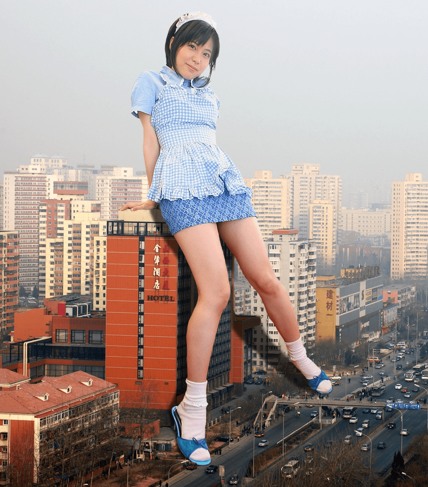
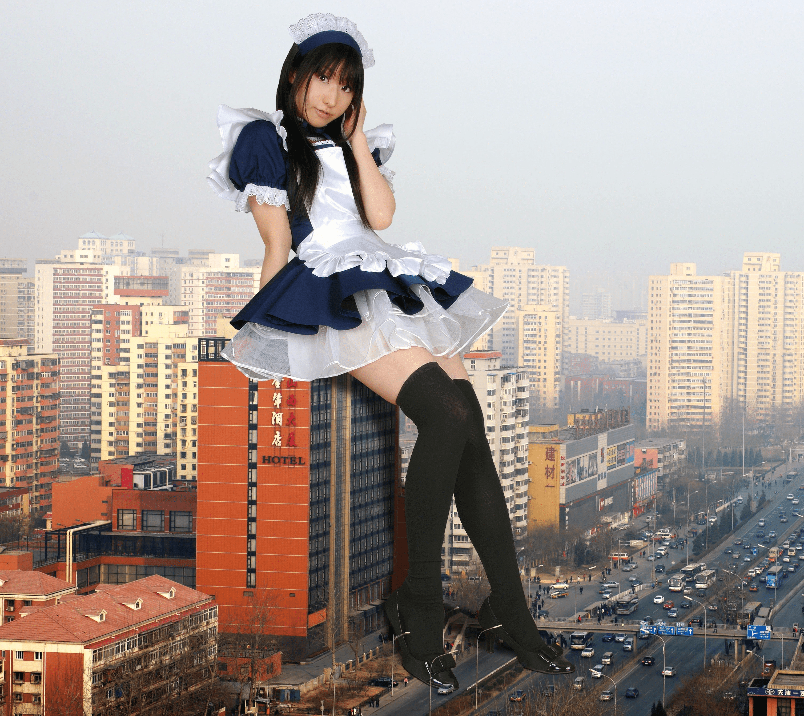
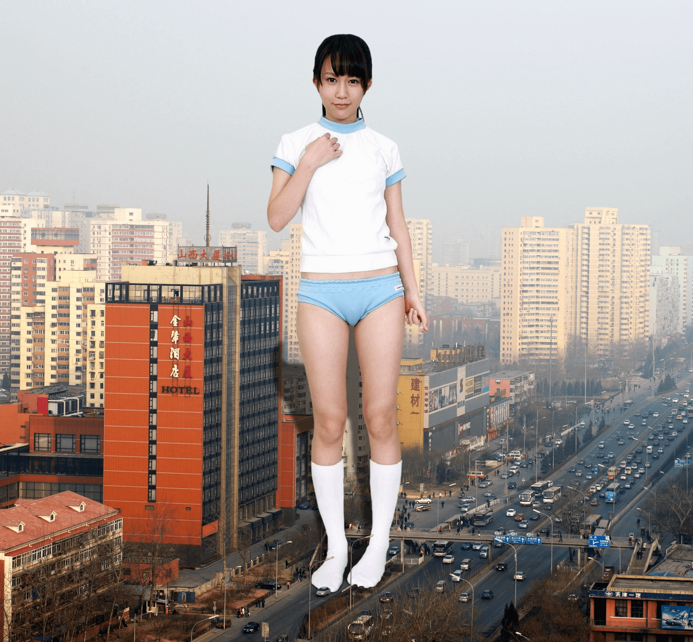
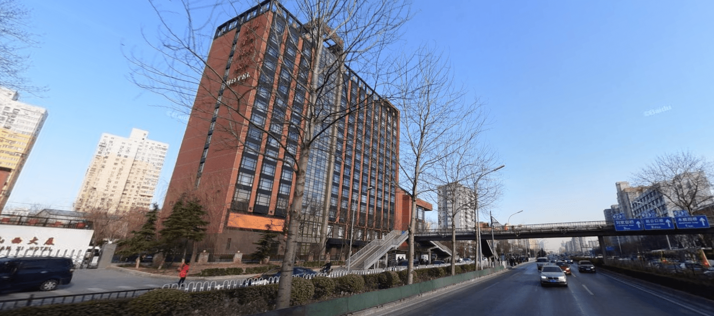

# 一些不是很知名的素材取集地大家去过吗？

作者：蜡下翁

TID：25033

<title>1</title> <link href="../Styles/Style.css" type="text/css" rel="stylesheet">

# 1

*本帖最後由 蜡下翁 於 2018-4-30 10:52 編輯*

今天白天在丰台办事的时候感觉有个地方莫名的熟悉，回家看General Sizefetish uploader时看到了一个专门做ps图的p主シロソスキー里面有几张图的背景就是今天白天我经过的地方。回过头想想如果当时真的有图上那样的gts还是挺带感的，不过不知道为什么日本的p主会拿这么一个不知名的地方做图，我北京住了这么久也不知道有这么栋平常的楼。如果是东京塔这样著名的地方还好，但这么一个不知名但以外发现就在身边的地方确实是有点以外。（北京木樨园附近的一个平常的写字楼）话说原p主搞错了，他有一张图的标题是[JPN School Stocking Girl in Tianjin](https://gs-uploader.jinja-modoki.com/documents/shirososki/s0292.jpg?dl=UruTfYA4PN.&t=1525056663&c=1525055108&r=1f)但其实北京南三环。 <title>2</title> <link href="../Styles/Style.css" type="text/css" rel="stylesheet">

# 2

 <ignore_js_op>[s0116.jpg](forum.php?mod=attachment&aid=NzIxNzR8MDRlZDM4Yzl8MTY3NDA2NzE2NHwxODIzMHwyNTAzMw%3D%3D&nothumb=yes) *(636.94 KB, 下載次數: 0)*

[下載附件](forum.php?mod=attachment&aid=NzIxNzR8MDRlZDM4Yzl8MTY3NDA2NzE2NHwxODIzMHwyNTAzMw%3D%3D&nothumb=yes)

2018-4-30 01:35 上傳  

</ignore_js_op> <ignore_js_op>[s0109.jpg](forum.php?mod=attachment&aid=NzIxNzJ8Njg3MWFlZDZ8MTY3NDA2NzE2NHwxODIzMHwyNTAzMw%3D%3D&nothumb=yes) *(1.32 MB, 下載次數: 0)*

[下載附件](forum.php?mod=attachment&aid=NzIxNzJ8Njg3MWFlZDZ8MTY3NDA2NzE2NHwxODIzMHwyNTAzMw%3D%3D&nothumb=yes)

2018-4-30 01:34 上傳  

</ignore_js_op> <ignore_js_op>[s0180.jpg](forum.php?mod=attachment&aid=NzIxNzN8YzY0OGNiMmJ8MTY3NDA2NzE2NHwxODIzMHwyNTAzMw%3D%3D&nothumb=yes) *(1.04 MB, 下載次數: 0)*

[下載附件](forum.php?mod=attachment&aid=NzIxNzN8YzY0OGNiMmJ8MTY3NDA2NzE2NHwxODIzMHwyNTAzMw%3D%3D&nothumb=yes)

2018-4-30 01:34 上傳  

</ignore_js_op> <ignore_js_op>[捕获.PNG](forum.php?mod=attachment&aid=NzIxNzV8MmM3ZmZlZWJ8MTY3NDA2NzE2NHwxODIzMHwyNTAzMw%3D%3D&nothumb=yes) *(2.4 MB, 下載次數: 1)*

[下載附件](forum.php?mod=attachment&aid=NzIxNzV8MmM3ZmZlZWJ8MTY3NDA2NzE2NHwxODIzMHwyNTAzMw%3D%3D&nothumb=yes)

2018-4-30 01:35 上傳  

</ignore_js_op> <title>3</title> <link href="../Styles/Style.css" type="text/css" rel="stylesheet">

# 3

估计是怕用本地建筑引起纠纷吧，用别国建筑被发现的可能比较低，这个圈子毕竟小众。大多数人还是根据自己的语言选择论坛的。 <title>4</title> <link href="../Styles/Style.css" type="text/css" rel="stylesheet">

# 4

噗，本国人民表示？？？？ <title>5</title> <link href="../Styles/Style.css" type="text/css" rel="stylesheet">

# 5

比如什么？我去过网站不少，但百度没被封之前，我都在那里，百度给封了，我就过来了 <title>6</title> <link href="../Styles/Style.css" type="text/css" rel="stylesheet">

# 6

p图的技术很不错啊。。。