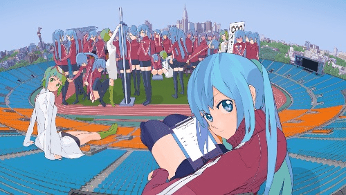

# 一些个人的简单猜想......

作者：Hardworking

TID：29965

<title>1</title> <link href="../Styles/Style.css" type="text/css" rel="stylesheet">

# 1

我前两天非常非常仔细的想了想为啥我会喜欢GTS。因为我想知道是什么让我变成了现在的我。我也想知道我喜欢GTS的本质到底是馋人家身子，还是货真价实的感情......

其实对我而言主要分为两点，一方面是没有安全感，从小便没有受到多少照顾，导致我对温柔系简直无法抵抗。毕竟，一个温柔的Giga级巨娘能给人到来的安全感是很难以比拟的。当然，这可能也是我为什么不仅仅喜欢GTS，还喜欢高女的原因吧。（顺便问问这里有多少人既喜欢GTS，也喜欢高女的...）

第二方面可能是对女性的崇拜和爱慕吧，毕竟本人单身狗。还没有摸过女孩手...所以作为一个兴趣取向正常的男的，对女孩有爱慕之情不过分吧？（只不过大了亿点）

第三方面，这个对我自己而言占据的比例不算大，没有在前面列举。我个人非常喜欢美好的事物。我认为巨娘对我而言算是美好的事物吧。毕竟每个人都有自己心目中最完美的巨娘的样子。

我很好奇各位同好是如何看待这个问题的......对我而言，安全感占据的比例有75% <title>2</title> <link href="../Styles/Style.css" type="text/css" rel="stylesheet">

# 2

 <ignore_js_op>[392E0F12-47E7-416A-89C5-5B7843766254.jpeg](forum.php?mod=attachment&aid=ODY0Nzd8MDNkYmUzN2V8MTY3NDA2NjIxNXwxODIzMHwyOTk2NQ%3D%3D&nothumb=yes) *(65.05 KB, 下載次數: 0)*

[下載附件](forum.php?mod=attachment&aid=ODY0Nzd8MDNkYmUzN2V8MTY3NDA2NjIxNXwxODIzMHwyOTk2NQ%3D%3D&nothumb=yes)

2020-12-18 14:30 上傳  

</ignore_js_op> <title>3</title> <link href="../Styles/Style.css" type="text/css" rel="stylesheet">

# 3

bigger,better!
当然也有可能因为我想象力太丰富，总会喜欢不存在的事物，而我又好大喜功，不喜欢软弱的形象，所以对女性躯体喜欢到极致就是gts了？但是我对现实里的姑娘感觉想法都是很正常的，完全没有过gts方面的想法，我本人性格好像也和m没撒关系... <title>4</title> <link href="../Styles/Style.css" type="text/css" rel="stylesheet">

# 4

我个人来说首先是比较喜欢强大的妹子，体型自然就是最直观的了
其次还是lsp，所以妹子好看很重要嘛
再次，想象力丰富，圈内人整体想象力我猜也是略高于平均水平的
最后可能有点抖m吧。。。。这就是小时候被女生欺负多了
<title>5</title> <link href="../Styles/Style.css" type="text/css" rel="stylesheet">

# 5

> jack369605 發表於 2020-12-18 19:08
> 我个人来说首先是比较喜欢强大的妹子，体型自然就是最直观的了
> 其次还是lsp，所以妹子好看很重要嘛
> 再次， ...

喜欢强大的事物算不算一种野心？或者和我一样周围没有强大的人（没有任何贬低意思） <title>6</title> <link href="../Styles/Style.css" type="text/css" rel="stylesheet">

# 6

大多数都m属性的吧。。巨大就代表无法反抗 加掌控这类的啊 <title>7</title> <link href="../Styles/Style.css" type="text/css" rel="stylesheet">

# 7

其实这是一种特殊的恋物癖，叫尺寸恋物癖，只不过这个恋物癖还是寄托于人的身上，不是那么明显 <title>8</title> <link href="../Styles/Style.css" type="text/css" rel="stylesheet">

# 8

> [Hardworking 發表於 2020-12-18 23:04](https://giantessnight.cf/gnforum2012/forum.php?mod=redirect&goto=findpost&pid=454245&ptid=29965)
> 喜欢强大的事物算不算一种野心？或者和我一样周围没有强大的人（没有任何贬低意思） ...

我觉得喜欢强大的，一方面是自己缺乏安全感，另一方面就是各种作品中强大的妹子往往更容易站在舞台中间，她们的性格也会比较傲娇或者说是身为强者的气场，容易形成反差萌，这种也挺吸引人吧
<title>9</title> <link href="../Styles/Style.css" type="text/css" rel="stylesheet">

# 9

> jack369605 發表於 2020-12-19 14:11
> 我觉得喜欢强大的，一方面是自己缺乏安全感，另一方面就是各种作品中强大的妹子往往更容易站在舞台中间， ...

有道理，可以理解...... <title>10</title> <link href="../Styles/Style.css" type="text/css" rel="stylesheet">

# 10

我觉得GTS兼具力与美，男生对于强大的力量和漂亮的女生有所向往挺正常，然后GTS的特质可以看作两者合二为一 <title>11</title> <link href="../Styles/Style.css" type="text/css" rel="stylesheet">

# 11

我喜欢GTS是从一本作文书封面开始的，封面上是一座RPG里常见的带院子的茅草顶小屋，然后上面放了个朦胧的青春少女的上半身（看上去和屋子加院子差不多大），她微笑着看向下方。我当时对这封面想了很多幼稚而直白的情景，后来快高中时又在gtss吧看了那些露点的MMD图和漫画啥的，之后就喜欢了（顺便，当年追的《杀戮都市》真的给我影响很深，这漫画也帮助了我喜欢上gts）。
简单总结：因为好色。

<title>12</title> <link href="../Styles/Style.css" type="text/css" rel="stylesheet">

# 12

> scale君 發表於 2020-12-19 23:07
> 我喜欢GTS是从一本作文书封面开始的，封面上是一座RPG里常见的带院子的茅草顶小屋，然后上面放了个朦胧的青 ...

好色是正常的，我也好色。就是馋身子罢了23333 <title>13</title> <link href="../Styles/Style.css" type="text/css" rel="stylesheet">

# 13

对了，我记得真正把我带入坑的，是很久以前百度搜女巨人能搜到的一个什么灌水论坛，里边好多manzi大佬的图，瞬间就把我征服了
后来发现优酷有一堆mmd和gen lab的视频，就入坑了
之后先进了gtss吧，后来发现了gn很怀念那时候的热情啊 <title>14</title> <link href="../Styles/Style.css" type="text/css" rel="stylesheet">

# 14

无非是生物性导致人想找更好的繁殖对象，但可能与个人遭遇有关，导致对异性的想象过于落于自己的喜好上。也就有夸张的想象，和不合常理的场景在自己的幻想当中。但事实上谁不是在若干年之后就会变成尘土呢？所以我们就用了自己异化的“繁殖方式”，来复制自己。但是并没有成功却取悦了大脑。人尝到甜头就会一种重复这种“有益”的行为。但从生物学的角度来说是一种bug。对人类个体的繁殖有一点阻碍作用，性的最终目的也不过是复制自己。人就是在此周而复始的“轮回” <title>15</title> <link href="../Styles/Style.css" type="text/css" rel="stylesheet">

# 15

实不相瞒，我曾考虑过我的爱好起源，我能追忆起我小时候非常喜欢巨大的恐龙，就越大号越好，震龙都排不上第一，然后长大后和性欲叠加……大概就变成gts了吧