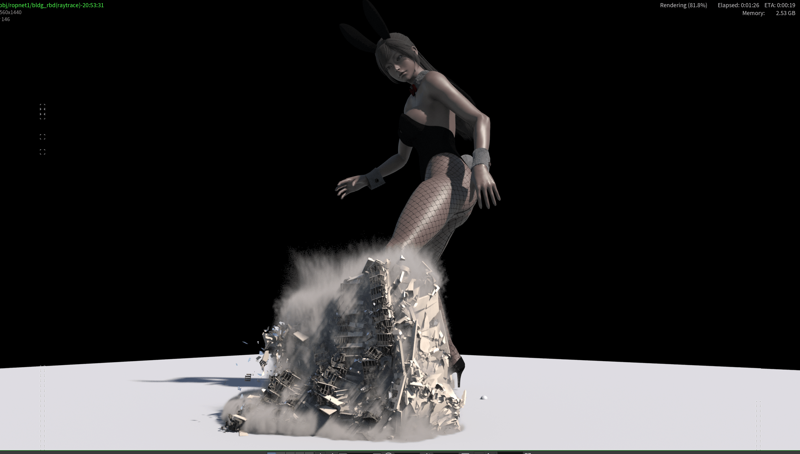
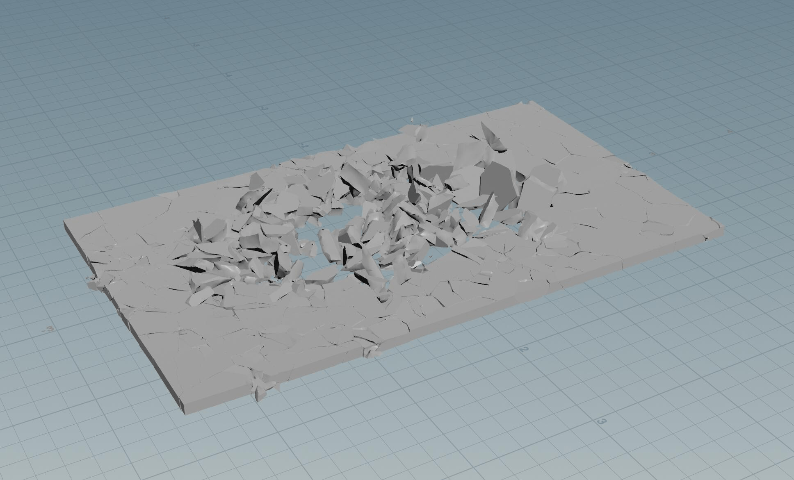
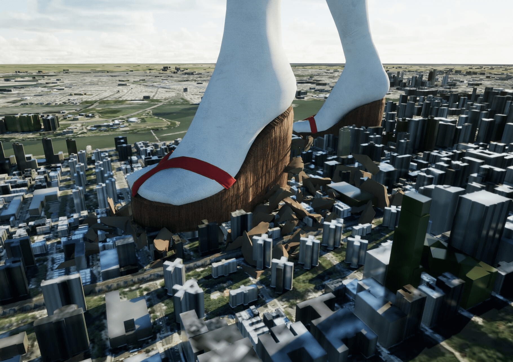
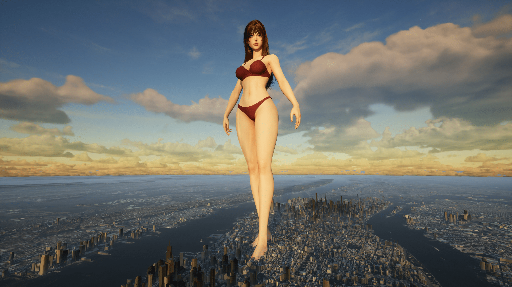
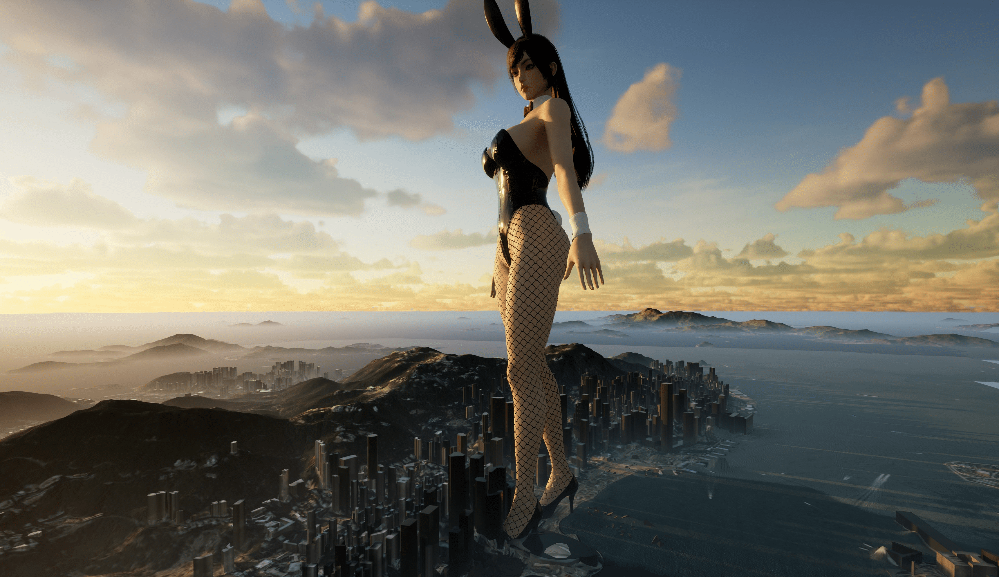
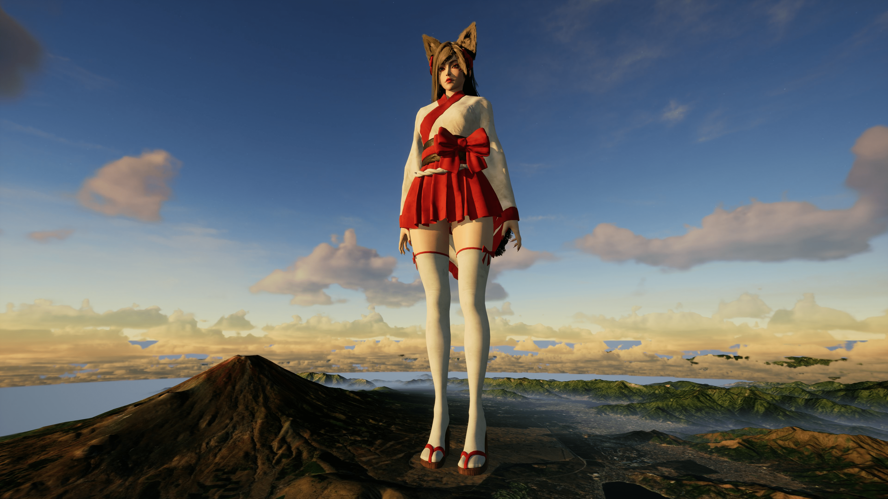
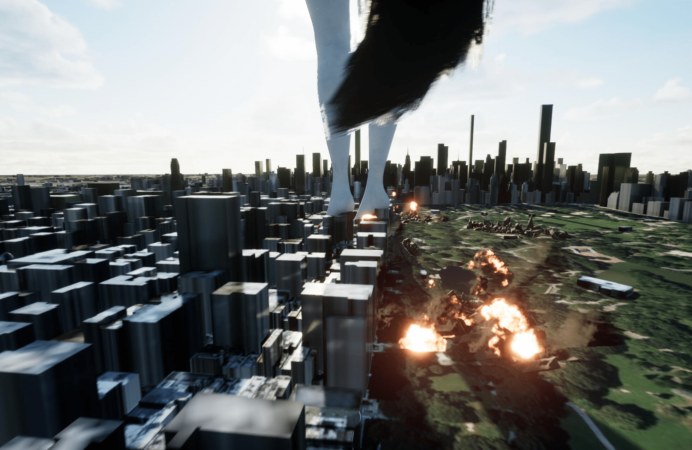
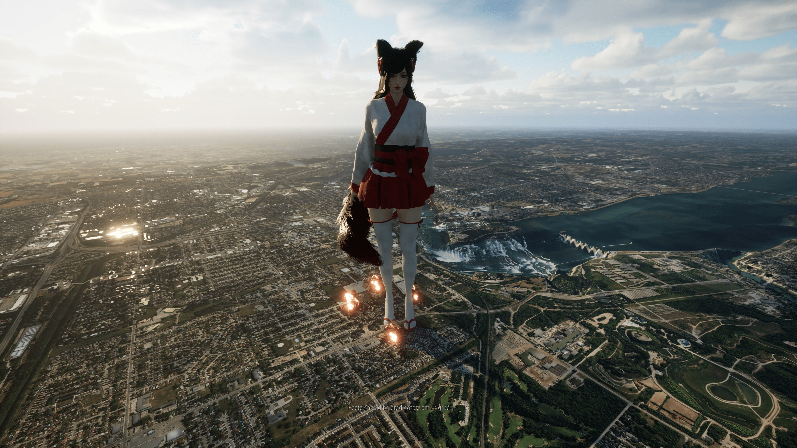
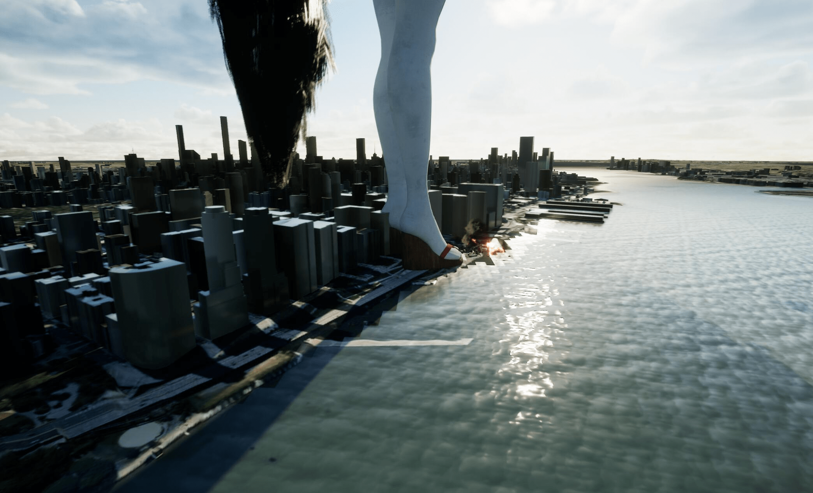

# 一些新的技术软件分享，附视频和效果

作者：willjilu

TID：34545

<title>1</title> <link href="../Styles/Style.css" type="text/css" rel="stylesheet">

# 1

*本帖最後由 willjilu 於 2022-12-15 21:57 編輯*

6月开始，借着学习做UE5游戏的机会，逐渐上手学习了一些奇妙的软件/工具。看起来gts圈子里很少有人在使用，遂分享一些使用心得和大致效果，如果对此感兴趣的话也欢迎一起交流。
首先是Houdini，这个软件我以前不太了解，是偏影视后期与VFX特效的，大家看到的各种电影中的破坏场景很多都是靠Houdini渲染出来的，我在学习的过程中做了个小渲染：
<ignore_js_op> [houdiniRender.mp4](forum.php?mod=attachment&aid=MTAwOTE0fDE3NjE0NzEzfDE2NzQwNjUyMDB8MTgyMzB8MzQ1NDU%3D) *(343.34 KB, 下載次數: 40)* 2022-12-10 20:33 上傳點擊文件名下載附件
低清晰度的视频
<ignore_js_op>

**A3FF7E1A2225636438AA97CE989EBFBE.png** *(1.53 MB, 下載次數: 1)*

[下載附件](forum.php?mod=attachment&aid=MTAwOTE1fDZjZDA1MDdjfDE2NzQwNjUyMDB8MTgyMzB8MzQ1NDU%3D&nothumb=yes)

2022-12-10 20:35 上傳

（放了个1080截图，效果非常不错）

这个只是用了一个建筑做了测试，实际上按照这个流程可以批量的复制更多建筑，就可以做出城市体量的电影级破坏效果。所以这就不需要等着别人拍gts电影，而是可以自己动手丰衣足食了。

Houdini软件本身的渲染效果很好，但是效率不高。不过它可以将物体的破碎过程bake成动画，这就比较有趣了，比如下面这两个图：
<ignore_js_op>

**QQ截图20221210204003.jpg** *(137.95 KB, 下載次數: 2)*

[下載附件](forum.php?mod=attachment&aid=MTAwOTE2fGYwZjRjMTk2fDE2NzQwNjUyMDB8MTgyMzB8MzQ1NDU%3D&nothumb=yes)

2022-12-10 20:40 上傳

上图是我在Houdini中制作的一个地面被踩碎的效果，是以fbx动画的形式渲染出来的。大概10MB大小，这个动画可以直接导入进Unity/Unreal/blender播放，于是就可以做出如下的破坏效果：
<ignore_js_op>

**QQ截图20221210204847.jpg** *(270.35 KB, 下載次數: 4)*

[下載附件](forum.php?mod=attachment&aid=MTAwOTE3fDAyYzkxZGNkfDE2NzQwNjUyMDB8MTgyMzB8MzQ1NDU%3D&nothumb=yes)

2022-12-10 20:48 上傳

而Houdini bake出来的动画完全不会影响游戏效率！于是就可以做出更加真实，且没什么显卡危机的破坏效果了。

第二个推荐的工具是GIS工具。因为很多人提意见希望在游戏里加入Giga size的女生，然后我也一直没有想到很好的解决方案，所以拖了很久。在前几天突然想到说能不能把Google Earth工具调入进来然后直接使用Google Earth进行地图绘制。后来研究了一下发现这个真的可以，有一种工具叫做GIS工具，可以使用地图来构建场景，并且加入了Height map之后甚至可以把建筑的高度读取到地图中去，于是我们只需要提供世界地图的经纬度就可以做出真实的1：1世界场景 （甚至可以找到自己的家）：

<ignore_js_op>

**2022-12-10 21h22min2s.jpeg** *(869.03 KB, 下載次數: 2)*

[下載附件](forum.php?mod=attachment&aid=MTAwOTE5fDUzZTY2ZTUwfDE2NzQwNjUyMDB8MTgyMzB8MzQ1NDU%3D&nothumb=yes)

2022-12-10 21:28 上傳

Manhattan
<ignore_js_op>

**2022-12-10 21h1min31s.jpg** *(636.63 KB, 下載次數: 2)*

[下載附件](forum.php?mod=attachment&aid=MTAwOTE4fDA2Y2M2YmUwfDE2NzQwNjUyMDB8MTgyMzB8MzQ1NDU%3D&nothumb=yes)

2022-12-10 21:28 上傳

香港

GIS包含了完整的地形数据，也就是说你甚至可以不需要给富士山建模：

<ignore_js_op>

**2022-12-10 21h14min12s.jpg** *(704.68 KB, 下載次數: 2)*

[下載附件](forum.php?mod=attachment&aid=MTAwOTIwfDY0NDAyOTFkfDE2NzQwNjUyMDB8MTgyMzB8MzQ1NDU%3D&nothumb=yes)

2022-12-10 21:30 上傳

借助这些高科技工具，其实还有很多我们没有想到或者没有人尝试的GTS内容，也希望有更多的小伙伴一起探索~搞出更多有趣好玩的内容！
加入了一些火焰和水面的特效，更好看了
<ignore_js_op>

**QQ截图20221214180211.jpg** *(195.81 KB, 下載次數: 0)*

[下載附件](forum.php?mod=attachment&aid=MTAwOTkyfGQyMGFmM2M3fDE2NzQwNjUyMDB8MTgyMzB8MzQ1NDU%3D&nothumb=yes)

2022-12-15 21:57 上傳

<ignore_js_op>

**2022-12-15 20h45min24s.jpg** *(1.6 MB, 下載次數: 0)*

[下載附件](forum.php?mod=attachment&aid=MTAwOTkxfDBiNGRjZTgyfDE2NzQwNjUyMDB8MTgyMzB8MzQ1NDU%3D&nothumb=yes)

2022-12-15 21:57 上傳

<ignore_js_op>

**QQ截图20221214185118.jpg** *(180.86 KB, 下載次數: 0)*

[下載附件](forum.php?mod=attachment&aid=MTAwOTkzfDQxODMyZmUzfDE2NzQwNjUyMDB8MTgyMzB8MzQ1NDU%3D&nothumb=yes)

2022-12-15 21:57 上傳

<title>2</title> <link href="../Styles/Style.css" type="text/css" rel="stylesheet">

# 2

你的Patreon 和 Youtube 还有 Twitter 这三个地址最好能互相绑定，这样方便有技术的同好和付费用户可以找到你。
<title>3</title> <link href="../Styles/Style.css" type="text/css" rel="stylesheet">

# 3

太棒了！效果真的非常不错啊，期待早日可以玩到完整版的，也希望能有越来越多会用Unity的大佬产出更多的游戏！Unity在塑造巨大少女的压迫感的时候是无与伦比的。 <title>4</title> <link href="../Styles/Style.css" type="text/css" rel="stylesheet">

# 4

看到您的推特里的宣传就已经迫不及待了 XD <title>5</title> <link href="../Styles/Style.css" type="text/css" rel="stylesheet">

# 5

> xnr 發表於 2022-12-10 22:25
> 你的Patreon 和 Youtube 还有 Twitter 这三个地址最好能互相绑定，这样方便有技术的同好和付费用户可以找到 ...

感谢，我得研究一下，这仨我都没玩明白哈哈 <title>6</title> <link href="../Styles/Style.css" type="text/css" rel="stylesheet">

# 6

> [草食君 發表於 2022-12-10 23:16](https://giantessnight.cf/gnforum2012/forum.php?mod=redirect&goto=findpost&pid=521607&ptid=34545)
> 太棒了！效果真的非常不错啊，期待早日可以玩到完整版的，也希望能有越来越多会用Unity的大佬产出更多的游 ...

嗯嗯，这个版本估计下周就会发布。我就是探索一下技术啦，等你们这些有能力写剧本的人发挥了
<title>7</title> <link href="../Styles/Style.css" type="text/css" rel="stylesheet">

# 7

> [nhbnfn 發表於 2022-12-10 23:26](https://giantessnight.cf/gnforum2012/forum.php?mod=redirect&goto=findpost&pid=521609&ptid=34545)
> 看到您的推特里的宣传就已经迫不及待了 XD

感谢呀哈哈！GIS是我第一次使用，但是作为giga size来说真的是太完美了
<title>8</title> <link href="../Styles/Style.css" type="text/css" rel="stylesheet">

# 8

> [nhbnfn 發表於 2022-12-10 23:26](https://giantessnight.cf/gnforum2012/forum.php?mod=redirect&goto=findpost&pid=521609&ptid=34545)
> 看到您的推特里的宣传就已经迫不及待了 XD

感谢呀哈哈！GIS是我第一次使用，但是作为giga size来说真的是太完美了
<title>9</title> <link href="../Styles/Style.css" type="text/css" rel="stylesheet">

# 9

城市用的是Cesium？还是osm转CityEngine？还是GoogleEarth抓包？ <title>10</title> <link href="../Styles/Style.css" type="text/css" rel="stylesheet">

# 10

> wxy112300 發表於 2022-12-11 02:54
> 城市用的是Cesium？还是osm转CityEngine？还是GoogleEarth抓包？

Cesium, 用了付费版贴了bing map overlay，一个月能有300GB流量，City engine 的话更贵，而且没办法全球导航，如果要能抓google earth的话能省不少钱，但是估计就拿不到geometrydata了 <title>11</title> <link href="../Styles/Style.css" type="text/css" rel="stylesheet">

# 11

> [willjilu 發表於 2022-12-11 02:59](https://giantessnight.cf/gnforum2012/forum.php?mod=redirect&goto=findpost&pid=521630&ptid=34545)
> Cesium, 用了付费版贴了bing map overlay，一个月能有300GB流量，City engine 的话更贵，而且没办法全球 ...

原来如此，看来成本也不低
以前研究过拿osm生成的那些东西，不管是CityEngine还是Blender的都不是很理想
城市数据精度都不高，生成的东西也都重复的要命
胡迪尼的过于复杂，CitySample的那个hip完全看不懂
Google Earth抓包的话确实效果最好，有个[圈内网站](https://sites.google.com/view/playgroundsfordaz/download-obj?authuser=0&pli=1)分享了一些抓包的资源，但是不太敢用，毕竟有版权问题
果然还得Cesium这种真实数据的啊

<title>12</title> <link href="../Styles/Style.css" type="text/css" rel="stylesheet">

# 12

*本帖最後由 willjilu 於 2022-12-11 03:40 編輯*

> wxy112300 發表於 2022-12-11 03:10
> 原来如此，看来成本也不低
> 以前研究过拿osm生成的那些东西，不管是CityEngine还是Blender的都不是很理想
> ...

city sample的那个houdini生成其实是利用了houdini procedual生成器的一个结果，我测试了一下可以用，但是
1.生成的地图和city sample一样非常吃资源（它等于是程序化帮你生成建筑然后贴图）并且看起来大同小异，毕竟素材就那些。
2.无法和真实世界连接，它可以用一个带建筑位置的gis数据生成一个地图，但是无法实时实现，需要提前创建好。所以还是没办法做到现在这种全世界满天飞的效果。
3.我一直以为procedural可以解决批量化可破碎建筑的生成（比如套用生成的不是static mesh而是蓝图或者带houdini动画的character）但是目前似乎还做不到。

blender有个插件好像可以抓google map的open street view还是什么，可以搜一下。那个如果不拿来盈利的话应该是可以用的，我看很多youtube博主推荐过，效果属于凑合能看（giga size本来就啥也看不到了）而且带贴图，质量也不错，最重要免费。不过还是需要提前做好导入ue5，一个城市可以，随便跑还是做不到，并且没办法获取地形数据。

大佬有空多交流呀，圈子里用UE的人太少了，我走了不少弯路才做到现在 <title>13</title> <link href="../Styles/Style.css" type="text/css" rel="stylesheet">

# 13

> [willjilu 發表於 2022-12-11 03:28](https://giantessnight.cf/gnforum2012/forum.php?mod=redirect&goto=findpost&pid=521634&ptid=34545)
> city sample的那个houdini生成其实是利用了houdini procedual生成器的一个结果，我测试了一下可以用，但 ...

不止是圈内，是用的人确实很少，UE在国内的开发者人数也就不到十万，和Unity的比数量差远了
不过这个时候开始用确实是赶上个好时代了，以前各种资料插件教程都比现在少很多，现在坑已经少了很多了

osm就是OpenStreetMap，用这个生成的基本都是效果一般，乍一看不错，实际使用的话很不理想
虽然我也不是追求超大地图，就是想弄个合格的背景板，自动生成的那些街道精度都太粗糙了，用来做个空战游戏倒是蛮合适
<title>14</title> <link href="../Styles/Style.css" type="text/css" rel="stylesheet">

# 14

> wxy112300 發表於 2022-12-11 03:55
> 不止是圈内，是用的人确实很少，UE在国内的开发者人数也就不到十万，和Unity的比数量差远了
> 不过这个时候 ...

那……其实cesium的贴图比osm的还要差，bing overlay的原理大概就是把地面的贴图直接糊在立体的建筑上，基本上只有个色块这样，所以更不敢细看哈哈 <title>15</title> <link href="../Styles/Style.css" type="text/css" rel="stylesheet">

# 15

过来支持一下！大佬太强了~这类型很少见呢 <title>16</title> <link href="../Styles/Style.css" type="text/css" rel="stylesheet">

# 16

真好啊真好啊，流下了贫穷的眼泪  <title>17</title> <link href="../Styles/Style.css" type="text/css" rel="stylesheet">

# 17

在Youtube上看见大佬的视频了 这个真的厉害 可以踏遍全世界了哈哈 <title>18</title> <link href="../Styles/Style.css" type="text/css" rel="stylesheet">

# 18

太强了大佬！！期待以后的新成果！！ <title>19</title> <link href="../Styles/Style.css" type="text/css" rel="stylesheet">

# 19

效果真的挺棒的，搞得我后面都想开发3D版的游戏了 <title>20</title> <link href="../Styles/Style.css" type="text/css" rel="stylesheet">

# 20

> [jack369605 發表於 2022-12-11 10:28](https://giantessnight.cf/gnforum2012/forum.php?mod=redirect&goto=findpost&pid=521656&ptid=34545)
> 过来支持一下！大佬太强了~这类型很少见呢

谢谢呀！其实也是在测试……我这个与其说是游戏不如说是gts模拟器
<title>21</title> <link href="../Styles/Style.css" type="text/css" rel="stylesheet">

# 21

> [Foobarz 發表於 2022-12-11 16:30](https://giantessnight.cf/gnforum2012/forum.php?mod=redirect&goto=findpost&pid=521679&ptid=34545)
> 真好啊真好啊，流下了贫穷的眼泪

唔……houdini比较吃配置，ue本身还好 <title>22</title> <link href="../Styles/Style.css" type="text/css" rel="stylesheet">

# 22

> [1628246867 發表於 2022-12-12 01:06](https://giantessnight.cf/gnforum2012/forum.php?mod=redirect&goto=findpost&pid=521728&ptid=34545)
> 在Youtube上看见大佬的视频了 这个真的厉害 可以踏遍全世界了哈哈

感谢感谢，最近在努力做一些效果
<title>23</title> <link href="../Styles/Style.css" type="text/css" rel="stylesheet">

# 23

> [freepenguin2 發表於 2022-12-12 09:27](https://giantessnight.cf/gnforum2012/forum.php?mod=redirect&goto=findpost&pid=521739&ptid=34545)
> 太强了大佬！！期待以后的新成果！！

感谢感谢，还在努力研究呢，后面的计划还是在学校的地图里玩
<title>24</title> <link href="../Styles/Style.css" type="text/css" rel="stylesheet">

# 24

> [咕咕的攸栗 發表於 2022-12-12 12:50](https://giantessnight.cf/gnforum2012/forum.php?mod=redirect&goto=findpost&pid=521748&ptid=34545)
> 效果真的挺棒的，搞得我后面都想开发3D版的游戏了

嗯嗯，其实是推荐更多人尝试一下3D的，虽然rpgmaker效果很不错，也有很大的想象空间，但是感觉3d会更有趣啦
<title>25</title> <link href="../Styles/Style.css" type="text/css" rel="stylesheet">

# 25

> [willjilu 發表於 2022-12-12 13:37](https://giantessnight.cf/gnforum2012/forum.php?mod=redirect&goto=findpost&pid=521754&ptid=34545)
> 感谢感谢，还在努力研究呢，后面的计划还是在学校的地图里玩

支持就完了！！！大佬冲冲冲！！！
<title>26</title> <link href="../Styles/Style.css" type="text/css" rel="stylesheet">

# 26

支持大佬 不知道我1070能否一战~ <title>27</title> <link href="../Styles/Style.css" type="text/css" rel="stylesheet">

# 27

> [qqbetta2 發表於 2022-12-15 11:43](https://giantessnight.cf/gnforum2012/forum.php?mod=redirect&goto=findpost&pid=521975&ptid=34545)
> 支持大佬 不知道我1070能否一战~

世界地图的主要瓶颈在于显存，超过6G基本都很安全
<title>28</title> <link href="../Styles/Style.css" type="text/css" rel="stylesheet">

# 28

之前的测试有试过，1060可以运行，但就是30帧左右问题不大 <title>29</title> <link href="../Styles/Style.css" type="text/css" rel="stylesheet">

# 29

效果非常不错，不过建议光影不用那么写实，否则很多精彩的部位都成一块阴影看不清楚了 <title>30</title> <link href="../Styles/Style.css" type="text/css" rel="stylesheet">

# 30

*本帖最後由 willjilu 於 2022-12-16 15:46 編輯*

> [咕咕的攸栗 發表於 2022-12-16 09:17](https://giantessnight.cf/gnforum2012/forum.php?mod=redirect&goto=findpost&pid=522014&ptid=34545)
> 效果非常不错，不过建议光影不用那么写实，否则很多精彩的部位都成一块阴影看不清楚了 ...

我试着加了一下修改时间的功能，基本上调一下时间(修改光线角度）就能把遮挡啊这些乱七八糟的问题解决</ignore_js_op></ignore_js_op></ignore_js_op></ignore_js_op></ignore_js_op></ignore_js_op></ignore_js_op></ignore_js_op></ignore_js_op></ignore_js_op>