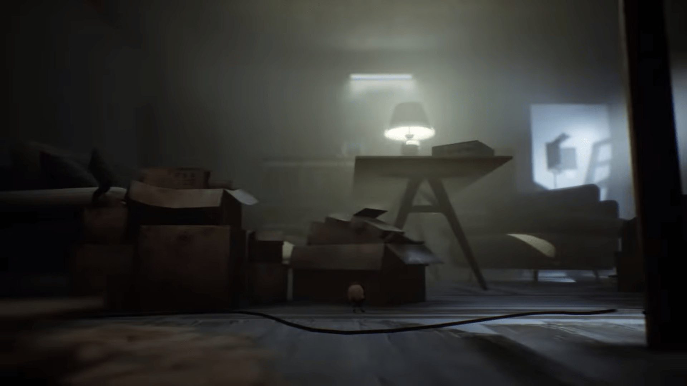

# 一個可以拿來做參考的遊戲Demo (Keep Out)

作者：3213213210

TID：27995

<title>1</title> <link href="../Styles/Style.css" type="text/css" rel="stylesheet">

# 1

警告：目前這遊戲只有GT，我只是想分享這種形式的遊戲架構的可能性

[https://youtu.be/FbzWjJv79x0](https://youtu.be/FbzWjJv79x0)
<ignore_js_op>

**KeepOut.jpg** *(135.33 KB, 下載次數: 0)*

[下載附件](forum.php?mod=attachment&aid=ODEyNzZ8ZjdmNDE1NDZ8MTY3NDA2NjU4NXwxODIzMHwyNzk5NQ%3D%3D&nothumb=yes)

2020-2-8 04:44 上傳

這是一個2D平台解謎遊戲，主角是......在房子裡的小隻生物，剩下的不重要
我以前就提過，要做GTS遊戲的方法其實非常多元
[https://giantessnight.com/gnforu ... hread&tid=25757](https://giantessnight.com/gnforum2012/forum.php?mod=viewthread&tid=25757)
就算沒太好看的模型或動畫，只要世界觀塑造夠有吸引力，巨人不用放在主軸也能有強大的震撼感
如果覺得這樣的靜態布景還是太複雜......可以學沉默之丘，灌一堆濃霧就好 (或者不灌濃霧就會馬上死所以要找開關之類的)
太好了，我又多了一個宣稱很有未來但完全沒打算做的專案計畫了呢

<title>2</title> <link href="../Styles/Style.css" type="text/css" rel="stylesheet">

# 2

这种其实明明可以设计成婴儿 幼女之类的，不过那样的话估计不适合恐怖氛围？ <title>3</title> <link href="../Styles/Style.css" type="text/css" rel="stylesheet">

# 3

可以改但是就没有恐怖元素了，不过光是这种2d的追逐战会有点意思 <title>4</title> <link href="../Styles/Style.css" type="text/css" rel="stylesheet">

# 4

> [琉璃 發表於 2020-2-8 05:06](https://giantessnight.cf/gnforum2012/forum.php?mod=redirect&goto=findpost&pid=425222&ptid=27995)
> 这种其实明明可以设计成婴儿 幼女之类的，不过那样的话估计不适合恐怖氛围？ ...

怎麼會沒有 寫實風幼女當反派主角恐怖直接加成30%
<title>5</title> <link href="../Styles/Style.css" type="text/css" rel="stylesheet">

# 5

> [3213213210 發表於 2020-2-8 10:00](https://giantessnight.cf/gnforum2012/forum.php?mod=redirect&goto=findpost&pid=425234&ptid=27995)
> 怎麼會沒有 寫實風幼女當反派主角恐怖直接加成30%

那也要有啊啊～可惜没有这种游戏
<title>6</title> <link href="../Styles/Style.css" type="text/css" rel="stylesheet">

# 6

小小梦魇啊，感觉类似，虽然那个更魔幻
之前有这种类似构筑的见过little snatcher里捉迷藏的桥段（不过桥段是完全2D加上是温柔系的没有那么恐怖，另一端恐怖的感觉角度反过来了），还有某个被论坛禁止分享的游戏里也有很简单的躲藏内容。 <title>7</title> <link href="../Styles/Style.css" type="text/css" rel="stylesheet">

# 7

> [紫色欧石楠 發表於 2020-2-8 10:46](https://giantessnight.cf/gnforum2012/forum.php?mod=redirect&goto=findpost&pid=425237&ptid=27995)
> 小小梦魇啊，感觉类似，虽然那个更魔幻
> 之前有这种类似构筑的见过little snatcher里捉迷藏的桥段（不过桥段 ...

little nightmare寫起來困難很多 需要真的寫出3D的環境
我貼的這個實際互動用2D的多邊形來觸發事件就能解決了 技術上簡單很多
Little snatcher的那個做的很不錯 就是遊戲形式有點太單調(在特定時間點要待在特定位置)</ignore_js_op>