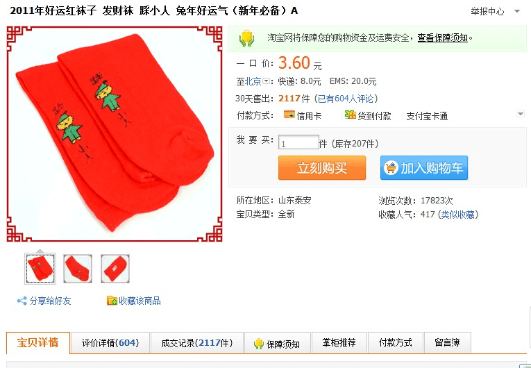
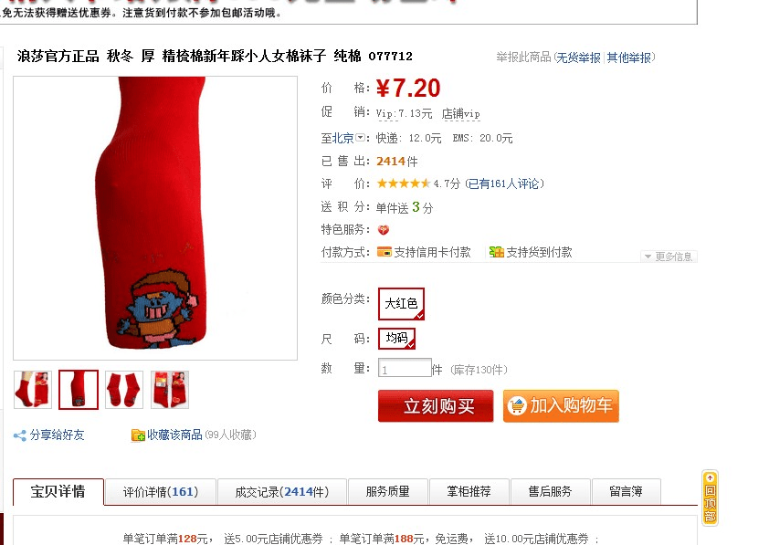

# 一双袜底写着 踩小人 的袜子

作者：泡面

TID：9561

<title>1</title> <link href="../Styles/Style.css" type="text/css" rel="stylesheet">

# 1

昨天收衣服的时候 看见妹妹的袜子 红色的 上面居然写着踩小人3个字 还画了个小人.. 我就想她不会有GTS倾向吧.. 还是无意买的
然后上淘宝一查 真有 而且挺畅销的...

原来如此 踩小人是新年风俗 来年带好运~ 了解了

[ *本帖最後由 390004989 於 2011-2-20 18:08 編輯* ] <title>2</title> <link href="../Styles/Style.css" type="text/css" rel="stylesheet">

# 2

 <ignore_js_op>[QQ截&#22270;未命名.jpg](forum.php?mod=attachment&aid=MjM2MDh8MGVhNTI0ZGV8MTY3NDA2ODgwOXwxODIzMHw5NTYx&nothumb=yes) *(84.78 KB, 下載次數: 3)*

[下載附件](forum.php?mod=attachment&aid=MjM2MDh8MGVhNTI0ZGV8MTY3NDA2ODgwOXwxODIzMHw5NTYx&nothumb=yes)

2011-2-20 13:48 上傳  

第一种

</ignore_js_op>  <ignore_js_op>[1.jpg](forum.php?mod=attachment&aid=MjM2MDl8YTA2MTYxYWN8MTY3NDA2ODgwOXwxODIzMHw5NTYx&nothumb=yes) *(92.45 KB, 下載次數: 1)*

[下載附件](forum.php?mod=attachment&aid=MjM2MDl8YTA2MTYxYWN8MTY3NDA2ODgwOXwxODIzMHw5NTYx&nothumb=yes)

2011-2-20 13:48 上傳  

第二种

</ignore_js_op> <title>3</title> <link href="../Styles/Style.css" type="text/css" rel="stylesheet">

# 3

曾經也看過人家穿..
意思應該是防小人吧
不過我看得比較可愛一點.. <title>4</title> <link href="../Styles/Style.css" type="text/css" rel="stylesheet">

# 4

这个踩小人和我们GTS圈内的踩小人，意义是不一样的。。。 <title>5</title> <link href="../Styles/Style.css" type="text/css" rel="stylesheet">

# 5

雖然不是我們那種GTS的小人

不過都挺有意思 <title>6</title> <link href="../Styles/Style.css" type="text/css" rel="stylesheet">

# 6

打小人那个小人嘛，算是一种传统习俗了，LZ的想象力还真丰富 <title>7</title> <link href="../Styles/Style.css" type="text/css" rel="stylesheet">

# 7

打小人都整出来了... 真有创意... 我看不是我们圈子里面理解的这意思