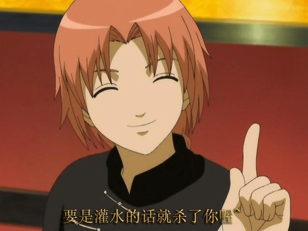

# 一堆乱七八糟的数据（第一弹）

作者：毒蛋白

TID：8296

<title>1</title> <link href="../Styles/Style.css" type="text/css" rel="stylesheet">

# 1

本来打算创作的文章的但是介于咱的笔锋拖沓，材料糟糕还是决定修炼一段时间以后再说，或许能悟到必杀技也说不定。
本来想发原创但发现不是太合适。。
纠结许久还是发在这里了。。。。。。
———————————————————————————
首先是个人对变物的一点理解~~
      关于变物理解的灵感来自钢炼里面的贤者之石。因为贤者之石是用人的灵魂做的，本质上来讲就是一种变物的构想，

（其实外形不重要吧。。被变成石头的样子跟变鞋子有区别么）严格意义上来讲，变物也有2中情况，一种就像阿尔那种，

把灵魂附在某个物体上，但是这样不会对外界有任何感觉，最多也就是知道你是这么个东西而已，

- -咱有想象过，最后得出的结论就是被绑死在椅子上一动不动的看电影。。。。。。外界的一切其实都与你无关。

另外一种就是直接用灵魂炼成的贤者之石，因为这个就是你本身，所以对外界刺激应该会有感觉的，而且因为本身的生理功能已经没有了，

所以不能根据你的个人意识来做出回应，只能一直忍受着痛苦。而从这里，又有两种结果，一种就是一直以这种形态存活着，

而意识也没有受到太大的干扰，就像霍恩海姆体内的贤者之石，因为有一定的交流和引导，你在里面的话就像是在一个城市里面生活着，

可以和其他灵魂交流，可以凭借自己的意识在可行的范围内移动。这种是大多数人可以接受的，但这需要一定的交流，也就是说至少要让你知道

尽管变了个形态，但本身还是人。而另一种就是放任不管，这种的结果就比较悲惨，由于缺乏交流，这种状态下的人会渐渐否定自己的存在，

但是他毕竟还是生命，生前的记忆和意识不断重复，于是就在这样的矛盾中不断消磨着自己的心智，逐渐失去人类的心，

相信如果最近看到钢炼的朋友对烧瓶小人造出来的“人类”有着深刻的印象，他们虽然还活着，但是已经在绝望和痛苦中度过了上百年，

实际上已经不能称之为“活着”，只是在无尽的呻吟和痛苦里面挣扎而已，证明这种猜想的还有布莱德快要便当时金布利的出现，

说明了即使被做成贤者之石也是以另一种形式存活着的，他只是疯狂到能在无数的哀号声中 保持自我而已。

（别跟我说如果是一个人被变的话不就没事了么。。。说不定高跟鞋或者小裤裤里面还有很多高跟鞋精灵和小裤裤仙人不停哀号也说不定。。。洞爷湖里面不是也有个洞爷湖仙人一家吗。。），
最后就是，作为生命存在，一定要有什么东西消耗才行，也就是说，被变物以后灵魂是会被不断消耗的，

在咱的理解中，不是东西坏了就结束了，而是里面的灵魂消耗完了，还是钢炼里面一个场景，那个巴里切尸者大叔最后剩一小块铁片不也还在么- -只是行动不能而已。

以上！
——————————————————————————————————————————————————————
下面是乱七八糟的数据+研究。

1。真正的女权主义动物——蜘蛛
      很多人知道螳螂会在交配以后把雄性吃掉，这种说法经过美化之后可以说成是螳螂为后代的一种献身，其实这种说法是正确的，因为雌性螳螂在这个时候及其需要养分。因此严格意义上来讲螳螂是伟大丈夫主义社会，不算女权主义。但是蜘蛛不一样，有些种类的蜘蛛雌雄体型比例差别很大，有的甚至就像一个MM跟一个苹果一般的比例，完全可以一口吞下，而有大部分蜘蛛在选择配偶之前会跳一种“舞蹈”，若雄性不能让雌性满意的话立刻就会被当做一顿美餐，或者被困在网里面成为一件收藏品。而大多数蜘蛛也会将交配后筋疲力尽的雄性吃掉，这就是“黑寡妇”蜘蛛名字的由来。还有就是有一些蜘蛛的进食方式比较猎奇——把消化液注入到猎物的身体里面，然后就想喝果汁一样把猎物喝掉0 0。说起蜘蛛可能会令人感到有些毛骨悚然，但是可以经过文笔 美化来达到相当好的效果~~soul eater里面那个蜘蛛女王不也挺不错的么~~~

2。有一个很有趣的研究，（别问我怎么研究的……），就是女性羊水里面有最近吃下去的食物混合的味道，够猎奇吧- -。。咱一直觉得这个是个相当有趣的数据，如果运用得当的话很有发挥哟~~~呵呵呵呵~~~

3。在体内的话要当心外面传来的声响哦~~
怀孕的时候，孩子能听到各种各样的声音，首先由2个心跳——自己的和妈妈的。还有就是安静时候，（大概就是一个人的时候）是可以听到肺部呼吸的声音哟~~~另外有研究称食物在消化道里面移动的声音是可以听到的哟（未考证）~~还有就是外面传来的声音，（比如说突然启动榨汁机- -）因为没有准备，可是会被吓到的哦。。。而且如果接连不断的话可能会被吓的很惨。。。
（喜欢体内生存系的朋友。。。仔细想想一直听着2个心跳和呼吸的声音要怎么生活下去吧。。。）

4。本辑最后一点。。（其实只是咱的邪恶想法）
咱来论坛有一段时间了，还没有看过关于变液体的文章，仔细想想吧，作为一个吞食系爱好者，咱一直在想，要是变成液体的话感觉不是更美妙么~~不会立刻被排出体外，随着血液在身体里面高速运动，至于可以运动的位置~~~你们懂的。啊？你说一部分变成汗一部分变成尿一部分留在身体里面怎么办，。。。。风太大!!！听不见。。。（逻辑什么的。。人家才不会去想呢）

——————————————————————————
<ignore_js_op>

**20100606_e36ae5ef18d11dcd8f4b6sfzM1gMwwl6.jpg** *(49.91 KB, 下載次數: 0)*

[下載附件](forum.php?mod=attachment&aid=MjEyMDZ8OWI1ZGI5Nzh8MTY3NDA2ODg1N3wxODIzMHw4Mjk2&nothumb=yes)

2010-6-28 15:14 上傳

[ *本帖最後由 lg83449447 於 2010-6-28 15:21 編輯* ] <title>2</title> <link href="../Styles/Style.css" type="text/css" rel="stylesheet">

# 2

阿 尔 是 有 感 觉 的 吧……

金布利只是时间短罢了……（当然你说他意志坚定我也没意见……）你要让故事发展到灵魂在物体里憋坏的程度吗……还有……指不定男主过得多乐呵呢（每天跟女主亲密接触，还可能跟什么仙人之类的一起YY）……

后面因为太高端+体内无爱就不赘言了…… <title>3</title> <link href="../Styles/Style.css" type="text/css" rel="stylesheet">

# 3

洞爺湖？GN都快變成SN(sliver night)了
蜘蛛女阿...對節肢動物興趣不大...
不過嚴重懷疑阿婆主對獵奇的部份懷有私心...你是想同化我們吧 把我們一起變成胺基酸聚合物... <title>4</title> <link href="../Styles/Style.css" type="text/css" rel="stylesheet">

# 4

- -原来大家都对这种素材性质的文章没兴趣啊。。。
看来咱的素材提供计划要被扼杀在第一辑了。。。。 <title>5</title> <link href="../Styles/Style.css" type="text/css" rel="stylesheet">

# 5

个人觉得蜘蛛女王...挺有吸引力.....变液体...还真是从来都没接触过...  <title>6</title> <link href="../Styles/Style.css" type="text/css" rel="stylesheet">

# 6

这个创意，我怎么感觉有点毛骨悚然呢~~~。估计是我太怕蜘蛛了</ignore_js_op>