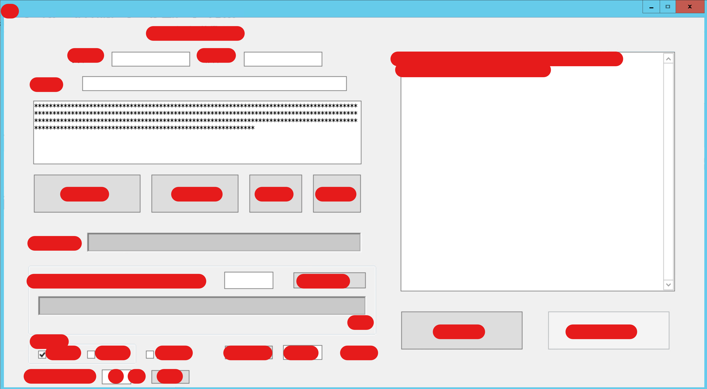

# 一点杂谈——聊以回顾2021

作者：Lcxzyr

TID：32353

<title>1</title> <link href="../Styles/Style.css" type="text/css" rel="stylesheet">

# 1

*本帖最後由 Lcxzyr 於 2022-1-3 02:51 編輯*

本来打算在词云（[传送门](https://giantessnight.com/gnforum2012/forum.php?mod=viewthread&tid=32352)）的帖子下面简单谈两句，结果写了一大段，干脆新开一贴

一点碎碎念：

做GTS文章词云的想法，很早就有了。
但是巧妇难为无米之炊，词云本质就是对数据的一种可视化分析处理方式
柴米油盐，锅碗瓢盆灶啥的都好解决，有话说的好，能技术手段解决的问题都不是问题（
为了得到米面肉菜，总不能手工去收集吧，太离谱了。
后来尝试了各种工具，最终决定还是自己实现，现有工具都没法很好的解决问题。
陆陆续续花了一年多的时间写了将近一千行代码实现了一个不存在的工具，中间还经历了一些非技术层的挫折，以及现实生活中的一些事情，直到今年暑假才最终完成了一个相对比较成熟的版本。

看着一个小工具从一片空白逐渐增长，就好像看着自己的孩子一样。
期间感受过欣喜和满足，实现功能，成功运行的成就感。也感受过绝望和无奈，数次将这个项目抛弃不做，甚至想过删掉所有源代码。（是的，其实后期干过类似的，删掉了95%以上的原有代码进行重构）
但是最终还是将这个项目完成了。
虽然我绝无可能将这个小工具的源代码或者代码片段与大家分享，也不能谈碰到的具体困难，但是我还是决定简单说说这段经历。

老实说这个项目的开发让我学到了很多，不仅是技术上的，还有非技术上的。
这个项目可以说贯穿了我的2021，就聊以做为我对2021的回顾吧。

最后放一张孩子的照片
<ignore_js_op>

**屏幕截图 2022-01-03 024843.png** *(93.99 KB, 下載次數: 0)*

[下載附件](forum.php?mod=attachment&aid=OTMxMjF8ZWM2MmI1NTR8MTY3NDA2NTcwMHwxODIzMHwzMjM1Mw%3D%3D&nothumb=yes)

2022-1-3 02:49 上傳

（声明：从某个早期版本开始，请求间隔被控制在至少5s以上，以避免对服务器造成压力）

<title>2</title> <link href="../Styles/Style.css" type="text/css" rel="stylesheet">

# 2

回顾2021，疫情贯穿了我这一整年，因为新冠延迟开学，也因为新冠现在还在学校，2021年，这一年里似乎什么都没干成，尤其是下半年，废了 <title>3</title> <link href="../Styles/Style.css" type="text/css" rel="stylesheet">

# 3

  路过，支持一下，传送门进不去怎么办？
<title>4</title> <link href="../Styles/Style.css" type="text/css" rel="stylesheet">

# 4

这个帖子没人回复，帮楼主顶一下。</ignore_js_op>