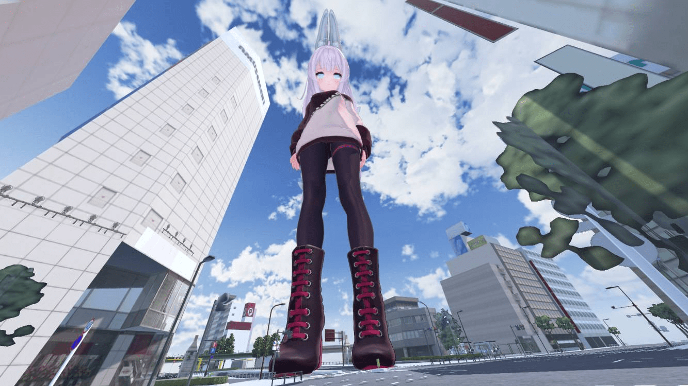

# 一种新型锻炼身体的方法

作者：s孙晓美

TID：32873

<title>1</title> <link href="../Styles/Style.css" type="text/css" rel="stylesheet">

# 1

就是爬巨大娘。
<ignore_js_op>

**[Thumb]640912770616-b14464f3-66fb-3b2d-bd83-caccf9318b92.jpg** *(111.48 KB, 下載次數: 0)*

[下載附件](forum.php?mod=attachment&aid=OTQ1OTV8Y2U3OGJlYzl8MTY3NDA2NTU5OXwxODIzMHwzMjg3Mw%3D%3D&nothumb=yes)

2022-3-17 20:47 上傳

VRchat 有个catch city的地图 可以抓取贴图和骨骼。
也就是说可以爬巨大娘的模型。
我自己去爬了一下，有点累。120m   12分钟
50m（从衣服开始爬）5分钟
真的非常有意思，等下看看视频能不能上传油管。

<title>2</title> <link href="../Styles/Style.css" type="text/css" rel="stylesheet">

# 2

以前去玩30米的那种室内攀岩玩下来就感觉人都要不行了，要真是让我攀爬百倍放大的女孩子应该爬不到到膝盖处就寄了吧。 <title>3</title> <link href="../Styles/Style.css" type="text/css" rel="stylesheet">

# 3

键鼠党表示毛毛雨啦，我玩过有个山岭女士的
加个长长的小尾巴 <title>4</title> <link href="../Styles/Style.css" type="text/css" rel="stylesheet">

# 4

这种，虽然我是个死宅，但我也觉得自己能突破人类极限，xp是第一生产力 <title>5</title> <link href="../Styles/Style.css" type="text/css" rel="stylesheet">

# 5

爬吧，年纪轻轻就该多锻炼，有个好身体。 <title>6</title> <link href="../Styles/Style.css" type="text/css" rel="stylesheet">

# 6

等等，这个需要什么插件么？

还是说VRC里就可以直接爬了？

比较震惊VRC现在都能做到这样了。 <title>7</title> <link href="../Styles/Style.css" type="text/css" rel="stylesheet">

# 7

> [狐乐 發表於 2022-3-18 04:34](https://giantessnight.cf/gnforum2012/forum.php?mod=redirect&goto=findpost&pid=497801&ptid=32873)
> 等等，这个需要什么插件么？
> 
> 还是说VRC里就可以直接爬了？

建造这个地图的作者在地图里装了手柄 catch 插件
所以只有在这个地图里能爬。
他的最初的意思其实是让VR的巨大娘玩具可以抓起小人。
还有小人可以爬楼。
但是。好像被我们开发出了奇怪的玩法。

<title>8</title> <link href="../Styles/Style.css" type="text/css" rel="stylesheet">

# 8

> [s孙晓美 發表於 2022-3-18 05:45](https://giantessnight.cf/gnforum2012/forum.php?mod=redirect&goto=findpost&pid=497802&ptid=32873)
> 建造这个地图的作者在地图里装了手柄 catch 插件
> 所以只有在这个地图里能爬。
> 他的最初的意思其实是让VR ...

欸，不错呢。

求出处。

我也想玩玩这个地图</ignore_js_op>