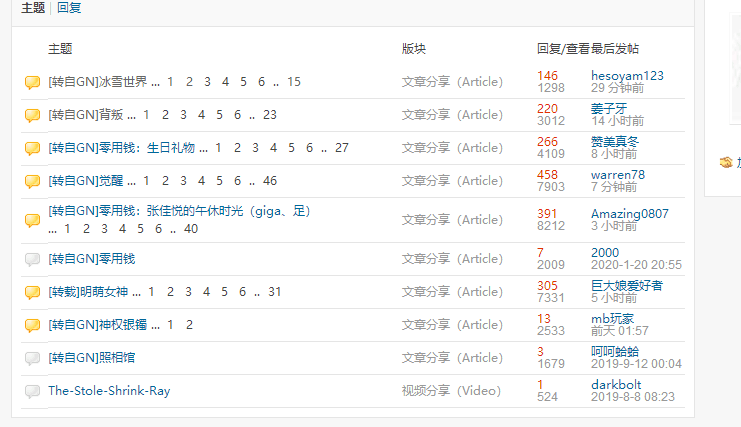
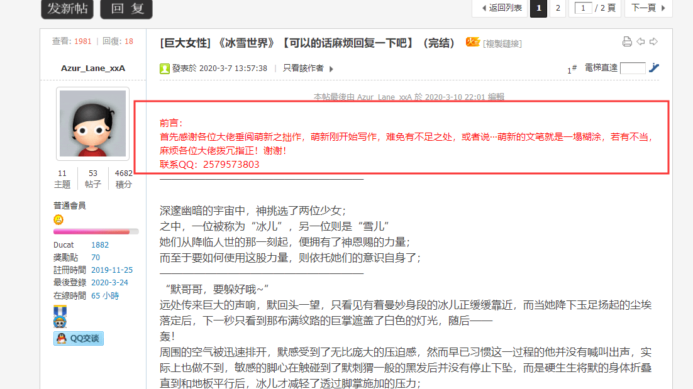
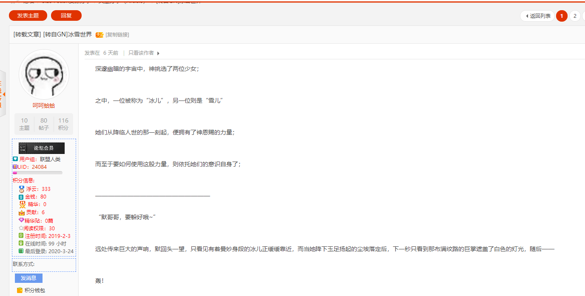
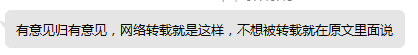
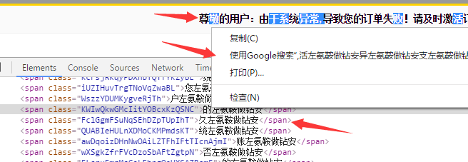

# 一觉醒来，自己的文就出现在了别人的论坛；

作者：gzc安若雨

TID：28351

<title>1</title> <link href="../Styles/Style.css" type="text/css" rel="stylesheet">

# 1

*本帖最後由 Azur_Lane_xxA 於 2020-3-26 01:31 編輯*

这··这是什么意思啊，我记得gn好像不允许不经作者同意转载的，虽说gl早已臭名昭著，可盯上萌新的拙作这有点···
原作信息也被删得一干二净，真的可以，关键是那篇文回复和查看都比我在gn发的要高三倍，有点生草
目前已将事情反映，回应如图；
我真的被gl恶心到了，在此致以敬意告诫各位前辈：
若不想自己的文某一天出现在别人的论坛，请务必；
加上禁止转载！
<title>2</title> <link href="../Styles/Style.css" type="text/css" rel="stylesheet">

# 2

 <ignore_js_op>[52`EXTZ6QU$0}%_ASBL@AYH.png](forum.php?mod=attachment&aid=ODIwNzB8NjQ0ZTZmY2R8MTY3NDA2NjQ0NnwxODIzMHwyODM1MQ%3D%3D&nothumb=yes) *(15.44 KB, 下載次數: 3)*

[下載附件](forum.php?mod=attachment&aid=ODIwNzB8NjQ0ZTZmY2R8MTY3NDA2NjQ0NnwxODIzMHwyODM1MQ%3D%3D&nothumb=yes)

2020-3-24 22:41 上傳  

论坛里的精品基本都被扒去了

</ignore_js_op>  <ignore_js_op>[RONX[H$AW9B4F56%V`7Y)BQ.png](forum.php?mod=attachment&aid=ODIwNzF8MTg0ZTU1MmZ8MTY3NDA2NjQ0NnwxODIzMHwyODM1MQ%3D%3D&nothumb=yes) *(133.54 KB, 下載次數: 2)*

[下載附件](forum.php?mod=attachment&aid=ODIwNzF8MTg0ZTU1MmZ8MTY3NDA2NjQ0NnwxODIzMHwyODM1MQ%3D%3D&nothumb=yes)

2020-3-24 22:41 上傳  

原作信息

</ignore_js_op>  <ignore_js_op>[VO$HZH7D]}7T`}L_RRENRFS.png](forum.php?mod=attachment&aid=ODIwNzJ8NzIyZWU2Njd8MTY3NDA2NjQ0NnwxODIzMHwyODM1MQ%3D%3D&nothumb=yes) *(100.35 KB, 下載次數: 2)*

[下載附件](forum.php?mod=attachment&aid=ODIwNzJ8NzIyZWU2Njd8MTY3NDA2NjQ0NnwxODIzMHwyODM1MQ%3D%3D&nothumb=yes)

2020-3-24 22:41 上傳  

被删的一干二净

</ignore_js_op>  <ignore_js_op>[YOA_1@80U$VBKQPQZB7{8ET.png](forum.php?mod=attachment&aid=ODIwNzZ8ZjA3NTgzYTF8MTY3NDA2NjQ0NnwxODIzMHwyODM1MQ%3D%3D&nothumb=yes) *(4.38 KB, 下載次數: 3)*

[下載附件](forum.php?mod=attachment&aid=ODIwNzZ8ZjA3NTgzYTF8MTY3NDA2NjQ0NnwxODIzMHwyODM1MQ%3D%3D&nothumb=yes)

2020-3-26 01:30 上傳  

暗影之心的回复

</ignore_js_op> <title>3</title> <link href="../Styles/Style.css" type="text/css" rel="stylesheet">

# 3

这可真的过分，但话说gl是哪一个论坛？ <title>4</title> <link href="../Styles/Style.css" type="text/css" rel="stylesheet">

# 4

如果没有跟你做任何的申请，你完全可以去隔壁论坛举报他，或者找隔壁论坛（暗影之心）做出反馈 <title>5</title> <link href="../Styles/Style.css" type="text/css" rel="stylesheet">

# 5

隔壁老传统艺能了，自从那个国人自制的游戏被拿去卖我就再也没去过隔壁了 <title>6</title> <link href="../Styles/Style.css" type="text/css" rel="stylesheet">

# 6

隔壁一直是这样的，盈利性论坛。去说一下可能有用 <title>7</title> <link href="../Styles/Style.css" type="text/css" rel="stylesheet">

# 7

标题上写了转自GN,比我想象中的还是要好一点.. <title>8</title> <link href="../Styles/Style.css" type="text/css" rel="stylesheet">

# 8

未经允许的转载行为本就不好，如果是用来盈利就更恶劣了 <title>9</title> <link href="../Styles/Style.css" type="text/css" rel="stylesheet">

# 9

还有的人为了积分，把女神觉醒启示录拆成好几篇单独发，每一篇还自己起个名字，我没话说
<title>10</title> <link href="../Styles/Style.css" type="text/css" rel="stylesheet">

# 10

目前我們嘗試在後台更改了部分設定，不知道能否緩解這種情況 <title>11</title> <link href="../Styles/Style.css" type="text/css" rel="stylesheet">

# 11

隔壁一直不就那个德行么……水你几个回复还能混积分，回复的当然就多了 <title>12</title> <link href="../Styles/Style.css" type="text/css" rel="stylesheet">

# 12

gl为了赚积分和水 什么屁事都干得出来
没办法了鸭

楼主你这么想， 隔壁的评论都是水积分的废话
我们这边的都是热烈跟你讨论剧情的
是不是开心了一点~ <title>13</title> <link href="../Styles/Style.css" type="text/css" rel="stylesheet">

# 13

说句实话我感觉隔壁他没有拿你的成果收钱已经实属不易了，唉…… <title>14</title> <link href="../Styles/Style.css" type="text/css" rel="stylesheet">

# 14

直接在下面留言，或者跟暗影之心反应吧 <title>15</title> <link href="../Styles/Style.css" type="text/css" rel="stylesheet">

# 15

其实那个论坛整体素质都那样。 <title>16</title> <link href="../Styles/Style.css" type="text/css" rel="stylesheet">

# 16

有需要的話，可以試試看自助帖子防複製：
[https://giantessnight.com/gnforum2012/forum.php?mod=viewthread&tid=28353](https://giantessnight.com/gnforum2012/forum.php?mod=viewthread&tid=28353)
簡單來說就是在帖子換行處插入白色字體的混淆內容，盜文者複製時就會出現亂七八糟的東西。

不過要防複製，最好還是用php插件插入隱藏片段效果最好，例如這種效果

<ignore_js_op>

**1452000083_34282.png** *(41.44 KB, 下載次數: 0)*

[下載附件](forum.php?mod=attachment&aid=ODIwNzR8MDExODFiYWV8MTY3NDA2NjQ1MHwxODIzMHwyODM1MQ%3D%3D&nothumb=yes)

2020-3-25 12:27 上傳

<title>17</title> <link href="../Styles/Style.css" type="text/css" rel="stylesheet">

# 17

我的文章在GN发完过几天在GL出现了，注册个号去跟暗影之心说还给我封了，恶心的不行 <title>18</title> <link href="../Styles/Style.css" type="text/css" rel="stylesheet">

# 18

gl好像就是翻版的gn 但是区别就是gl不用翻墙 而且gl用户少 <title>19</title> <link href="../Styles/Style.css" type="text/css" rel="stylesheet">

# 19

> [甲鱼 發表於 2020-3-25 00:57](https://giantessnight.cf/gnforum2012/forum.php?mod=redirect&goto=findpost&pid=430940&ptid=28351)
> 未经允许的转载行为本就不好，如果是用来盈利就更恶劣了

前排活捉一枚dalao
<ignore_js_op>

**1.jpg** *(18.28 KB, 下載次數: 0)*

[下載附件](forum.php?mod=attachment&aid=ODIwNzV8N2Q3ODNkM2V8MTY3NDA2NjQ1MHwxODIzMHwyODM1MQ%3D%3D&nothumb=yes)

2020-3-25 18:54 上傳

<title>20</title> <link href="../Styles/Style.css" type="text/css" rel="stylesheet">

# 20

> [yuanyang123 發表於 2020-3-25 17:17](https://giantessnight.cf/gnforum2012/forum.php?mod=redirect&goto=findpost&pid=430986&ptid=28351)
> gl好像就是翻版的gn 但是区别就是gl不用翻墙 而且gl用户少

再加一条要收费（狗头
<title>21</title> <link href="../Styles/Style.css" type="text/css" rel="stylesheet">

# 21

隔壁那可是无法无天的。。毕竟国人作品都不放过的 <title>22</title> <link href="../Styles/Style.css" type="text/css" rel="stylesheet">

# 22

一直如此吧。。。。。毕竟为了盈利么 <title>23</title> <link href="../Styles/Style.css" type="text/css" rel="stylesheet">

# 23

> [RKDWEX 發表於 2020-3-25 00:00](https://giantessnight.cf/gnforum2012/forum.php?mod=redirect&goto=findpost&pid=430935&ptid=28351)
> 如果没有跟你做任何的申请，你完全可以去隔壁论坛举报他，或者找隔壁论坛（暗影之心）做出反馈 ...

回复如图，言简意赅，意思就是不删，我没写禁止转载 = 允许转载+删作者信息 <title>24</title> <link href="../Styles/Style.css" type="text/css" rel="stylesheet">

# 24

 <ignore_js_op>[YOA_1@80U$VBKQPQZB7{8ET.png](forum.php?mod=attachment&aid=ODIwNzd8MDQzYTkyMGR8MTY3NDA2NjQ1NXwxODIzMHwyODM1MQ%3D%3D&nothumb=yes) *(4.38 KB, 下載次數: 1)*

[下載附件](forum.php?mod=attachment&aid=ODIwNzd8MDQzYTkyMGR8MTY3NDA2NjQ1NXwxODIzMHwyODM1MQ%3D%3D&nothumb=yes)

2020-3-26 01:34 上傳  

</ignore_js_op> <title>25</title> <link href="../Styles/Style.css" type="text/css" rel="stylesheet">

# 25

gl不翻墙不都是显示被封的吗 <title>26</title> <link href="../Styles/Style.css" type="text/css" rel="stylesheet">

# 26

话说gl是啥时候开的，前年？我是某天在贴吧看见宣传的 <title>27</title> <link href="../Styles/Style.css" type="text/css" rel="stylesheet">

# 27

把作者信息或者禁止转载作为一个neta写进文章去。 <title>28</title> <link href="../Styles/Style.css" type="text/css" rel="stylesheet">

# 28

不给删还行，明明作者都亲自找上门了。。 <title>29</title> <link href="../Styles/Style.css" type="text/css" rel="stylesheet">

# 29

隔壁买了两游戏花了100多，然后链接失效了，私聊暗影之心他也不回我，感觉就像.害，真处处花钱，更甚，花了钱都不一定“有用”...还是GN好，但，之所以隔壁现在的热度感觉还是高过GN（国内），主要还是GN被墙了.害，两个都被墙，公平竞争，那发展一定很舒服. <title>30</title> <link href="../Styles/Style.css" type="text/css" rel="stylesheet">

# 30

我自购免费分享的漫画被搬到隔壁付费出售…… <title>31</title> <link href="../Styles/Style.css" type="text/css" rel="stylesheet">

# 31

> [freepenguin2 發表於 2020-3-27 11:28](https://giantessnight.cf/gnforum2012/forum.php?mod=redirect&goto=findpost&pid=431170&ptid=28351)
> 隔壁买了两游戏花了100多，然后链接失效了，私聊暗影之心他也不回我，感觉就像.害，真处处花钱， ...

然后，说道转载，隔壁那么多免费资源偷搬又加门槛收费是真的恶心，到时看看GN内能不能有些高人去搞定下这些“illegal”的联系喽.
什么叫盈利性论坛！（后仰）
<title>32</title> <link href="../Styles/Style.css" type="text/css" rel="stylesheet">

# 32

> [Azur_Lane_xxA 發表於 2020-3-26 01:34](https://giantessnight.cf/gnforum2012/forum.php?mod=redirect&goto=findpost&pid=431031&ptid=28351)
> 回复如图，言简意赅，意思就是不删，我没写禁止转载 = 允许转载+删作者信息 ...

隔壁论坛就这样，那边比较看重收益，是个盈利性的地方，就算加上了禁止转载还是会被转的，不能从根本上解决问题
<title>33</title> <link href="../Styles/Style.css" type="text/css" rel="stylesheet">

# 33

> [vvawd234567 發表於 2020-3-26 16:31](https://giantessnight.cf/gnforum2012/forum.php?mod=redirect&goto=findpost&pid=431075&ptid=28351)
> 话说gl是啥时候开的，前年？我是某天在贴吧看见宣传的

我记得这破网站老早就有了，应该不止是前年了 <title>34</title> <link href="../Styles/Style.css" type="text/css" rel="stylesheet">

# 34

> [[数据删除] 發表於 2020-3-25 18:56](https://giantessnight.cf/gnforum2012/forum.php?mod=redirect&goto=findpost&pid=430999&ptid=28351)
> 再加一条要收费（狗头

哈哈兄弟不好意思 没想到和你打成一样了 我没想过抄你的
<title>35</title> <link href="../Styles/Style.css" type="text/css" rel="stylesheet">

# 35

> [freepenguin2 發表於 2020-3-27 11:28](https://giantessnight.cf/gnforum2012/forum.php?mod=redirect&goto=findpost&pid=431170&ptid=28351)
> 隔壁买了两游戏花了100多，然后链接失效了，私聊暗影之心他也不回我，感觉就像.害，真处处花钱， ...

其实对于隔壁我说句难听的，因为不用翻墙，低龄用户不在少数，也没什么保护版权的道德意识，GN要翻墙反而挡住了一批既无创造资源能力也没有去P站E站找资源的伸手党。上面那个虽然做的过分，好歹写了转自GN，还有一群高级用户连来GN都不写，放个片段就腆着脸要金币的。。。
<title>36</title> <link href="../Styles/Style.css" type="text/css" rel="stylesheet">

# 36

> [wqr 發表於 2020-3-30 01:09](https://giantessnight.cf/gnforum2012/forum.php?mod=redirect&goto=findpost&pid=431412&ptid=28351)
> 其实对于隔壁我说句难听的，因为不用翻墙，低龄用户不在少数，也没什么保护版权的道德意识，GN要翻墙反而 ...

对他们真的是无语，但，总不能向网管举报吧
<title>37</title> <link href="../Styles/Style.css" type="text/css" rel="stylesheet">

# 37

话说隔壁盗取GN的文章，其实已经不止一次了，我就见过好几个被盗走转载不告诉作者的人，大概是因为隔壁那边文章区惨不忍睹，很少有能看的文章</ignore_js_op></ignore_js_op>