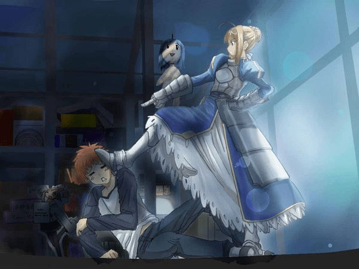

# 一首国语歌曲《把你变小》

作者：spacewolves

TID：18639

<title>1</title> <link href="../Styles/Style.css" type="text/css" rel="stylesheet">

# 1

记得这首歌早在五年前就在网络发布了，在gn里搜了一下却没有人提到过。
歌词奉上：

把你变小

演唱:魏玉婷
词/曲:袁子辉
编曲/制作: 葬音乐工作室
录音室/混音:火之浴工作室

愚人节的校园里到处很怪
表白变成愚弄借口使坏
满天的星星眨者眼睛是否在期待
一个童话般美丽故事的精彩

自行车后面唱歌的小女孩
等待着温暖双手的到来
冬天的虫宝宝已经找到厚厚的被盖
旁边的小手也放进暖暖的口袋

我想 我想 我想把你变小
放到掌心里 保护你
我想 我想 我想把你变小
装进口袋里 每时每刻和你在一起

<title>2</title> <link href="../Styles/Style.css" type="text/css" rel="stylesheet">

# 2

 <ignore_js_op>[x_large_ip6C_502e00001a191261.jpg](forum.php?mod=attachment&aid=NTA5MzN8Mzk4ZjM2Yjh8MTY3NDA2NzQ2N3wxODIzMHwxODYzOQ%3D%3D&nothumb=yes) *(49.28 KB, 下載次數: 17)*

[下載附件](forum.php?mod=attachment&aid=NTA5MzN8Mzk4ZjM2Yjh8MTY3NDA2NzQ2N3wxODIzMHwxODYzOQ%3D%3D&nothumb=yes)

2015-3-11 21:42 上傳  

</ignore_js_op> <ignore_js_op>

[把你变小.mp3](forum.php?mod=attachment&aid=NTA5MzJ8NDk3YTU1OWJ8MTY3NDA2NzQ2N3wxODIzMHwxODYzOQ%3D%3D)

2015-3-11 21:31 上傳

點擊文件名下載附件

3.18 MB, 下載次數: 345</ignore_js_op> <title>3</title> <link href="../Styles/Style.css" type="text/css" rel="stylesheet">

# 3

最後一段的歌詞真是引人遐想 <title>4</title> <link href="../Styles/Style.css" type="text/css" rel="stylesheet">

# 4

这个歌曲听起来确实很有感觉...谢谢分享... <title>5</title> <link href="../Styles/Style.css" type="text/css" rel="stylesheet">

# 5

配上潘玮柏的小小蚂蚁是不是很好，还有MV呢
<title>6</title> <link href="../Styles/Style.css" type="text/css" rel="stylesheet">

# 6

非常有趣，不过不是太好我的口味，谢谢楼主分享 <title>7</title> <link href="../Styles/Style.css" type="text/css" rel="stylesheet">

# 7

歌普通
但有擦邊就好?

我想把你变小~~~~ <title>8</title> <link href="../Styles/Style.css" type="text/css" rel="stylesheet">

# 8

   还有首歌 轻轻松松放口袋 <title>9</title> <link href="../Styles/Style.css" type="text/css" rel="stylesheet">

# 9

为啥打不开啊，无法播放 <title>10</title> <link href="../Styles/Style.css" type="text/css" rel="stylesheet">

# 10

> [Lanclot 發表於 2015-10-20 08:15](https://giantessnight.cf/gnforum2012/forum.php?mod=redirect&goto=findpost&pid=271958&ptid=18639)
> 为啥打不开啊，无法播放

可以的，点击下载，然后播放
<title>11</title> <link href="../Styles/Style.css" type="text/css" rel="stylesheet">

# 11

这首歌。。。。
还不错，谢谢楼主分享 <title>12</title> <link href="../Styles/Style.css" type="text/css" rel="stylesheet">

# 12

我想 我想 我想把你变小
放到掌心里 保护你
我想 我想 我想把你变小
装进口袋里 每时每刻和你在一起

话说某本小Loli屠村的本子里也有这样的情节......... <title>13</title> <link href="../Styles/Style.css" type="text/css" rel="stylesheet">

# 13

我记得还有类似的，也是一个缩小向的歌，还有mv的 <title>14</title> <link href="../Styles/Style.css" type="text/css" rel="stylesheet">

# 14

歌词听着怪怪的.....虽然没什么感觉但还是支持一下 <title>15</title> <link href="../Styles/Style.css" type="text/css" rel="stylesheet">

# 15

配图好棒。。。。。。。。。。。。。。 <title>16</title> <link href="../Styles/Style.css" type="text/css" rel="stylesheet">

# 16

其实吧，我觉得真的很，，，，，擦边。