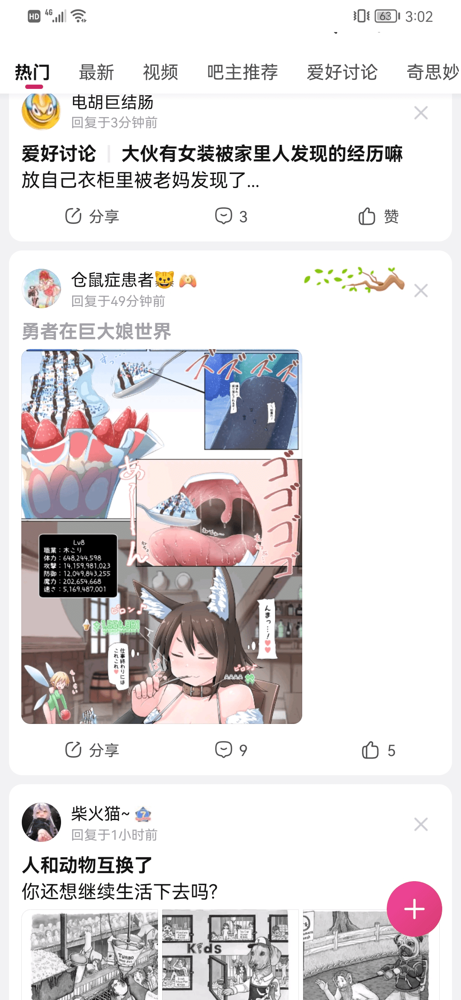

# 上贴吧首页了兄弟们

作者：trampled_mono

TID：32735

<title>1</title> <link href="../Styles/Style.css" type="text/css" rel="stylesheet">

# 1

<ignore_js_op>

**Screenshot_20220226_000423_com.baidu.tieba.jpg** *(459.85 KB, 下載次數: 0)*

[下載附件](forum.php?mod=attachment&aid=OTQwNjR8MjA0MGMyZGF8MTY3NDA2NTU4NHwxODIzMHwzMjczNQ%3D%3D&nothumb=yes)

2022-2-26 00:08 上傳

<ignore_js_op>

**Screenshot_20220226_000448_com.baidu.tieba.jpg** *(362.39 KB, 下載次數: 0)*

[下載附件](forum.php?mod=attachment&aid=OTQwNjZ8MDVkOWQyNjF8MTY3NDA2NTU4NHwxODIzMHwzMjczNQ%3D%3D&nothumb=yes)

2022-2-26 00:09 上傳

<ignore_js_op>

**Screenshot_20220226_000454_com.baidu.tieba.jpg** *(341.2 KB, 下載次數: 0)*

[下載附件](forum.php?mod=attachment&aid=OTQwNjd8MmEwZTE0ZmV8MTY3NDA2NTU4NHwxODIzMHwzMjczNQ%3D%3D&nothumb=yes)

2022-2-26 00:09 上傳

核吧
离出圈又近了一步啊
似乎反响还不错？ <title>2</title> <link href="../Styles/Style.css" type="text/css" rel="stylesheet">

# 2

 <ignore_js_op>[Screenshot_20220226_000448_com.baidu.tieba.jpg](forum.php?mod=attachment&aid=OTQwNjV8ZmM0Y2U4ODJ8MTY3NDA2NTU4NHwxODIzMHwzMjczNQ%3D%3D&nothumb=yes) *(362.39 KB, 下載次數: 2)*

[下載附件](forum.php?mod=attachment&aid=OTQwNjV8ZmM0Y2U4ODJ8MTY3NDA2NTU4NHwxODIzMHwzMjczNQ%3D%3D&nothumb=yes)

2022-2-26 00:09 上傳  

</ignore_js_op> <title>3</title> <link href="../Styles/Style.css" type="text/css" rel="stylesheet">

# 3

河坝的人xp系统都很多样，包容性还是强的 <title>4</title> <link href="../Styles/Style.css" type="text/css" rel="stylesheet">

# 4

核吧是这样的，什么都有------------
<title>5</title> <link href="../Styles/Style.css" type="text/css" rel="stylesheet">

# 5

能看见爱好相同的人还是挺开心的，不过他要是发uru的图那就是另一个故事了（滑稽） <title>6</title> <link href="../Styles/Style.css" type="text/css" rel="stylesheet">

# 6

核吧什么xp没有，太正常了，说不定人家觉得我们这算清淡的（） <title>7</title> <link href="../Styles/Style.css" type="text/css" rel="stylesheet">

# 7

前两天刷贴吧还刷到了，接收度比想象中高很多 <title>8</title> <link href="../Styles/Style.css" type="text/css" rel="stylesheet">

# 8

之前老宫吧也有几个破圈贴很火，我还收藏了
但现在宫吧厕所化，没人认真ghs了，反倒是首页推过一个v吧的与gts有关的帖子 <title>9</title> <link href="../Styles/Style.css" type="text/css" rel="stylesheet">

# 9

又来了又来了又是首页兄弟们！
频率有点高啊！而且这位老哥在下面把最近勇者异世界这一系列的图全贴上去了
甚至让我感觉是道友在传教
<ignore_js_op>

**Screenshot_20220227_150223_com.baidu.tieba.jpg** *(812.04 KB, 下載次數: 0)*

[下載附件](forum.php?mod=attachment&aid=OTQwODZ8YmM0YTJjOGR8MTY3NDA2NTU4NHwxODIzMHwzMjczNQ%3D%3D&nothumb=yes)

2022-2-27 15:05 上傳

<title>10</title> <link href="../Styles/Style.css" type="text/css" rel="stylesheet">

# 10

河坝什么xp都有，但是很少有gts的，之前专门去搜了搜（ <title>11</title> <link href="../Styles/Style.css" type="text/css" rel="stylesheet">

# 11

就国内这网络环境还是别出圈的好，越出圈事越多 <title>12</title> <link href="../Styles/Style.css" type="text/css" rel="stylesheet">

# 12

> [trampled_mono 發表於 2022-2-27 08:05](https://giantessnight.cf/gnforum2012/forum.php?mod=redirect&goto=findpost&pid=496041&ptid=32735)
> 又来了又来了又是首页兄弟们！
> 频率有点高啊！而且这位老哥在下面把最近勇者异世界这一系列的图全贴上去了
> ...

草，这个有点危险啊
寺田的图还是不太合适，Raps 和teston的还可以
<title>13</title> <link href="../Styles/Style.css" type="text/css" rel="stylesheet">

# 13

> pofik20p 發表於 2022-3-4 07:05
> 草，这个有点危险啊
> 寺田的图还是不太合适，Raps 和teston的还可以

贴吧有寺田好多图。。毕竟寺田画的大部分都是同人图。 <title>14</title> <link href="../Styles/Style.css" type="text/css" rel="stylesheet">

# 14

核吧xp，，，，，， 不过还是不太想在国内出圈的 <title>15</title> <link href="../Styles/Style.css" type="text/css" rel="stylesheet">

# 15

河坝是这样的，甚至看到过gt内容导致现在刷起来都很小心… <title>16</title> <link href="../Styles/Style.css" type="text/css" rel="stylesheet">

# 16

可能不控gts或者某一个xp… 而只是单纯的好色… <title>17</title> <link href="../Styles/Style.css" type="text/css" rel="stylesheet">

# 17

> [tttt 發表於 2022-2-26 11:54](https://giantessnight.cf/gnforum2012/forum.php?mod=redirect&goto=findpost&pid=495926&ptid=32735)
> 能看见爱好相同的人还是挺开心的，不过他要是发uru的图那就是另一个故事了（滑稽） ...

那个画面确实不敢想象，承包了我今日的笑点hhhhh
<title>18</title> <link href="../Styles/Style.css" type="text/css" rel="stylesheet">

# 18

河坝发这个挺正常的，我还在汪吧看到有人发NA的MMD然后讨论量级的 <title>19</title> <link href="../Styles/Style.css" type="text/css" rel="stylesheet">

# 19

这个似乎一两个月之前就在q群上见了，这不是圈内人创作的？ <title>20</title> <link href="../Styles/Style.css" type="text/css" rel="stylesheet">

# 20

有个人发现有河坝的人申请论坛就立刻拒绝但我不说他是谁???? <title>21</title> <link href="../Styles/Style.css" type="text/css" rel="stylesheet">

# 21

> [伊邪纳岐 發表於 2022-4-5 04:40](https://giantessnight.cf/gnforum2012/forum.php?mod=redirect&goto=findpost&pid=499521&ptid=32735)
> 这个似乎一两个月之前就在q群上见了，这不是圈内人创作的？

是啊，肯定是圈内人创作的，不过转发的可能只是偶尔看到的人
<title>22</title> <link href="../Styles/Style.css" type="text/css" rel="stylesheet">

# 22

河坝可以理解的，666666666666666666666，但不要过多</ignore_js_op></ignore_js_op></ignore_js_op></ignore_js_op>