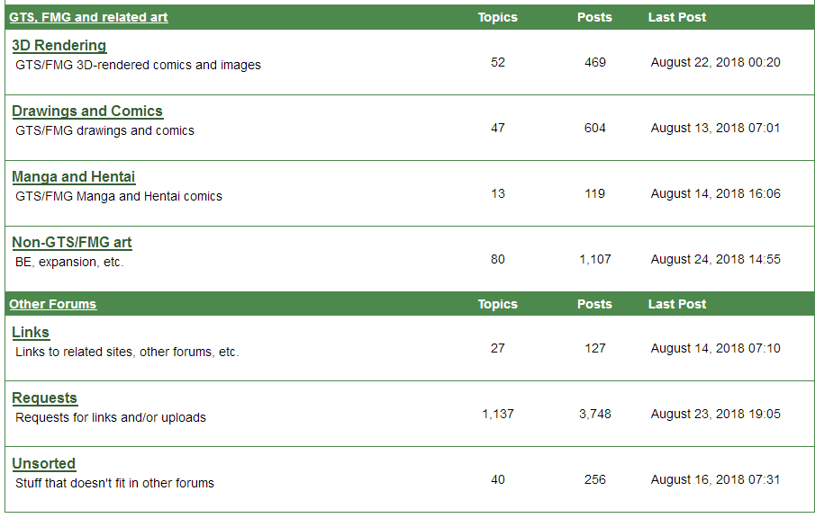

# 不知道大家有没有听过暗网这个东西

作者：迷途小喵

TID：26683

<title>1</title> <link href="../Styles/Style.css" type="text/css" rel="stylesheet">

# 1

听到YOUTUBE上面关于暗网的介绍，说有很多平时我们无法接触到的各种重口资源，虽然我们想要的只是GTS相关的，但是要去付费网站买真的不现实，居然有100多刀一部的?还无法预览？买回来大概率是个坑，那么我想问一下，这个暗网到底有没有这种资源下载？
<title>2</title> <link href="../Styles/Style.css" type="text/css" rel="stylesheet">

# 2

还有各种非法交易  足以让你纯洁的心灵崩成渣
<title>3</title> <link href="../Styles/Style.css" type="text/css" rel="stylesheet">

# 3

暗网啊，请务必用洋葱浏览器，但是呢...怎么说呢，那些东西太真实了，如果你未满18岁或者有心脏问题，推荐你不要观看 <title>4</title> <link href="../Styles/Style.css" type="text/css" rel="stylesheet">

# 4

稍微试过一下，怎么说呢，主要是因为GTS基本是幻想内容，所以基本是合法的，所以基本上没有任何东西需要上暗网找。

只有你如果需要不太合法的东西的话，才需要上去。

你懂，CP啊，CP啊，还有CP啊之类的。 <title>5</title> <link href="../Styles/Style.css" type="text/css" rel="stylesheet">

# 5

呃 需要用暗網看的GTS 大概是縮放光線真的發明以後才會存在 <title>6</title> <link href="../Styles/Style.css" type="text/css" rel="stylesheet">

# 6

GTS应该不需要用暗网看吧 <title>7</title> <link href="../Styles/Style.css" type="text/css" rel="stylesheet">

# 7

暗网莫得GTS，真的，莫得，网速还贼慢（协议限制） <title>8</title> <link href="../Styles/Style.css" type="text/css" rel="stylesheet">

# 8

z？暗网网速慢不说，还可能被钓鱼执法
<title>9</title> <link href="../Styles/Style.css" type="text/css" rel="stylesheet">

# 9

*本帖最後由 rayaiou 於 2019-4-11 14:51 編輯*

不好意思，耽误了几天。 <ignore_js_op>

**截图1.PNG** *(32.59 KB, 下載次數: 0)*

[下載附件](forum.php?mod=attachment&aid=Nzc3MjR8ZmFjZTMwOGF8MTY3NDA2Njc1N3wxODIzMHwyNjY4Mw%3D%3D&nothumb=yes)

2019-4-11 14:47 上傳

切入正题，首先，这里讨论的暗网是指使用tor协议的onion域名的网站。经查明，暗网表层确实存在唯一的gts论坛AnonGTS([http://ocu3errhpxppmwpr.onion/](http://ocu3errhpxppmwpr.onion/))（暗网深层我也没去过，不好说）。
该网站注册只需要输入用户名和密码就可以了，同时注意该站严格禁止未成年色情内容。
说明下其他同好谈到的问题。
钓鱼：只要你挂着代理访问，使用tor浏览器而不是linkto这类工具访问，不发表任何可能表明自己身份的信息，基本上不会有太大的问题。（看个gts还要被抓？）
网速慢：原因比较复杂，总的来说是由于电脑中有国产软件(严格来讲是大陆产)导致的。解决方法有两个，一是把所有国产软件全部无保留卸载。二是使用二层以上的代理进行嵌套，都可以较好地解决这个问题。
最后，因使用不当方法访问该网站导致的任何信息安全、财产安全、生命安全损失，本人概不负责！
<title>10</title> <link href="../Styles/Style.css" type="text/css" rel="stylesheet">

# 10

暗網很可能被釣魚，很危險 <title>11</title> <link href="../Styles/Style.css" type="text/css" rel="stylesheet">

# 11

先說不推暗網，網際網路之所以安全
是因為有明網的協定以及瀏覽器的保護
但暗網真的可能隨便逛就死一台電腦，被竊一張卡，被塞病毒
如果真的要逛，請用虛擬機

再來暗網上大概流的東西跟你想像中差太多了
能在明網光明正大放出來的東西沒必要再暗網放
上面基本上都是宗教，血腥，暴力，戀童等等
明文被禁止的東西，小心造成心理陰影 <title>12</title> <link href="../Styles/Style.css" type="text/css" rel="stylesheet">

# 12

YOUTUBE的介绍说暗网的资源是明网的N倍，是这么回事吗？如果只是宗教什么的，那应该远远少于明网 <title>13</title> <link href="../Styles/Style.css" type="text/css" rel="stylesheet">

# 13

> [3213213210 發表於 2019-4-7 18:42](https://giantessnight.cf/gnforum2012/forum.php?mod=redirect&goto=findpost&pid=402119&ptid=26683)
> 呃 需要用暗網看的GTS 大概是縮放光線真的發明以後才會存在

的确幻想过缩放技术真的大规模民用会有多恐怖的事发生
<title>14</title> <link href="../Styles/Style.css" type="text/css" rel="stylesheet">

# 14

> [dfggggx 發表於 2019-4-8 12:17](https://giantessnight.cf/gnforum2012/forum.php?mod=redirect&goto=findpost&pid=402192&ptid=26683)
> YOUTUBE的介绍说暗网的资源是明网的N倍，是这么回事吗？如果只是宗教什么的，那应该远远少于明网 ...

世界范围内的法外之地应该比咱们想象的要多..好多极端分子天天就喜欢拍一些非法视频传播..虽然我没上过暗网，但还是那个意思，非法的资源才主要通过暗网流通，合法的资源不会藏的那么深，毕竟分享的人也想通过分享资源积攒一定的人气。即使暗网上有单纯的资源分享，应该也会通过明网透露点信息的。

<title>15</title> <link href="../Styles/Style.css" type="text/css" rel="stylesheet">

# 15

你们想象中的那种很牛逼的暗网客不到5%，然后一大群咸鱼和诈骗犯，黄色资源更不要再按网找（无论什么形式），都是老的一批的资源一直传啊传，不找到指定“店家”都没什么新的可看 <title>16</title> <link href="../Styles/Style.css" type="text/css" rel="stylesheet">

# 16

同感，今天因为要找某些数据试了一下所谓的暗网，真的没那么邪乎，用Tor阅览器就能上，可能会有些血腥暴力的内容吧，但说什么明网只有网络上20%的信息真的是太胡扯了。明网只有网上20%的骗子和木马倒是差不多。 <title>17</title> <link href="../Styles/Style.css" type="text/css" rel="stylesheet">

# 17

> dfggggx 發表於 2019-4-8 12:17
> YOUTUBE的介绍说暗网的资源是明网的N倍，是这么回事吗？如果只是宗教什么的，那应该远远少于明网 ...

那个说法是混淆了广义上的暗网与狭义上的暗网，凡是与国际互联网不相连的数据都属于广义上暗网的范畴，比如你家不联网的硬盘上的资源或者互联网公司服务器里不公开的数据。你想想如果真的是指狭义上的暗网，一个大部分人甚至都没听说过的东西，资源怎么可能比明网多呀，要那么多资源有什么用。。。</ignore_js_op>