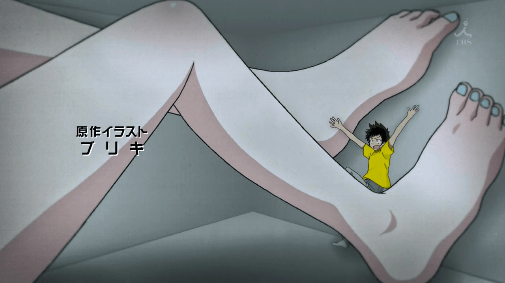

# 不经意看到的

作者：我只是路过

TID：19073

<title>1</title> <link href="../Styles/Style.css" type="text/css" rel="stylesheet">

# 1

看着怎么好像是动画呢，可是从来没看过。 <title>2</title> <link href="../Styles/Style.css" type="text/css" rel="stylesheet">

# 2

 <ignore_js_op>[181743 - barefoot drawing indoors short_hair waving_arms.jpg](forum.php?mod=attachment&aid=NTIxNzd8MGZlNDU3YTB8MTY3NDA2ODA1OHwxODIzMHwxOTA3Mw%3D%3D&nothumb=yes) *(94.22 KB, 下載次數: 61)*

[下載附件](forum.php?mod=attachment&aid=NTIxNzd8MGZlNDU3YTB8MTY3NDA2ODA1OHwxODIzMHwxOTA3Mw%3D%3D&nothumb=yes)

2015-6-1 16:33 上傳  

</ignore_js_op> <title>3</title> <link href="../Styles/Style.css" type="text/css" rel="stylesheet">

# 3

青春男与电波女开头曲里的。。 <title>4</title> <link href="../Styles/Style.css" type="text/css" rel="stylesheet">

# 4

主角是 藤和艾利欧，来自电波女与青春男OP <title>5</title> <link href="../Styles/Style.css" type="text/css" rel="stylesheet">

# 5

然而它的OP和内容无关    <title>6</title> <link href="../Styles/Style.css" type="text/css" rel="stylesheet">

# 6

电波女的，与本片无关，只存在op <title>7</title> <link href="../Styles/Style.css" type="text/css" rel="stylesheet">

# 7

依照網友說的
其實是動漫的OP? <title>8</title> <link href="../Styles/Style.css" type="text/css" rel="stylesheet">

# 8

这类与内容无关的op也是屡见不鲜ya` <title>9</title> <link href="../Styles/Style.css" type="text/css" rel="stylesheet">

# 9

这个是好几年前的片头，主线没有任何关系 <title>10</title> <link href="../Styles/Style.css" type="text/css" rel="stylesheet">

# 10

這不錯呀 REALLY!!!!!!!!!!!!!!!!!!! <title>11</title> <link href="../Styles/Style.css" type="text/css" rel="stylesheet">

# 11

电波女与青春男，但只是OP动画，跟电波女剧情本身毫无关系 <title>12</title> <link href="../Styles/Style.css" type="text/css" rel="stylesheet">

# 12

这张图片看起来不错呀
<title>13</title> <link href="../Styles/Style.css" type="text/css" rel="stylesheet">

# 13

这样的壁咚看起来很好~~
 <title>14</title> <link href="../Styles/Style.css" type="text/css" rel="stylesheet">

# 14

*本帖最後由 land 於 2016-3-6 17:34 編輯*

电波女与青春男  化物语 监督都是新房昭之，而片头都强行插入GTS，说明新房。。嗯 <title>15</title> <link href="../Styles/Style.css" type="text/css" rel="stylesheet">

# 15

这个擦边擦得厉害了，剧情倒是和GTS完全没关系