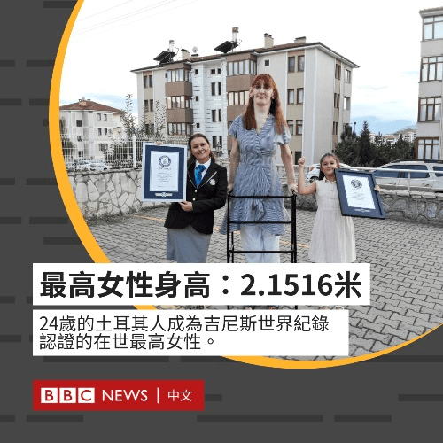

# 世界上在世的最高女性

作者：dindin

TID：31872

<title>1</title> <link href="../Styles/Style.css" type="text/css" rel="stylesheet">

# 1

吉尼斯世界纪录确认，土耳其人Rumeysa Gelgi是世界上在世的最高女性，身高为215.16厘米。

组织方称她的身高是由于一种叫韦弗综合症的罕见疾病所致，这种病的患者会出现成长加速等异常情况。 <title>2</title> <link href="../Styles/Style.css" type="text/css" rel="stylesheet">

# 2

 <ignore_js_op>[750D1F2B-D2DA-433D-A1E2-970507BC9F25.jpeg](forum.php?mod=attachment&aid=OTE3NDd8MDU3MmE2OTB8MTY3NDA2OTgxNXwxODIzMHwzMTg3Mg%3D%3D&nothumb=yes) *(85.54 KB, 下載次數: 1)*

[下載附件](forum.php?mod=attachment&aid=OTE3NDd8MDU3MmE2OTB8MTY3NDA2OTgxNXwxODIzMHwzMTg3Mg%3D%3D&nothumb=yes)

2021-10-14 21:49 上傳  

</ignore_js_op> <title>3</title> <link href="../Styles/Style.css" type="text/css" rel="stylesheet">

# 3

吉尼斯都这么拉了吗？这还没张子宇一个自然生长的高 <title>4</title> <link href="../Styles/Style.css" type="text/css" rel="stylesheet">

# 4

国内不是有一个六年级的小学生的身高都差不多和姚明一样高了吗