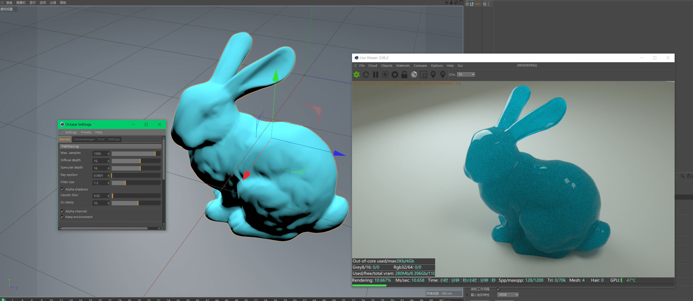
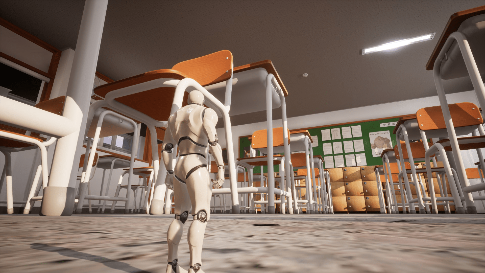

# 世界变化太快，渲染器方案更新！！

作者：月熙哥哥

TID：23945

<title>1</title> <link href="../Styles/Style.css" type="text/css" rel="stylesheet">

# 1

*本帖最後由 awkeygen 於 2017-10-21 01:50 編輯*

注：此文仅仅代表个人观点       最近配了台新电脑，于是重操旧业，在梳理近两年的渲染器发展的时候，我想说，**世界变化太快了**，承接之前的总结文章，我现在就为大家更新一下目前GTS的3D产品制作的渲染方案总结       为了节约大家时间，我这次只说干货总而言之就是：1\. 渲染器从CPU向GPU的转换（大幅度提升渲染速度）！2\. 无偏差纯物理渲染的飞速发展（直接出照片效果的图）！       还是那个需要用多核CPU加上模拟GI的各种渲染器（扫描线，Mental ray，巴西，vray）的时代吗？？不是了，世道变了，未来我们可以选择GPU渲染+全真实的物理渲染，下面介绍几个最近发展较快的渲染器
1\. Vray RT       自Vray3.4之后，Vray自带的RT(也就是GPU渲染方式)开始发力，直接用显卡出图，速度飞快，渲染设置套路也完全改变，不过，目前Vray RT大部分只用于预览，国外有大神能用RT出产品图，A某还没这个能力。2\. Octane       对，就是这个渲染器，全球最快的GPU无偏差物理渲染器，我刚刚淘宝了一个，刷新我对3D渲染的理解，感觉自己完全可以化身为摄影师，为什么这么说，请看下图（1秒钟不到的渲染结果）<ignore_js_op>

**捕获.JPG** *(355.12 KB, 下載次數: 0)*

[下載附件](forum.php?mod=attachment&aid=Njk2NDh8NWI5ZTc5MTZ8MTY3NDA2OTY3MXwxODIzMHwyMzk0NQ%3D%3D&nothumb=yes)

2017-10-20 22:00 上傳

对！这边调整，那边秒速出图，而且这可是sss材质啊，天空，光线和材质实时调整，实时出图，简直就是一个摄影师在布光的感觉，而且是纯物理渲染，想不真实都不可能，同样的还有thea render, iray, bias等，不过目前，与c4d配合最好的绝对是octane。3\. 阿诺德       已经集成如了3ds max，据说也是效果顶级的无偏差物理渲染，但是很慢4\. iray感谢Nvidia公司，iray是个好东西，完全为N卡打造，目前已经进入max取代mentalray，而且而且，daz竟然把iray买了下来集成进了daz!!!好家伙，daz威武，具体效果图不说了，请参考我的新作品       Max中的iray不用多说，相对成熟，不过，DAZ的iray还是有几个不成熟的地方

*   天空系统过于简单，可操控的范围太小
*   速度太慢，大约比octane慢了10倍，虽然iray有实时渲染，可是由于太慢导致其实用性不佳
*   DAZ的场景资源质量偏低，感觉这些作者的打光水平不佳，白瞎了这么好的渲染器，所以建议大家可以考虑下载场景后自己重新布光。还有octane也出了poser和daz的插件，不差钱的尽管买买买！！！

5\. vray，Mental ray等主流渲染器       得力于CPU的发展，这些渲染器的提升其实还是不小的，只是目前势头不如GPU渲染器，不过，这些渲染器的优质资源多，因此也不可忽视！并且这些 经典渲染器的工作流程很成熟了，也是很好的选择！6\. Maxwell，Reality等渲染器       虽然也是纯物理渲染，可是考虑无法忍受的速度，pass了。
对于个人渲染进展：目前A某具备用Octane+c4d渲染照片的能力，但是着实不好出作品，主要问题在于模型互相导入后需要重新做材质，工作量太大，因此，期待DAZ与各大主流软件进一步结合那一天！最后，推荐一下配置：适用于GPU渲染器-octane，iray等1\. CPU – i7起步最佳2\. GPU：1070起步，最好1080Ti或泰坦XP，有条件的可以1080Ti*2或*43\. 内存：16G起步(考虑到材质的大量内存占用)4\. IPS屏幕显示器，2k起步（对于后期修图有帮助）5\. SSD硬盘6\. 一块好主板，推荐华硕z系列7\. 可以考虑显卡水冷（对于公版，尤其是泰坦XP）8\. 笔记本不推荐
<title>2</title> <link href="../Styles/Style.css" type="text/css" rel="stylesheet">

# 2

时代不同了，就现在而言，没必要一味抵制农企的CPU，锐龙7系列渲染并不比I7差多少的。 <title>3</title> <link href="../Styles/Style.css" type="text/css" rel="stylesheet">

# 3

用心文推一個
這是Nvidia的缺德技術獨佔的勝利嗎XD
話說水冷除了看起來炫砲散熱真的有差多少嗎?
感覺機殼空間的影響大很多
還有CPU跟GPU都打錯了...... <title>4</title> <link href="../Styles/Style.css" type="text/css" rel="stylesheet">

# 4

渲染速度貌似与CineBench R15之类的跑分成正比，只要跑分差不多，渲染同一场景花的时间也差不多。 <title>5</title> <link href="../Styles/Style.css" type="text/css" rel="stylesheet">

# 5

啊……谢谢推荐Orz
收藏做参考了Orz
虽然我不渲染3D
偶尔做作MMD，主要还是单纯的剪视频Orz玩游戏一类的…… <title>6</title> <link href="../Styles/Style.css" type="text/css" rel="stylesheet">

# 6

> [Eighteen 發表於 2017-10-20 23:53](https://giantessnight.cf/gnforum2012/forum.php?mod=redirect&goto=findpost&pid=349078&ptid=23945)
> 时代不同了，就现在而言，没必要一味抵制农企的CPU，锐龙7系列渲染并不比I7差多少的。 ...

嗯 AMD和i7渲染在CPU渲染上差不多速度，而且性价比更高，推荐i7系列是我感觉i7和n卡配合更好，当然很期待a卡的下一代，n卡涨价太厉害了，需要a卡来竞争
<title>7</title> <link href="../Styles/Style.css" type="text/css" rel="stylesheet">

# 7

> [3213213210 發表於 2017-10-21 00:06](https://giantessnight.cf/gnforum2012/forum.php?mod=redirect&goto=findpost&pid=349079&ptid=23945)
> 用心文推一個
> 這是Nvidia的缺德技術獨佔的勝利嗎XD
> 話說水冷除了看起來炫砲散熱真的有差多少嗎?

嗯嗯，文章还没来得整理，错的地方有点多，见谅
话说我之前是a卡死忠，可惜a卡一直不出新产品，3d的各种渲染技术和物理加速也都只支持n卡（比如破碎特效、爆炸特效），无奈换的n卡，话说a卡啥时候出新产品呢。。。。
<title>8</title> <link href="../Styles/Style.css" type="text/css" rel="stylesheet">

# 8

> [sevenstrasword 發表於 2017-10-21 00:45](https://giantessnight.cf/gnforum2012/forum.php?mod=redirect&goto=findpost&pid=349083&ptid=23945)
> 啊……谢谢推荐Orz
> 收藏做参考了Orz
> 虽然我不渲染3D

嗯，用好了都能出好作品
话说MMD和honey select要如何才能将模型导出来呢，请问兄台有研究吗？
<title>9</title> <link href="../Styles/Style.css" type="text/css" rel="stylesheet">

# 9

> [白袍甘道夫 發表於 2017-10-21 00:13](https://giantessnight.cf/gnforum2012/forum.php?mod=redirect&goto=findpost&pid=349081&ptid=23945)
> 渲染速度貌似与CineBench R15之类的跑分成正比，只要跑分差不多，渲染同一场景花的时间也差不多。 ...

嗯，我没做测试，不过就DAZ的来说，如果选iray渲染器的话，个人做过测试，感觉单GPU的渲染速度是单CPU速度的10倍多 <title>10</title> <link href="../Styles/Style.css" type="text/css" rel="stylesheet">

# 10

> [3213213210 發表於 2017-10-21 00:06](https://giantessnight.cf/gnforum2012/forum.php?mod=redirect&goto=findpost&pid=349079&ptid=23945)
> 用心文推一個
> 這是Nvidia的缺德技術獨佔的勝利嗎XD
> 話說水冷除了看起來炫砲散熱真的有差多少嗎?

不过话说回来，N卡今年的确很进取，至少在3D方面已经开发了自己的渲染器了，期待A卡爆发的那一天了！！！
<title>11</title> <link href="../Styles/Style.css" type="text/css" rel="stylesheet">

# 11

970M瑟瑟发抖……老妈不让我3年内换新电脑（还剩两年） <title>12</title> <link href="../Styles/Style.css" type="text/css" rel="stylesheet">

# 12

这做的像真的一样了。。。确实牛啊。。。 <title>13</title> <link href="../Styles/Style.css" type="text/css" rel="stylesheet">

# 13

其实不只是离线渲染，实时渲染也有很大进步了。现在的游戏引擎也都是物理渲染的，贴图可以直接用Substance画PBR的贴图，效果奇好。
比如我最近重启的游戏，场景直接导进去简单烘焙一下画面效果就已经很好了，shader都没有调整过，而且可以在GTX1080下用2K分辨率跑到120帧，对比离线渲染的话还是比较爽的，就是效果复杂的shader调整起来就烦人的多了...
<ignore_js_op>

**HighresScreenshot00000.jpg** *(345.89 KB, 下載次數: 0)*

[下載附件](forum.php?mod=attachment&aid=Njk2NTN8MDc0Y2U1ODR8MTY3NDA2OTY4MXwxODIzMHwyMzk0NQ%3D%3D&nothumb=yes)

2017-10-21 23:25 上傳

<title>14</title> <link href="../Styles/Style.css" type="text/css" rel="stylesheet">

# 14

最近升级了DAZ后发现 新版本好像不支持我的显卡了
习惯了GUP渲染 再去用i5去进行CPU渲染感觉真是奇慢 <title>15</title> <link href="../Styles/Style.css" type="text/css" rel="stylesheet">

# 15

> [awkeygen 發表於 2017-10-21 01:52](https://giantessnight.cf/gnforum2012/forum.php?mod=redirect&goto=findpost&pid=349087&ptid=23945)
> 嗯，用好了都能出好作品
> 话说MMD和honey select要如何才能将模型导出来呢，请问兄台有研究吗？
> ...

啊……不好意思Orz 并不知道Orz我只会初级的MMD操作Orz
<title>16</title> <link href="../Styles/Style.css" type="text/css" rel="stylesheet">

# 16

> [wxy112300 發表於 2017-10-21 23:31](https://giantessnight.cf/gnforum2012/forum.php?mod=redirect&goto=findpost&pid=349150&ptid=23945)
> 其实不只是离线渲染，实时渲染也有很大进步了。现在的游戏引擎也都是物理渲染的，贴图可以直接用Substance ...

这速度的确不可思议，请问兄台用的是虚幻三引擎吗，貌似现在的有些制作软件也很成熟了，不妨尝试一下DAZ和虚幻三的结合，据我所知这俩软件配合起来是很方便的
<title>17</title> <link href="../Styles/Style.css" type="text/css" rel="stylesheet">

# 17

> [cghjg 發表於 2017-10-22 00:35](https://giantessnight.cf/gnforum2012/forum.php?mod=redirect&goto=findpost&pid=349154&ptid=23945)
> 最近升级了DAZ后发现 新版本好像不支持我的显卡了
> 习惯了GUP渲染 再去用i5去进行CPU渲染感觉真是奇慢 ...

用CUP跑物理渲染的确慢的无法忍受，不过iray用GPU跑也是不快，总之我是1080ti的显卡，跑一张带场景的要跑2小时多。。。。CUP的话估计一张图要跑1天了，目前GUP最快的还是Octane
<title>18</title> <link href="../Styles/Style.css" type="text/css" rel="stylesheet">

# 18

> [awkeygen 發表於 2017-11-16 11:05](https://giantessnight.cf/gnforum2012/forum.php?mod=redirect&goto=findpost&pid=350219&ptid=23945)
> 这速度的确不可思议，请问兄台用的是虚幻三引擎吗，貌似现在的有些制作软件也很成熟了，不妨尝试一下DAZ ...

现在我已经全面切换到虚幻4了，Daz到虚幻4的效果确实不错，我也测试过了用APEX Cloth来模拟头发和布料，不过现在最大的问题其实在动画上面，Daz的骨骼进入Max之后完全是普通的bone状态，不带IK的，基本没法制作动画...
请教下动画方面有什么好的解决方案吗？动画在DAZ里面工作似乎并不是很理想...</ignore_js_op></ignore_js_op>