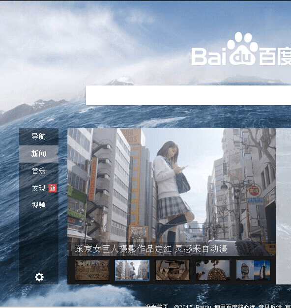

# 东京巨女居然登上百度首页了

作者：kahei0726

TID：19367

<title>1</title> <link href="../Styles/Style.css" type="text/css" rel="stylesheet">

# 1

<ignore_js_op>

**QQ图片20150709183357.jpg** *(66.55 KB, 下載次數: 0)*

[下載附件](forum.php?mod=attachment&aid=NTMwMjF8MGUyZDNmZmJ8MTY3NDA2NzkxOXwxODIzMHwxOTM2Nw%3D%3D&nothumb=yes)

2015-7-9 18:28 上傳

很显然这算是GTS第一次出现在这种大规模网站首页，不得不说二次元的力量已经很大程度上影响到了三次元
虽说很多人看到这些只会觉得好玩（我也是这么认为的），但是，还是感到莫名的亲切
<title>2</title> <link href="../Styles/Style.css" type="text/css" rel="stylesheet">

# 2

哦哦哦哦，看了楼主照片去查了下是真的诶，巨娘文化真的传播开了哈QwQ <title>3</title> <link href="../Styles/Style.css" type="text/css" rel="stylesheet">

# 3

*本帖最後由 taroxd 於 2015-7-9 19:25 編輯*

> [luffyoo 發表於 2015-7-9 18:47](https://giantessnight.cf/gnforum2012/forum.php?mod=redirect&goto=findpost&pid=260942&ptid=19367)
> 哦哦哦哦，看了楼主照片去查了下是真的诶，巨娘文化真的传播开了哈QwQ

这个算是传播开了么……？
我的想法和楼主差不多，只是让人觉得很好玩吧？
<title>4</title> <link href="../Styles/Style.css" type="text/css" rel="stylesheet">

# 4

> [taroxd 發表於 2015-7-9 19:21](https://giantessnight.cf/gnforum2012/forum.php?mod=redirect&goto=findpost&pid=260953&ptid=19367)
> 这个算是传播开了么……？
> 我的想法和楼主差不多，只是让人觉得很好玩吧？
> ...

凡事要对比，感觉像巨大娘这样的小众能这样已经很不错了的QwQ <title>5</title> <link href="../Styles/Style.css" type="text/css" rel="stylesheet">

# 5

估计他们也就跟看进击的心态一样吧 <title>6</title> <link href="../Styles/Style.css" type="text/css" rel="stylesheet">

# 6

还不是进击的巨人带出来的  只是搭了顺风车而已  我们这个圈子怎么可能主流 <title>7</title> <link href="../Styles/Style.css" type="text/css" rel="stylesheet">

# 7

我关心的是其他几部好久能看 <title>8</title> <link href="../Styles/Style.css" type="text/css" rel="stylesheet">

# 8

在百度看到之后来论坛一看，果然有人发了。
毕竟比进击里的巨人好看，大家应该还比较接受吧
不过我很想知道那位创作者是不是圈里人呢 <title>9</title> <link href="../Styles/Style.css" type="text/css" rel="stylesheet">

# 9

刚刚打开百度就看到了。。不过作为圈内人也就笑笑(´･ω･`) <title>10</title> <link href="../Styles/Style.css" type="text/css" rel="stylesheet">

# 10

可能就是个新鲜吧，感觉过一阵子就没人在乎这个了。 这个圈子毕竟小啊 <title>11</title> <link href="../Styles/Style.css" type="text/css" rel="stylesheet">

# 11

现在才发现已经错过了，这种尺度拿去传播还是能让大众接受 <title>12</title> <link href="../Styles/Style.css" type="text/css" rel="stylesheet">

# 12

虽然实质对圈内没什么影响，但是还是很高兴这样的伪传播 <title>13</title> <link href="../Styles/Style.css" type="text/css" rel="stylesheet">

# 13

很好破，如果互动残酷，立马就是世界差评。世人看到的是创意，并没有对精神的崇拜的意思。 <title>14</title> <link href="../Styles/Style.css" type="text/css" rel="stylesheet">

# 14

没多少人会去在意的吧。。 <title>15</title> <link href="../Styles/Style.css" type="text/css" rel="stylesheet">

# 15

唯一可惜的是都太短了，估计圈外人士都是抱着猎奇的心态来看这个的 <title>16</title> <link href="../Styles/Style.css" type="text/css" rel="stylesheet">

# 16

现在好像还是被封了。。。。。。 <title>17</title> <link href="../Styles/Style.css" type="text/css" rel="stylesheet">

# 17

小日本在这方面确实创意新颖  不过破坏性的估计一般人很难接受 <title>18</title> <link href="../Styles/Style.css" type="text/css" rel="stylesheet">

# 18

要把這圈子擴到像足控妹控那樣大家沒興趣不過也不在乎還需要時間啊 <title>19</title> <link href="../Styles/Style.css" type="text/css" rel="stylesheet">

# 19

报道也是强行和进击的巨人联系起来，明明被广电禁了还敢这样报。 <title>20</title> <link href="../Styles/Style.css" type="text/css" rel="stylesheet">

# 20

> [sx101 發表於 2015-7-9 21:37](https://giantessnight.cf/gnforum2012/forum.php?mod=redirect&goto=findpost&pid=260976&ptid=19367)
> 还不是进击的巨人带出来的  只是搭了顺风车而已  我们这个圈子怎么可能主流 ...

我个人感觉是人的爱美之心带出来的，毕竟只有一个体型上的关联，重要的是美女还有新鲜感 <title>21</title> <link href="../Styles/Style.css" type="text/css" rel="stylesheet">

# 21

> [liuqihao1997 發表於 2015-7-9 22:27](https://giantessnight.cf/gnforum2012/forum.php?mod=redirect&goto=findpost&pid=260984&ptid=19367)
> 在百度看到之后来论坛一看，果然有人发了。
> 毕竟比进击里的巨人好看，大家应该还比较接受吧
> 不过我很想知道 ...

目测不是，应该只是突发奇想之类的。。。
<title>22</title> <link href="../Styles/Style.css" type="text/css" rel="stylesheet">

# 22

说实话，这些照片做的很有水平很真实 <title>23</title> <link href="../Styles/Style.css" type="text/css" rel="stylesheet">

# 23

看过了 我还以为是电影 <title>24</title> <link href="../Styles/Style.css" type="text/css" rel="stylesheet">

# 24

互动要是能多点。，。。。。。 <title>25</title> <link href="../Styles/Style.css" type="text/css" rel="stylesheet">

# 25

特效确实不错，可惜太短了，话说那个动漫原来百度视频还能找到呢，现在也没了，动漫时间略长一点，不知道哪位大大有收藏。。。 <title>26</title> <link href="../Styles/Style.css" type="text/css" rel="stylesheet">

# 26

我坚信，只要咱继续努力，肯定能感染这个世界~ <title>27</title> <link href="../Styles/Style.css" type="text/css" rel="stylesheet">

# 27

我坚信，只要咱继续努力，肯定能感染这个世界~ <title>28</title> <link href="../Styles/Style.css" type="text/css" rel="stylesheet">

# 28

只是作为一个比较吸引人的话题来说的，和GTS扩散没什么关系 <title>29</title> <link href="../Styles/Style.css" type="text/css" rel="stylesheet">

# 29

呃，听说有视频，哪里可以看？ <title>30</title> <link href="../Styles/Style.css" type="text/css" rel="stylesheet">

# 30

说不定会有小盆友因此走上不归路。。 <title>31</title> <link href="../Styles/Style.css" type="text/css" rel="stylesheet">

# 31

可能这个广告，引发不少人内在的属性 <title>32</title> <link href="../Styles/Style.css" type="text/css" rel="stylesheet">

# 32

繼續支持吧 , 引發多些人關注 ,  推紅他 , 成為熱門 , 可能會引起些創作人以巨人為題材. <title>33</title> <link href="../Styles/Style.css" type="text/css" rel="stylesheet">

# 33

希望以后能有更长的作品啊！！ <title>34</title> <link href="../Styles/Style.css" type="text/css" rel="stylesheet">

# 34

> [hunj 發表於 2015-7-12 16:02](https://giantessnight.cf/gnforum2012/forum.php?mod=redirect&goto=findpost&pid=261346&ptid=19367)
> 说实话，这些照片做的很有水平很真实

话说如何查看漫画区啊，他们我经常看你们说到漫画区，怎么进去啊？谢谢 <title>35</title> <link href="../Styles/Style.css" type="text/css" rel="stylesheet">

# 35

别说是百度了，好多视频网站早就有了，而且还是超清版，不过毕竟圈子小，受关注度没那么高而已
<title>36</title> <link href="../Styles/Style.css" type="text/css" rel="stylesheet">

# 36

估计是应为进击的巨人才能火一段世界的吧 <title>37</title> <link href="../Styles/Style.css" type="text/css" rel="stylesheet">

# 37

我们也就惊奇，但旁人只是笑笑...而且百度如果真的允许巨女传播的话，也不会封了那么多关于gts的吧... <title>38</title> <link href="../Styles/Style.css" type="text/css" rel="stylesheet">

# 38

        他们允许的是没有残杀,没有虐待,
没有战争,没有强迫,没有.......

        总之,和谐很重要(但我想说分级也
很重要好不好)! <title>39</title> <link href="../Styles/Style.css" type="text/css" rel="stylesheet">

# 39

哦哦哦，看了楼主照片去查了下是真的诶，巨娘文化真的传播开了哈QwQ <title>40</title> <link href="../Styles/Style.css" type="text/css" rel="stylesheet">

# 40

我希望這様可以宣传巨大娘的文化QWQ <title>41</title> <link href="../Styles/Style.css" type="text/css" rel="stylesheet">

# 41

大部分人应该只是有些好奇罢了，毕竟我们这样爱好的人数量应该还是不多的QAQ</ignore_js_op>