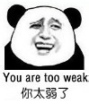
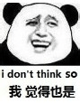

# 为什么各类文章里描写的女主角都普遍偏矮？

作者：roundrage

TID：26413

<title>1</title> <link href="../Styles/Style.css" type="text/css" rel="stylesheet">

# 1

学生文里的女主角都是不到（等比例）160cm，160cm+，165cm的，难道就没有像我一样喜欢身材170cm+的么 <title>2</title> <link href="../Styles/Style.css" type="text/css" rel="stylesheet">

# 2

165不算矮了吧，难不成lz周围的女生都170以上？ <title>3</title> <link href="../Styles/Style.css" type="text/css" rel="stylesheet">

# 3

主要是这样的话变大或者相对变大的话会让人比较兴奋。

对所以平均身高150什么的
<title>4</title> <link href="../Styles/Style.css" type="text/css" rel="stylesheet">

# 4

*本帖最後由 jiko 於 2019-2-13 16:18 編輯*

先问是不是，再问为什么吧，我印象中女主角有170的文章不算很稀有的。何况如果把mini和tall girl也算进来，那就更多了

至于为什么大部分女主角的确没有170，那是因为大部分女生没有170，并且大部分男生最喜欢的女生身高区间不是170+，此外gts文里原身高不是十分重要了吧

当然，楼主喜欢170以上的话，同好哇 <title>5</title> <link href="../Styles/Style.css" type="text/css" rel="stylesheet">

# 5

因为作者在现实中接触到的女生普遍是这个身高，所以写这么高
人的审美是受环境影响的，原生180cm的女生和160cm等比例放大到180的是完全不一样的长相，没见过，无法喜欢 <title>6</title> <link href="../Styles/Style.css" type="text/css" rel="stylesheet">

# 6

萝莉控表示150CM太高了 <title>7</title> <link href="../Styles/Style.css" type="text/css" rel="stylesheet">

# 7

长期在波兰的我表示这边的妹子180+的太多了，毛子血统 <title>8</title> <link href="../Styles/Style.css" type="text/css" rel="stylesheet">

# 8

反差萌吧，本来小小的软软的可以抱在怀里的女孩子变大之后(或者是你变小之后)，只要一根小小的脚趾就能遮蔽住你的整个天空，她轻轻揉动脚趾就能驱使大气极速的流动，仅仅是袜子上的静电吸引就能把曾经比她高上一个头的你黏在脚趾缝里，她从那个比你矮一个头的小女孩变成了一举一动都能将你抹杀的女神，不要说脚掌，只要轻轻动动脚趾就能让楼房、城市、甚至是大陆、星球破碎，变成她脚上的灰尘。这种从小到大的反差，是多么戳人的萌点啊～ <title>9</title> <link href="../Styles/Style.css" type="text/css" rel="stylesheet">

# 9

楼主，不才的《巨母逆袭》写的就是185的女神啊!有兴趣可以去看看
<title>10</title> <link href="../Styles/Style.css" type="text/css" rel="stylesheet">

# 10

我还是喜欢185往上的高女……160以下的不好yy <title>11</title> <link href="../Styles/Style.css" type="text/css" rel="stylesheet">

# 11

可能就是追求一个反差，毕竟本来就很高的女生再变为gts很奇怪的感觉.....
反而是平时弱小的小女孩140cm-150cm变为gts更有反差感落差感。
而且我看到的大部分人爱好都是10-20岁的年轻少女 <title>12</title> <link href="../Styles/Style.css" type="text/css" rel="stylesheet">

# 12

因为比例问题吧，最受欢迎的女生身高不会超过165cm <title>13</title> <link href="../Styles/Style.css" type="text/css" rel="stylesheet">

# 13

因为好多萝莉控，虽然我也不能理解就是了。还有，矮=年轻，人都喜欢年轻的，大概吧 <title>14</title> <link href="../Styles/Style.css" type="text/css" rel="stylesheet">

# 14

设定吧，这个看本人，如果让我设定最躲一米六，不超过一密六，毕竟中国人素来以小家碧玉，大家闺秀之叹，是问，小家碧玉，大家闺秀，超过一米六了？别说现代，是纵观过去，不要停留今天 <title>15</title> <link href="../Styles/Style.css" type="text/css" rel="stylesheet">

# 15

隔壁论坛tallg欢迎你，那都是165以上的 <title>16</title> <link href="../Styles/Style.css" type="text/css" rel="stylesheet">

# 16

165厘米在女生中难道还算矮么，最多叫不高吧。 <title>17</title> <link href="../Styles/Style.css" type="text/css" rel="stylesheet">

# 17

*本帖最後由 Airfry 於 2019-2-20 20:36 編輯*

矮人一头的小女生本身带有柔弱感，巨大化后带来的反差不是很萌吗 <title>18</title> <link href="../Styles/Style.css" type="text/css" rel="stylesheet">

# 18

我觉得本来矮的女生感觉起来比较柔弱,而变大后会让人感觉起来变得强大,这种过程让人更加愉悦 <title>19</title> <link href="../Styles/Style.css" type="text/css" rel="stylesheet">

# 19

165左右还算正常的吧，感觉变身之后没什么影响 <title>20</title> <link href="../Styles/Style.css" type="text/css" rel="stylesheet">

# 20

因为太高  身材这些可能拉的过长不好看 <title>21</title> <link href="../Styles/Style.css" type="text/css" rel="stylesheet">

# 21

我就不喜欢女生太矮了，找女朋友也想找比我高的，但是那会特别困难，所以身高不是我的硬性要求。而且神奇的是，我高中以来关系好的女孩子很多都偏矮，最喜欢的几个女生可能连一米六都没有，但是她们都很可爱，如果能交往的话我也会很开心，但是如果她们能长高三十厘米就太好了太好了。 <title>22</title> <link href="../Styles/Style.css" type="text/css" rel="stylesheet">

# 22

我觉得喜欢萝莉没有问题啊 <title>23</title> <link href="../Styles/Style.css" type="text/css" rel="stylesheet">

# 23

楼主我就喜欢175+的..... <title>24</title> <link href="../Styles/Style.css" type="text/css" rel="stylesheet">

# 24

可能主流文化还是更喜欢这种吧 <title>25</title> <link href="../Styles/Style.css" type="text/css" rel="stylesheet">

# 25

强烈的反差，更让人心动 <title>26</title> <link href="../Styles/Style.css" type="text/css" rel="stylesheet">

# 26

女生本来就矮  而且矮显得可爱  除此之外  就是与巨大的现在形成对比  反差萌。。。。。 <title>27</title> <link href="../Styles/Style.css" type="text/css" rel="stylesheet">

# 27

lolicon云集于此的理据（bushi）