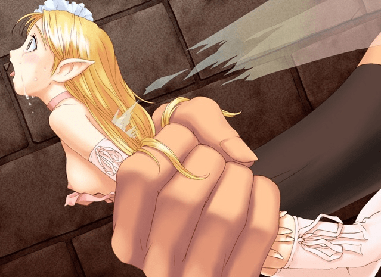

# 为什么我们这里没有关于sw的话题呢？

作者：無間道

TID：7198

<title>1</title> <link href="../Styles/Style.css" type="text/css" rel="stylesheet">

# 1

突然想到的，拿出来问一下 <title>2</title> <link href="../Styles/Style.css" type="text/css" rel="stylesheet">

# 2

因為沒那麼多人喜歡呀 <title>3</title> <link href="../Styles/Style.css" type="text/css" rel="stylesheet">

# 3

那话题没意思啊，也没人喜欢 <title>4</title> <link href="../Styles/Style.css" type="text/css" rel="stylesheet">

# 4

<ignore_js_op>

**1253689486832.jpg** *(94.48 KB, 下載次數: 0)*

[下載附件](forum.php?mod=attachment&aid=MTg3NjR8OWVjNGE2ZGZ8MTY3NDA2ODkxMXwxODIzMHw3MTk4&nothumb=yes)

2010-3-21 15:51 上傳

我收過幾張圖，不過不太感冒，因為太小了，被SM吧？她身材不夠，SM她吧，沒法把全部的玩法用出來............  扔到瓶子裏面圈養當擺設算了。

  作為一個禽獸 我感覺壓力很大。 <title>5</title> <link href="../Styles/Style.css" type="text/css" rel="stylesheet">

# 5

作為一個禽獸 我感覺壓力很大 
赞！哈哈 <title>6</title> <link href="../Styles/Style.css" type="text/css" rel="stylesheet">

# 6

.
在以巨大少女為前提之下所出現的SW，個人是可以接受的。

反之，類似樓上那種怎麼看都像是虐待妖精的東西，基本上…我光是瞥到都很討厭。 <title>7</title> <link href="../Styles/Style.css" type="text/css" rel="stylesheet">

# 7

最近一直在SW開荒...看到SW兩個字第一反應就是WOW（擦汗
話說泥碰那邊妖精廚不少的說...=。= <title>8</title> <link href="../Styles/Style.css" type="text/css" rel="stylesheet">

# 8

SW啊...個人是接受不虐但有道具或手部性交的類型,對象以GT或GTS為主
其他太過重口味的(如觸手)我是無法接受 <title>9</title> <link href="../Styles/Style.css" type="text/css" rel="stylesheet">

# 9

看到那种类型会很有压力的呀。 <title>10</title> <link href="../Styles/Style.css" type="text/css" rel="stylesheet">

# 10

sw只对f/f有爱，GT的情节拒绝接受。 <title>11</title> <link href="../Styles/Style.css" type="text/css" rel="stylesheet">

# 11

SW在一些獵奇版塊很流行，雖然看上去SW和GTS差不多，不過卻是兩個截然相反的東西。
一方面是自己處於絕對的弱勢，另一方面是壓倒性的強勢。

話說，某受很喜歡被虐的小精靈.........................  <title>12</title> <link href="../Styles/Style.css" type="text/css" rel="stylesheet">

# 12

其实我们不是不喜欢SW，最主要的原因是对GT反感，嗯，就是这样。

只要是有GTS，我也很喜欢SW。 <title>13</title> <link href="../Styles/Style.css" type="text/css" rel="stylesheet">

# 13

4楼的那个图！！
我很稀饭了 呵呵 <title>14</title> <link href="../Styles/Style.css" type="text/css" rel="stylesheet">

# 14

现在觉得GTS与ＳＷ一起的很好，一旦出现ＧＴ就非常难以接受了！ <title>15</title> <link href="../Styles/Style.css" type="text/css" rel="stylesheet">

# 15

SW到底是啥?(別圍觀我) <title>16</title> <link href="../Styles/Style.css" type="text/css" rel="stylesheet">

# 16

sw必须要有GTS陪同才看！
我对sm或shrink man比更有兴趣~ <title>17</title> <link href="../Styles/Style.css" type="text/css" rel="stylesheet">

# 17

强烈 同意楼上的， <title>18</title> <link href="../Styles/Style.css" type="text/css" rel="stylesheet">

# 18

SW=small woman</ignore_js_op>