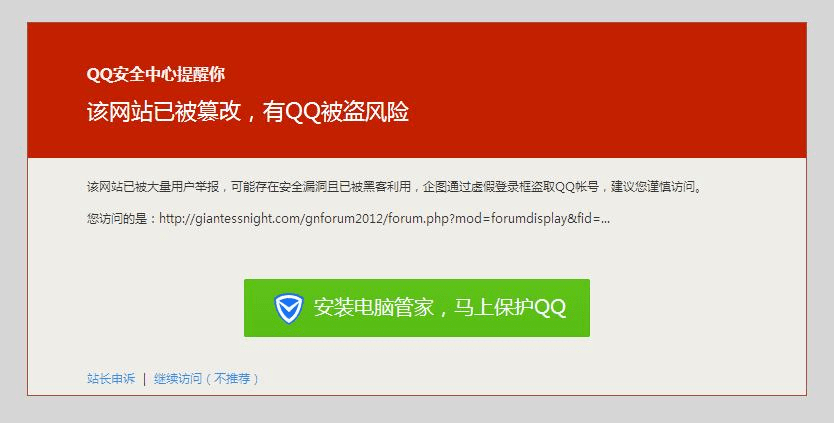

# 为什么我每点一次链接就会跳出来次这个，有一样的吗？

作者：vandarkholme

TID：19994

<title>1</title> <link href="../Styles/Style.css" type="text/css" rel="stylesheet">

# 1

着么去掉啊，好烦的。。。。。。。。。。。。。。。。。。。。。

<title>2</title> <link href="../Styles/Style.css" type="text/css" rel="stylesheet">

# 2

 <ignore_js_op>[err.JPG](forum.php?mod=attachment&aid=NTUxMTZ8OGU3OGY0Zjl8MTY3NDA2Nzk1NXwxODIzMHwxOTk5NA%3D%3D&nothumb=yes) *(33.92 KB, 下載次數: 3)*

[下載附件](forum.php?mod=attachment&aid=NTUxMTZ8OGU3OGY0Zjl8MTY3NDA2Nzk1NXwxODIzMHwxOTk5NA%3D%3D&nothumb=yes)

2015-10-23 12:54 上傳  

</ignore_js_op> <title>3</title> <link href="../Styles/Style.css" type="text/css" rel="stylesheet">

# 3

安装电脑管家咯？ <title>4</title> <link href="../Styles/Style.css" type="text/css" rel="stylesheet">

# 4

浏览器设置里面取消掉，网上有教程，自己去找找，丰衣足食 <title>5</title> <link href="../Styles/Style.css" type="text/css" rel="stylesheet">

# 5

我的办法是删QQ。彻底治愈不复发。 <title>6</title> <link href="../Styles/Style.css" type="text/css" rel="stylesheet">

# 6

好像从来就没有出现这样的情况。。。。。 <title>7</title> <link href="../Styles/Style.css" type="text/css" rel="stylesheet">

# 7

360应该好一点吧，反正我从来没遇到过这种情况 <title>8</title> <link href="../Styles/Style.css" type="text/css" rel="stylesheet">

# 8

这用的难道是QQ浏览器吗 <title>9</title> <link href="../Styles/Style.css" type="text/css" rel="stylesheet">

# 9

用其他浏览器喽。                  <title>10</title> <link href="../Styles/Style.css" type="text/css" rel="stylesheet">

# 10

不用qq安全中心啊  很坑的       <title>11</title> <link href="../Styles/Style.css" type="text/css" rel="stylesheet">

# 11

安装电脑管家没用，换浏览器吧。
个人推荐谷歌
<title>12</title> <link href="../Styles/Style.css" type="text/css" rel="stylesheet">

# 12

用手机的我从来没有过这种情况 <title>13</title> <link href="../Styles/Style.css" type="text/css" rel="stylesheet">

# 13

好像从来就没有出现这样的情况。。。。。            <title>14</title> <link href="../Styles/Style.css" type="text/css" rel="stylesheet">

# 14

QQ浏览器？上GN别用TX的最好是Chrome 火狐之类的
<title>15</title> <link href="../Styles/Style.css" type="text/css" rel="stylesheet">

# 15

为啥我用qq浏览器的时候没有出现呢，lz不行就换个浏览器吧 <title>16</title> <link href="../Styles/Style.css" type="text/css" rel="stylesheet">

# 16

我在用电脑管家，登录一直都没问题啊。。 <title>17</title> <link href="../Styles/Style.css" type="text/css" rel="stylesheet">

# 17

换个浏览器换个DNS试试？