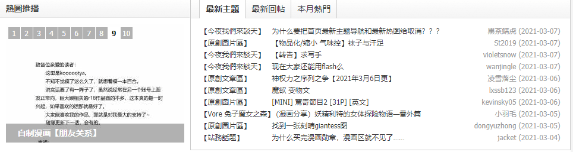

# 为什么要把首页最新主题导航和最新热图给取消？？？

作者：wjdbg

TID：30485

<title>1</title> <link href="../Styles/Style.css" type="text/css" rel="stylesheet">

# 1

我这还是可以看到的啊，只是每次进站这个板块会卡几秒出现。
<title>2</title> <link href="../Styles/Style.css" type="text/css" rel="stylesheet">

# 2

 <ignore_js_op>[Capture.PNG](forum.php?mod=attachment&aid=ODc3ODl8MWU1NzA5NjJ8MTY3NDA2NjA4M3wxODIzMHwzMDQ4NQ%3D%3D&nothumb=yes) *(65.6 KB, 下載次數: 0)*

[下載附件](forum.php?mod=attachment&aid=ODc3ODl8MWU1NzA5NjJ8MTY3NDA2NjA4M3wxODIzMHwzMDQ4NQ%3D%3D&nothumb=yes)

2021-3-7 18:30 上傳  

</ignore_js_op> <title>3</title> <link href="../Styles/Style.css" type="text/css" rel="stylesheet">

# 3

啊？……我这还有啊……兄你怕不是穿越惹，，， <title>4</title> <link href="../Styles/Style.css" type="text/css" rel="stylesheet">

# 4

我也可以看到啊……你是不是网页出了什么bug啊？ <title>5</title> <link href="../Styles/Style.css" type="text/css" rel="stylesheet">

# 5

我能看到啊，楼主要不试试看多等一会网页加载？可能是没有加载出来。 <title>6</title> <link href="../Styles/Style.css" type="text/css" rel="stylesheet">

# 6

是网络不稳定问题 加载出的 我也会这样 等一会就OK了 或者换个VPN <title>7</title> <link href="../Styles/Style.css" type="text/css" rel="stylesheet">

# 7

并没有取消，就是要过几秒才能看得到 <title>8</title> <link href="../Styles/Style.css" type="text/css" rel="stylesheet">

# 8

> [黒茶鯖虎 發表於 2021-3-7 20:57](https://giantessnight.cf/gnforum2012/forum.php?mod=redirect&goto=findpost&pid=462267&ptid=30485)
> 我这边却显示成这个样子应该是我VPN不太稳定的原因吧，我还以为是管理把首页图片和主题给取消 ...

手机有时候确实会显示不出来，多刷新几次就有了