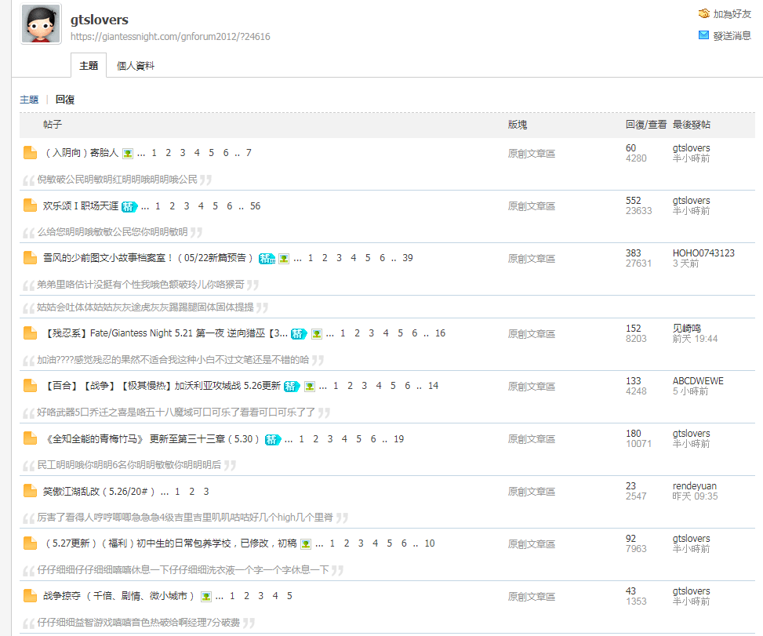

# 举报了

作者：van♂

TID：25236

<title>1</title> <link href="../Styles/Style.css" type="text/css" rel="stylesheet">

# 1

感觉近来论坛里水贴的风气很猖獗，没记错的话这个id之前好像被封过一次 <title>2</title> <link href="../Styles/Style.css" type="text/css" rel="stylesheet">

# 2

 <ignore_js_op>[QQ图片20180530161908.png](forum.php?mod=attachment&aid=NzI2NTF8MGY3NjhhZDl8MTY3NDA2NzA5OHwxODIzMHwyNTIzNg%3D%3D&nothumb=yes) *(119.2 KB, 下載次數: 9)*

[下載附件](forum.php?mod=attachment&aid=NzI2NTF8MGY3NjhhZDl8MTY3NDA2NzA5OHwxODIzMHwyNTIzNg%3D%3D&nothumb=yes)

2018-5-30 16:22 上傳  

</ignore_js_op> <title>3</title> <link href="../Styles/Style.css" type="text/css" rel="stylesheet">

# 3

回的内容乱七八糟的，摆明了就是水 <title>4</title> <link href="../Styles/Style.css" type="text/css" rel="stylesheet">

# 4

主要就是想水贴然后发现论坛回复自动设置是15字然后就蹦了 <title>5</title> <link href="../Styles/Style.css" type="text/css" rel="stylesheet">

# 5

这纯粹就是水帖！恶意灌水！支持封IP <title>6</title> <link href="../Styles/Style.css" type="text/css" rel="stylesheet">

# 6

明显的乱打字水贴的 真的是过分了 应该集体整理一下这种账号才是 <title>7</title> <link href="../Styles/Style.css" type="text/css" rel="stylesheet">

# 7

其实我就不明白这么水贴有什么用……就为了一个徽章吗（X <title>8</title> <link href="../Styles/Style.css" type="text/css" rel="stylesheet">

# 8

為了資源 只是克制力不足 就會開始做傻事
有看過為了多回覆 拿Ducat 把正常的話 拆成用5次回覆
但提高註冊要求 也對收入新人也會有影響 (茶) <title>9</title> <link href="../Styles/Style.css" type="text/css" rel="stylesheet">

# 9

> [Fid 發表於 2018-5-30 21:46](https://giantessnight.cf/gnforum2012/forum.php?mod=redirect&goto=findpost&pid=376336&ptid=25236)
> 為了資源 只是克制力不足 就會開始做傻事
> 有看過為了多回覆 拿Ducat 把正常的話 拆成用5次回覆
> 但提高註冊 ...

我感觉还好啦（？），站里资源只有漫画区的墙比较高，基本上和白嫖没什么区别（？），无理由地水贴就显得很傻，被封掉不更才真是什么也没有咧（……

<title>10</title> <link href="../Styles/Style.css" type="text/css" rel="stylesheet">

# 10

个人感觉这些恶意灌水的,八成以上都是冲漫画区去的,因为那里是唯一需要足够Ducatl来解锁的地方,其他也就是一些需要一定阅读权限的帖子了,另外这个人我也有印象,之前有个和他一样发言模式的人被禁了,怕不是这人的又一个小号. <title>11</title> <link href="../Styles/Style.css" type="text/css" rel="stylesheet">

# 11

为了自己看漫画就发水贴影响别人的阅读是很自私的行为 <title>12</title> <link href="../Styles/Style.css" type="text/css" rel="stylesheet">

# 12

又见到一个乱敲键盘的啊...虽然漫画区门槛高但只要保持活跃也是能上的 <title>13</title> <link href="../Styles/Style.css" type="text/css" rel="stylesheet">

# 13

已处理，谢谢举报 <title>14</title> <link href="../Styles/Style.css" type="text/css" rel="stylesheet">

# 14

> [咯咯 發表於 2018-5-31 02:21](https://giantessnight.cf/gnforum2012/forum.php?mod=redirect&goto=findpost&pid=376397&ptid=25236)
> 已处理，谢谢举报

想知道大佬的头像出自哪里？
<title>15</title> <link href="../Styles/Style.css" type="text/css" rel="stylesheet">

# 15

直接永封吧，不长记性。 <title>16</title> <link href="../Styles/Style.css" type="text/css" rel="stylesheet">

# 16

早就举报过他了，没有封吗？ <title>17</title> <link href="../Styles/Style.css" type="text/css" rel="stylesheet">

# 17

其实呢...对于脑子没问题的人来说，15个字真没多难打，刻意乱打那么多，绝对是想快速混分 <title>18</title> <link href="../Styles/Style.css" type="text/css" rel="stylesheet">

# 18

恶意灌水，建议提高论坛进入门槛 <title>19</title> <link href="../Styles/Style.css" type="text/css" rel="stylesheet">

# 19

应该是为了漫画区刷分吧，事实上自己好好参与谈天区的对话也能好好攒够积分，不必这样做的，希望他能知道