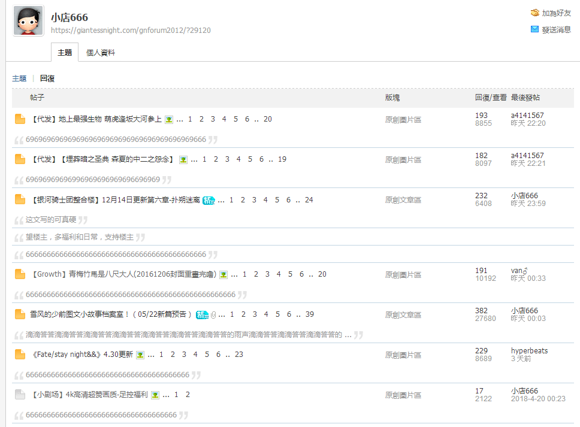

# 举报恶意灌水

作者：zyh1983914

TID：25247

<title>1</title> <link href="../Styles/Style.css" type="text/css" rel="stylesheet">

# 1

*本帖最後由 zyh1983914 於 2018-6-1 00:40 編輯*

如图,这个叫小店666的人,最近两天半夜时分一直在文章区几篇帖子里反复灌水刷分,严重影响人看文章的心情,望管理员大佬查明之后给与应有的处罚.
<ignore_js_op>

**689BWM$NB4)C]WABBQ{@CZ9.png** *(77.34 KB, 下載次數: 0)*

[下載附件](forum.php?mod=attachment&aid=NzI2Njl8YzUwMDQzMjB8MTY3NDA2NzA5MHwxODIzMHwyNTI0Nw%3D%3D&nothumb=yes)

2018-6-1 00:34 上傳

<title>2</title> <link href="../Styles/Style.css" type="text/css" rel="stylesheet">

# 2

哇，还是在晚上和半夜来水，算个做贼心虚，这待会查明就妥妥的封号了 <title>3</title> <link href="../Styles/Style.css" type="text/css" rel="stylesheet">

# 3

晕死，为了积分真是什么都能做 <title>4</title> <link href="../Styles/Style.css" type="text/css" rel="stylesheet">

# 4

这个比昨天那个还过分啊！一直刷数字！ <title>5</title> <link href="../Styles/Style.css" type="text/css" rel="stylesheet">

# 5

哇怕是不耐烦了才发数字的吧...希望早点出个审核制度之类的管管，天天封禁啥时候是个头啊 <title>6</title> <link href="../Styles/Style.css" type="text/css" rel="stylesheet">

# 6

我觉得还是得靠我们多多举报，大家如果是手机版可以先切换电脑版，再找到灌水的发言点右下角的举报 <title>7</title> <link href="../Styles/Style.css" type="text/css" rel="stylesheet">

# 7

建议提高论坛进入门槛 <title>8</title> <link href="../Styles/Style.css" type="text/css" rel="stylesheet">

# 8

这样的人也不多啦，告诫他规则顺带让他删掉水贴就行了，不必影响其他成员 <title>9</title> <link href="../Styles/Style.css" type="text/css" rel="stylesheet">

# 9

> [oppo 發表於 2018-6-8 15:30](https://giantessnight.cf/gnforum2012/forum.php?mod=redirect&goto=findpost&pid=377818&ptid=25247)
> 这样的人也不多啦，告诫他规则顺带让他删掉水贴就行了，不必影响其他成员 ...

这样的人还是举报不谢吧，一次宽恕他，他会越来越猖狂的</ignore_js_op>