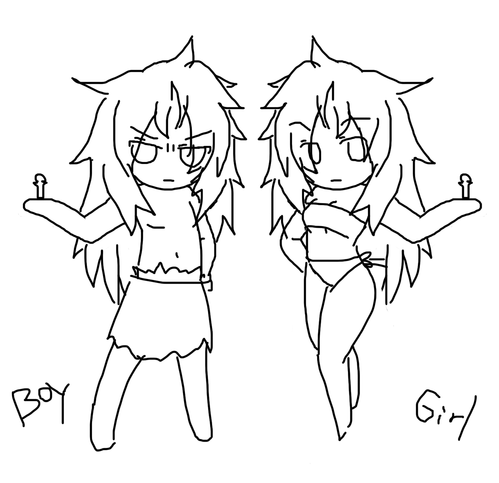

# 久久沒上,又收到一封騷擾短訊

作者：wstcc

TID：7083

<title>1</title> <link href="../Styles/Style.css" type="text/css" rel="stylesheet">

# 1

但是我刪除按太快了,沒記下對方的帳號

我只想說,想找別人踩死你就別找我加QQ
不管有多崇拜也一樣,我不是踐踏愛好者,OK?

想玩體內遊戲是可以考慮考慮 <title>2</title> <link href="../Styles/Style.css" type="text/css" rel="stylesheet">

# 2

.
這種人從來沒少過，把他當一陣惱人的風吹過就好了。
下次把他ID記著，我來處理。 <title>3</title> <link href="../Styles/Style.css" type="text/css" rel="stylesheet">

# 3

 我们这女人就是神啊 <title>4</title> <link href="../Styles/Style.css" type="text/css" rel="stylesheet">

# 4

話說我最近也收到一堆短信
都是求饒信

不過我是不會心軟的 <title>5</title> <link href="../Styles/Style.css" type="text/css" rel="stylesheet">

# 5

> 原帖由 *lovegts* 於 2010-3-13 18:48 發表 
> 話說我最近也收到一堆短信
> 都是求饒信
> 
> 不過我是不會心軟的

我寧可收到求饒信或是體內探索申請許可 <title>6</title> <link href="../Styles/Style.css" type="text/css" rel="stylesheet">

# 6

算了,這也不是今天才出現的
只要有人認為問這種問題不用付上成本的話,還是會繼續出現這個問題 <title>7</title> <link href="../Styles/Style.css" type="text/css" rel="stylesheet">

# 7

> 原帖由 *gtsferygood* 於 2010-3-13 19:03 發表 
> 
> 我寧可收到求饒信或是體內探索申請許可

可能大家不知道你對什麼感興趣

畢竟體內遊戲太鹹濕了 <title>8</title> <link href="../Styles/Style.css" type="text/css" rel="stylesheet">

# 8

我希望有个帖子....GN里面所有女性同学都报名并且附带爱好系然后招小人....

当然咯..只是希望 <title>9</title> <link href="../Styles/Style.css" type="text/css" rel="stylesheet">

# 9

> 原帖由 *o_0MorToy* 於 2010-3-13 19:17 發表 
> 我希望有个帖子....GN里面所有女性同学都报名并且附带爱好系然后招小人....
> 
> 当然咯..只是希望

不過主動的女性太少了,大部分的人還是很害羞的
我則是在自我介紹的時後就說明過了 <title>10</title> <link href="../Styles/Style.css" type="text/css" rel="stylesheet">

# 10

奇怪噢...既然有需求..干嘛不说呢....女生真奇怪... <title>11</title> <link href="../Styles/Style.css" type="text/css" rel="stylesheet">

# 11

這叫做羞恥心作祟 <title>12</title> <link href="../Styles/Style.css" type="text/css" rel="stylesheet">

# 12

體內探索？貌似很有趣的樣子……
有生命安全保障咩？我可是很怕死的呢^__^ <title>13</title> <link href="../Styles/Style.css" type="text/css" rel="stylesheet">

# 13

很可惜的,沒有人身保險
而且只能由下方入口進出 <title>14</title> <link href="../Styles/Style.css" type="text/css" rel="stylesheet">

# 14

可以组团进吗...配合会比较好吧 <title>15</title> <link href="../Styles/Style.css" type="text/css" rel="stylesheet">

# 15

組團也可以啊,但是能平安回來的不知有幾人就是了
---
另外我想順便在這問些有點突兀的問題
論壇內有同好的守備範圍大到連局外的GT也能吃的嗎? <title>16</title> <link href="../Styles/Style.css" type="text/css" rel="stylesheet">

# 16

> 原帖由 *gtsferygood* 於 2010-3-13 22:38 發表 
> 組團也可以啊,但是能平安回來的不知有幾人就是了
> ---
> 另外我想順便在這問些有點突兀的問題
> 論壇內有同好的守備範圍大到連局外的GT也能吃的嗎?

伪娘，或者小受型正太就可以。 <title>17</title> <link href="../Styles/Style.css" type="text/css" rel="stylesheet">

# 17

> 原帖由 *gtsferygood* 於 2010-3-13 22:38 發表 
> 組團也可以啊,但是能平安回來的不知有幾人就是了
> ---
> 另外我想順便在這問些有點突兀的問題
> 論壇內有同好的守備範圍大到連局外的GT也能吃的嗎?

黑黑...
我有
不過是有限定的
要求很嚴格(龜毛)

就不便再說拉 <title>18</title> <link href="../Styles/Style.css" type="text/css" rel="stylesheet">

# 18

我可以要求列出明細嘛? <title>19</title> <link href="../Styles/Style.css" type="text/css" rel="stylesheet">

# 19

表示扶她通吃.
可是GT完全无爱.... <title>20</title> <link href="../Styles/Style.css" type="text/css" rel="stylesheet">

# 20

组团进入...弱弱的问一下,需要签证么?团签是不是会比较简单呢? <title>21</title> <link href="../Styles/Style.css" type="text/css" rel="stylesheet">

# 21

我想问是不是女的知道男的有这种爱好会不会特别看不起他？如果发现了自己的男朋友有这种爱好就会马上分手啊？ <title>22</title> <link href="../Styles/Style.css" type="text/css" rel="stylesheet">

# 22

有簽證,立碑就比較簡單(?) <title>23</title> <link href="../Styles/Style.css" type="text/css" rel="stylesheet">

# 23

我想是很有可能的
不過是可以試著解釋或是把女友拉進圈內 <title>24</title> <link href="../Styles/Style.css" type="text/css" rel="stylesheet">

# 24

難得薔薇版主這麼晚還能上線
沒有上網門禁嗎XDD

[ *本帖最後由 lovegts 於 2010-3-14 01:51 編輯* ] <title>25</title> <link href="../Styles/Style.css" type="text/css" rel="stylesheet">

# 25

我觉着其实女性如果S属性的话可能会接受吧，但是就像女皇说的，羞耻心作祟……
p.s 难道男性在这里有M属性？ <title>26</title> <link href="../Styles/Style.css" type="text/css" rel="stylesheet">

# 26

我用了第二台電腦做接力,反正週休嘛 <title>27</title> <link href="../Styles/Style.css" type="text/css" rel="stylesheet">

# 27

> 原帖由 *gtsferygood* 於 2010-3-14 01:00 發表 
> 我想是很有可能的
> 不過是可以試著解釋或是把女友拉進圈內

我這邊可還不敢呢!
現在最多買喜歡的鞋子給她穿
找個機會就說喜歡她穿這個鞋子或靴子
還有時開開玩笑說要被她打被她踢,或者被她踩

至少曾經她有用腳玩弄我之類的

但GTS的嗜好可還不敢讓她知道 <title>28</title> <link href="../Styles/Style.css" type="text/css" rel="stylesheet">

# 28

如果大家发现自己女朋友是同好该怎么办啊？是不是也是玩玩就分手啊？ <title>29</title> <link href="../Styles/Style.css" type="text/css" rel="stylesheet">

# 29

如果我发现必然不会分手 <title>30</title> <link href="../Styles/Style.css" type="text/css" rel="stylesheet">

# 30

为什么gtsferygood在线仅有55小时，lovegts在线有着不可思议的910小时但是gtsferygood的阅读权限却比lovegts要高这么多啊？ <title>31</title> <link href="../Styles/Style.css" type="text/css" rel="stylesheet">

# 31

如果我发现了或者被发现了是肯定会分手的，现实永远不要和变态的幻想混在一起。 <title>32</title> <link href="../Styles/Style.css" type="text/css" rel="stylesheet">

# 32

可能是设定了特权？不晓得... <title>33</title> <link href="../Styles/Style.css" type="text/css" rel="stylesheet">

# 33

我希望找個受.............

作為雙向SM GTS 通吃者 我表示毫無壓力。 <title>34</title> <link href="../Styles/Style.css" type="text/css" rel="stylesheet">

# 34

可是幻想和幻想结合在一起有什么不好呢..？
我觉得更是知己啊....而且既然已经成为男女朋友肯定对对方都有好感...在GTS方面还能一致 <title>35</title> <link href="../Styles/Style.css" type="text/css" rel="stylesheet">

# 35

求WJD性别......我不想问可我的确看不出..... <title>36</title> <link href="../Styles/Style.css" type="text/css" rel="stylesheet">

# 36

算了不问了.....怕被人当做骚扰者..... <title>37</title> <link href="../Styles/Style.css" type="text/css" rel="stylesheet">

# 37

> 原帖由 *o_0MorToy* 於 2010-3-14 10:46 發表 
> 求WJD性别......我不想问可我的确看不出.....

老兄，珍惜生命啊。 <title>38</title> <link href="../Styles/Style.css" type="text/css" rel="stylesheet">

# 38

> 原帖由 *o_0MorToy* 於 2010-3-14 10:46 發表 
> 求WJD性别......我不想问可我的确看不出.....

把这里所有同好都当成男性，绝对不会有错。 <title>39</title> <link href="../Styles/Style.css" type="text/css" rel="stylesheet">

# 39

當版主自然會調高閱讀權限
－
還有人想回答我的問題嗎？ <title>40</title> <link href="../Styles/Style.css" type="text/css" rel="stylesheet">

# 40

跪请G姐列出明细 <title>41</title> <link href="../Styles/Style.css" type="text/css" rel="stylesheet">

# 41

扶她勉強可以接受，但是GT是絕對不予接受的……嘿嘿 <title>42</title> <link href="../Styles/Style.css" type="text/css" rel="stylesheet">

# 42

原来版主比超级版主要屌啊 <title>43</title> <link href="../Styles/Style.css" type="text/css" rel="stylesheet">

# 43

GT不可能的，扶她不知道是什么，估计也不能接受 <title>44</title> <link href="../Styles/Style.css" type="text/css" rel="stylesheet">

# 44

就是女神身上的三角地帶長出瑪利歐的香菇(吃了不會1up)

不過我昨天明明就沒有提及扶他...
---
結果在剛才與同好的MSN討論中
生出了一則美型GT的設定
與vore小故事來了...

幸好反應還不錯

[ *本帖最後由 gtsferygood 於 2010-3-14 13:09 編輯* ] <title>45</title> <link href="../Styles/Style.css" type="text/css" rel="stylesheet">

# 45

> 原帖由 *gtsferygood* 於 2010-3-14 13:06 發表 
> 就是女神身上的三角地帶長出瑪利歐的香菇(吃了不會1up)
> 
> 不過我昨天明明就沒有提及扶他...
> ---
> 結果在剛才與同好的MSN討論中
> 生出了一則美型GT的設定
> 與vore小故事來了...
> 
> 幸好反應還不錯

表示....那个讨论的同好就是我...
嗯.. <title>46</title> <link href="../Styles/Style.css" type="text/css" rel="stylesheet">

# 46

你會想選哪個呢? <title>47</title> <link href="../Styles/Style.css" type="text/css" rel="stylesheet">

# 47

 <ignore_js_op>[BG.jpg](forum.php?mod=attachment&aid=MTgzMjd8NmRkMmIzMmJ8MTY3NDA2ODkwN3wxODIzMHw3MDgz&nothumb=yes) *(404.99 KB, 下載次數: 1)*

[下載附件](forum.php?mod=attachment&aid=MTgzMjd8NmRkMmIzMmJ8MTY3NDA2ODkwN3wxODIzMHw3MDgz&nothumb=yes)

2010-3-14 14:16 上傳  

</ignore_js_op> <title>48</title> <link href="../Styles/Style.css" type="text/css" rel="stylesheet">

# 48

呵呵， 薔薇女皇画风很成熟啊，赞一个！

不过这里的同好（99%都是男性）对GT都蛮反感的。。。 <title>49</title> <link href="../Styles/Style.css" type="text/css" rel="stylesheet">

# 49

小小鼠繪而已,談不上真正的純熟
我連上色都還在練習中呢
---
大部分都是對肌肉比例佔了身體60%以上才會反感吧
而且又是短髮,陽剛味太重

還是肌肉比例10%+長髮+五官清秀比較容易讓人接受 <title>50</title> <link href="../Styles/Style.css" type="text/css" rel="stylesheet">

# 50

好吧...我得承认相比之下还是右边... <title>51</title> <link href="../Styles/Style.css" type="text/css" rel="stylesheet">

# 51

那样的话.不如直接做扶她更好些吧....

毕竟男女的界限还是... <title>52</title> <link href="../Styles/Style.css" type="text/css" rel="stylesheet">

# 52

(肌肉10%的話剩下是什麼0.0) <title>53</title> <link href="../Styles/Style.css" type="text/css" rel="stylesheet">

# 53

學功夫用的那種速度與力量並具的軀體
不過我的比例似乎調太低了 <title>54</title> <link href="../Styles/Style.css" type="text/css" rel="stylesheet">

# 54

我想到了真三里的张郃.... <title>55</title> <link href="../Styles/Style.css" type="text/css" rel="stylesheet">

# 55

我想玩入体的可以吗？？？ <title>56</title> <link href="../Styles/Style.css" type="text/css" rel="stylesheet">

# 56

你是指入陰嘛?

[ *本帖最後由 gtsferygood 於 2010-3-14 16:07 編輯* ] <title>57</title> <link href="../Styles/Style.css" type="text/css" rel="stylesheet">

# 57

> 原帖由 *gtsferygood* 於 2010-3-14 16:06 發表 
> 你是指入陰嘛?

恩，是的，我也非常喜欢 <title>58</title> <link href="../Styles/Style.css" type="text/css" rel="stylesheet">

# 58

又有奇怪的人一直加我QQ
說想被我吃掉,快出來自首 <title>59</title> <link href="../Styles/Style.css" type="text/css" rel="stylesheet">

# 59

....

可以踩我的在哪~~ <title>60</title> <link href="../Styles/Style.css" type="text/css" rel="stylesheet">

# 60

我决定自曝.QQ：403286693
                     MSN：[CUA.Mrx@hotmail.com](mailto:CUA.Mrx@hotmail.com)

 <title>61</title> <link href="../Styles/Style.css" type="text/css" rel="stylesheet">

# 61

超级版主的阅读权限变瞬间高了啊，谁在操纵这一切？ <title>62</title> <link href="../Styles/Style.css" type="text/css" rel="stylesheet">

# 62

當然是神摟 ＝ ＝ <title>63</title> <link href="../Styles/Style.css" type="text/css" rel="stylesheet">

# 63

o_0MorToy 一定要忍住啊......... <title>64</title> <link href="../Styles/Style.css" type="text/css" rel="stylesheet">

# 64

谢谢WJD大.....我会努力的... <title>65</title> <link href="../Styles/Style.css" type="text/css" rel="stylesheet">

# 65

 天喔！回復留言那麼多....... (白天我出遠門時沒上論壇)

一群人來看騷擾短訊的話，會太引人注目。 <title>66</title> <link href="../Styles/Style.css" type="text/css" rel="stylesheet">

# 66

呵呵。。热闹。。一个骚扰短信引发的多种讨论。。。呵呵 <title>67</title> <link href="../Styles/Style.css" type="text/css" rel="stylesheet">

# 67

> 原帖由 *linkson* 於 2010-3-14 22:40 發表 
> 呵呵。。热闹。。一个骚扰短信引发的多种讨论。。。呵呵

你不知道女生在這裡是寶嗎XDDD <title>68</title> <link href="../Styles/Style.css" type="text/css" rel="stylesheet">

# 68

看样子还是超级版主屌一些啊，可是超级版主和版主有什么区别呢？还是就是看上去屌一些而已？ <title>69</title> <link href="../Styles/Style.css" type="text/css" rel="stylesheet">

# 69

版主：能管理自己的版塊
超級版主：論壇所有版塊都能管

最簡單的解釋 <title>70</title> <link href="../Styles/Style.css" type="text/css" rel="stylesheet">

# 70

哦，原来如此，还有lovegts你是不是在线时间最长的人啊？除了蛋大以外 <title>71</title> <link href="../Styles/Style.css" type="text/css" rel="stylesheet">

# 71

[http://giantessnight.com/gnforum/stats.php?type=onlinetime](http://giantessnight.com/gnforum/stats.php?type=onlinetime) <title>72</title> <link href="../Styles/Style.css" type="text/css" rel="stylesheet">

# 72

原来这个也有排名的啊，第二三名都没看到过。 <title>73</title> <link href="../Styles/Style.css" type="text/css" rel="stylesheet">

# 73

我说，这贴是不是跑题了？ <title>74</title> <link href="../Styles/Style.css" type="text/css" rel="stylesheet">

# 74

> 原帖由 *KID* 於 2010-4-26 20:22 發表 
> 我说，这贴是不是跑题了？

正確
還談上GT了 <title>75</title> <link href="../Styles/Style.css" type="text/css" rel="stylesheet">

# 75

 各种欢乐向。。。。突然发现人多了也是非常热闹的说。。。
另求GT是啥？入圈时间短，很多东西还不太懂。。 <title>76</title> <link href="../Styles/Style.css" type="text/css" rel="stylesheet">

# 76

说到入体，本来就对上面没什么兴趣
范围的话，貌似伪娘和扶他也在可接受的范围之内呢