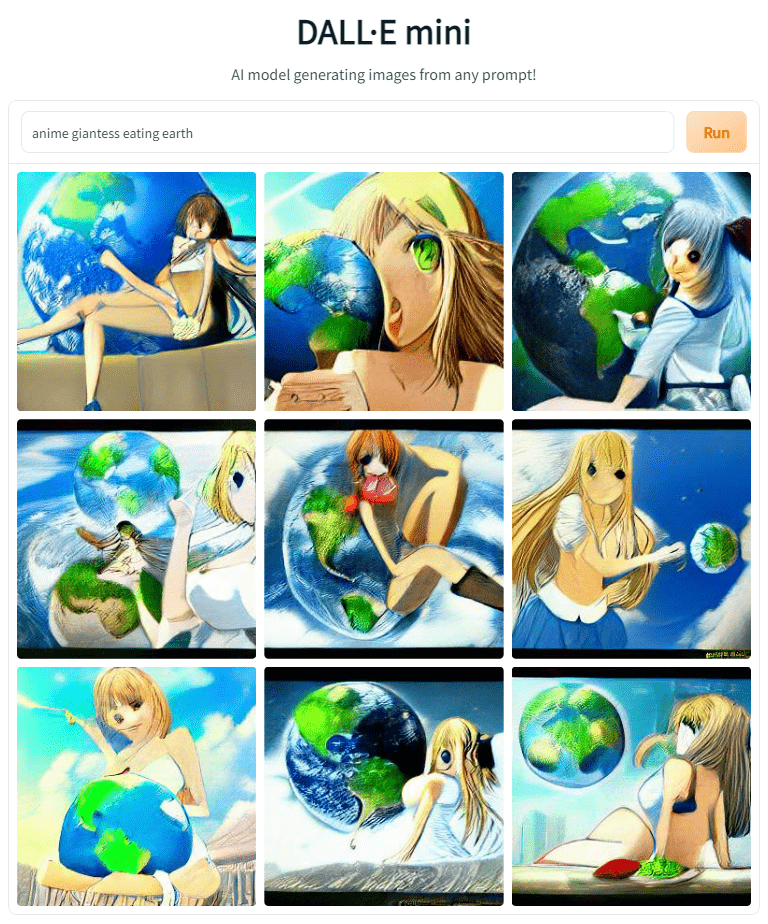
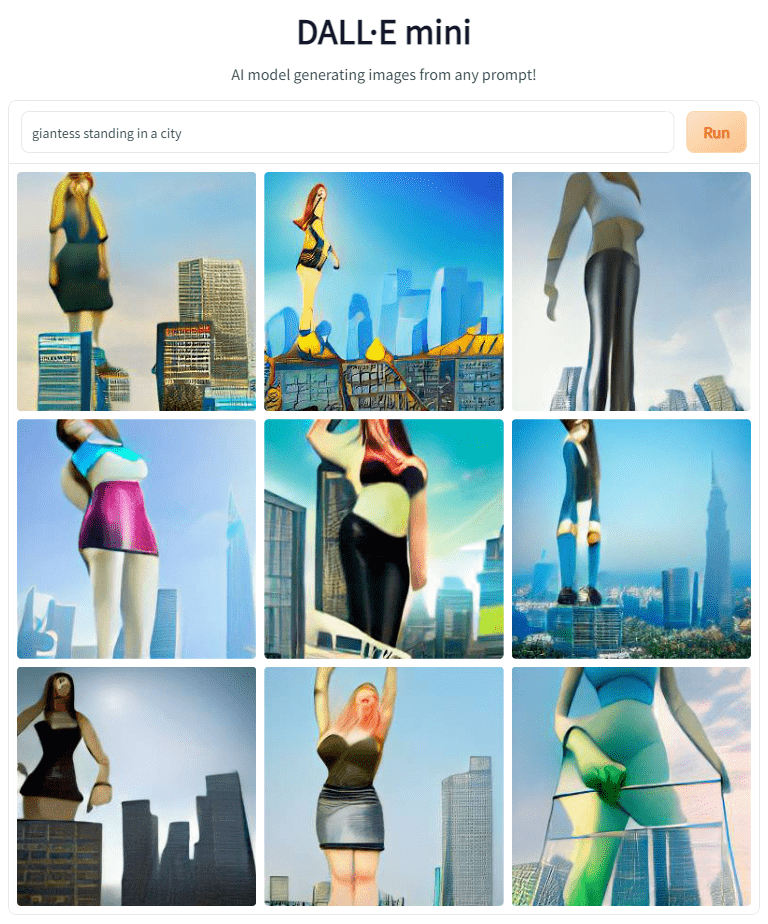

# 人工智能生成巨大娘画像？

作者：逗号

TID：33484

<title>1</title> <link href="../Styles/Style.css" type="text/css" rel="stylesheet">

# 1

*本帖最後由 逗号 於 2022-6-17 16:10 編輯*

今天刷到了人工智能将人类输入的文本描述转化成图像的新闻，里面给出的例子已经真实到足以骗过人眼，并且很有想象力。具体链接在这：[https://www.gamersky.com/ent/202206/1491392.shtml](https://www.gamersky.com/ent/202206/1491392.shtml)
于是乎就想着能不能输入一些巨大娘相关内容看看情况。
顺着DALL-E模型在Hugging Face上找到了一个名为dalle-mini的项目，可以允许在线输入然后获得生成的图像。
生成的结果十分前卫，几乎可以说人类在绘画领域已经完全败给了AI。下面是一些生成的结果：
<ignore_js_op>

**dallemini_2022-6-17_15-55-27.png** *(1.17 MB, 下載次數: 0)*

[下載附件](forum.php?mod=attachment&aid=OTcwNzF8NTRjYjRjNWJ8MTY3NDA2NTUxNXwxODIzMHwzMzQ4NA%3D%3D&nothumb=yes)

2022-6-17 16:00 上傳

<ignore_js_op>

**dallemini_2022-6-17_16-3-33.png** *(928.08 KB, 下載次數: 0)*

[下載附件](forum.php?mod=attachment&aid=OTcwNzJ8NTE0NWYwZWF8MTY3NDA2NTUxNXwxODIzMHwzMzQ4NA%3D%3D&nothumb=yes)

2022-6-17 16:03 上傳

不好意思，刚刚对着这个冲晕过去了，我们继续。

总之，人工智能目前能够做到的事情仍然极为有限，当然也不排除是mini模型的锅。或许可以试着从中找找灵感？项目的网址放在下面：
[https://huggingface.co/spaces/dalle-mini/dalle-mini](https://huggingface.co/spaces/dalle-mini/dalle-mini)
有做AI的大佬说说现在学术界和业界的情况吗？不得不说这玩意儿其实还挺有意思的。
<title>2</title> <link href="../Styles/Style.css" type="text/css" rel="stylesheet">

# 2

我沒學過AI，不過我正好昨天也拿這個軟體測試過產圖
不過我輸入的關鍵字是“角色 becomes giantess”

產圖的結果跟樓主第二張圖很類似，構圖都是角色＋藍天+城市

猜測這個AI從網路上匯入的giantess樣本大致就是這樣的形象 <title>3</title> <link href="../Styles/Style.css" type="text/css" rel="stylesheet">

# 3

> [無邊落木 發表於 2022-6-17 16:46](https://giantessnight.cf/gnforum2012/forum.php?mod=redirect&goto=findpost&pid=506851&ptid=33484)
> 我沒學過AI，不過我正好昨天也拿這個軟體測試過產圖
> 不過我輸入的關鍵字是“角色 becomes giantess”

好像他们说模型训练是从互联网上的公开资料里学习？不知道具体的样本来源是哪些网站，至少DeviantArt那边做拼接画的大多都是这种风格。
<title>4</title> <link href="../Styles/Style.css" type="text/css" rel="stylesheet">

# 4

其实我感觉，不久的未来，等到人工智能的技术爆炸，基本现在能想到的或者不能想到的，至少在虚拟世界，全都可以给你搞到。虽然这样对人类社会还是挺危险的，但是呢，到底还是挺期待的.. <title>5</title> <link href="../Styles/Style.css" type="text/css" rel="stylesheet">

# 5

ai生成建筑物或者风景可以，人像还是不行，太扭曲了 <title>6</title> <link href="../Styles/Style.css" type="text/css" rel="stylesheet">

# 6

快进到写一段短文就可以让ai成图，再也不用花n个小时自己画了
我记得好像还有个类似的网站，不过生成的风景图好看居多，我打foot fetish和giantess之类的关键词只能生成十分抽象的画面。贴吧里那个很有意境的顶真脑袋好像就是它生成的。。
目前这些开放的工具，其实说人类完全败给还为时尚早。你也看到了这些生成的人物都十分抽象甚至猎奇，不过ai和machine learning的未来大趋势可能有助于这方面的飞速发展。另外不太严谨的说，这些生成图的工具主要还是灌输大量的已有的作品和照片来学习，所以本质还是基于人类的创作。 <title>7</title> <link href="../Styles/Style.css" type="text/css" rel="stylesheet">

# 7

现阶段用AI生成故事算这类最成熟的，欧美一群培育写GTS文AI的大佬 <title>8</title> <link href="../Styles/Style.css" type="text/css" rel="stylesheet">

# 8

看得出这项技术短期对gts圈子不会产生多大的影响，毕竟现在高质量的gts图要么沉在暗网里，要么需要付费解锁，网上能搜索到的学习模板可能就是这类的了 <title>9</title> <link href="../Styles/Style.css" type="text/css" rel="stylesheet">

# 9

过于抽象，现阶段不建议折磨自己 <title>10</title> <link href="../Styles/Style.css" type="text/css" rel="stylesheet">

# 10

> [123 發表於 2022-6-17 23:59](https://giantessnight.cf/gnforum2012/forum.php?mod=redirect&goto=findpost&pid=506895&ptid=33484)
> 现阶段用AI生成故事算这类最成熟的，欧美一群培育写GTS文AI的大佬

现在有这种写gts文的ai了吗？目前感觉地牢和彩云小梦都太全面，不适合写gts的文</ignore_js_op></ignore_js_op>