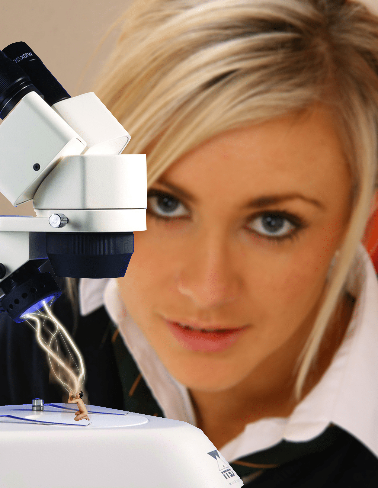

# 人类能不能把自己缩小成像蚂蚁那么大？

作者：whrlovexm

TID：19743

<title>1</title> <link href="../Styles/Style.css" type="text/css" rel="stylesheet">

# 1

人类要变得像蚂蚁那么大，在虚拟情景中模拟出来当然是一点问题都没有。除此之外就是在童话故事里才能出现了。在现实中能实现吗？不会吧。因为即使按照等比例缩放，人体各个系统也不可能安然无事照常运作。
如果消除原子数量行不行？组成细胞或者DNA都需要一定数量的原子，这个数量都是有一个最小值，但不会比原本的数目小太多。所以减少原子固然可以让人缩小，但真要缩到蚂蚁那么大，那么这个人很可能基本构成都无法维持。
人类可是比昆虫复杂多了，摄取的氧气量、消耗的食物量、时刻散发的热量都与人体器官表面积和体重有很大关系。比如缩小个100倍，散热表面积就变为一万分之一，产生的热量变为一百万分之一。这样的话岂不是只能一直不停的进食才能维持体内能量。所以说人类基本不可能安然无事的缩小成蚂蚁大小。
（认真过头了还请从轻发落nya）
<title>2</title> <link href="../Styles/Style.css" type="text/css" rel="stylesheet">

# 2

 <ignore_js_op>[101611 - blonde_giantess collage kneeling lab nude shrinking_ray shrunken_men sm.jpg](forum.php?mod=attachment&aid=NTQxNjh8MjI0YmNkNDN8MTY3NDA2NzkxN3wxODIzMHwxOTc0Mw%3D%3D&nothumb=yes) *(979.64 KB, 下載次數: 29)*

[下載附件](forum.php?mod=attachment&aid=NTQxNjh8MjI0YmNkNDN8MTY3NDA2NzkxN3wxODIzMHwxOTc0Mw%3D%3D&nothumb=yes)

2015-8-30 22:00 上傳  

</ignore_js_op> <title>3</title> <link href="../Styles/Style.css" type="text/css" rel="stylesheet">

# 3

既然都知道组成人体的部分就那么多，那么这个问题你是知道答案的。而且最主要的是先不提能不能，而是这么做到底有什么意义？ <title>4</title> <link href="../Styles/Style.css" type="text/css" rel="stylesheet">

# 4

> [qaz2190 發表於 2015-8-30 22:18](https://giantessnight.cf/gnforum2012/forum.php?mod=redirect&goto=findpost&pid=267305&ptid=19743)
> 既然都知道组成人体的部分就那么多，那么这个问题你是知道答案的。而且最主要的是先不提能不能，而是这么做 ...

保护环境啊，早有科学家提出要缩小人类，以保护环境，就像缩小学院那个结局一样
当那天环境真的已经不适合人类生存 人口过多，粮食不足，就有三种方法一是移民外星二是缩小人类，三是治理环境，治理环境不是一时半会解决不了问题，最起码几个世纪，就前两个比较靠谱点
<title>5</title> <link href="../Styles/Style.css" type="text/css" rel="stylesheet">

# 5

*本帖最後由 餃子 於 2015-8-30 22:36 編輯*

我觉得在讨论这个问题之前，可以先讨论一下蚂蚁大小的生物的脑容量，是否有可能承载人类的智商蚂蚁大小的人形蚂蚁大概做得出来，蚂蚁大小的人，还是算了吧

<title>6</title> <link href="../Styles/Style.css" type="text/css" rel="stylesheet">

# 6

真要把你缩小了，你还提的起性趣吗？ <title>7</title> <link href="../Styles/Style.css" type="text/css" rel="stylesheet">

# 7

楼主好认真的样子 在这种复杂的问题上 我只想说 认真你就输了 <title>8</title> <link href="../Styles/Style.css" type="text/css" rel="stylesheet">

# 8

　　最近在北美上映的超级英雄电影《蚁人》当中，男主角利用“皮姆粒子”将自己缩小到蚂蚁大小，惩恶锄奸。然而有科学家严肃指出，人绝不可能缩到蚂蚁般大小，科技再发达也不行。

　　为什么还没有可以把我们缩小的科学技术？因为有太多太多的不可能了。“缩小将意味着只有2种方法。”贡扎加大学物理学助理教授Erik Aver表示：“要么必须把你的原子缩小，要么把你的原子数量减少。”

　　原子不能缩小。一个原子中由质子和中子构成的原子核及其周围的电子之间的平均距离，不能更改。即使莫名其妙地出现一个疯狂科学家可以把某人身上的全部原子缩小，把Ta变成蚂蚁大小，但是过大的密度会使Ta直接下沉穿过地球。

　　另一种选择是消除原子。这在理论上可以实现，在某种程度上。但是组成细胞壁或DNA需要的原子数量有一个最小值，这就好比“你不能用少于4块的积木来建造一座城堡，”Aver解释道。“如果有一座由一百万块积木搭成的城堡，你也许能把它缩小到1000块积木，但这有一个限度。”

　　因此，“蚁人”中的Paul Rudd从1米7变成1米5是可能的，但不可能变成昆虫大小。

　　还有一个问题：生物系统并不是简单的按比例缩放。我们摄取的氧气、消耗的食物、散发的热量；这些都关乎我们器官的表面积和我们身体的重量。“这并不是简单地说一句：'喔！一切都将按比例缩小。'”生物力学专家，兼圣迭戈大学环境和海洋科学系主席Michel Boudrias说。

　　你不能单单缩小你的器官而不计后果。比如说肺部，如果你把它纵向缩小两倍，那么表面积会缩小四倍，体积会缩小八倍。这将大大影响氧和二氧化碳在肺部的扩散速率。

　　在一份由芝加哥大学有机体生物学和解剖学教授Michael LaBarbera撰写的名为《电影怪物的生物学（The Biology of B-Movie Monsters）》的娱乐性科学文章中，他解释了如果把一个人缩小70倍，那么他用来散热的表面积会减少5000倍，而产生热量的身体质量会减少350000倍。

　　这将意味着他需要提高自己的新陈代谢速率。“就像一只鼩鼱。”LaBarbera写道，“这人可能每天都要吃下相当于自己体重的食物，而这仅能保证他的生存。”

　　如果你24小时都在吃东西，那你很难去打击犯罪，连走路都困难了。缩小蚁人就缩小了他的肌肉，那么他会变得很脆弱。如果缩小的时候保持肌肉结构不变，那惊人的密度会把任何东西都破坏。

　　在漫画中，科学家Hank Pym通过发现一种反物理现象来解决这个问题——亚原子的皮姆粒子。这当然还是不可能，但至少这听起来比把人变成蜘蛛侠的放射性蜘蛛来得有趣一些。 <title>9</title> <link href="../Styles/Style.css" type="text/css" rel="stylesheet">

# 9

从物理学上看，蚂蚁这个大小是绝无可能的
在这个尺度上，很多原本可以忽略不计的现象会带来巨大影响，比如液体的表面张力等等
通过一定程度的改造，变成猫狗那样的大小是有可能的，当然这种改造涉及复杂的生物工程，并不是等比例缩小那么简单 <title>10</title> <link href="../Styles/Style.css" type="text/css" rel="stylesheet">

# 10

只能寄希望与外星人了，不知道美国的五十一区会不会有办法 <title>11</title> <link href="../Styles/Style.css" type="text/css" rel="stylesheet">

# 11

就目前而言是不可能的    等多来几次技术革命才有希望 <title>12</title> <link href="../Styles/Style.css" type="text/css" rel="stylesheet">

# 12

   再等个几十万年以后吧。。说不定奇迹就发生了。 <title>13</title> <link href="../Styles/Style.css" type="text/css" rel="stylesheet">

# 13

蚂蚁太小了，打火机般大小差不多 <title>14</title> <link href="../Styles/Style.css" type="text/css" rel="stylesheet">

# 14

> [zzz133540 發表於 2015-8-30 22:30](https://giantessnight.cf/gnforum2012/forum.php?mod=redirect&goto=findpost&pid=267306&ptid=19743)
> 保护环境啊，早有科学家提出要缩小人类，以保护环境，就像缩小学院那个结局一样
> 当那天环境真的已经不适 ...

环境治理是不能放缓的，人口问题资源问题能源问题都难以解决的当下，移民外星或缩小都是不切实际，只能硬生生牺牲很（lao）多（bai）人（xing）了【哎呀说了大实话真是对不住】
<title>15</title> <link href="../Styles/Style.css" type="text/css" rel="stylesheet">

# 15

> [餃子 發表於 2015-8-30 22:32](https://giantessnight.cf/gnforum2012/forum.php?mod=redirect&goto=findpost&pid=267307&ptid=19743)
> 我觉得在讨论这个问题之前，可以先讨论一下蚂蚁大小的生物的脑容量，是否有可能承载人类的智商{:8 ...

从其他很多方面讨论都会得出缩小化是天方夜谭的结论。比如，密度，人体要陷入地层吧？和同大小的蚂蚁角力是赢不了的。体重连一克也没有随便吹个风儿就成蒲公英了……呃呃
<title>16</title> <link href="../Styles/Style.css" type="text/css" rel="stylesheet">

# 16

> [zzz133540 發表於 2015-8-30 22:30](https://giantessnight.cf/gnforum2012/forum.php?mod=redirect&goto=findpost&pid=267306&ptid=19743)
> 保护环境啊，早有科学家提出要缩小人类，以保护环境，就像缩小学院那个结局一样
> 当那天环境真的已经不适 ...

人类是不可能把自己变的弱小的.如果科技真的高到可以缩小人类.那么放大东西比缩小更简单.你会选哪个？
<title>17</title> <link href="../Styles/Style.css" type="text/css" rel="stylesheet">

# 17

*本帖最後由 餃子 於 2015-8-31 21:08 編輯*

> [Euphoria 發表於 2015-8-31 20:43](https://giantessnight.cf/gnforum2012/forum.php?mod=redirect&goto=findpost&pid=267357&ptid=19743)
> 从其他很多方面讨论都会得出缩小化是天方夜谭的结论。比如，密度，人体要陷入地层吧？和同大小的蚂蚁角力 ...

缩小化这种事情，和把你分解再在另一个地方重组的传送机器，没什么本质的差别。。。等于是做个复制人然后把本体杀掉而已，其实不杀本体也是做得出复制人的
所以还不如先讨论，是否与可以做出蚂蚁大小、结构不限、拥有人类智商的新生物。哪怕结构不用和人一样，光是要用那个大小的脑部达到人类智商就是天方夜谭了。。。
没有人类智商那就只是普通的虫子而已。。。即使做出类似人形的外观，也只是普通的人形虫子而已。。。

<title>18</title> <link href="../Styles/Style.css" type="text/css" rel="stylesheet">

# 18

> [Euphoria 發表於 2015-8-31 20:37](https://giantessnight.cf/gnforum2012/forum.php?mod=redirect&goto=findpost&pid=267356&ptid=19743)
> 环境治理是不能放缓的，人口问题资源问题能源问题都难以解决的当下，移民外星或缩小都是不切实际，只能硬 ...

最后一句话点醒了我
<title>19</title> <link href="../Styles/Style.css" type="text/css" rel="stylesheet">

# 19

> [餃子 發表於 2015-8-31 21:00](https://giantessnight.cf/gnforum2012/forum.php?mod=redirect&goto=findpost&pid=267360&ptid=19743)
> 缩小化这种事情，和把你分解再在另一个地方重组的传送机器，没什么本质的差别。。。等于是做个复 ...

做成普通的人形虫子，这个观点很有创意哦！而且实用性也很强呢

也许未来实现GTS最理想的情形是：（缩小系）
虚拟现实（头盔或体感式）链接可以感官传送的微型复制体（缩小的人形生物体）
<title>20</title> <link href="../Styles/Style.css" type="text/css" rel="stylesheet">

# 20

唔，其实我觉得未来人类真的可能会在科技允许下缩小，因为这样相同的资源就可以承载更多的人了，而使科学家的数量会变多，相应的科技发展也会更快，至于那种大小后智商是不会变的，印象智商的其实是大脑与整个身体的比值，而不是脑子的大小，毕竟蓝鲸之类的也不见得有多聪明 <title>21</title> <link href="../Styles/Style.css" type="text/css" rel="stylesheet">

# 21

你沒看蟻人嗎?
哈哈哈 只有屌片而已 <title>22</title> <link href="../Styles/Style.css" type="text/css" rel="stylesheet">

# 22

> [zzz133540 發表於 2015-8-31 22:43](https://giantessnight.cf/gnforum2012/forum.php?mod=redirect&goto=findpost&pid=267365&ptid=19743)
> 最后一句话点醒了我

醒了就别再睡下去吧;-)
<title>23</title> <link href="../Styles/Style.css" type="text/css" rel="stylesheet">

# 23

很仔細的分析呀 了不起!!!!!!!!!!!! <title>24</title> <link href="../Styles/Style.css" type="text/css" rel="stylesheet">

# 24

开发出缩小仪器还要最少几十年呢。。等吧 <title>25</title> <link href="../Styles/Style.css" type="text/css" rel="stylesheet">

# 25

万一有了着想技术，政府进行法律规定，男人缩小成100~1000倍不等。好看的女人不做处理，老的、丑的女人统统缩小100倍，世界政府由美女们掌管，这就行了 <title>26</title> <link href="../Styles/Style.css" type="text/css" rel="stylesheet">

# 26

> [xnr 發表於 2015-9-1 00:07](https://giantessnight.cf/gnforum2012/forum.php?mod=redirect&goto=findpost&pid=267375&ptid=19743)
> 做成普通的人形虫子，这个观点很有创意哦！而且实用性也很强呢
> 
> 也许未来实现GTS最理想的情形是：（缩小 ...

我覺得這是最可行的方案之一
<title>27</title> <link href="../Styles/Style.css" type="text/css" rel="stylesheet">

# 27

感觉不太可能，毕竟现在科技还不是很发达 <title>28</title> <link href="../Styles/Style.css" type="text/css" rel="stylesheet">

# 28

期待虛擬實境吧
這還比較實際 <title>29</title> <link href="../Styles/Style.css" type="text/css" rel="stylesheet">

# 29

就算真的能縮小 又有誰想被縮小?

如果真有這種東西 應該變成生化武器還有可能

如果是資源不足問題 到不如用放大資源 <title>30</title> <link href="../Styles/Style.css" type="text/css" rel="stylesheet">

# 30

完全不可能吧。。。无论是受力结构，器官功能，随着尺寸变小问题太多了。。。。我觉得通过vr技术来模拟要现实得多，而且在未来十几年里完全可以期待 <title>31</title> <link href="../Styles/Style.css" type="text/css" rel="stylesheet">

# 31

目前来说，这个真心不可能 <title>32</title> <link href="../Styles/Style.css" type="text/css" rel="stylesheet">

# 32

既然缩小不行！放大呢》 <title>33</title> <link href="../Styles/Style.css" type="text/css" rel="stylesheet">

# 33

我觉得类似刀剑里面那样的虚拟现实技术要合理得多，有生之年也许可以见到 <title>34</title> <link href="../Styles/Style.css" type="text/css" rel="stylesheet">

# 34

> [餃子 發表於 2015-8-31 21:00](https://giantessnight.cf/gnforum2012/forum.php?mod=redirect&goto=findpost&pid=267360&ptid=19743)
> 缩小化这种事情，和把你分解再在另一个地方重组的传送机器，没什么本质的差别。。。等于是做个复 ...

蚂蚁大小的脑达到人类的智能水平也不能算天方夜谭，毕竟以现在的技术水平做那么大个半导体芯片也能有相当的机能，更何况以后还可能有量子计算机这种黑科技。我觉得做成人形小机器人还是更靠谱一点的，机器人的话，可以录像，可以vr，跟驾驶巨大机体一个性质。

<title>35</title> <link href="../Styles/Style.css" type="text/css" rel="stylesheet">

# 35

我们没希望啦               <title>36</title> <link href="../Styles/Style.css" type="text/css" rel="stylesheet">

# 36

GTS本身就是一种不科学的东西..... <title>37</title> <link href="../Styles/Style.css" type="text/css" rel="stylesheet">

# 37

> [liyun1988 發表於 2015-8-31 10:17](https://giantessnight.cf/gnforum2012/forum.php?mod=redirect&goto=findpost&pid=267329&ptid=19743)
> 只能寄希望与外星人了，不知道美国的五十一区会不会有办法

想象力真好，但是我们要自己来，万一外星人也没办法呢
<title>38</title> <link href="../Styles/Style.css" type="text/css" rel="stylesheet">

# 38

比起把人体直接缩小，还是感应纳米机器人更现实一点，即把人的意识寄于计算机之类的，如果足够逼真可以达到缩小的感觉，把你放置劲某个舱室内，然后你的意识在很微小的机器人里，你可以进行一些基本操作，如果感应技术在成熟一些的话还是有相似的体验 <title>39</title> <link href="../Styles/Style.css" type="text/css" rel="stylesheet">

# 39

其实感觉要是有4d体验的话也是很好啊 <title>40</title> <link href="../Styles/Style.css" type="text/css" rel="stylesheet">

# 40

目前最接近的技術可能事vr了吧 <title>41</title> <link href="../Styles/Style.css" type="text/css" rel="stylesheet">

# 41

缩小人类头脑也会缩小，脑容量也会缩小，到时候就是智障了吧 <title>42</title> <link href="../Styles/Style.css" type="text/css" rel="stylesheet">

# 42

> [jian123 發表於 2016-7-2 13:22](https://giantessnight.cf/gnforum2012/forum.php?mod=redirect&goto=findpost&pid=298445&ptid=19743)
> 缩小人类头脑也会缩小，脑容量也会缩小，到时候就是智障了吧

或许吧，有一种压缩技术将脑体积缩小而其他和正常人一样就解决了脑容量不足的问题

<title>43</title> <link href="../Styles/Style.css" type="text/css" rel="stylesheet">

# 43

从目前来看 ，缩小成蚂蚁大小是不科学的 <title>44</title> <link href="../Styles/Style.css" type="text/css" rel="stylesheet">

# 44

如果在你還是胚胎時就給予你意識? <title>45</title> <link href="../Styles/Style.css" type="text/css" rel="stylesheet">

# 45

配的一手好图啊。。。。。 <title>46</title> <link href="../Styles/Style.css" type="text/css" rel="stylesheet">

# 46

缩小技术应该是没希望的，只有等克隆技术真正解禁了才能够大规模开展缩小技术的实验吧。。
【然而好像还是没希望 <title>47</title> <link href="../Styles/Style.css" type="text/css" rel="stylesheet">

# 47

这当然是不科学的，所以我看到一些虚拟的人物在解释不科学的事物时，感到很无语。 <title>48</title> <link href="../Styles/Style.css" type="text/css" rel="stylesheet">

# 48

那么小是不可能的，即使肌肉和运动组织缩小后功能没问题，但人的大脑那么复杂，缩小后神经肯定要失去很多功能，可能就没有智商了 <title>49</title> <link href="../Styles/Style.css" type="text/css" rel="stylesheet">

# 49

看来并没什么可能 <title>50</title> <link href="../Styles/Style.css" type="text/css" rel="stylesheet">

# 50

現在不行，希望以後有生之年可以然後體驗看看XD <title>51</title> <link href="../Styles/Style.css" type="text/css" rel="stylesheet">

# 51

未来科学=玄学，鬼知道将来会不会有什么黑科技，暂时保留可能性吧。 <title>52</title> <link href="../Styles/Style.css" type="text/css" rel="stylesheet">

# 52

显微镜，蚂蚁人，这是个图片，还是视频 <title>53</title> <link href="../Styles/Style.css" type="text/css" rel="stylesheet">

# 53

说实话，我有想过通过降低分子间隙从而缩小的情况，不过貌似会和外界的分子产生冲突，似乎有些站不住脚，不过如果减少人体各器官的细胞数来缩小人类的话，会不会出现脑容量降低，智商下降的情况。。。好可怕-。- <title>54</title> <link href="../Styles/Style.css" type="text/css" rel="stylesheet">

# 54

现在的科技一定不可能吧,但不知之后可不可以...(其实我也想有此東西,但一定要是安全的=w=
<title>55</title> <link href="../Styles/Style.css" type="text/css" rel="stylesheet">

# 55

未来可能可以，但是现在还没法做到