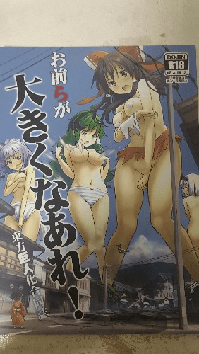

# 今天去中古店看到了这个本子

作者：夏游云

TID：25964

<title>1</title> <link href="../Styles/Style.css" type="text/css" rel="stylesheet">

# 1

算是补票吧，就买了(´･_･`) <title>2</title> <link href="../Styles/Style.css" type="text/css" rel="stylesheet">

# 2

 <ignore_js_op>[P81013-231919.jpg](forum.php?mod=attachment&aid=NzUxNDZ8ZmU2NWI3ZmJ8MTY3NDA2ODY4N3wxODIzMHwyNTk2NA%3D%3D&nothumb=yes) *(56.93 KB, 下載次數: 7)*

[下載附件](forum.php?mod=attachment&aid=NzUxNDZ8ZmU2NWI3ZmJ8MTY3NDA2ODY4N3wxODIzMHwyNTk2NA%3D%3D&nothumb=yes)

2018-10-13 22:20 上傳  

</ignore_js_op> <title>3</title> <link href="../Styles/Style.css" type="text/css" rel="stylesheet">

# 3

其实一直蛮奇怪的……明明东方兼容性这么强……却一直没看到东方主题的GTS作品……好奇怪…… <title>4</title> <link href="../Styles/Style.css" type="text/css" rel="stylesheet">

# 4

> cosecant 發表於 2018-10-13 22:46
> 其实一直蛮奇怪的……明明东方兼容性这么强……却一直没看到东方主题的GTS作品……好奇怪…… ...

其实去E站搜索touhou + giantess，还是有挺多的 <title>5</title> <link href="../Styles/Style.css" type="text/css" rel="stylesheet">

# 5

某个本子（天真烂漫什么的）必有车万，今年这本蜂蜜貌似还画了碧蓝幻想里的克拉丽丝，不过目前肯定没有流出，八成又是有生之年。 <title>6</title> <link href="../Styles/Style.css" type="text/css" rel="stylesheet">

# 6

貌似这本在好多地方都能搜到..不知道为啥
里面我记得也有一点点r18的哇..
就这么摆上来了吗 有点恐怖 <title>7</title> <link href="../Styles/Style.css" type="text/css" rel="stylesheet">

# 7

这个看过啊，有印象，但是对我来说没有撸点…………
<title>8</title> <link href="../Styles/Style.css" type="text/css" rel="stylesheet">

# 8

> [罗绘尼發 發表於 2018-10-15 19:47](https://giantessnight.cf/gnforum2012/forum.php?mod=redirect&goto=findpost&pid=389465&ptid=25964)
> 这个看过啊，有印象，但是对我来说没有撸点…………

虽然是R18的那种但确实没啥撸点(´･_･`)
<title>9</title> <link href="../Styles/Style.css" type="text/css" rel="stylesheet">

# 9

有一个东方的内窥合同志，比较符合vore党的口味的，但是一直没有人扫，也看不到..好难受 <title>10</title> <link href="../Styles/Style.css" type="text/css" rel="stylesheet">

# 10

话说这本E站有资源吗？有这个本的印象但是貌似没看过全篇