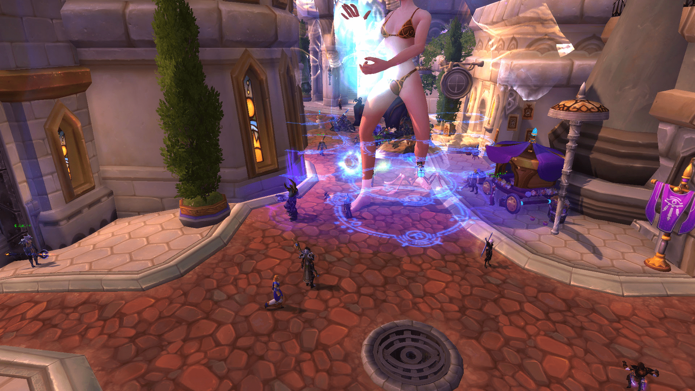

# 今天在魔兽世界发现的的，怎么能变这么大啊有没有人知道

作者：zhangxiyan

TID：22098

<title>1</title> <link href="../Styles/Style.css" type="text/css" rel="stylesheet">

# 1

今天在魔兽世界发现的的，怎么能变这么大啊有没有人知道 <title>2</title> <link href="../Styles/Style.css" type="text/css" rel="stylesheet">

# 2

 <ignore_js_op>[WoWScrnShot_110116_134453.jpg](forum.php?mod=attachment&aid=NjUzMzN8Yjc1NjU5ZGZ8MTY3NDA2NzUxNnwxODIzMHwyMjA5OA%3D%3D&nothumb=yes) *(491.71 KB, 下載次數: 13)*

[下載附件](forum.php?mod=attachment&aid=NjUzMzN8Yjc1NjU5ZGZ8MTY3NDA2NzUxNnwxODIzMHwyMjA5OA%3D%3D&nothumb=yes)

2016-11-1 13:57 上傳  

</ignore_js_op> <ignore_js_op>[WoWScrnShot_110116_134503.jpg](forum.php?mod=attachment&aid=NjUzMzR8OGExY2IwMmV8MTY3NDA2NzUxNnwxODIzMHwyMjA5OA%3D%3D&nothumb=yes) *(514.82 KB, 下載次數: 5)*

[下載附件](forum.php?mod=attachment&aid=NjUzMzR8OGExY2IwMmV8MTY3NDA2NzUxNnwxODIzMHwyMjA5OA%3D%3D&nothumb=yes)

2016-11-1 13:58 上傳  

</ignore_js_op> <ignore_js_op>[WoWScrnShot_110116_134507.jpg](forum.php?mod=attachment&aid=NjUzMzV8NjQzNzY0ZjJ8MTY3NDA2NzUxNnwxODIzMHwyMjA5OA%3D%3D&nothumb=yes) *(352.77 KB, 下載次數: 0)*

[下載附件](forum.php?mod=attachment&aid=NjUzMzV8NjQzNzY0ZjJ8MTY3NDA2NzUxNnwxODIzMHwyMjA5OA%3D%3D&nothumb=yes)

2016-11-1 13:59 上傳  

</ignore_js_op> <ignore_js_op>[WoWScrnShot_110116_134512.jpg](forum.php?mod=attachment&aid=NjUzMzZ8MDEzYWQzZDV8MTY3NDA2NzUxNnwxODIzMHwyMjA5OA%3D%3D&nothumb=yes) *(360.01 KB, 下載次數: 0)*

[下載附件](forum.php?mod=attachment&aid=NjUzMzZ8MDEzYWQzZDV8MTY3NDA2NzUxNnwxODIzMHwyMjA5OA%3D%3D&nothumb=yes)

2016-11-1 14:00 上傳  

</ignore_js_op> <ignore_js_op>[WoWScrnShot_110116_134523.jpg](forum.php?mod=attachment&aid=NjUzMzd8YzIwMTM4YzZ8MTY3NDA2NzUxNnwxODIzMHwyMjA5OA%3D%3D&nothumb=yes) *(419.2 KB, 下載次數: 1)*

[下載附件](forum.php?mod=attachment&aid=NjUzMzd8YzIwMTM4YzZ8MTY3NDA2NzUxNnwxODIzMHwyMjA5OA%3D%3D&nothumb=yes)

2016-11-1 14:01 上傳  

</ignore_js_op> <title>3</title> <link href="../Styles/Style.css" type="text/css" rel="stylesheet">

# 3

不是很大啊。。。以前80的时候有个声望药剂可以变大 一直刷就可以卡出非常大的模型 那时候在铁炉堡只能看到脚 <title>4</title> <link href="../Styles/Style.css" type="text/css" rel="stylesheet">

# 4

哈哈，我学会了 <ignore_js_op>

**WoWScrnShot_110116_143003.jpg** *(448.24 KB, 下載次數: 0)*

[下載附件](forum.php?mod=attachment&aid=NjUzMzh8Zjg5YjE2NmN8MTY3NDA2NzUxNnwxODIzMHwyMjA5OA%3D%3D&nothumb=yes)

2016-11-1 14:31 上傳

<ignore_js_op>

**WoWScrnShot_110116_143143.jpg** *(530.13 KB, 下載次數: 0)*

[下載附件](forum.php?mod=attachment&aid=NjUzMzl8ZDZiMDU5NTN8MTY3NDA2NzUxNnwxODIzMHwyMjA5OA%3D%3D&nothumb=yes)

2016-11-1 14:32 上傳

<title>5</title> <link href="../Styles/Style.css" type="text/css" rel="stylesheet">

# 5

<ignore_js_op>

**WoWScrnShot_110116_143755.jpg** *(319.22 KB, 下載次數: 0)*

[下載附件](forum.php?mod=attachment&aid=NjUzNDB8N2RhYTEwODF8MTY3NDA2NzUxNnwxODIzMHwyMjA5OA%3D%3D&nothumb=yes)

2016-11-1 14:38 上傳

这个就挺大的了。。。。 <title>6</title> <link href="../Styles/Style.css" type="text/css" rel="stylesheet">

# 6

> [archer 發表於 2016-11-1 14:04](https://giantessnight.cf/gnforum2012/forum.php?mod=redirect&goto=findpost&pid=313319&ptid=22098)
> 不是很大啊。。。以前80的时候有个声望药剂可以变大 一直刷就可以卡出非常大的模型 那时候在铁炉堡只能看到 ...

什么任务还记得吗
我去试试。。。。
<title>7</title> <link href="../Styles/Style.css" type="text/css" rel="stylesheet">

# 7

没玩过山口山....但是这个真的不是玩家自制吗0.0 <title>8</title> <link href="../Styles/Style.css" type="text/css" rel="stylesheet">

# 8

> [luffyoo 發表於 2016-11-1 15:15](https://giantessnight.cf/gnforum2012/forum.php?mod=redirect&goto=findpost&pid=313326&ptid=22098)
> 没玩过山口山....但是这个真的不是玩家自制吗0.0

山口山里面各种变大药剂和BUFF的。。 而且大部分可以叠加的

<title>9</title> <link href="../Styles/Style.css" type="text/css" rel="stylesheet">

# 9

以前是冬泉谷药剂和万圣节南瓜糖，话说正好万圣节了啊 <title>10</title> <link href="../Styles/Style.css" type="text/css" rel="stylesheet">

# 10

现在这个版本是  要塞任务的莫洛诺斯的抹布+工程学世界缩小器 。这俩个叠加是最大化的   用80的狂心酒声望是最大的  只不过没法移动 要不停的喝   停止喝的话最多几秒就萎了，目前网易正在和谐这种巨大化的技巧  因为有不少没有公德心的牛牛喜欢骑大象挡npc  尤其是时空漫游期间遭到了不少玩家的举报   要玩的话尽快   <title>11</title> <link href="../Styles/Style.css" type="text/css" rel="stylesheet">

# 11

我擦！最喜欢这种让人开心的surprise了 是有什么样的心态才会没事喝长大药剂给大家送福利 <title>12</title> <link href="../Styles/Style.css" type="text/css" rel="stylesheet">

# 12

额……魔兽世界这个游戏都有这个啊……GTS也真是遍布世界了
<title>13</title> <link href="../Styles/Style.css" type="text/css" rel="stylesheet">

# 13

6666学到了！原来是这样</ignore_js_op></ignore_js_op></ignore_js_op>