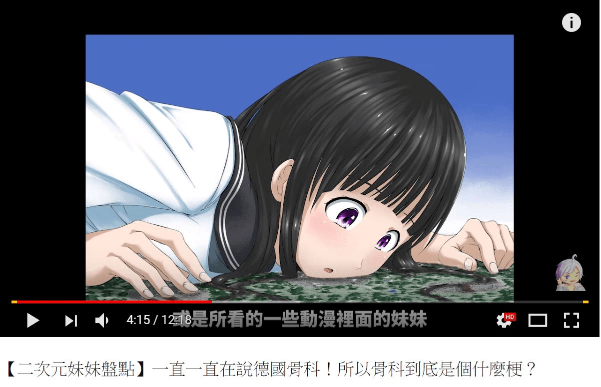

# 今天看個影片看到個圖

作者：超SizeJKGirl

TID：23991

<title>1</title> <link href="../Styles/Style.css" type="text/css" rel="stylesheet">

# 1

今天看個影片看到個圖我覺得GTS慢慢融入大眾裡了

<ignore_js_op>

**GTS擦邊 德國骨科.JPG** *(109.46 KB, 下載次數: 0)*

[下載附件](forum.php?mod=attachment&aid=Njk3NDR8MWRlMTY4NzR8MTY3NDA2NzI5MnwxODIzMHwyMzk5MQ%3D%3D&nothumb=yes)

2017-11-4 16:20 上傳

看個U吐都能碰到GTS
何況是我沒看過的圖
雖然沒看過但是我感覺是寺田的圖
女主雖然我也沒看過動漫但我猜是賓果動畫裡面的人物
有人知道這張圖是哪來的嗎?
話說我覺得絕大部分的人類都有隱性GTS基因
只要能開發出來世界應該會很美好
為美好的世界獻上GTS的祝福！
<title>2</title> <link href="../Styles/Style.css" type="text/css" rel="stylesheet">

# 2

这个还真有点像是寺田的，动漫名字忘记了。

至于每个人都有gts属性就难说了

如果是gt属性我还是比较愿意相信的... <title>3</title> <link href="../Styles/Style.css" type="text/css" rel="stylesheet">

# 3

这个就是寺田的啦~~
角色是动画 冰菓里面的女主角 千反田爱瑠 <title>4</title> <link href="../Styles/Style.css" type="text/css" rel="stylesheet">

# 4

我觉得应该是圈内人，或者就单纯是不知情人士 <title>5</title> <link href="../Styles/Style.css" type="text/css" rel="stylesheet">

# 5

寺田無誤 還有舔地板差分
我看剪影片的人根本沒注意地上是啥吧 <title>6</title> <link href="../Styles/Style.css" type="text/css" rel="stylesheet">

# 6

> [C-aki 發表於 2017-11-4 17:52](https://giantessnight.cf/gnforum2012/forum.php?mod=redirect&goto=findpost&pid=349649&ptid=23991)
> 这个还真有点像是寺田的，动漫名字忘记了。
> 
> 至于每个人都有gts属性就难说了

其實是有可能的
只要回想一下小時候看到一些巨大娘的畫面雖然看不懂但是卻有感覺
其實我覺得很少有那種個性特別S的人
而且我覺得就算是特S的人
也是有同時喜歡巨大娘的人
搞不好GN裡面就有
大部分只要是中間或是偏M的人都有機會讓那個人加上巨大娘的屬性
就算他本身不喜歡
但是因為題材少見大部分人只要是妹子多少都會感興趣
要洗腦或是引導出來太容易了
像是以前出的魔物娘或扶他
我以前也不接受的
但是只要是妹子遲早都會接受新屬性的
套句老話
""動漫電玩有問題只要有妹子就能搞定大部分問題""
賣個肉觀眾就來了
管你是啥妹子
而且畢竟舊屬性看太多了
只是現在市場巨大娘相關的動漫太少
所以沒辦法對到很多人的頻率
讓普通人走上巨大娘之路

還有個很大的問題讓巨大娘沒辦法普及
就是戀足或戀物這類嗜好大部分人都不敢明講
巨大娘又是屬於跟這個屬性習習相關的嗜好
所以大部分人都是偷偷來不會光明正大來

講了那麼多還是希望中指是巨大娘能普及開來
大部分人看到跟山一樣大的胸部最好是男人都不會想爬或摸摸看
這可能是很多男人的夢想
雖然只是一個胸部
<title>7</title> <link href="../Styles/Style.css" type="text/css" rel="stylesheet">

# 7

就这个视频的主题来说，寺田的这个老图感觉是强行用上的啊。以前的寺田画人脸就那样，肯定不适合用上的。我感觉作者应该知道圈子想搞事才拿这个图的。 <title>8</title> <link href="../Styles/Style.css" type="text/css" rel="stylesheet">

# 8

> [超SizeJKGirl 發表於 2017-11-8 19:47](https://giantessnight.cf/gnforum2012/forum.php?mod=redirect&goto=findpost&pid=349823&ptid=23991)
> 其實是有可能的
> 只要回想一下小時候看到一些巨大娘的畫面雖然看不懂但是卻有感覺
> 其實我覺得很少有那種個 ...

其实真的很难说。虽然也有转化论，但是就像是有的s永远也不会变成m，有的m也永远不会成为s一样。他们的快感都不同吧。
而对于gts普及感觉像是老生常谈的东西了，可能会注入新鲜的血液，但是普及力度不会太大，除非有某个人有着绝对女王一样的力量能够有一大波爱好者并且希望得到更多爱好者，甚至有能力实现gts（比如有书院）。不过，还有一种发展，有gts，也许就可能有gt呢...那个时候就是神所选中之人和神所抛弃之人的战斗了吧..
当然，或者说成为了神惩罚虫也有这样的命题呢，毕竟，人类嘛....（这种高傲的语气是怎么回事(・o・)）</ignore_js_op>