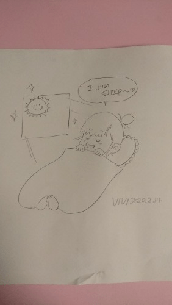

# 今日告诉各位一个噩耗

作者：xxx99

TID：28082

<title>1</title> <link href="../Styles/Style.css" type="text/css" rel="stylesheet">

# 1

2020年2月17日下午三时，无数人入坑GTS的领路人VIVIAN女士与世长辞，我们在和她丈夫的交流中得到此令人悲痛的消息，愿VIVIAN女士沐浴在GTS女神的圣光之下，不再痛苦，不再悲伤。 <title>2</title> <link href="../Styles/Style.css" type="text/css" rel="stylesheet">

# 2

v姐走好，为您默哀，感谢您一直以来的付出 <title>3</title> <link href="../Styles/Style.css" type="text/css" rel="stylesheet">

# 3

 <ignore_js_op>[-660a61b84d9e0d40.jpg](forum.php?mod=attachment&aid=ODE0NjR8Mjg0NzYzMTN8MTY3NDA2ODYyMXwxODIzMHwyODA4Mg%3D%3D&nothumb=yes) *(17.28 KB, 下載次數: 5)*

[下載附件](forum.php?mod=attachment&aid=ODE0NjR8Mjg0NzYzMTN8MTY3NDA2ODYyMXwxODIzMHwyODA4Mg%3D%3D&nothumb=yes)

2020-2-17 19:57 上傳  

</ignore_js_op> <title>4</title> <link href="../Styles/Style.css" type="text/css" rel="stylesheet">

# 4

绝非玩笑，也不是骗局，这是真的。 <title>5</title> <link href="../Styles/Style.css" type="text/css" rel="stylesheet">

# 5

 <ignore_js_op>[-18b8bc777e15bdda.jpg](forum.php?mod=attachment&aid=ODE0NjN8MjllMTIyOWZ8MTY3NDA2ODYyMXwxODIzMHwyODA4Mg%3D%3D&nothumb=yes) *(227.76 KB, 下載次數: 8)*

[下載附件](forum.php?mod=attachment&aid=ODE0NjN8MjllMTIyOWZ8MTY3NDA2ODYyMXwxODIzMHwyODA4Mg%3D%3D&nothumb=yes)

2020-2-17 19:56 上傳  

</ignore_js_op> <title>6</title> <link href="../Styles/Style.css" type="text/css" rel="stylesheet">

# 6

再补上另一张，绝不作假。
<title>7</title> <link href="../Styles/Style.css" type="text/css" rel="stylesheet">

# 7

 <ignore_js_op>[645876978973acd1.jpg](forum.php?mod=attachment&aid=ODE0Njd8NzkwZGM1OWF8MTY3NDA2ODYyMXwxODIzMHwyODA4Mg%3D%3D&nothumb=yes) *(221.81 KB, 下載次數: 12)*

[下載附件](forum.php?mod=attachment&aid=ODE0Njd8NzkwZGM1OWF8MTY3NDA2ODYyMXwxODIzMHwyODA4Mg%3D%3D&nothumb=yes)

2020-2-17 20:05 上傳  

</ignore_js_op> <title>8</title> <link href="../Styles/Style.css" type="text/css" rel="stylesheet">

# 8

虽未曾与您谋面，但请您接受一位读者的悼念，愿您能安详的沉眠。 <title>9</title> <link href="../Styles/Style.css" type="text/css" rel="stylesheet">

# 9

入坑多年，V姐一直都是精神领袖般的存在，愿V姐在另一个世界安好 <title>10</title> <link href="../Styles/Style.css" type="text/css" rel="stylesheet">

# 10

默哀.....如果天國是存在的，願V姐能見到那夢中的巨大女神。
RIP。 <title>11</title> <link href="../Styles/Style.css" type="text/css" rel="stylesheet">

# 11

RIP ...V姐 安息
一直為了華人GTS 圈中 創作美好  
我們絕對不會忘記。。。一直長存在我們心中
感謝您 一直以來的付出。。。巨大的女神 <title>12</title> <link href="../Styles/Style.css" type="text/css" rel="stylesheet">

# 12

默哀，感谢V姐一直以来的创作
R.I.P <title>13</title> <link href="../Styles/Style.css" type="text/css" rel="stylesheet">

# 13

默哀，愿v姐一路走好，愿天堂也有gts <title>14</title> <link href="../Styles/Style.css" type="text/css" rel="stylesheet">

# 14

R.I.P VIVIAN
祝在彼方安好 <title>15</title> <link href="../Styles/Style.css" type="text/css" rel="stylesheet">

# 15

V姐安息，这有点太突然了，以前非常喜欢她的作品，和她本人也唠的很开，太突然了。 <title>16</title> <link href="../Styles/Style.css" type="text/css" rel="stylesheet">

# 16

v姐总有一天会变成gts回来的 <title>17</title> <link href="../Styles/Style.css" type="text/css" rel="stylesheet">

# 17

唉，v姐一路走好...从未想过病毒会离自己如此的近
<title>18</title> <link href="../Styles/Style.css" type="text/css" rel="stylesheet">

# 18

虽然并不在V姐是谁，但还是祝她一路走好????️。 <title>19</title> <link href="../Styles/Style.css" type="text/css" rel="stylesheet">

# 19

安息，愿v姐能在天堂成为巨大女神 <title>20</title> <link href="../Styles/Style.css" type="text/css" rel="stylesheet">

# 20

女神走好，如果有里斯本水手将她复活又该多好。RIP <title>21</title> <link href="../Styles/Style.css" type="text/css" rel="stylesheet">

# 21

晚安，V姐。
谢谢你。

R.I.P. <title>22</title> <link href="../Styles/Style.css" type="text/css" rel="stylesheet">

# 22

這真的是太突然了....
<title>23</title> <link href="../Styles/Style.css" type="text/css" rel="stylesheet">

# 23

第一次知道v姐还是从但大的文章知道的，唉，逝者安息 <title>24</title> <link href="../Styles/Style.css" type="text/css" rel="stylesheet">

# 24

R.I.P , 不知该怎说了。 <title>25</title> <link href="../Styles/Style.css" type="text/css" rel="stylesheet">

# 25

> [seelenerve 發表於 2020-2-17 22:24](https://giantessnight.cf/gnforum2012/forum.php?mod=redirect&goto=findpost&pid=426772&ptid=28082)
> 唉，v姐一路走好...从未想过病毒会离自己如此的近

病毒？？？别告诉我是新型冠状病毒！
<title>26</title> <link href="../Styles/Style.css" type="text/css" rel="stylesheet">

# 26

什么情况！？？有人能告知什么原因吗。。 <title>27</title> <link href="../Styles/Style.css" type="text/css" rel="stylesheet">

# 27

太难受了，看着v姐的作品过来的，真希望这是个玩笑！！！！ <title>28</title> <link href="../Styles/Style.css" type="text/css" rel="stylesheet">

# 28

真的假的......希望是假消息
總之R.I.P <title>29</title> <link href="../Styles/Style.css" type="text/css" rel="stylesheet">

# 29

> [[数据删除] 發表於 2020-2-17 23:12](https://giantessnight.cf/gnforum2012/forum.php?mod=redirect&goto=findpost&pid=426787&ptid=28082)
> 病毒？？？别告诉我是新型冠状病毒！

是的就是新冠肺炎......
<title>30</title> <link href="../Styles/Style.css" type="text/css" rel="stylesheet">

# 30

我今天晚間也得到了通知……
畢竟是同一年代走過來的人，我想，但丁和我的心情是一樣的，走好VV……
（真的很希望她只是不想再畫gts，準備換個馬甲轉型做別的啊） <title>31</title> <link href="../Styles/Style.css" type="text/css" rel="stylesheet">

# 31

很喜欢v姐的作品，这真的是一个难以置信的噩耗，一路走好 <title>32</title> <link href="../Styles/Style.css" type="text/css" rel="stylesheet">

# 32

希望这只是命运的一个玩笑！ <title>33</title> <link href="../Styles/Style.css" type="text/css" rel="stylesheet">

# 33

*本帖最後由 吸水恶魔 於 2020-2-18 03:29 編輯*

RIP 一路走好.好久没有V姐的信息了,然后收到的第一个信息居然是这个.
<title>34</title> <link href="../Styles/Style.css" type="text/css" rel="stylesheet">

# 34

RIP……V姐一路走好…真的是太突然了 <title>35</title> <link href="../Styles/Style.css" type="text/css" rel="stylesheet">

# 35

这场瘟疫，爆发占一半，爆发后止损占一半。一帮死要钱的由上至下有命赚没命花的不知道是急着给自己买棺材还是干啥。 <title>36</title> <link href="../Styles/Style.css" type="text/css" rel="stylesheet">

# 36

难以置信这该死的肺炎就这么带走了V大    RIP <title>37</title> <link href="../Styles/Style.css" type="text/css" rel="stylesheet">

# 37

这真是个悲伤的消息，我也看过很多她的漫画，脑洞都挺大的
<title>38</title> <link href="../Styles/Style.css" type="text/css" rel="stylesheet">

# 38

刚刚知道V姐感染的时候也认为病毒已被控制，只是在等她康复。没想到噩耗来得这么快，真的有些无法接受。
或许上帝也喜欢GTS了，所以带走了V姐。 <title>39</title> <link href="../Styles/Style.css" type="text/css" rel="stylesheet">

# 39

Rest in peace, our giant goddess. <title>40</title> <link href="../Styles/Style.css" type="text/css" rel="stylesheet">

# 40

……wtf……愿彼方一切安好…… <title>41</title> <link href="../Styles/Style.css" type="text/css" rel="stylesheet">

# 41

R.I.P……真是没想到啊…… <title>42</title> <link href="../Styles/Style.css" type="text/css" rel="stylesheet">

# 42

？？？这也太突然吧？
不知道该说什么好......
Ｖ姐一路走好...... <title>43</title> <link href="../Styles/Style.css" type="text/css" rel="stylesheet">

# 43

太难受了，从入坑就一直看着V姐作品走过来的，没想到走的这么突然，只能祝愿V姐在天堂安好。 <title>44</title> <link href="../Styles/Style.css" type="text/css" rel="stylesheet">

# 44

R.I.P.
未完的作品等不到了結局
希望這不會只是成為名單上的一筆數字而已 <title>45</title> <link href="../Styles/Style.css" type="text/css" rel="stylesheet">

# 45

R.I.P.
......一路走好......
<title>46</title> <link href="../Styles/Style.css" type="text/css" rel="stylesheet">

# 46

> [seelenerve 發表於 2020-2-18 00:55](https://giantessnight.cf/gnforum2012/forum.php?mod=redirect&goto=findpost&pid=426820&ptid=28082)
> 是的就是新冠肺炎......

该死的肺炎啊。。。v姐是第一个因为新型冠状病毒去世的我认识的人，之前真的天真的认为病毒只存在于新闻里，现在想想。。。唉
<title>47</title> <link href="../Styles/Style.css" type="text/css" rel="stylesheet">

# 47

我就是武汉的，而且父母都是医生，从一月初家里人就跟我说了病毒的事情，一月中旬就已经向卫生部发出了警告，然而上面的人居然还想去摆百家宴。。。陆陆续续的疫情信息传到耳朵里，确诊和病危的人数越来越多，幸运的是还没收到熟人确诊的消息，今天看到V姐的消息心中一寒，还是躲不过去吗~
希望V姐一路走好吧，愿天堂没有病毒 <title>48</title> <link href="../Styles/Style.css" type="text/css" rel="stylesheet">

# 48

得知这样的噩耗，根本无法用语言形容心中的悲伤。
V姐，安息。
R.I.P <title>49</title> <link href="../Styles/Style.css" type="text/css" rel="stylesheet">

# 49

無言.....因為腦中所想的都太政治

<title>50</title> <link href="../Styles/Style.css" type="text/css" rel="stylesheet">

# 50

真的是精神领袖一样的存在，从我入坑大概07年吧？就一直在的作者。而且画风一直很精致。RIP <title>51</title> <link href="../Styles/Style.css" type="text/css" rel="stylesheet">

# 51

R.I.P
我刚从推特看到消息就急忙过来论坛。愿天堂没有病痛。
同好们也请保护好自己，不要得病。 <title>52</title> <link href="../Styles/Style.css" type="text/css" rel="stylesheet">

# 52

千言万语一句话吧 V姐走好
<title>53</title> <link href="../Styles/Style.css" type="text/css" rel="stylesheet">

# 53

太突然了。。。V姐一路走好，在天堂做最大的gts吧 <title>54</title> <link href="../Styles/Style.css" type="text/css" rel="stylesheet">

# 54

我还等着看尼洛亚更新，没想到v姐就走了。。。(我会永远记住v姐的，还有小莫) <title>55</title> <link href="../Styles/Style.css" type="text/css" rel="stylesheet">

# 55

R.I.P.
真是没有想到如此噩耗,她的离去将会使业界失去太多太多，她的成就和“举足轻重”就是如此重要。

和V姐的作品接触已经是本站最早的一批人了，陪着我已经不记得度过了多少个孤独的夜晚……
遥想当年V姐还对刚学sai的我提出了很多透视和光影上的建议，到现在还记忆尤新，只可惜自己因为某事件被迫离开画师圈，不然还能有更多交集……
这也对常年996的我提了个醒，一定要注意身体啊。 <title>56</title> <link href="../Styles/Style.css" type="text/css" rel="stylesheet">

# 56

R.I.P  愿v姐一路走好，做个好梦。谢谢你 <title>57</title> <link href="../Styles/Style.css" type="text/css" rel="stylesheet">

# 57

*本帖最後由 死神a艾斯 於 2020-2-18 19:43 編輯*

看了一下疫情地图，辽宁目前新冠去世了一个，明天应该就能看到这个数字+1了，有时候看着这些冷冰冰的数字真的没什么感觉，直到自己知道的人变成上面的数字才有感觉。

无限惋惜。

RIP

<title>58</title> <link href="../Styles/Style.css" type="text/css" rel="stylesheet">

# 58

那个喜欢gt的xx，现在整个论坛都沉浸在失去一位灵魂人物的痛苦中，你能不能不要再见一个贴就反对一下来恶心人了 <title>59</title> <link href="../Styles/Style.css" type="text/css" rel="stylesheet">

# 59

人有旦夕祸福月有阴晴圆缺，望在天堂安好，默哀 <title>60</title> <link href="../Styles/Style.css" type="text/css" rel="stylesheet">

# 60

安息，愿世界轻抚你的灵魂，指引你的道路，我的灯塔 <title>61</title> <link href="../Styles/Style.css" type="text/css" rel="stylesheet">

# 61

R.I.P
7年过来真的不知道说什么   <title>62</title> <link href="../Styles/Style.css" type="text/css" rel="stylesheet">

# 62

*本帖最後由 萬里風塵 於 2020-2-19 01:31 編輯*

R.I.P. 縱然沒有接觸或交流 可是就有一種莫名的傷感 願她安息 <title>63</title> <link href="../Styles/Style.css" type="text/css" rel="stylesheet">

# 63

R.I.P v姐是我最喜欢的gts画师，望在天堂安好 <title>64</title> <link href="../Styles/Style.css" type="text/css" rel="stylesheet">

# 64

RIP 願死者安息
希望這場病毒風波可以趕快結束 <title>65</title> <link href="../Styles/Style.css" type="text/css" rel="stylesheet">

# 65

RIP，v姐。
论坛里当年还有V姐在我入坑时温柔地教导我要正视自己欲望的回帖。愿v姐在天堂继续做做巨大美少女 <title>66</title> <link href="../Styles/Style.css" type="text/css" rel="stylesheet">

# 66

因V姐而知圈，找到大家庭的感觉，听到噩耗万分震惊，心情十分复杂难过。感谢一直的女神！ <title>67</title> <link href="../Styles/Style.css" type="text/css" rel="stylesheet">

# 67

唉……没想到，是说v姐是辽宁的嘛…… <title>68</title> <link href="../Styles/Style.css" type="text/css" rel="stylesheet">

# 68

> [jy24310350 發表於 2020-2-18 07:27](https://giantessnight.cf/gnforum2012/forum.php?mod=redirect&goto=findpost&pid=426858&ptid=28082)
> 刚刚知道V姐感染的时候也认为病毒已被控制，只是在等她康复。没想到噩耗来得这么快，真的有些无法接受。
> 或 ...

已經確定是因為肺炎原因了？
她不是在美國嗎？
<title>69</title> <link href="../Styles/Style.css" type="text/css" rel="stylesheet">

# 69

没想到啊......在这么沉重的话题下，竟然有把全部发言全部踩一遍的小鬼......
毫无人性 <title>70</title> <link href="../Styles/Style.css" type="text/css" rel="stylesheet">

# 70

R.I.P
v姐的作品曾带我入坑，愿天堂没有病痛。

<title>71</title> <link href="../Styles/Style.css" type="text/css" rel="stylesheet">

# 71

看了一下，到现在辽宁的死亡数字还是1例...
圈内的巨星陨落，结果连个数字都不是吗 <title>72</title> <link href="../Styles/Style.css" type="text/css" rel="stylesheet">

# 72

所以，p站上我关注的第一个gts作者竟然，，， <title>73</title> <link href="../Styles/Style.css" type="text/css" rel="stylesheet">

# 73

有看過一些他的作品，真的是一個傳奇。R.I.P. <title>74</title> <link href="../Styles/Style.css" type="text/css" rel="stylesheet">

# 74

真希望是假消息啊。。v姐对于gts圈的贡献不言而喻，那天有听到说v姐感染了病毒，没想到居然真的与世长辞。。愿一路走好。v姐一定能在天堂见到真正的gts吧。 <title>75</title> <link href="../Styles/Style.css" type="text/css" rel="stylesheet">

# 75

> wxy112300 發表於 2020-2-19 21:53
> 看了一下，到现在辽宁的死亡数字还是1例...
> 圈内的巨星陨落，结果连个数字都不是吗 ...

可能感染的时候不在辽宁吧。。。哎，太可惜了 <title>76</title> <link href="../Styles/Style.css" type="text/css" rel="stylesheet">

# 76

R.I.P  愿v姐一路走好，做天堂最大的女巨人 <title>77</title> <link href="../Styles/Style.css" type="text/css" rel="stylesheet">

# 77

愿她安息，一路走好。