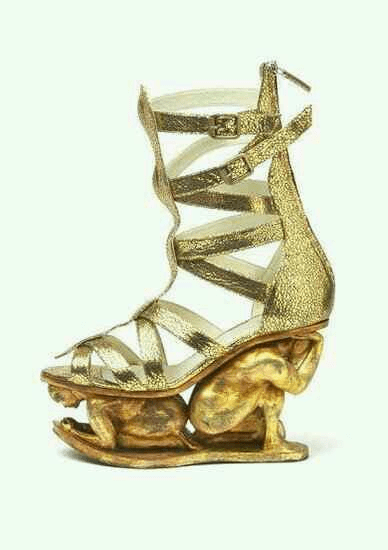
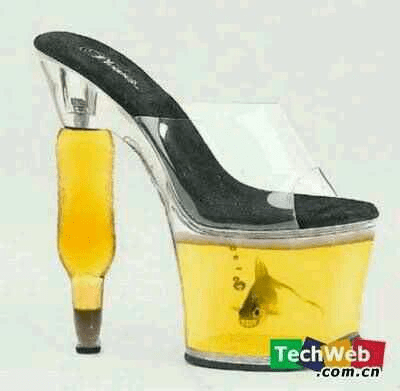

# 令人浮想联翩的高跟鞋。。。

作者：界界界界

TID：14681

<title>1</title> <link href="../Styles/Style.css" type="text/css" rel="stylesheet">

# 1

看吧下面踩的小人。 <title>2</title> <link href="../Styles/Style.css" type="text/css" rel="stylesheet">

# 2

 <ignore_js_op>[c8177f3e6709c93dfaf9086f9e3df8dcd100541a.jpg](forum.php?mod=attachment&aid=MzUwMTZ8MTQ4NTM0NmF8MTY3NDA2ODk2M3wxODIzMHwxNDY4MQ%3D%3D&nothumb=yes) *(23.71 KB, 下載次數: 44)*

[下載附件](forum.php?mod=attachment&aid=MzUwMTZ8MTQ4NTM0NmF8MTY3NDA2ODk2M3wxODIzMHwxNDY4MQ%3D%3D&nothumb=yes)

2013-7-3 14:02 上傳  

</ignore_js_op> <title>3</title> <link href="../Styles/Style.css" type="text/css" rel="stylesheet">

# 3

还有一个高跟鞋下养鱼的，好想变成美女脚下的鱼啊。。。。 <title>4</title> <link href="../Styles/Style.css" type="text/css" rel="stylesheet">

# 4

在这里在这里 <title>5</title> <link href="../Styles/Style.css" type="text/css" rel="stylesheet">

# 5

 <ignore_js_op>[e824b899a9014c0885852f3d0b7b02087af4f4e8.jpg](forum.php?mod=attachment&aid=MzUwMTl8YzMzZjRhMTh8MTY3NDA2ODk2M3wxODIzMHwxNDY4MQ%3D%3D&nothumb=yes) *(15.32 KB, 下載次數: 7)*

[下載附件](forum.php?mod=attachment&aid=MzUwMTl8YzMzZjRhMTh8MTY3NDA2ODk2M3wxODIzMHwxNDY4MQ%3D%3D&nothumb=yes)

2013-7-3 14:08 上傳  

</ignore_js_op> <title>6</title> <link href="../Styles/Style.css" type="text/css" rel="stylesheet">

# 6

。。。诶斗。。。这能算艺术品么。。。
感觉真的穿2天就要坏了。。。不过有网址啊。。。 <title>7</title> <link href="../Styles/Style.css" type="text/css" rel="stylesheet">

# 7

其实这个东西更多是Sm的爱好品。
貌似还有恐龙的 <title>8</title> <link href="../Styles/Style.css" type="text/css" rel="stylesheet">

# 8

UP从火星回来了......
这个N年前就看过了。
嘛，不过是在某SM网站上看见的...... <title>9</title> <link href="../Styles/Style.css" type="text/css" rel="stylesheet">

# 9

相比高跟鞋 还是更喜欢学生板鞋.
当然 裸足 人字拖永远最高
人字拖就像比基尼 在我心中 比全裸性感 <title>10</title> <link href="../Styles/Style.css" type="text/css" rel="stylesheet">

# 10

我最喜欢高跟鞋，呵呵 <title>11</title> <link href="../Styles/Style.css" type="text/css" rel="stylesheet">

# 11

高跟鞋都被玩坏了 <title>12</title> <link href="../Styles/Style.css" type="text/css" rel="stylesheet">

# 12

神の高跟鞋 <title>13</title> <link href="../Styles/Style.css" type="text/css" rel="stylesheet">

# 13

三次元的逆襲 <title>14</title> <link href="../Styles/Style.css" type="text/css" rel="stylesheet">

# 14

没有腿的话  单看还是没什么感觉:) <title>15</title> <link href="../Styles/Style.css" type="text/css" rel="stylesheet">

# 15

楼上一语命中靶心啊，不过养金鱼那个确实很有创意。 <title>16</title> <link href="../Styles/Style.css" type="text/css" rel="stylesheet">

# 16

是啊，有腿就好了，鞋只是看看，没什么赶脚 <title>17</title> <link href="../Styles/Style.css" type="text/css" rel="stylesheet">

# 17

鱼的表情亮了，那脸。。 <title>18</title> <link href="../Styles/Style.css" type="text/css" rel="stylesheet">

# 18

大家好我是那只鱼 <title>19</title> <link href="../Styles/Style.css" type="text/css" rel="stylesheet">

# 19

淘宝上有卖的吗？、、、、、、、、、 <title>20</title> <link href="../Styles/Style.css" type="text/css" rel="stylesheet">

# 20

蛮有特色，不知道现实有没有人会穿