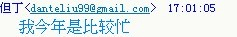

# 但大未免也太久没有更新了吧

作者：Prophet

TID：9012

<title>1</title> <link href="../Styles/Style.css" type="text/css" rel="stylesheet">

# 1

这样惊艳世人的才华就束之高阁，让我等痴迷的粉丝情何以堪啊？
每次看到没有但大的新文时，都会很失望，但同时又安慰自己，暂时的压抑是为了更好的释放，但大下一部作品一定会更加令人敬佩，或许会超越EOE也说不定。
但可惜，还是没有看到。
不过我依旧可以坚守，继续守望，直到更新的那一天，希望可以快些看到结果。 <title>2</title> <link href="../Styles/Style.css" type="text/css" rel="stylesheet">

# 2

哈哈，此贴必顶，说出了我们的心声~此贴应该加精，哈哈！ <title>3</title> <link href="../Styles/Style.css" type="text/css" rel="stylesheet">

# 3

但大表示鸭梨很大- -，哈哈哈 <title>4</title> <link href="../Styles/Style.css" type="text/css" rel="stylesheet">

# 4

这个催稿不简单……甚至有点可以称之为神催稿的意味啊哈哈

但大感到压力大么~ <title>5</title> <link href="../Styles/Style.css" type="text/css" rel="stylesheet">

# 5

但大表示
<ignore_js_op>

**b.jpg** *(5.46 KB, 下載次數: 0)*

[下載附件](forum.php?mod=attachment&aid=MjI2MDB8MzdlYzdlZmR8MTY3NDA2OTE4MXwxODIzMHw5MDEy&nothumb=yes)

2010-12-31 17:23 上傳

<ignore_js_op>

**c.jpg** *(7.22 KB, 下載次數: 0)*

[下載附件](forum.php?mod=attachment&aid=MjI2MDF8ZWQ2YzE2ZTJ8MTY3NDA2OTE4MXwxODIzMHw5MDEy&nothumb=yes)

2010-12-31 17:23 上傳

<title>6</title> <link href="../Styles/Style.css" type="text/css" rel="stylesheet">

# 6

前几楼都“哈哈哈”干什么 <title>7</title> <link href="../Styles/Style.css" type="text/css" rel="stylesheet">

# 7

再天才的创作者也需要创作的动力和灵感的激发。

不知道楼上诸位在催稿的同时有没有做过这方面的努力呢？

另外，楼上也有不少元老人物了，居然没人说出这句话，我在这里补上：

自己动手丰衣足食，苦苦等待他人的作品，不如自己投身创作，同人作什么的都好，这何尝不是一种激励你喜欢的作者的方式呢？ <title>8</title> <link href="../Styles/Style.css" type="text/css" rel="stylesheet">

# 8

但大我支持你~其实我不太敢在电脑上看小说的 眼睛难过。 写小说也是件很累的事情 所以为了你和我的共同身体健康与幸福 新作什么的让他去吧~ <title>9</title> <link href="../Styles/Style.css" type="text/css" rel="stylesheet">

# 9

这种事不能强求的 <title>10</title> <link href="../Styles/Style.css" type="text/css" rel="stylesheet">

# 10

基本上但大出来的都是精品.....等就等吧...... <title>11</title> <link href="../Styles/Style.css" type="text/css" rel="stylesheet">

# 11

某蛋需要靈感……沒靈感的時候他就是一上班族……
某蛋需要時間……天天工作壓的他沒空胡思亂想……
某蛋需要動力……現實生活才是他所要解決的事…… <title>12</title> <link href="../Styles/Style.css" type="text/css" rel="stylesheet">

# 12

.
反正我就是照我的步調去寫作，我已經不是那麼容易被影響的年紀啦。
（簡單講就是凝固了）

基本上我很看重每一篇作品的完成度，所以我不會輕易把沒寫完的半成品給丟出來。
雖然以前也玩過連載，不過那畢竟是空閒時間比較多的時候。
像現在這樣寫作時間不固定的情況時，我只會更嚴格替自己的作品把關。

其實我不知道論壇上有多少作者在寫完作品後、還會花時間去校對文法及錯字？
當然我不強求大家都這樣嚴謹，不過我會強求我自己。
所以……總之……我只能保證我抓到時間就會寫，就醬∼ <title>13</title> <link href="../Styles/Style.css" type="text/css" rel="stylesheet">

# 13

我也倾向与写完文自己校对一遍呢
另外透露一下内幕 蛋丁其实想在元旦放出一篇文的上半部分
但是铁奥阻止了他  所以有怨念就去找那只吧 <title>14</title> <link href="../Styles/Style.css" type="text/css" rel="stylesheet">

# 14

潜水党表示鸭梨不大有生之年能够看到全本就此生无憾鸟  <title>15</title> <link href="../Styles/Style.css" type="text/css" rel="stylesheet">

# 15

很惭愧，看了各位前辈的回复之后。
自己还是太年轻了，缺少一种淡然。特别是对于KILLER的勉励，更是无言以对。
但大对严谨的追求也让我感动，想起自己对学习的投入之少，汗颜。
不过至少坚定了信念，还是值得等下去的。14楼的透露让我的青春沸腾了。</ignore_js_op></ignore_js_op>