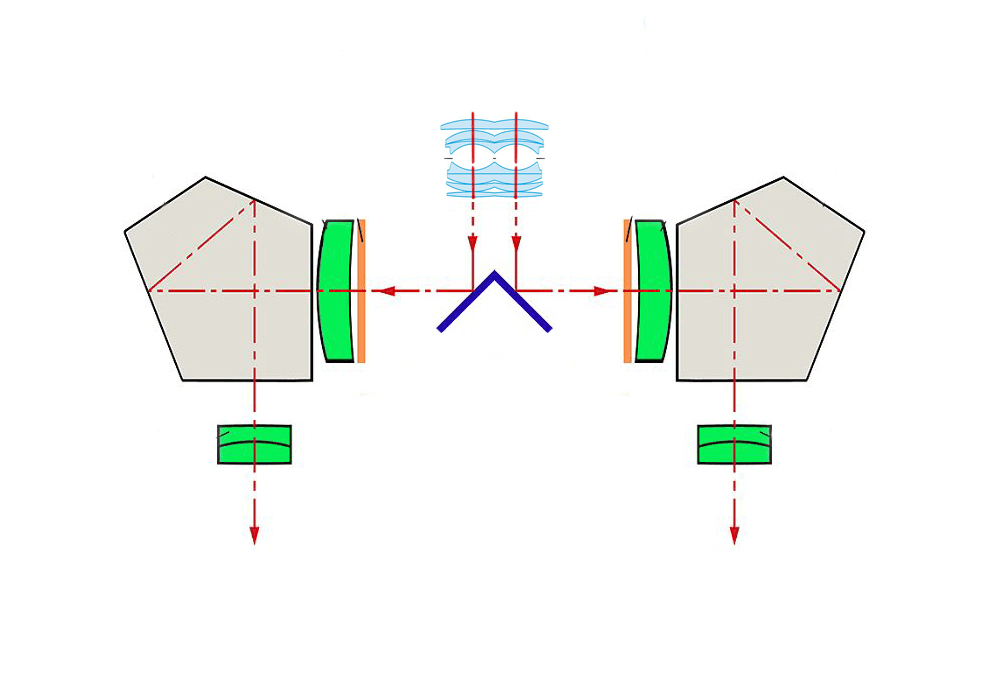

# 体验过VR之后的一个脑洞

作者：74Hisa

TID：25773

<title>1</title> <link href="../Styles/Style.css" type="text/css" rel="stylesheet">

# 1

之前按照[https://giantessnight.com/gnforu ... hread&tid=24405](https://giantessnight.com/gnforum2012/forum.php?mod=viewthread&tid=24405)帖子里的方法改变了游戏中人物的瞳距来获得小人视角
于是有了一个脑洞，如果可以通过透镜和反射镜制作一个类似潜望镜的装置来改变瞳距的话，是否可以在现实生活中体验到小人的视觉感受呢_(:3」∠)_

用单反结构改的一个图：

<title>2</title> <link href="../Styles/Style.css" type="text/css" rel="stylesheet">

# 2

 <ignore_js_op>[1.jpg](forum.php?mod=attachment&aid=NzM5ODZ8Y2U5MDliYWJ8MTY3NDA2NzAxNXwxODIzMHwyNTc3Mw%3D%3D&nothumb=yes) *(165.44 KB, 下載次數: 2)*

[下載附件](forum.php?mod=attachment&aid=NzM5ODZ8Y2U5MDliYWJ8MTY3NDA2NzAxNXwxODIzMHwyNTc3Mw%3D%3D&nothumb=yes)

2018-9-3 16:11 上傳  

</ignore_js_op> <title>3</title> <link href="../Styles/Style.css" type="text/css" rel="stylesheet">

# 3

应该不是这么简单的吧，就算改编瞳距也不过是视角变窄了，大概感觉就像是闭上一个眼睛的效果啊。。。。从双眼视角变成单眼视角吧。。。。。 <title>4</title> <link href="../Styles/Style.css" type="text/css" rel="stylesheet">

# 4

樓主可以把雙筒望遠鏡反過來看，會有類似的效果

<title>5</title> <link href="../Styles/Style.css" type="text/css" rel="stylesheet">

# 5

那样的话视野应当会缩小才对啊…… <title>6</title> <link href="../Styles/Style.css" type="text/css" rel="stylesheet">

# 6

羡慕，首先我要有一个Vr。