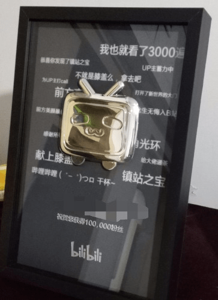

# 作为b站直播视频签约认证up主，我也有点忍不住想说几句了

作者：xxHxx

TID：30900

<title>1</title> <link href="../Styles/Style.css" type="text/css" rel="stylesheet">

# 1

怎么说呢，刚刚上gn看到了小希小桃做的那个gts科普，心里又开心又有种不太舒服的感觉吧，开心是因为有b站的同事也在这个圈子，不过不舒服的更多，感觉弹幕什么的我看起来好羞耻吧。。并且有一个热评科普了gts所有的内容，让我真的有些说不上来的感觉，我感觉咱们圈子还是很平和的，可能我不是很希望火到圈外吧，我从记事就喜欢gts，但我后面初二才知道有这么个圈子，这么长时间肯定也没跟别人说过，原因就是现在网络戾气太重了，我视频弹幕和评论区以及直播间经常有人吵起来，而且都喜欢阴阳怪气，我不希望咱们gts圈火到圈外，然后被一些反二次元，以及一些极端讨厌咱们xp的人各种阴阳怪气，看到这些真的让我不太舒服吧反正，不知道大家怎么看，总之现在我确实心里很堵，所以才发了这个帖子，平常我还是藏的很深的。。 <title>2</title> <link href="../Styles/Style.css" type="text/css" rel="stylesheet">

# 2

 <ignore_js_op>[IMG_20210513_202609.jpg](forum.php?mod=attachment&aid=ODg3NjN8OWFlYTkxYmJ8MTY3NDA2NjAyMXwxODIzMHwzMDkwMA%3D%3D&nothumb=yes) *(39.35 KB, 下載次數: 5)*

[下載附件](forum.php?mod=attachment&aid=ODg3NjN8OWFlYTkxYmJ8MTY3NDA2NjAyMXwxODIzMHwzMDkwMA%3D%3D&nothumb=yes)

2021-5-13 20:28 上傳  

</ignore_js_op> <title>3</title> <link href="../Styles/Style.css" type="text/css" rel="stylesheet">

# 3

我擦  可以啊   没想到还有这种高级别内鬼的嘛，不过关于你说的这个GTS毕竟是少数派的爱好，如果主动宣扬肯定会被主流笑话甚至歧视的，这毕竟是比较少见的爱好，进行不特定多数人群的宣扬百分之百会引起部分不感冒的人的反感，紧接而来的就是这部分人里面少数极端人士的攻讦了，所以那个主动科普的我感觉是在引火烧身 <title>4</title> <link href="../Styles/Style.css" type="text/css" rel="stylesheet">

# 4

圈地自萌就好了，不过有这种可以发展新人的情况也是挺好的 <title>5</title> <link href="../Styles/Style.css" type="text/css" rel="stylesheet">

# 5

现在B站这烂环境是这样的，一个个阴阳怪气的 <title>6</title> <link href="../Styles/Style.css" type="text/css" rel="stylesheet">

# 6

现在啊B的弹幕环境就是这样，看着救戾气很重很难受，好怀念以前啊 <title>7</title> <link href="../Styles/Style.css" type="text/css" rel="stylesheet">

# 7

高级内鬼 深藏不露.. 圈地自萌维持现状.. <title>8</title> <link href="../Styles/Style.css" type="text/css" rel="stylesheet">

# 8

xp这种东西都能吵起来这是得多无聊 <title>9</title> <link href="../Styles/Style.css" type="text/css" rel="stylesheet">

# 9

这就是很矛盾的地方，固然希望有更多新人，但是也很害怕去吸引新人，尤其GN被墙得不是一般的离谱

<title>10</title> <link href="../Styles/Style.css" type="text/css" rel="stylesheet">

# 10

想关注楼主了哈哈，说不定是我关注的人。这种东西我感觉不去科普真正有性趣的人也会自己到处找的。那些不理解的人就不理解呗。我有时候看弹幕和评论就当看个乐了，看看恋尺寸癖在别人眼中是啥样的。 <title>11</title> <link href="../Styles/Style.css" type="text/css" rel="stylesheet">

# 11

只能说入坑深似海呀，我也是很小年纪就资深LSP了反正已经一脚踏进去了，至少希望这个小圈子能自己慢慢发展吧 <title>12</title> <link href="../Styles/Style.css" type="text/css" rel="stylesheet">

# 12

哦哦哦哦！大佬！大佬！想关注了………………… <title>13</title> <link href="../Styles/Style.css" type="text/css" rel="stylesheet">

# 13

啊，有内鬼，终止交易          <title>14</title> <link href="../Styles/Style.css" type="text/css" rel="stylesheet">

# 14

其实我觉得和什么圈子没关系，问题出在网民整体素质不行上（指本科率小于9%），所以只要人一多就会出现几个zz，无视就好，正常人我觉得对xp就是兼容并包的 <title>15</title> <link href="../Styles/Style.css" type="text/css" rel="stylesheet">

# 15

俺寻思这也不能叫内鬼，换个说法：叫越共 <title>16</title> <link href="../Styles/Style.css" type="text/css" rel="stylesheet">

# 16

这种级别的大up可太秀了，没想到啊，高级别人才 <title>17</title> <link href="../Styles/Style.css" type="text/css" rel="stylesheet">

# 17

GTS爱好者真的比我想象中多很多……看那期视频评论就能看出来 <title>18</title> <link href="../Styles/Style.css" type="text/css" rel="stylesheet">

# 18

以及我明显感觉到这些年国内原创GTS视频数量越来越多了（虽然质量还没上去） <title>19</title> <link href="../Styles/Style.css" type="text/css" rel="stylesheet">

# 19

xp这个东西我只能说，互相尊重就行了，但是现在很多人做不到 <title>20</title> <link href="../Styles/Style.css" type="text/css" rel="stylesheet">

# 20

觉得最好还是不要彻底出圈，因为GTS可以说是一个很开放的爱好基础，难免会有特殊的爱好在这基础上混进来。
因为GTS本身其实没有什么太奇怪的，招人厌恶的属性，纯粹的GTS我想不出来怎么写恶心人的爱好附带产品，只是体型大的女性，很多事情都做不了，没法工作，也没法正常生活，也不会因为有什么压倒性的力量而喜欢错误的使用它，也不会有什么温柔，互动，母性，因为纯粹的GTS爱好附带产品没有这些属性。
GTS必须有后缀的属性才能让人感到恶心或者是性奋。
GTS+SM,GTS+GURO,GTS+VORE,GTS+Dominant,GTS+Foot,GTS+Scat有了后缀之后才会有特殊的，有可能会遭人厌恶的属性，而这些特殊的属性后缀是最容易被圈外人发现且大肆宣扬的，毕竟大多数人是不会认为单纯宣传帮助爱护残障人士有什么好讨论而且恶心人的，只有那些本身就不容易被主流大众所接受的观点，才会被人大肆宣传，然后新人圈子毁掉，老人越来越少。 <title>21</title> <link href="../Styles/Style.css" type="text/css" rel="stylesheet">

# 21

作为这种小众xp的爱好者自然是希望圈地自萌的，曝光度增加带来的新人是无脑小鬼的可能性显然大于是可以友善交流的同好。
但就我个人而言，虚拟次元愿意做这样的科普视频是令我开心且值得肯定的，比起被一无所知的小白盲目揣测，还是通过这样的窗口来提供一个交流、沟通与了解的机会要好一些……大概吧。 <title>22</title> <link href="../Styles/Style.css" type="text/css" rel="stylesheet">

# 22

最主要的是B站小学生太多了，败坏圈内的风气，好在GN他们进不来 <title>23</title> <link href="../Styles/Style.css" type="text/css" rel="stylesheet">

# 23

还是小众的好 ，氛围好一点，可以心平气和的沟通 <title>24</title> <link href="../Styles/Style.css" type="text/css" rel="stylesheet">

# 24

哎，我觉得毛事儿没有，最多也就心烦一点，和浮尘一样不看罢了，反正gn都在墙外了还能咋嘛，扫不到头上该干嘛干嘛喽，就像楼上说的不加sm不加guro的话gts不会让人厌恶，但是让人厌恶又咋了嘛，现在sm难道是啥销声匿迹的xp咩，万物从不终结 <title>25</title> <link href="../Styles/Style.css" type="text/css" rel="stylesheet">

# 25

这是个金的还是银的，金的可就太棒了 <title>26</title> <link href="../Styles/Style.css" type="text/css" rel="stylesheet">

# 26

> [Lisbon_Farrell 發表於 2021-5-14 11:01](https://giantessnight.cf/gnforum2012/forum.php?mod=redirect&goto=findpost&pid=468515&ptid=30900)
> GTS爱好者真的比我想象中多很多……看那期视频评论就能看出来

是的 我在其他关于抖m啥的xp讨论下面也经常会碰到擦边gts的言论 毕竟这个xp和抖m 足控啥的容易扯上关系 lsp这么多肯定感兴趣的是有的
<title>27</title> <link href="../Styles/Style.css" type="text/css" rel="stylesheet">

# 27

> zzh159zzxc 發表於 2021-5-14 23:12
> 这是个金的还是银的，金的可就太棒了

上面写了10万，银的吧？十万已经很多了。 <title>28</title> <link href="../Styles/Style.css" type="text/css" rel="stylesheet">

# 28

这种级别的大up可太秀了，没想到啊，高级别人才 <title>29</title> <link href="../Styles/Style.css" type="text/css" rel="stylesheet">

# 29

毕竟成为b站会员的难度已经降低了，不像很多年前答题在网上疯狂找答案 <title>30</title> <link href="../Styles/Style.css" type="text/css" rel="stylesheet">

# 30

b站弱智太多了，早就不是以前的b站了，人群分布太广了，以前b的人可能有点包容性，现在看不对眼直接开始攻击的也不少 <title>31</title> <link href="../Styles/Style.css" type="text/css" rel="stylesheet">

# 31

 10w粉大佬！突然有点好奇楼主的ID了2333想关注一下 <title>32</title> <link href="../Styles/Style.css" type="text/css" rel="stylesheet">

# 32

赞成你的想法，看看贴吧就知道了，没宣传过都经常有各种告密党举报蛆，真的是太难了 <title>33</title> <link href="../Styles/Style.css" type="text/css" rel="stylesheet">

# 33

想要保证圈子质量的话就尽量控制住新人的量吧，别人问你就科普一下，基于XP建立起来的圈子的人们是很难有那种统一意识的 <title>34</title> <link href="../Styles/Style.css" type="text/css" rel="stylesheet">

# 34

我记得之前在app上看gts漫画足的出口的时候就看到比如住口，这不是足控之类的评论，gts对于普通人来说还是太奇怪了，一般都会下意识感到恶心 <title>35</title> <link href="../Styles/Style.css" type="text/css" rel="stylesheet">

# 35

目前从评论区来看的话，大部分人还是很稳的，至少没有多少人想出圈，我认为这是好事情。B站性资，迟早药丸，这年头真不知道有什么正常平台了。