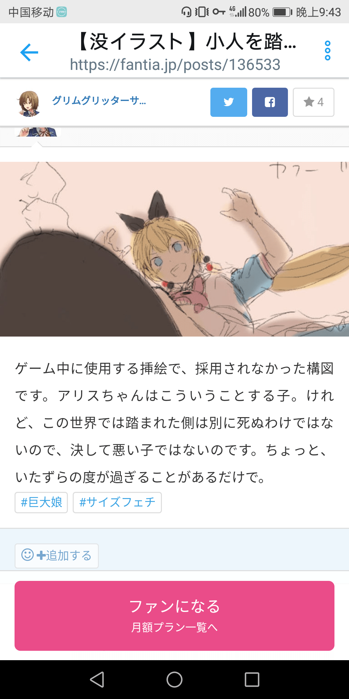

# 你们有人知道fantia怎么查看大图嘛

作者：yzqlove

TID：26604

<title>1</title> <link href="../Styles/Style.css" type="text/css" rel="stylesheet">

# 1

你们有人知道fantia怎么查看大图嘛，不知道怎么点开
<title>2</title> <link href="../Styles/Style.css" type="text/css" rel="stylesheet">

# 2

 <ignore_js_op>[Screenshot_20190321-214356.png](forum.php?mod=attachment&aid=NzcyNDJ8ZjcwNTQwYWV8MTY3NDA2Njg1N3wxODIzMHwyNjYwNA%3D%3D&nothumb=yes) *(527.3 KB, 下載次數: 4)*

[下載附件](forum.php?mod=attachment&aid=NzcyNDJ8ZjcwNTQwYWV8MTY3NDA2Njg1N3wxODIzMHwyNjYwNA%3D%3D&nothumb=yes)

2019-3-21 21:45 上傳  

</ignore_js_op> <title>3</title> <link href="../Styles/Style.css" type="text/css" rel="stylesheet">

# 3

訂(付)閱(錢) 特地不放完整圖當然是為了廣告
<title>4</title> <link href="../Styles/Style.css" type="text/css" rel="stylesheet">

# 4

付钱啊，而且每个月赞助的钱还是分开的。 <title>5</title> <link href="../Styles/Style.css" type="text/css" rel="stylesheet">

# 5

那个需要付钱的……每个月都要