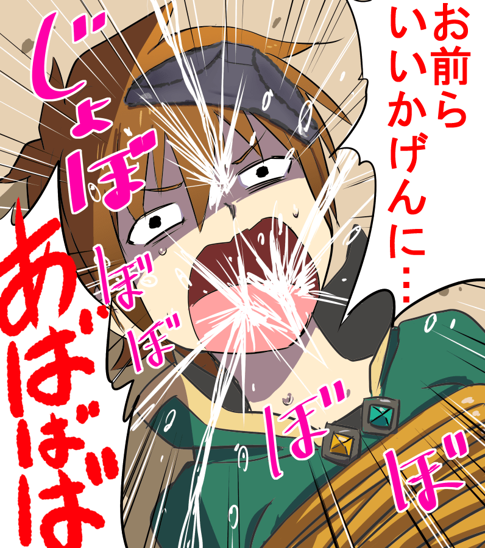

# 你當初是為什麼創作自己的作品的

作者：BAss926

TID：26183

<title>1</title> <link href="../Styles/Style.css" type="text/css" rel="stylesheet">

# 1

論壇裡的作者各種方面，各種類型都有，但是真要說創作目的，我相信所有人都不一樣。
我創作的目的談不上高尚也談不上低劣，我僅僅只是興趣使然加上想要進步罷了。
我喜歡講故事，更喜歡想象，所以創作對我來說真的只是興趣使然，但我想看到自己腦海裡的故事，我不就只能寫出來或者畫出來了嗎（雖然我不會畫畫）
另外我以後不會在gn論壇發佈文章了，我可能會請人代發之類的。 <title>2</title> <link href="../Styles/Style.css" type="text/css" rel="stylesheet">

# 2

想做贡献，但胎死腹中。想了想:写出来gts绝对不是主要内容，而且论坛的人肯定只想看h的。 <title>3</title> <link href="../Styles/Style.css" type="text/css" rel="stylesheet">

# 3

像这种小圈子里的小圈子，由于资源太少，大部分都会变得自给自足，自产自销 <title>4</title> <link href="../Styles/Style.css" type="text/css" rel="stylesheet">

# 4

因為我想要的東西沒人作，最後得出了只能自己作的結論
就連委託繪畫都沒有想像中的效果，還能怎麼辦，要求太高最後只能自己執行啊 <title>5</title> <link href="../Styles/Style.css" type="text/css" rel="stylesheet">

# 5

曾经动笔写过，不过没多久就放弃了，感觉自己都不满意 <title>6</title> <link href="../Styles/Style.css" type="text/css" rel="stylesheet">

# 6

都是一个点子晴天霹雳或者脑洞大到能补足懒惰缺陷的时候，才会开始写……（所以答应别人写的文、剧本两年了还没写……就是因为懒） <title>7</title> <link href="../Styles/Style.css" type="text/css" rel="stylesheet">

# 7

一是自己对创作乐在其中，自己最了解自己的撸点，创作的图片可以用来满足自己的欲望/
二是当年（差不多10年前吧）3D领域太依赖国外，亚洲题材的3D作品太匮乏，所以希望能够创作出国人喜欢的3D-GTS作品。 <title>8</title> <link href="../Styles/Style.css" type="text/css" rel="stylesheet">

# 8

N年前第一次接觸poser的作品，第一次知道原來自己可以用電腦做出3d作品，於是就這樣入坑了
只是出來了社會，創作無可避免也會開始考慮資金的問題了... <title>9</title> <link href="../Styles/Style.css" type="text/css" rel="stylesheet">

# 9

一半是为了研究出什么样的文章是定律式的撸管用品，后来发现，这是不存在的。后来就开始各种脑洞了。
另一半是为了研究我到底在喜欢什么，和大家讨论我写了什么 <title>10</title> <link href="../Styles/Style.css" type="text/css" rel="stylesheet">

# 10

就是试试自己的文笔，另一方面也是满足自己的幻想吧，不过就是过程经常不尽人意就是了、、、、我都拖更一年多了。。。 <title>11</title> <link href="../Styles/Style.css" type="text/css" rel="stylesheet">

# 11

本來是為了應付囉里巴縮的社團指導老師

因為我以為漫畫社就是看漫畫的而已 <title>12</title> <link href="../Styles/Style.css" type="text/css" rel="stylesheet">

# 12

*本帖最後由 ccccccccccc 於 2018-12-20 01:13 編輯*

看著一批這個貼感覺心情有點複雜
總感覺有想說的但又不知道怎麼說更不知道說什麼好

對了, 一批GN註冊兩週年快樂?
(我到底在說什麼)

世界改變了太多 如果我能更早接觸這個圈子就好了
幾乎所有圈子在最早期風氣都是最好的時候吧 有點向往 <title>13</title> <link href="../Styles/Style.css" type="text/css" rel="stylesheet">

# 13

一直忘不了不久前論壇裡某個萌新對GTS圈的存續下了個註解:

「這個圈子就是靠一群大佬興趣使然才能維持下去的。」

無某不大不佬，不過還是很慶幸這份興趣還沒衰退，還能為這個圈子貢獻一點綿薄之力。

說白了，把自娛的東西拿出來娛樂眾人，其實也挺開心的

<title>14</title> <link href="../Styles/Style.css" type="text/css" rel="stylesheet">

# 14

如果说做mod也算创作的话那我应该算兴趣使然的那一种
<title>15</title> <link href="../Styles/Style.css" type="text/css" rel="stylesheet">

# 15

這個問題對我來說有點複雜呀。

一開始發文只是為了資金(積分)，畢竟回覆別人的文只能回個幾篇，但是自己發文的話便能每一樓都回，這樣累積起來就相當快速。

但我沒想到的是跳入這個坑後居然寫出了一點興趣，畢竟是自己喜歡的主題加上回響不錯，而且點子越來越多，慢慢就變成了興趣為主，也是一種舒壓管道。

不過現在工作忙碌，似乎也沒太多時間創作，現在已經有點搞不清楚是為什麼創作自己的作品了，唯一的動力只有不希望被說是挖坑不填的傢伙，因此有空時便一鏟一鏟的填(挖?)著自己弄出來的坑。

<ignore_js_op>

**我也不知道自己在做啥呀.jpg** *(589.84 KB, 下載次數: 0)*

[下載附件](forum.php?mod=attachment&aid=NzU4OTZ8YTI1Y2E2MzJ8MTY3NDA2NjgwMnwxODIzMHwyNjE4Mw%3D%3D&nothumb=yes)

2018-12-20 20:14 上傳

<title>16</title> <link href="../Styles/Style.css" type="text/css" rel="stylesheet">

# 16

> [524 發表於 2018-12-19 02:37](https://giantessnight.cf/gnforum2012/forum.php?mod=redirect&goto=findpost&pid=392585&ptid=26183)
> 想做贡献，但胎死腹中。想了想:写出来gts绝对不是主要内容，而且论坛的人肯定只想看h的。 ...

那我过段时间发着试试，反正写不好，随便骂吧。
<title>17</title> <link href="../Styles/Style.css" type="text/css" rel="stylesheet">

# 17

高中的时候画画画了很多，有能力给自己来个私人订制的感觉真好 <title>18</title> <link href="../Styles/Style.css" type="text/css" rel="stylesheet">

# 18

一段时间不看自己的文，回头再来看居然会觉得有些爽~ <title>19</title> <link href="../Styles/Style.css" type="text/css" rel="stylesheet">

# 19

想写温暖人心的故事……
我希望我能创作有血有肉有灵魂的人物……
想在文中埋各种各样的梗……</ignore_js_op>