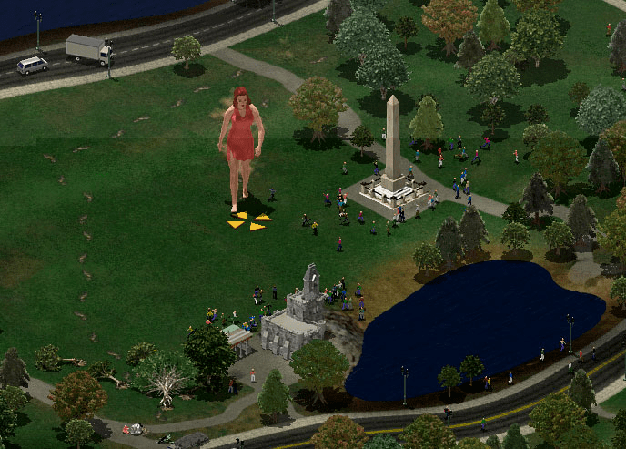

# 你覺得gts應不應該被更多人知道

作者：wanjingle

TID：24619

<title>1</title> <link href="../Styles/Style.css" type="text/css" rel="stylesheet">

# 1

具體原因參考我之前發的帖子

這個帖子就只問你一個問題
你覺得gts該不該被更多人知道
應該——為什麽應該？
不應該——為什麽不應該？

能抽出時間說下你的理由，讓大家知道當然最好不過了。
<title>2</title> <link href="../Styles/Style.css" type="text/css" rel="stylesheet">

# 2

被发现了，应该很难看的。 <title>3</title> <link href="../Styles/Style.css" type="text/css" rel="stylesheet">

# 3

说一点题外话，在现实世界中，不管你是正常的性取向也好，变态的也罢，都可以在现实中找到与之对应的事物，比如“恋童癖”、“恋尸癖”、“SM”这些群体，他们所热爱的事物都是能在现实里找到真的所存在的客观对象。
但是我们gts爱好者呢？
在现实里，别说女巨人了，就算是两米高的女性都是少之又少的存在。
根本就没有东西供我们发泄情感，可以说我们算是很可怜的了，喜欢上了一个不存在的事物。
因为这个世界根本就不存在女巨人，我的爱好也只能存在于想象与虚拟世界中。
可以说是我们对这个世界没有任何危害。
不像那些恋童恋尸的人，还有可能会做出伤天害理的事情来。
我觉得我的性癖虽然特殊，那也只是我个人的爱好。她天生存在于我的身体里，就跟那些同性恋一样，并无本质的区别。
我不以此为荣，也不以为耻。
现实世界曾经有人问过我的性癖，我都大大方方的承认了自己是gts爱好者。
如果有圈外的人士以此来攻击嘲讽我，我觉得这并不是我的错，而是对方的错，错在他素质低下。
现在的社会，都已经越来越认同同性恋的存在了，甚至有的国家都已经合法化了。
这些都是人家同性恋们，用血的代价所争取来的。
人家都能做出如此大的牺牲，我们受点圈外人的嘲讽又何足挂齿呢？
所以我觉得，gts应该被更多的人知道，让喜欢的人加入进来，不喜欢的人也对我们保持理解，这不过是一个有一点特殊的性取向罢了。
而不是自我封闭起来。
以现在人类的科学理论来说，我们的爱好对人类社会来说是完全无害的。
我希望未来有一天我们每一个人都能大大方方的承认自己的性取向。 <title>4</title> <link href="../Styles/Style.css" type="text/css" rel="stylesheet">

# 4

我说几句吧：

1\. 如果GTS同好的圈子影响力，能上升到“恋足”“SM”“同性恋”等小众性癖好的规模的话，我们能获取的商业资源会大大丰富。
会有专门的AV公司来制作GTS作品来讨好我们（哪怕只为了盈利）。就算没有，能吸引更多同好来到这个论坛，一起贡献和创作，也是个不错的结果。

2\. 不刻意去宣扬，因为连我们GTS同好都不理解我们的癖好到底源自何处，其核心要素到底是啥，为什么我们跟正常大众不一样？
当你去宣扬的时候，很容易走入误区，被人误解，甚至有划入危险区域的可能（比如CRUSH动物等极度反社会内容）。

3\. GTS性癖好的特殊性在于：同好源自天生，不可能后天通过看GTS作品就变成GTS同好，这种“传教方式”几乎无效。
我信奉“过滤器理论”，当我们童年观看《格列佛游记》的时候（巨人国和小人国），就已经把我们从正常人当中剥离开了。
如果是同好，当时看的时候一定有感觉，如果当时看没感觉，后天也不可能成为同好。 <title>5</title> <link href="../Styles/Style.css" type="text/css" rel="stylesheet">

# 5

個人看法是應該，因為人口基數越高創作量也會上升
不過還是得強調，你覺得不該跟你想「禁止」別人宣揚是兩回事
<title>6</title> <link href="../Styles/Style.css" type="text/css" rel="stylesheet">

# 6

关注和感兴趣的人越多，制造视频等等各种资源的人才越来越多啊 <title>7</title> <link href="../Styles/Style.css" type="text/css" rel="stylesheet">

# 7

感觉宣传也没用，觉醒这个爱好的应该会自己找到这里，没觉醒的怎么宣传也是不会觉醒的了，还会觉得不理解啊，反感啊，恶心啊 <title>8</title> <link href="../Styles/Style.css" type="text/css" rel="stylesheet">

# 8

*本帖最後由 d5q25x62 於 2018-2-28 20:58 編輯*

如果是為了保護這個論壇是不應該特別去宣傳,
但如果是只是宣傳GTS文化的話也不一定是要論壇裡的人,畢竟許多的檯面上的漫畫或是影片都有出現GTS的畫面了,
所以你在這裡問該不該讓更多人知道實在是沒什麼意義.

<title>9</title> <link href="../Styles/Style.css" type="text/css" rel="stylesheet">

# 9

*本帖最後由 wongvict 於 2018-2-28 21:17 編輯*

我在2005年從台灣網站遊戲基地一個叫"They came from hollowood"遊戲那個遊戲搜索相關資料開始知道有gts這種癖好及群體存在。 [那個遊戲應該爛尾了?不過網站還在....那個遊戲是正常向的怪獸game，不是偏向gts癖好,還支援上上世代的遊戲跳舞毯呢，現在都走VR了，時代的眼淚]
我想宣傳是起到一定作用。
第一個加入的中文社群就是Giantess Night，那時還沒有論壇網站呢。只是個Yahoo群組，找相關圖片影片資源等都是在神社モドキ (Jinja-Modoki),g-zone fun link等連結介紹網站其他地方找。

我覺得宣傳順其自然最好，不要太刻意做作。
<ignore_js_op>

**woman_footprints.jpg** *(99.88 KB, 下載次數: 3)*

[下載附件](forum.php?mod=attachment&aid=NzEwOTN8MDRlZmJlYTR8MTY3NDA2NjE3M3wxODIzMHwyNDYxOQ%3D%3D&nothumb=yes)

They came from the Hollywood[應該棄坑了?]

2018-2-28 20:38 上傳

<title>10</title> <link href="../Styles/Style.css" type="text/css" rel="stylesheet">

# 10

我们不要主动向外部传播，但是也不要刻意刁难能主动找到我们这里来的新人 <title>11</title> <link href="../Styles/Style.css" type="text/css" rel="stylesheet">

# 11

我觉得真的想让更多人知道的话需要有大量的无h无血腥内容“开路”，看更多的人能接受到什么样的程度。
不过找现实来看，可能只是妄想
也许我有点悲观 <title>12</title> <link href="../Styles/Style.css" type="text/css" rel="stylesheet">

# 12

往往不会被接受还会迎来外人的嘲讽，宣扬出去不是找死吗 <title>13</title> <link href="../Styles/Style.css" type="text/css" rel="stylesheet">

# 13

如果别人知道并能理解这一爱好的话，让人了解也无妨，但不会主动向外去传播。 <title>14</title> <link href="../Styles/Style.css" type="text/css" rel="stylesheet">

# 14

我们向外宣传的应该是巨大娘的萌文化，而不是什么掺杂个人癖好的东西。 <title>15</title> <link href="../Styles/Style.css" type="text/css" rel="stylesheet">

# 15

宣传没必要，但可以让人知道有这东西的存在。因为可以以此吸引更多有潜在兴趣的人，毕竟这东西越大众，哪更好的资源和作品也会越多啊 <title>16</title> <link href="../Styles/Style.css" type="text/css" rel="stylesheet">

# 16

本来就是个有点特殊的性趣爱好而已，不指望（只是不指望）能有更多的人加入进来，周围的人能多多少少理解就不错了 <title>17</title> <link href="../Styles/Style.css" type="text/css" rel="stylesheet">

# 17

不应该，至少目前不应该，因为特殊癖好可以说是所有特殊癖好者的一个软肋，一旦被人抓到把柄不说身败名裂但至少也会闹出很多不愉快的事情。
而且GTS不被更多人知道还有好处在于：当别人不甚了解便不会有主观臆断的揣测。比如一个人心中完全清楚GTS是怎么回事，那他难免会因自己觉得该爱好粗鄙或是高雅而对GTS爱好者进行等价评判，而如果他几乎完全不知道GTS是什么，也许当听说一个人是GTS爱好者时便只会认为是众多奇葩爱好之一，不会做过多评价。
虽说广泛传播也许能引起更多GTS爱好者的共鸣，甚至能像同性恋者一样呼吁属于自己的公正与平等，但从我们目前身处的时区来看，同性恋尚不能被接受，何况GTS乎？这也是我说目前不应该的原因。 <title>18</title> <link href="../Styles/Style.css" type="text/css" rel="stylesheet">

# 18

要宣传的话，可以找一些轻度口味的图先去引起他们的兴趣，然后再改一下主题内容，玩点文字方面的陷阱，等他入坑了，他就已经无法后悔了 <title>19</title> <link href="../Styles/Style.css" type="text/css" rel="stylesheet">

# 19

*本帖最後由 Euphoria 於 2018-2-28 23:54 編輯*

要我看，两个投票选择哪个都不合适
可以让理解GTS的人越来越多，但不是要刻意追求增加同好的数量，也不用隐瞒GTS这一爱好本身的存在
但是要宣扬的话，圈外人很可能会将你当作精神病或者有怪癖吧。GTS有一个特征：她是统合了“力”与“美”的存在，有着强大肉体力量令男性无可匹敌，同时充满女性魅力吸引着男性，而现实是根本不存在GTS的，就像前面的朋友说的，就连两米的女性也是少之又少。反正是幻想创造出来的东西，就和孙悟空奥特曼似的。但是加之SM，裸体，虐杀，还有各种重口味，我自己都从来不喜欢看这种贴的，现在都能自动回避了。
女人找对象，几乎都是找比自己高的男人。想像一下，“我就是喜欢比自己高大数十倍数百倍数千万亿倍的女生”说这种话的男人让女生怎么看待？很奇怪吧？这已经是留面子的回答了。真要让大众知道了自己爱好这类事物，那叫什么——被赋予了“社会的死”，到哪都没脸面见人，当然这也说得可能有些夸张了。
<title>20</title> <link href="../Styles/Style.css" type="text/css" rel="stylesheet">

# 20

我覺得這是個無聊的問題，應該要有廢票選項
沒有什麼應該不應該，因為你要推廣一個性癖幹什麼
這性癖有的人就有，而且自然地會聚在一起
沒有的人就沒有，你去推廣也不會變成有
雖然推廣沒意義，可是也沒必要搞成封閉性圈子
有人就是喜歡宣揚他的性癖你奈他如何
有可能因為這性癖被當成怪人，但又不是殺人放火販毒，管人家怎麼說
如果是怕被搞破壞...無聊人士到處都是，不管推不推廣都有可能有人來搞
講這根本沒意義，又不是沒有管理員，這麼怕被搞還是把站關一關搞線下聚會就好了
沒有出門的必要性，可是也並不需要鎖門 <title>21</title> <link href="../Styles/Style.css" type="text/css" rel="stylesheet">

# 21

我觉得应该。近几年来，很明显宅相关的圈子的接受能力越来越强了。长远来讲，应该还是圈子的大小扩大才更好。 <title>22</title> <link href="../Styles/Style.css" type="text/css" rel="stylesheet">

# 22

让新人自己设法找来（我觉得真要找不会找不到），不要主动跑到大庭广众之下宣传。 <title>23</title> <link href="../Styles/Style.css" type="text/css" rel="stylesheet">

# 23

可能也算信仰的一种，虽然不是真实存在（起码现阶段不存在吧）。别人直到了或者不直到其实影响也不大。好比有人喜欢超人，喜欢超级英雄，喜欢二次元之类。爱好也就是爱好吧 <title>24</title> <link href="../Styles/Style.css" type="text/css" rel="stylesheet">

# 24

> [EIJIL 發表於 2018-2-28 18:00](https://giantessnight.cf/gnforum2012/forum.php?mod=redirect&goto=findpost&pid=361916&ptid=24619)
> 说一点题外话，在现实世界中，不管你是正常的性取向也好，变态的也罢，都可以在现实中找到与之对应的事物， ...

说的很好，其实我们没必要这样害怕圈外人对我们有什么。我也把我的爱好给我老婆说过，她也就是当个趣闻看了一下视频图片什么的，接着就是无聊。就这么过了。其实你说的对，GTS圈比起其他恋什么癖的圈子，真的算好的多的。所以没必要这么担惊受怕。
<title>25</title> <link href="../Styles/Style.css" type="text/css" rel="stylesheet">

# 25

这个好像是天生的，一旦你拥有这个天性，你会自己幻想这些事情，看着漫画，天生的就会认为非常有趣，反之则会觉得无聊，不要主动声张了，因为我们还没有达到那种势力 <title>26</title> <link href="../Styles/Style.css" type="text/css" rel="stylesheet">

# 26

我个人觉得还是不主动宣传比较好。
毕竟如果这个东西大范围公开了 估计还是批判我们这个圈子的人
不可能有什么大量新血液涌入或者多来一堆人创作的
所以现在这个状态我觉得还是挺好的。 就这样吧 <title>27</title> <link href="../Styles/Style.css" type="text/css" rel="stylesheet">

# 27

我个人觉得还是不要主动传播为好。本身这就不是一个大众的爱好，自己圈内的人娱乐娱乐不好吗，为什么非要推到那些不愿接受的人面前？现在这些打着所谓圈外推广的人在公众场合大肆宣扬这种爱好的大多只是把自己的爱好强加在大众身上的变态罢了，人家有些人是不能接受这种癖好的，但是人家也没有干涉我们，为什么非要去骚扰人家不可呢？ <title>28</title> <link href="../Styles/Style.css" type="text/css" rel="stylesheet">

# 28

投了应该。

为什么不投不应该：对于任何一个圈子，差异性都是保有活力的重要前提，而差异性只能来自于源源不断加入的新鲜血液。刻意地把这个圈子封闭起来将极大地提高潜在同好进一步了解的成本，进而把这些人阻挡在外。更何况我们都不是什么一呼百应的人，哪怕GN真的站出来作为圈子的代表加大了封闭的力度，圈中愿意宣传的人也并没有受到任何意义上的约束。行动力足够的同好也必然会寻找新的栖息地，结果就是GN没落。@蛋大 拉个票。

为什么投应该：被更多人知道不代表强迫更多人去接受和感同身受。除却上文提到的吸引新鲜血液的加入，这个圈子被更多人知道，会导致我们受到非议吗？会，但大小恋物癖违法吗？足控违法吗？吞食违法吗？人外？变物？没有一个违法，所以非议我们的人只有非议。此外我们的圈子里18+的东西大多数跳出我们的圈子一样18+。而且不明真相的大众对我们的圈子的反馈除却归属只会有非议吗？显然不会。假设有一个你不感兴趣的性癖，你会在偶然点进相关视频之后破口大骂，买个百万水军到处打压吗？大众作为一个整体，反应是迟钝的，绝大多数人的反应会是疑惑以及无视。**我前女友看见了cakeinferno的furry vore视频的第一反应是为了这个non-sense你每月花十刀patronize the artist？ARE YOU CRAZY？**我姑且以小人之心揣测一下楼主的担忧，有一天被别人知道了我的性趣岂不是很尴尬？但正如楼上EIJIL所言，被人问到性癖我大大方方承认解释，并没有什么值得骄傲或者自卑的。你听了我的解释无论是觉得还行，觉得兴奋亦或是嫌弃鄙夷那都是你的事。你因此而疏远我，well那就拜拜了您内。因为我知道定义我的绝不仅仅是我的性癖，而值得我交的朋友显然也该认识到这一点。**这绝对不是我和前女友分手的原因。单身狗哭成傻子。** <title>29</title> <link href="../Styles/Style.css" type="text/css" rel="stylesheet">

# 29

经常涉及色气，所以个人认为不应该宣扬。好这口的终究能找到组织，不好这口的不相为谋。 <title>30</title> <link href="../Styles/Style.css" type="text/css" rel="stylesheet">

# 30

大大的思緒有點打結了 很多事情搞不清楚
分享自己的興趣跟散播盜版的資源是兩回事
還有以真實身分跟匿名論壇這也是兩回事
亞洲國家跟歐美國家還是有差別的
歐美都比較開放
甚至敢於把自己身分跟興趣曝光
亞洲屬於比較隱密型的
我支持GTS慢慢被眾人接受或是成為動漫裡的一個新屬性
但是我沒種也不想讓別人知道我在研究這類事情
雖然很多朋友會交流A片之類的
但你總不會跟朋友講說我跟我女友在床上怎樣知的事情吧?這是兩回事
這是觀念問題
做自己喜歡的事情但是不要給社會帶來負面觀感這是很需要技術的
真要做的話不但要時間跟經驗
就像但丁大開這個論壇開了個十年一樣(大概有吧?)
一堆老司機都是從這裡出發的
再說一次討論跟散播盜版是兩回事
要不要讓別人知道自己的興趣要靠自己決定
蘿莉控一開始是人眼光也是排斥
現在已經變成動漫的一個屬性被很多人接受這樣的例子你懂了吧?
足控現在也越來越多之後演變成GTS也是有可能的

<title>31</title> <link href="../Styles/Style.css" type="text/css" rel="stylesheet">

# 31

最近这样的话题已经引入重视了，我们最开始加入这个圈子的初心是什么?
的确，在现实生活中承认自己的性癖在我看来的确是一件比较尴尬的事情，
但这并不代表我们见不得人。
前面几位大佬已经说了自己的看法，作为一名新人，我也要说一句:
这个问题是一把双刃剑，我们应该低调，毕竟一定会有h的成分。
但是不代表同好们一定要去刻意隐藏自己的爱好。
一位不知道叫什么来着的哲人曾经说过:"人无癖不可交。"
虽然我们的愿望在现实中不可能实现，但这并不代表我们不能去推广它让更多的同好知道。毕竟gn决定不能将自己封闭，我们需要新鲜血液。 <title>32</title> <link href="../Styles/Style.css" type="text/css" rel="stylesheet">

# 32

我和我的朋友都说过，他们纷纷表示不可思议... <title>33</title> <link href="../Styles/Style.css" type="text/css" rel="stylesheet">

# 33

楼主问了一个非常值得我们深思的问题,这种虚拟的不存在的东西到底要不要发扬光大
我不会写什么长篇大论,只是觉得:这个东西还是得根据情况而定,有的喜欢有的毫无波动有的厌恶,不同的人不同的见解,咱们只负责宣传,不是说必须要去让他们内心深处某种属性觉醒对吧,这个完全看他们,进来了这圈子,欢迎,不进也不强拉,这么个意思(感觉说了堆废话)
14楼说的我觉得有道理,可以宣传好的一面,至于那些不好的最后他们自己怎么探索到的怎么喜欢上的那是他们的事了 <title>34</title> <link href="../Styles/Style.css" type="text/css" rel="stylesheet">

# 34

*本帖最後由 wargrey 於 2018-3-2 00:12 編輯*

“巨大化”和“缩小化”两种癖好的外延有很多，譬如有些画家就喜欢把玩具或昆虫画大了，譬如日式门那种设计就是日本人缩小意识的体现(有本书就叫《日本人的缩小意识》)。早些时候提及 GTS 还能见到诸如“把力量赋予女性”的解释，这个多少根女权主义有关，然后随着满脑子都是性的人的介入，这个观点不仅不被圈内的他们接受，反而被他们呲之以鼻。

顺其自然吧，人类主动思考的意愿从来就不强，不仅是 GTS，所有的文学创作，都是“性”题材最为丰富、受众最广。这些受众如果眼界不够开阔，他们就会以为“一切都是性”，弗洛伊德时代的心理学整个理论根基都是“性”，可你们知道他的理论，或者他那个时代的心理学局限性很大么？甚至大到让他撞上了自己的墙。

与其担心别人会非议，还不如圈子内部先认真思考，如何创作使 GTS 多元化，譬如力、美、萌，这些属性都不直接跟“性”有关。

真的，GTS 不是“性”癖。。。 <title>35</title> <link href="../Styles/Style.css" type="text/css" rel="stylesheet">

# 35

我认为是不推广不封闭
偶有打开了自己开关的人应该可以通过自行的搜索找到同好,至于对于不是同好的,不需要刻意去宣传.
<title>36</title> <link href="../Styles/Style.css" type="text/css" rel="stylesheet">

# 36

别说gts了，就是普通动漫都是“见光死” <title>37</title> <link href="../Styles/Style.css" type="text/css" rel="stylesheet">

# 37

跟東方Project一樣，不宣傳不封閉。
大眾化就不好的事情之一。 <title>38</title> <link href="../Styles/Style.css" type="text/css" rel="stylesheet">

# 38

> [xnr 發表於 2018-2-28 10:16](https://giantessnight.cf/gnforum2012/forum.php?mod=redirect&goto=findpost&pid=361923&ptid=24619)
> 我说几句吧：
> 
> 1\. 如果GTS同好的圈子影响力，能上升到“恋足”“SM”“同性恋”等小众性癖好的规模的话，我 ...

現在想想，本人上小學之前就已經對GTS感興趣了。
感覺還真是，這種愛好基本上是先天的。
<title>39</title> <link href="../Styles/Style.css" type="text/css" rel="stylesheet">

# 39

顺其自然最好，宣传有种不妙的感觉 <title>40</title> <link href="../Styles/Style.css" type="text/css" rel="stylesheet">

# 40

这本来就是一个小众的题材，若是让更多的人知道的话，会很尴尬的，而且有和谐的危险 <title>41</title> <link href="../Styles/Style.css" type="text/css" rel="stylesheet">

# 41

坚决支持GTS扩大圈子、个人觉得GTS潜在爱好者还是很多的（可以从足控和抖M里挖掘）、小众爱好喜欢的人多了就是普世价值、

但是传播是需要方法的、不分场合乱PO巨大娘的R18图怎么想都是制杖行为、

<title>42</title> <link href="../Styles/Style.css" type="text/css" rel="stylesheet">

# 42

其实知不知道无所谓，只要是想看的，谁来都可以。 <title>43</title> <link href="../Styles/Style.css" type="text/css" rel="stylesheet">

# 43

事实上我身边很多妹纸已经 知道了，我主动给她们讲的 <title>44</title> <link href="../Styles/Style.css" type="text/css" rel="stylesheet">

# 44

因為這也是美好的次文化表現 <title>45</title> <link href="../Styles/Style.css" type="text/css" rel="stylesheet">

# 45

不能强求吧，毕竟爱好者总会找到这里 <title>46</title> <link href="../Styles/Style.css" type="text/css" rel="stylesheet">

# 46

就像一般正常的H，人人都看，可是也很难放到台面上来 <title>47</title> <link href="../Styles/Style.css" type="text/css" rel="stylesheet">

# 47

還是希望能讓更多人知道，甚至會去接受這種文化

這樣一來相關的創作會變得更多，我們的選擇也會變更多XD <title>48</title> <link href="../Styles/Style.css" type="text/css" rel="stylesheet">

# 48

应该让有潜在喜欢gts的人了解到，至于不感兴趣的人当然就无所谓啦，你不来找我，我也是不会去找你的 <title>49</title> <link href="../Styles/Style.css" type="text/css" rel="stylesheet">

# 49

还是不要的好，看色情网站就会被说成变态，这个呢？大家自己去想吧 <title>50</title> <link href="../Styles/Style.css" type="text/css" rel="stylesheet">

# 50

这个和其他癖好又不同了，其他什么恋物癖，恋足癖啥啥的都是真实可现的，咱这个，，，就算未来真能缩小了也不会发展到gts这方面吧。。。
<title>51</title> <link href="../Styles/Style.css" type="text/css" rel="stylesheet">

# 51

其实咱们这个小圈子的扩大还是要分两头讲的：
对于潜在的新人，要在加以验明正身后再进一步引导（例如知乎这个答主的做法[https://www.zhihu.com/question/264477592/answer/355142426](https://www.zhihu.com/question/264477592/answer/355142426)）
对于普通大众来说，最好还是在二次元内装可爱无辜，尽量避免露出gts中会引起不必要的麻烦的方面。 <title>52</title> <link href="../Styles/Style.css" type="text/css" rel="stylesheet">

# 52

当然应该，为什么要隐瞒？藏着掖着圈子怎么吸收新鲜血液 <title>53</title> <link href="../Styles/Style.css" type="text/css" rel="stylesheet">

# 53

我反正不想被人知道，就拿我的文章来说，虽然和gts没关联，但肯定很多人骂脑子有问题，还变态，一天什么不想想变成女人的生殖器，这个就不正常，所以不想被人知道
<title>54</title> <link href="../Styles/Style.css" type="text/css" rel="stylesheet">

# 54

> [EIJIL 發表於 2018-2-28 18:00](https://giantessnight.cf/gnforum2012/forum.php?mod=redirect&goto=findpost&pid=361916&ptid=24619)
> 说一点题外话，在现实世界中，不管你是正常的性取向也好，变态的也罢，都可以在现实中找到与之对应的事物， ...

说的好，为你鼓掌，对GN的喜爱是发自内心的，天生便存在的，小时候便无意地搜女巨人视频，再到贴吧，到这里，我们应该被大家所理解
<title>55</title> <link href="../Styles/Style.css" type="text/css" rel="stylesheet">

# 55

> [xnr 發表於 2018-2-28 18:16](https://giantessnight.cf/gnforum2012/forum.php?mod=redirect&goto=findpost&pid=361923&ptid=24619)
> 我说几句吧：
> 
> 1\. 如果GTS同好的圈子影响力，能上升到“恋足”“SM”“同性恋”等小众性癖好的规模的话，我 ...

说的好，为你鼓掌，对GN的喜爱是发自内心的，天生便存在的，小时候便无意地搜女巨人视频，再到贴吧，到这里，我们应该被大家所理解
<title>56</title> <link href="../Styles/Style.css" type="text/css" rel="stylesheet">

# 56

被别人知道这个的话，挺难理解的，而且估计除了关系特别好的人，其他人会觉得不大正常。
GTS还是作为一个小众爱好会更好。它不像其他的癖好，可以在现实世界找到，有稍微大一些的体形差都是不多的。个人认为，随着VR和AR发展，GTS会传播更广，但不会太大。 <title>57</title> <link href="../Styles/Style.css" type="text/css" rel="stylesheet">

# 57

没必要特意宣扬。
人畜无害的默默存在才是小众圈子合理的生存方式吧 <title>58</title> <link href="../Styles/Style.css" type="text/css" rel="stylesheet">

# 58

希望更多的人了解或理解和主动地宣传是两码事…… <title>59</title> <link href="../Styles/Style.css" type="text/css" rel="stylesheet">

# 59

前幾天主動給朋友解釋了下
獸控他們能夠理解 但是GTS就不行...
巨尷尬 以後不說了 <title>60</title> <link href="../Styles/Style.css" type="text/css" rel="stylesheet">

# 60

不需要特別掩蓋 可以宣傳 但先以非R18類別開始 有興趣的接觸就容易進圈
如果過度封鎖 也不利於成長 相關創作多少也會影響
遇到小白出來耍白 能做的也很有限 畢竟擺明來亂的 要防不容易
但總不能因為一個人發瘋 就封鎖 這對整體也未必是好事

<title>61</title> <link href="../Styles/Style.css" type="text/css" rel="stylesheet">

# 61

以中国大陆的性开放程度来说，估计圈子越大被打压得越厉害。。。 <title>62</title> <link href="../Styles/Style.css" type="text/css" rel="stylesheet">

# 62

我感觉动漫如果拍这个题材肯定火，可惜只有进击的巨人，女巨人还都是配角 <title>63</title> <link href="../Styles/Style.css" type="text/css" rel="stylesheet">

# 63

这种都是个人爱好吧，反正我觉得不应该 <title>64</title> <link href="../Styles/Style.css" type="text/css" rel="stylesheet">

# 64

更多的人应该知道 GTS，所以我可以和我国更多的人交谈。Vive la France ou pas. 
<title>65</title> <link href="../Styles/Style.css" type="text/css" rel="stylesheet">

# 65

觉得没必要，有这个兴趣的会主动找组织的，宣传出去反而会被打压 <title>66</title> <link href="../Styles/Style.css" type="text/css" rel="stylesheet">

# 66

GTS本身並無對錯,關鍵是以何種方式向外傳播.
<title>67</title> <link href="../Styles/Style.css" type="text/css" rel="stylesheet">

# 67

最好还是不要让太多人知道吧，毕竟也是奇怪的癖好 <title>68</title> <link href="../Styles/Style.css" type="text/css" rel="stylesheet">

# 68

GTS还是个小众爱好吧，不是所有人都能接受这个的，小范围的交流就可以了。 <title>69</title> <link href="../Styles/Style.css" type="text/css" rel="stylesheet">

# 69

GTS由淺入深其時不是很容易，大綜文學也常有GTS情節，漫畫之類的就更不用說了
縮小偷窺、女體探險這類普羅大眾已都能接受，但有些較重口味的部分，例如踩踏、入陰之類的，就如同扶它一樣屬於小眾的特殊癖好，自然能接受的就少了。

推廣的部分呢，縮小被胸部夾住、因體型差的各種趣事等這類可被歸類為幽默、搞笑等內容個人認為可以繼續推廣，甚至成為特色之一。但是容易被歸類為變態的H性質甚至重口味的部分，就讓那些覺醒的新生GTS愛好者自己尋找即可。 <title>70</title> <link href="../Styles/Style.css" type="text/css" rel="stylesheet">

# 70

这个癖好不必让人知道，gts癖好是先天的，可能各位都是小时候的某些动漫等一下感觉很兴奋，没有先天gts的人可能会没有感觉，反而感到很恶心，所以不要公布这个圈子，也不要拒绝来这里的新人们是最完美的处理 <title>71</title> <link href="../Styles/Style.css" type="text/css" rel="stylesheet">

# 71

就当是奇怪的性癖？还在可以理解的范畴嘛 <title>72</title> <link href="../Styles/Style.css" type="text/css" rel="stylesheet">

# 72

因为这是一个利基业余爱好、意外产品很美味。 <title>73</title> <link href="../Styles/Style.css" type="text/css" rel="stylesheet">

# 73

虽然知道的人多了也许会有一部分人入坑，但gts是小众兴趣，更多可能会被别人看做变态 <title>74</title> <link href="../Styles/Style.css" type="text/css" rel="stylesheet">

# 74

楼上的大佬们说的在理（不主动宣传，亦不封锁）。但是有没有想过一个问题，在当今的网络环境下，萌新真的有机会接触到我们吗?我从小学开始接触到GTS，然后在贴吧里大量看文（天香传奇，星球大战，奇迹的文章，媛媛的文章，宇宙女神启示录，武林浪女志以及海量的短篇），在贴吧的海量信息（约几千万字）里发现了 <title>75</title> <link href="../Styles/Style.css" type="text/css" rel="stylesheet">

# 75

GN这个论坛，但百度找不到GN，我看文是 <title>76</title> <link href="../Styles/Style.css" type="text/css" rel="stylesheet">

# 76

看文时离发帖时间已经过去了数年。后来找到了giantesslover，知道了giantessnight。但由于网络审查的问题又无法访问。直到最近学会了翻墙才能正常访问GN。现在回首，贴吧里的gts和gtss吧都倒了，大量文章被清理，来路已经沦陷，我可能搭上了gts的末班车。现在值得担心的是，未来的潜在同好们，还找的到组织吗，还知道自己是gts爱好者吗。。。。。。。 <title>77</title> <link href="../Styles/Style.css" type="text/css" rel="stylesheet">

# 77

楼上的大佬们说的在理（不主动宣传，亦不封锁）。但是有没有想过一个问题，在当今的网络环境下，萌新真的有机会接触到我们吗?我从小学开始接触到GTS，然后在贴吧里大量看文（天香传奇，星球大战，奇迹的文章，媛媛的文章，宇宙女神启示录，武林浪女志以及海量的短篇），在贴吧的海量信息（约几千万字）里发现了GN这个论坛，但百度找不到GN，我看文时离发帖时间已经过去了数年。后来找到了giantesslover，知道了giantessnight。但由于网络审查的问题又无法访问。直到最近学会了翻墙才能正常访问GN。现在回首，贴吧里的gts和gtss吧都倒了，大量文章被清理，来路已经沦陷，我可能搭上了gts的末班车。现在值得担心的是，未来的潜在同好们，还找的到组织吗，还知道自己是gts爱好者吗。。。。。。。(刚才手抖，整合一下) <title>78</title> <link href="../Styles/Style.css" type="text/css" rel="stylesheet">

# 78

個人覺得GTS這種喜好幾乎是先天覺醒的，真的很難靠傳教去推廣
小眾式性癖就很多不被大眾所接受，更別說是比小眾還小眾的GTS
新進能不能找到這裡，就看緣份吧
當初我也是意外才找到這個GN論壇，讓我知道原來這種性癖還有這麼多同好 <title>79</title> <link href="../Styles/Style.css" type="text/css" rel="stylesheet">

# 79

感觉不太好，知道的自然会知道，不知道的人知道了会有很多想法
<title>80</title> <link href="../Styles/Style.css" type="text/css" rel="stylesheet">

# 80

一宣传起来感觉被禁的可能性更大一点，但同时资源也会更多，权衡一下利弊吧 <title>81</title> <link href="../Styles/Style.css" type="text/css" rel="stylesheet">

# 81

但是……我还是觉得知道的人更多比较好……这样的话，资源就会更多了……而且也不用躲躲藏藏的…… <title>82</title> <link href="../Styles/Style.css" type="text/css" rel="stylesheet">

# 82

这个属于小众型的，暴露在大众面前，感觉好奇怪的 <title>83</title> <link href="../Styles/Style.css" type="text/css" rel="stylesheet">

# 83

其實就算曝露了，這裡對其他人來說只是有點難以理解而已，也不是不能接受的... <title>84</title> <link href="../Styles/Style.css" type="text/css" rel="stylesheet">

# 84

需要权衡影响扩大后带来的资源膨胀与舆论以及网络风气的影响，不过了解的人越来越多的话现在平静友好的氛围会被打破吧 <title>85</title> <link href="../Styles/Style.css" type="text/css" rel="stylesheet">

# 85

扩大这个圈子的同事要面对的问题也更多，但是得到的资源也更加广泛，关键的问题就在是否有能力解决这个问题。个人觉得的话小范围的宣传一下GTS这个概念还是可以的。从个人经历上来讲，其实从小学三，四年级就有这方面的幻想了，但是也只是幻想，并没有接触过实质上讲这方面的漫画，但是动漫的话 像百变小樱魔术卡里面有一集就是小樱变大去打怪兽什么的，不过还是没有GTS这个概念，真实意义上知道GTS大概是高中开始用exhentai的时候，然后再从漫画到整个GTS这个圈子（游戏 小说等等），但是最大的困扰就是，现在能从生活中抽出来去享受GTS的时间很少，于是就经常想，要是早点知道就好了什么的，哈哈。。。 <title>86</title> <link href="../Styles/Style.css" type="text/css" rel="stylesheet">

# 86

我们来说极端一点，虽然我不会和周围的人透露任何我的性癖好，但是，我能接受周围人知道我是足控，知道我是m，但是绝对不接受我喜欢gts，他们无法理解的。也许以后对关系很稳定很信任的女朋友会表露性癖好，亲吻舔舐她的足袜，但是gts，我永远不会说 <title>87</title> <link href="../Styles/Style.css" type="text/css" rel="stylesheet">

# 87

反正七八年前这种极其小众的亚文化鲜有人知，但现在经常在一些动画贴吧里看见圈内人 <title>88</title> <link href="../Styles/Style.css" type="text/css" rel="stylesheet">

# 88

顺其自然吧 不用刻意去改变什么 <title>89</title> <link href="../Styles/Style.css" type="text/css" rel="stylesheet">

# 89

不应该吧 反正我是不敢别人知道怕被当成异类自己也感觉这个爱好怪怪的 <title>90</title> <link href="../Styles/Style.css" type="text/css" rel="stylesheet">

# 90

我觉得gts应该是处于“可以被喜欢gts并对gts有一定兴趣的人经过一定的努力后才能发现”的地位。第一能避免过多的关注，因为一个圈子越大，鱼龙混杂的东西就越多，并不是关注的人越多出的质量就越高。第二，一个圈子要有一定的门槛和接受力才能良好的运作下去。 <title>91</title> <link href="../Styles/Style.css" type="text/css" rel="stylesheet">

# 91

个人感觉自己的喜欢就好。 <title>92</title> <link href="../Styles/Style.css" type="text/css" rel="stylesheet">

# 92

我认为还是算了，毕竟能理解的人太少 <title>93</title> <link href="../Styles/Style.css" type="text/css" rel="stylesheet">

# 93

知道的人太多了容易被墙2333 我觉得这东西还是跟个人经历有关吧 童年 初中 高中 看过的一些漫画或者什么的 随着好奇心的增加 最终打开了新世界的大门 <title>94</title> <link href="../Styles/Style.css" type="text/css" rel="stylesheet">

# 94

覺得不用去讓他人知道，畢竟有這興趣需求的自然會找到這或是city，向外推反而會有很多麻煩事 <title>95</title> <link href="../Styles/Style.css" type="text/css" rel="stylesheet">

# 95

> [EIJIL 發表於 2018-2-28 18:00](https://giantessnight.cf/gnforum2012/forum.php?mod=redirect&goto=findpost&pid=361916&ptid=24619)
> 说一点题外话，在现实世界中，不管你是正常的性取向也好，变态的也罢，都可以在现实中找到与之对应的事物， ...

所以gts相较于其他性癖变态，更加遵纪守法，温和。我记得知乎上一个答主这样回答的
<title>96</title> <link href="../Styles/Style.css" type="text/css" rel="stylesheet">

# 96

国家现在这么严，还是不要主动宣传了（把gts几个文笔比较好的传到大妈之家怎样？） <title>97</title> <link href="../Styles/Style.css" type="text/css" rel="stylesheet">

# 97

小圈子自己嗨就好了，不要张扬
<title>98</title> <link href="../Styles/Style.css" type="text/css" rel="stylesheet">

# 98

我认为不应该。

如果是有这个性趣爱好，早晚会进圈，根本无需传教。
如果没有这个爱好，以国人的尿性，轻则当笑话嘲弄，重则各种谩骂举报。

喜欢GTS圈的人，更多的是基因决定的，是少数派。
让更多人知道这个领域，只会自讨没趣。 <title>99</title> <link href="../Styles/Style.css" type="text/css" rel="stylesheet">

# 99

用不着，自己喜欢就好 <title>100</title> <link href="../Styles/Style.css" type="text/css" rel="stylesheet">

# 100

这种事情随缘吧...  

不管怎么说，人越多越好，但是就gts来说还是有很多分歧，怎么想都是仁者见仁智者见智的东西啊。 <title>101</title> <link href="../Styles/Style.css" type="text/css" rel="stylesheet">

# 101

很多圈外人看了gts题材作品之后评论不能理解，觉得恶心之类的.. <title>102</title> <link href="../Styles/Style.css" type="text/css" rel="stylesheet">

# 102

畢竟是非主流文化，多少會讓社會大眾反感吧 <title>103</title> <link href="../Styles/Style.css" type="text/css" rel="stylesheet">

# 103

还是少些吧，毕竟在这样的社会环境下，现实的引力太重了 <title>104</title> <link href="../Styles/Style.css" type="text/css" rel="stylesheet">

# 104

忽然想要一个类似的问题：你觉得5G时代应不应该到来？ <title>105</title> <link href="../Styles/Style.css" type="text/css" rel="stylesheet">

# 105

顺其自然吧 ( •͈ᴗ⁃͈)ᓂ- - <title>106</title> <link href="../Styles/Style.css" type="text/css" rel="stylesheet">

# 106

进这个圈子应该都是看自己喜好的吧，圈外人很容易会对此发生误解。 <title>107</title> <link href="../Styles/Style.css" type="text/css" rel="stylesheet">

# 107

之所以是小众非主流  自然有它的道理  没必要可以宣传的 <title>108</title> <link href="../Styles/Style.css" type="text/css" rel="stylesheet">

# 108

不是应不应该，是可不可能。我并不觉得没有这个爱好的人会认为超巨大的女孩子是一种很可爱的存在。更何况，有些“里世界”的东西不可能推广到大众范围内的。 <title>109</title> <link href="../Styles/Style.css" type="text/css" rel="stylesheet">

# 109

个人感觉还是应该的，毕竟现在人没那么保守 <title>110</title> <link href="../Styles/Style.css" type="text/css" rel="stylesheet">

# 110

感觉大多数人不会认同我   会被人嘲笑的。。。。而且我们这个爱好现在不被社会认可  宣传出去恐怕会被封杀 <title>111</title> <link href="../Styles/Style.css" type="text/css" rel="stylesheet">

# 111

这个东西不会被大众接受的，不要搞宣传
<title>112</title> <link href="../Styles/Style.css" type="text/css" rel="stylesheet">

# 112

我认为不应该吧，毕竟我们关于这方面的某些观念可能与主流不符，那我们也没有必要强迫他人去接受我们的观念，融入我们的圈子，毕竟也只是个人兴趣罢了.
<title>113</title> <link href="../Styles/Style.css" type="text/css" rel="stylesheet">

# 113

我觉得作为圈内人，并不是需要广泛的认同感吧，而且也不会有发扬成优秀文化的想法吧？更多人知道对应着更多人的加入，我觉得gts应该是一个小众的圈子，人太多的话，可能会产生很多不必要的麻烦，而且现在的小孩子。。。已经不可理喻了，基于某个贴吧事件的感慨。 <title>114</title> <link href="../Styles/Style.css" type="text/css" rel="stylesheet">

# 114

被人看到会被说成异类的。。， <title>115</title> <link href="../Styles/Style.css" type="text/css" rel="stylesheet">

# 115

> [EIJIL 發表於 2018-2-28 18:00](https://giantessnight.cf/gnforum2012/forum.php?mod=redirect&goto=findpost&pid=361916&ptid=24619)
> 说一点题外话，在现实世界中，不管你是正常的性取向也好，变态的也罢，都可以在现实中找到与之对应的事物， ...

说的很好，希望自己也能和你一样大大方方和别人说自己的这些爱好，而不是躲躲藏藏，遮遮掩掩

<title>116</title> <link href="../Styles/Style.css" type="text/css" rel="stylesheet">

# 116

这个还真有点的不敢说，也不好意思说 <title>117</title> <link href="../Styles/Style.css" type="text/css" rel="stylesheet">

# 117

感觉这个爱好不能宣传，被其他人知道鬼知道会想些什么。。。 <title>118</title> <link href="../Styles/Style.css" type="text/css" rel="stylesheet">

# 118

性癖太过奇怪了，说不出口 <title>119</title> <link href="../Styles/Style.css" type="text/css" rel="stylesheet">

# 119

觉得自己的小癖好不想让别人知道 <title>120</title> <link href="../Styles/Style.css" type="text/css" rel="stylesheet">

# 120

我觉得还是算了吧，毕竟如果被爆出来，天知道舆论会怎么走，还是让社会自己发现吧。不让很难避免有脑残的出现 <title>121</title> <link href="../Styles/Style.css" type="text/css" rel="stylesheet">

# 121

> [zhangxiyan 發表於 2020-4-8 21:17](https://giantessnight.cf/gnforum2012/forum.php?mod=redirect&goto=findpost&pid=432395&ptid=24619)
> 个人觉得最好还是别了吧。。。。
> 举个例子吧，gts应该属于特殊xp了，目前市面上常见的xp，sm啊，炼铜啊之类 ...

其实常见xp sm足控什么的 理解人好多的还是 你可以多注意一下b站里的 lsp越来越多 就是光明正大说自己是抖m想被骂啥的也很多的甚至还有热评是这样的 怎么说呢 就感觉大家越来越开放了（也可能是lsp越来越多了 滑稽）
<title>122</title> <link href="../Styles/Style.css" type="text/css" rel="stylesheet">

# 122

> [solaww 發表於 2020-8-13 12:47](https://giantessnight.cf/gnforum2012/forum.php?mod=redirect&goto=findpost&pid=444939&ptid=24619)
> 其实常见xp sm足控什么的 理解人好多的还是 你可以多注意一下b站里的 lsp越来越多 就是光明正大说自己是 ...

哈哈哈 确实 大家都是lsp隐瞒什么啊.png
<title>123</title> <link href="../Styles/Style.css" type="text/css" rel="stylesheet">

# 123

> [zhangxiyan 發表於 2020-8-13 12:59](https://giantessnight.cf/gnforum2012/forum.php?mod=redirect&goto=findpost&pid=444940&ptid=24619)
> 哈哈哈 确实 大家都是lsp隐瞒什么啊.png

而且上次我和我闺蜜聊什么xp 足控 sm啥的 她也觉得没啥 她还觉得她是个m 别说了 我很痛苦2333
<title>124</title> <link href="../Styles/Style.css" type="text/css" rel="stylesheet">

# 124

*本帖最後由 六神一 於 2020-8-17 05:37 編輯*

对多啦av梦事件，有个评价我很喜欢。
现在大部分都小众同好圈子（其实尤其是饭圈），都没搞清楚一个事实：这些圈子大多本质上就是用于释（排）放（泄）欲望的撤硕。

不，这并不是贬义。我的意思是，这些东西和排泄一样，属于合理且必要的生理需求，但同时，也并不应该让每个人都来参观。为什么饭圈令人反感，因为他们控评、刷数据、侵占圈外人的空间。也就是说，他们把他们自己的撤硕，搬进了别人的撤硕、甚至别人的客厅里。在自己的撤硕拉屎，属于正常的生理需求；在别人的客厅拉屎，属于有病。

by知乎 两翼生风

总之圈内人主动传播不可取，但个人是希望被传播并变成类似ntr或者futa这种规模影响力的xp。这会让gts相关的资源数量变多，如有商业的介入质量也会随之变高（虽说小鬼或ky也不可避免会出现）。不过除非出了类似av梦那样的事，不然正常情况下想出圈太难了。毕竟大部分人对这xp就算知道并了解了，也不会去关注。

<title>125</title> <link href="../Styles/Style.css" type="text/css" rel="stylesheet">

# 125

还是不公开的好，比较是个人不同的兴趣爱好 <title>126</title> <link href="../Styles/Style.css" type="text/css" rel="stylesheet">

# 126

gts毕竟是一个小众爱好，可能还会有h内容，过于推广必定会受举报啥的 <title>127</title> <link href="../Styles/Style.css" type="text/css" rel="stylesheet">

# 127

我觉得不必…范围广了多半会有不少麻烦 <title>128</title> <link href="../Styles/Style.css" type="text/css" rel="stylesheet">

# 128

我觉得还是算了吧，毕竟如果被爆出来，天知道舆论会怎么走，还是让社会自己发现吧。不让很难避免有脑残的出现 <title>129</title> <link href="../Styles/Style.css" type="text/css" rel="stylesheet">

# 129

> [zhangxiyan 發表於 2020-4-8 21:17](https://giantessnight.cf/gnforum2012/forum.php?mod=redirect&goto=findpost&pid=432395&ptid=24619)
> 个人觉得最好还是别了吧。。。。
> 举个例子吧，gts应该属于特殊xp了，目前市面上常见的xp，sm啊，炼铜啊之类 ...

其实常见xp sm足控什么的 理解人好多的还是 你可以多注意一下b站里的 lsp越来越多 就是光明正大说自己是抖m想被骂啥的也很多的甚至还有热评是这样的 怎么说呢 就感觉大家越来越开放了（也可能是lsp越来越多了 滑稽）
<title>130</title> <link href="../Styles/Style.css" type="text/css" rel="stylesheet">

# 130

> [solaww 發表於 2020-8-13 12:47](https://giantessnight.cf/gnforum2012/forum.php?mod=redirect&goto=findpost&pid=444939&ptid=24619)
> 其实常见xp sm足控什么的 理解人好多的还是 你可以多注意一下b站里的 lsp越来越多 就是光明正大说自己是 ...

哈哈哈 确实 大家都是lsp隐瞒什么啊.png
<title>131</title> <link href="../Styles/Style.css" type="text/css" rel="stylesheet">

# 131

> [zhangxiyan 發表於 2020-8-13 12:59](https://giantessnight.cf/gnforum2012/forum.php?mod=redirect&goto=findpost&pid=444940&ptid=24619)
> 哈哈哈 确实 大家都是lsp隐瞒什么啊.png

而且上次我和我闺蜜聊什么xp 足控 sm啥的 她也觉得没啥 她还觉得她是个m 别说了 我很痛苦2333
<title>132</title> <link href="../Styles/Style.css" type="text/css" rel="stylesheet">

# 132

*本帖最後由 六神一 於 2020-8-17 05:37 編輯*

对多啦av梦事件，有个评价我很喜欢。
现在大部分都小众同好圈子（其实尤其是饭圈），都没搞清楚一个事实：这些圈子大多本质上就是用于释（排）放（泄）欲望的撤硕。

不，这并不是贬义。我的意思是，这些东西和排泄一样，属于合理且必要的生理需求，但同时，也并不应该让每个人都来参观。为什么饭圈令人反感，因为他们控评、刷数据、侵占圈外人的空间。也就是说，他们把他们自己的撤硕，搬进了别人的撤硕、甚至别人的客厅里。在自己的撤硕拉屎，属于正常的生理需求；在别人的客厅拉屎，属于有病。

by知乎 两翼生风

总之圈内人主动传播不可取，但个人是希望被传播并变成类似ntr或者futa这种规模影响力的xp。这会让gts相关的资源数量变多，如有商业的介入质量也会随之变高（虽说小鬼或ky也不可避免会出现）。不过除非出了类似av梦那样的事，不然正常情况下想出圈太难了。毕竟大部分人对这xp就算知道并了解了，也不会去关注。

<title>133</title> <link href="../Styles/Style.css" type="text/css" rel="stylesheet">

# 133

还是不公开的好，比较是个人不同的兴趣爱好 <title>134</title> <link href="../Styles/Style.css" type="text/css" rel="stylesheet">

# 134

gts毕竟是一个小众爱好，可能还会有h内容，过于推广必定会受举报啥的 <title>135</title> <link href="../Styles/Style.css" type="text/css" rel="stylesheet">

# 135

我觉得不必…范围广了多半会有不少麻烦</ignore_js_op>