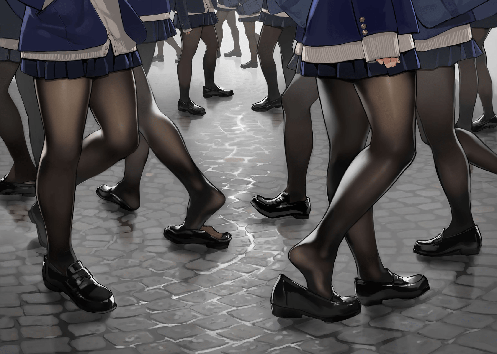
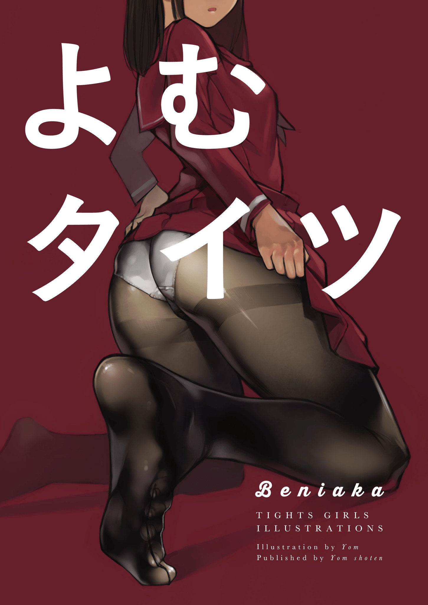

# 個人覺得非常適合腦洞的一張圖

作者：小虎

TID：24105

<title>1</title> <link href="../Styles/Style.css" type="text/css" rel="stylesheet">

# 1

illust_id=65037870
<ignore_js_op>

**65037870_p0.jpg** *(296.27 KB, 下載次數: 1)*

[下載附件](forum.php?mod=attachment&aid=Njk5NzF8NzM3MmIwZDF8MTY3NDA2NzI4MHwxODIzMHwyNDEwNQ%3D%3D&nothumb=yes)

2017-12-6 14:52 上傳

<title>2</title> <link href="../Styles/Style.css" type="text/css" rel="stylesheet">

# 2

好多JK 好多腿
興奮
好想被丟到學生鞋裡被踩
 <title>3</title> <link href="../Styles/Style.css" type="text/css" rel="stylesheet">

# 3

足控的本子很多的，有些视角相当给力，脑补脑补就很开心 <title>4</title> <link href="../Styles/Style.css" type="text/css" rel="stylesheet">

# 4

*本帖最後由 無邊落木 於 2017-12-6 21:09 編輯*

這張圖的畫師[size=51.213px]よむ專畫黑絲，
最近在秋葉原有開個展，到12月11日

個人畫冊:
<ignore_js_op>

**IMG_20171206_205706.jpg** *(171.01 KB, 下載次數: 0)*

[下載附件](forum.php?mod=attachment&aid=Njk5NzR8NmUyMzM1MDh8MTY3NDA2NzI4MHwxODIzMHwyNDEwNQ%3D%3D&nothumb=yes)

2017-12-6 21:05 上傳

展覽資訊:
============
「よむイラスト展」を開催することになりました！
イラスト展示はもちろん、複製原画やグッズの販売もいたします！

12月1日(金)～11日(月) 10：00～22：00
会場／とらのあな秋葉原店A 3階
入場／無料
============

詳情見[https://news.toranoana.jp/27603](https://news.toranoana.jp/27603)
有在日本的同好可以去看看~ 

<title>5</title> <link href="../Styles/Style.css" type="text/css" rel="stylesheet">

# 5

哇，看起来感觉贼过瘾，浮想联翩</ignore_js_op></ignore_js_op>