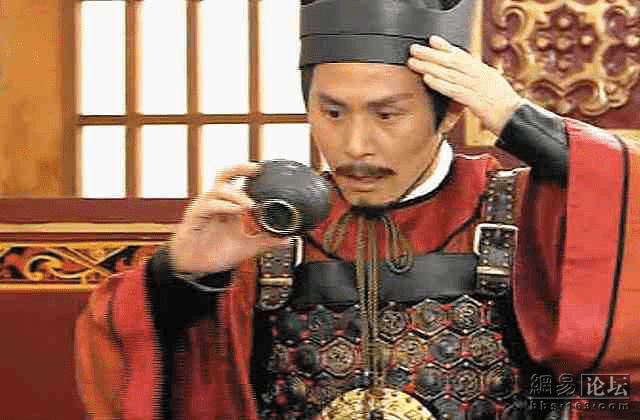
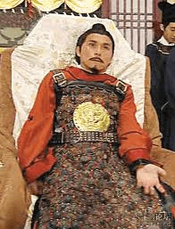
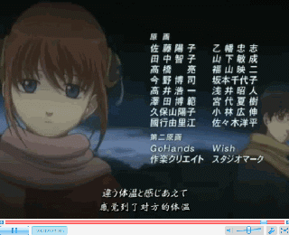

# 假如有一次重生，你会？

作者：yuchen

TID：10474

<title>1</title> <link href="../Styles/Style.css" type="text/css" rel="stylesheet">

# 1

假设你有一天遇到一个疯狂博士，他能让你重生，他有两种药水，变成两种人，你会选择：
1.变成巨大少女的药水，然后全身充满复仇的力量... （之后的自己想象吧 呵呵）
2.变成渺小男生的药水，然后任由人踩踏你... （还是需要自己幻想一下 呵呵）
3.其他 （我在此就想不出了）

如果是我，我会愿意当一个渺小男生的...  在高跟下，受她的踩踏...             <title>2</title> <link href="../Styles/Style.css" type="text/css" rel="stylesheet">

# 2

是我的话，比较会选变成巨大少女。 <title>3</title> <link href="../Styles/Style.css" type="text/css" rel="stylesheet">

# 3

.
哇，我還以為我看錯了！這不是雨辰大嗎？

幾年不見你出現了，歡迎回來！ <title>4</title> <link href="../Styles/Style.css" type="text/css" rel="stylesheet">

# 4

啊，那個，變成巨大少女的話，總覺得性別轉換這種事很難適應啊……
變成縮小男的話……求續關次數……

PS：不明真相的後生過來膜拜2L前輩。 <title>5</title> <link href="../Styles/Style.css" type="text/css" rel="stylesheet">

# 5

在下是来看宝月茜的……在下自重

楼主的问题非常那啥，在下活得好好的干嘛要重生……
不过既然是药水，何必对自己用呢？果断把妹子变成GTS啊 <title>6</title> <link href="../Styles/Style.css" type="text/css" rel="stylesheet">

# 6

其实我想说，
不是只有两种药水么，
怎么还有3？
难道可以混合使用？
。。。。。。
如果这药水变质那就不好了，
所以果断放在给E爷的茶里让他喝掉 <title>7</title> <link href="../Styles/Style.css" type="text/css" rel="stylesheet">

# 7

「那些茶......有毒!」 <title>8</title> <link href="../Styles/Style.css" type="text/css" rel="stylesheet">

# 8

 <ignore_js_op>[45.jpg](forum.php?mod=attachment&aid=MjUwMjV8NTcxNGViZTh8MTY3NDA2ODc2OXwxODIzMHwxMDQ3NA%3D%3D&nothumb=yes) *(39.6 KB, 下載次數: 0)*

[下載附件](forum.php?mod=attachment&aid=MjUwMjV8NTcxNGViZTh8MTY3NDA2ODc2OXwxODIzMHwxMDQ3NA%3D%3D&nothumb=yes)

2011-6-26 21:45 上傳  

那些茶......有毒!

</ignore_js_op>  <ignore_js_op>[images.jpg](forum.php?mod=attachment&aid=MjUwMjZ8MGMyMmNlNjl8MTY3NDA2ODc2OXwxODIzMHwxMDQ3NA%3D%3D&nothumb=yes) *(13.49 KB, 下載次數: 0)*

[下載附件](forum.php?mod=attachment&aid=MjUwMjZ8MGMyMmNlNjl8MTY3NDA2ODc2OXwxODIzMHwxMDQ3NA%3D%3D&nothumb=yes)

2011-6-26 21:45 上傳  

「我中毒了」

</ignore_js_op> <title>9</title> <link href="../Styles/Style.css" type="text/css" rel="stylesheet">

# 9

我选1,之后自己幻想去....... <title>10</title> <link href="../Styles/Style.css" type="text/css" rel="stylesheet">

# 10

> 原帖由 *eventually* 於 2011-6-26 21:09 發表 
> 在下是来看宝月茜的……在下自重
> 
> 楼主的问题非常那啥，在下活得好好的干嘛要重生……
> 不过既然是药水，何必对自己用呢？果断把妹子变成G ...

妹子用了性別轉換變成GT…… <title>11</title> <link href="../Styles/Style.css" type="text/css" rel="stylesheet">

# 11

-w-既然大家都围观那就一起围观吧~（纯跟风
另外~重生的机会的话……不想当个胖次之神或者黄瓜之神神马的吗？
ps.
wt桑的图文并茂吐槽……实在是太喜感了！！！ <title>12</title> <link href="../Styles/Style.css" type="text/css" rel="stylesheet">

# 12

看来得先果断做掉狂草兄……不，不能下药，什么性转换巨大狂草实在太那啥了！还是果断用剑解决问题……未来永劫斩！

wtman兄神应景啊！乃的图库也太大了吧~ <title>13</title> <link href="../Styles/Style.css" type="text/css" rel="stylesheet">

# 13

> 原帖由 *Dante* 於 2011-6-26 06:46 發表 
> .
> 哇，我還以為我看錯了！這不是雨辰大嗎？
> 
> 幾年不見你出現了，歡迎回來！

歐買尬XD <title>14</title> <link href="../Styles/Style.css" type="text/css" rel="stylesheet">

# 14

這個問題應該往變物發展比較有變化性顆顆

把自己變GTS太糟糕了
因為人肉很難吃

[ *本帖最後由 路人丁丁 於 2011-6-27 00:16 編輯* ] <title>15</title> <link href="../Styles/Style.css" type="text/css" rel="stylesheet">

# 15

我不要转生 我宁愿作为幽灵徘徊在现世 顺便各种附体…… <title>16</title> <link href="../Styles/Style.css" type="text/css" rel="stylesheet">

# 16

就变成从高处掉下来摔不死就行- -|||
或者被RPG炸飞之后拍拍土就站起来走了那种..... <title>17</title> <link href="../Styles/Style.css" type="text/css" rel="stylesheet">

# 17

我会算好生辰八字挑个最好的日子重生 <title>18</title> <link href="../Styles/Style.css" type="text/css" rel="stylesheet">

# 18

选三，完成主公的遗憾，变成主公为之夺得天下，一扫寰宇 <title>19</title> <link href="../Styles/Style.css" type="text/css" rel="stylesheet">

# 19

你們都被騙了
要是這藥真管用的話那博士自己就喝了啊,難道還會給你們嗎 <title>20</title> <link href="../Styles/Style.css" type="text/css" rel="stylesheet">

# 20

然後乃斬斷了狂草的左手，變成「左手」狂草和「右手」狂草兩個個體。

變性巨大化，我要!只要可以變成美女的話，我會要巨大化。 <title>21</title> <link href="../Styles/Style.css" type="text/css" rel="stylesheet">

# 21

看成【公主】的默默路过……
我神马都不知道…… <title>22</title> <link href="../Styles/Style.css" type="text/css" rel="stylesheet">

# 22

> 原帖由 *Dante* 於 2011-6-26 20:46 發表 
> .
> 哇，我還以為我看錯了！這不是雨辰大嗎？
> 
> 幾年不見你出現了，歡迎回來！

多謝但丁大大及各位同好記掛，回到這裡，感覺真好:)
還要再謝謝但丁大大這麼多年來寶貝一樣的為我們大家守住這塊陣地~

[ *本帖最後由 yuchen 於 2011-7-1 21:59 編輯* ] <title>23</title> <link href="../Styles/Style.css" type="text/css" rel="stylesheet">

# 23

 在重生两边 不久又了 <title>24</title> <link href="../Styles/Style.css" type="text/css" rel="stylesheet">

# 24

自然想变成渺小的男生，不过生命力要强，不然。。。。。。 <title>25</title> <link href="../Styles/Style.css" type="text/css" rel="stylesheet">

# 25

啊啊，等有了能进三次元的药水再说
<ignore_js_op>

**444.gif** *(473.49 KB, 下載次數: 0)*

[下載附件](forum.php?mod=attachment&aid=MjU0MTF8MzA0NGVlZjB8MTY3NDA2ODc3MnwxODIzMHwxMDQ3NA%3D%3D&nothumb=yes)

2011-7-13 20:32 上傳

混到醋海带里？
根据银魂的剧情大概持续一集就恢复了
啊啊，有一集就行了
最好和宅十四一样来个再现 <title>26</title> <link href="../Styles/Style.css" type="text/css" rel="stylesheet">

# 26

我在想要是变成渺小男的话，女GTS能对我言听计从就好了。要不然估计死都不知道咋死的。要是还没等你享受呢，就被顺脚KO。很纠结啊 <title>27</title> <link href="../Styles/Style.css" type="text/css" rel="stylesheet">

# 27

表示很感谢各位的捧场 <title>28</title> <link href="../Styles/Style.css" type="text/css" rel="stylesheet">

# 28

 巨大女吧，这个我喜欢撒</ignore_js_op>