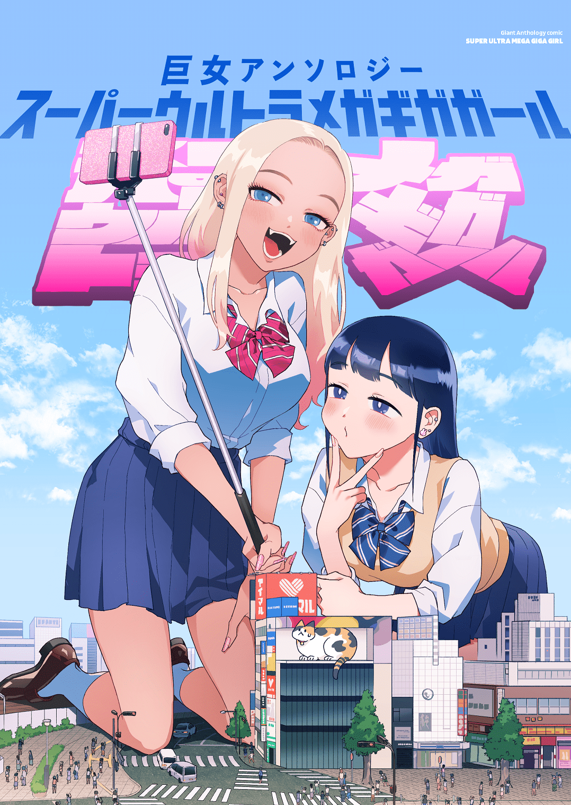
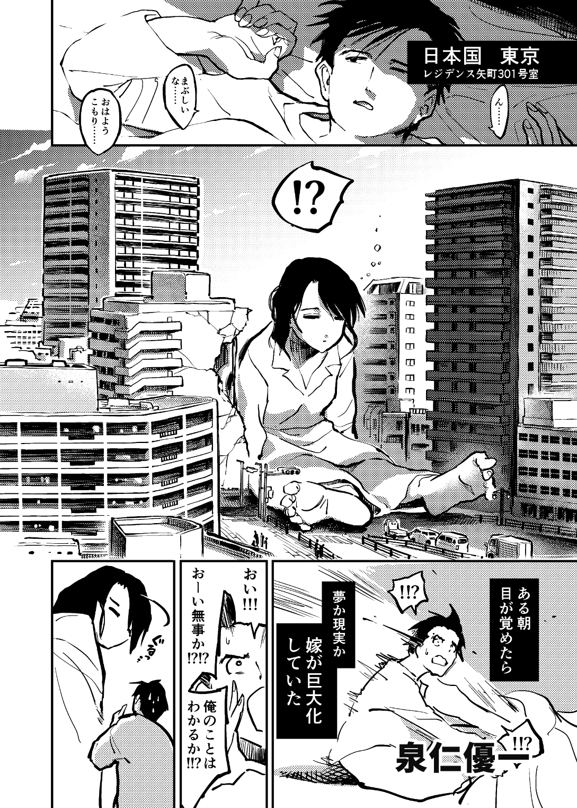
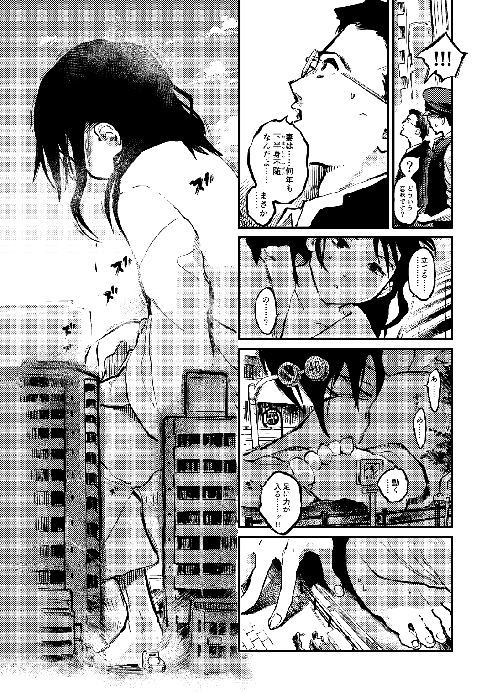

# 偶然的灵感，从另一个角度刻画巨大娘

作者：a1236gh

TID：34736

<title>1</title> <link href="../Styles/Style.css" type="text/css" rel="stylesheet">

# 1

巨女アンソロジー这本是2021年就出的，结果直到去年半载时才搜到，因为简介上根本没加#巨大娘的标签
简介可见此：[https://www.pixiv.net/artworks/94295655](https://www.pixiv.net/artworks/94295655)

<ignore_js_op>

**94295655_p0.png** *(1.96 MB, 下載次數: 0)*

[下載附件](forum.php?mod=attachment&aid=MTAxNDY2fDBiNGUwY2Y0fDE2NzQwNjUwMTZ8MTgyMzB8MzQ3MzY%3D&nothumb=yes)

2023-1-8 07:43 上傳

单纯因为好奇翻了下简介，这一本是由好几个不同作者的短篇合起来的，参与的作者也基本都是些从未听过的人，结果翻到最后一个篇章的时候就突然有兴致了：

<ignore_js_op>

**94295655_p29.png** *(775.95 KB, 下載次數: 0)*

[下載附件](forum.php?mod=attachment&aid=MTAxNDY3fDFhMDA4YTQxfDE2NzQwNjUwMTZ8MTgyMzB8MzQ3MzY%3D&nothumb=yes)

2023-1-8 07:48 上傳

<ignore_js_op>

**94295655_p30.png** *(959.91 KB, 下載次數: 0)*

[下載附件](forum.php?mod=attachment&aid=MTAxNDY4fDg1N2Q4OTUzfDE2NzQwNjUwMTZ8MTgyMzB8MzQ3MzY%3D&nothumb=yes)

2023-1-8 07:48 上傳

大体就是某家庭主妇因不明原因巨大化，光看这一点倒也没什么。真正吸引人的设定是她原来是下半身瘫痪，结果巨大化以后双腿又能动了。接下来按照一般发展应该就是讲怎么在已经多年未站起来的情况下做康复训练，同时还不造成不造成巨大破坏。

因为实在耐不住好奇于是就入手了。结果入手以后才发现，虽然一本里的故事很多，但毕竟都不是人气作者，画风实在有些不经看，很多故事都是寥寥几页就收尾，没头没尾的就结束了，全本除了少有的一两个特写外也基本没什么福利，毕竟不是那种本子。就连最后给予厚望的那篇最后也没有按想看的发展走，后半段突然就超展开了，而且最后的几页人物背景都画的潦草无比，就像突然赶工似的。总的来说那个性价比实在不推荐买

虽然没看到想看的，但如之前所说，那个创意依然值得点赞，感觉提供了一种新的创作思路。以往看过的作品里面人物变成巨大娘以后就立刻无视一切攻击，获得各种逆天buff加持以及自带全知全能，几乎从来没看过有哪些作品是着重描写成为巨大娘以后的障碍的，感觉有很大的挖掘空间，比如写写变大后生活上的各种不便，或者变大后身体上的残疾都消失了却还要慢慢适应没有残疾的身体，或者是即使变大了原来身体上的不便却没有消失该怎么办等等。

当然绝大部分圈子里的人肯定还是更愿意看爽文一类的作品的，这也只是提供个创作思路，让一个题材类型更丰富一些也不是坏事。就像现在的异世界题材番一样，看惯了各种龙傲天拯救世界之后，偶尔也愿意看看《从零开始》或《蜘蛛子》这类地狱难度开局的找找新鲜感。毕竟说到底，多元化才是任何一个圈子得以长期发展的支柱。
<title>2</title> <link href="../Styles/Style.css" type="text/css" rel="stylesheet">

# 2

下肢瘫痪然后变形之后恢复，这好像阿凡达的剧本啊。感觉很有意思一个漫画，感谢楼主分享了~ <title>3</title> <link href="../Styles/Style.css" type="text/css" rel="stylesheet">

# 3

其实（我的小小奇迹）也给我这种感觉，这个作品的前几部目前是讲述6个女子高中生和自己的小人从宠物玩具到爱人的故事，非常有新鲜感，在DA上免费连载。爽文确实必不可少，但是是太泛滥后你记不住人物或者一些作者就根本不给人物名字这样的文章在阈值提高了之后很多都是过目就忘，无论是写文章还是做游戏能让人记住的就是个性的人物和精彩的情节。 <title>4</title> <link href="../Styles/Style.css" type="text/css" rel="stylesheet">

# 4

前年刚出的时候就买了一本，里面故事蛮有意思的
没有色色，这种从另一个角度看巨娘是蛮有趣的，更多的是日常感吧 <title>5</title> <link href="../Styles/Style.css" type="text/css" rel="stylesheet">

# 5

这种设定听起来也确实有点意思 <title>6</title> <link href="../Styles/Style.css" type="text/css" rel="stylesheet">

# 6

这本我记得都是找的圈外的，在进行商业创作的专业漫画家创作的（比如封面作者就是京都精华大学漫画学科教授宇岛叶先生）。大概是想仿照类似《黑之十三》那样的模式请圈外人来尝试，看能不能开发出不同于经典创作内容的新的内容与方向。不过相比《黑之十三》那样圈外人仅提供灵异故事，这次的创作是全权委派给圈外漫画家的。本身大部分作者对gts属性都算是素人，况且作为职业漫画家也习惯于顾虑很多方面的事情。因此就内容来看，结果不尽如人意也是正常。倒不如说或许这本最大的意义，就在于像楼主这样以圈内的视角做总结，并且开发新的创作灵感与方向。
至于因意外事故或者其他被动原因巨大化之后遇到的问题，最经典的就是会被军政部门找上门抓走搞研究（美漫经典剧情），或者是被暴露到公众面前之后很难回复到平静的日常生活中（比如已完结漫画系列《ちっちゃい島のでっかいガール》）。在许多经典创作内容与技巧已然相当成熟的今天，这或许确是一个新的思路。 <title>7</title> <link href="../Styles/Style.css" type="text/css" rel="stylesheet">

# 7

以前看过一篇日语文章，讲的是一个有恐高症的女孩子突然巨大化后从各种不适应到最后克服恐高开始享受的故事，挺好看的，可惜我忘了作者是谁了。</ignore_js_op></ignore_js_op></ignore_js_op>