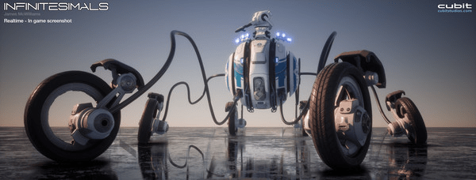
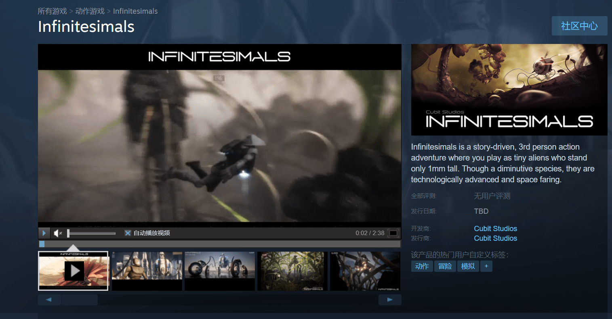
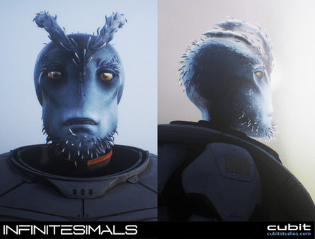
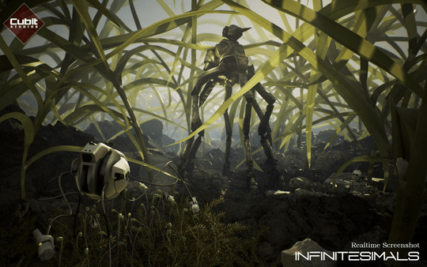

# 偶然看到的游戏（Infinitesimals）（微小的高科技外星人）

作者：St2019

TID：28811

<title>1</title> <link href="../Styles/Style.css" type="text/css" rel="stylesheet">

# 1

今天偶然看到的一个steam上的游戏。
大致是一个有剧情的第三人称动作冒险类游戏。设定上玩家是一种体型微小（1mm）但拥有高科技的外星生物。
目前其他信息一律不明确，甚至会不会出现人类都不知道。。。

<title>2</title> <link href="../Styles/Style.css" type="text/css" rel="stylesheet">

# 2

 <ignore_js_op>[ss_3b43796f70f068a269228b01151ccaf943863fb2.600x338.jpg](forum.php?mod=attachment&aid=ODMyMTV8MjJlM2M4ZmV8MTY3NDA2NjQzMnwxODIzMHwyODgxMQ%3D%3D&nothumb=yes) *(57.66 KB, 下載次數: 3)*

[下載附件](forum.php?mod=attachment&aid=ODMyMTV8MjJlM2M4ZmV8MTY3NDA2NjQzMnwxODIzMHwyODgxMQ%3D%3D&nothumb=yes)

2020-6-2 08:01 上傳  

</ignore_js_op> <ignore_js_op>[捕获.PNG](forum.php?mod=attachment&aid=ODMyMTJ8YjE0NDFlZWV8MTY3NDA2NjQzMnwxODIzMHwyODgxMQ%3D%3D&nothumb=yes) *(1.2 MB, 下載次數: 4)*

[下載附件](forum.php?mod=attachment&aid=ODMyMTJ8YjE0NDFlZWV8MTY3NDA2NjQzMnwxODIzMHwyODgxMQ%3D%3D&nothumb=yes)

2020-6-2 08:01 上傳  

</ignore_js_op> <ignore_js_op>[ss_473668072e080e8a91082d7fad98c66ba0c81501.600x338.jpg](forum.php?mod=attachment&aid=ODMyMTN8OTZmNzI5ZGZ8MTY3NDA2NjQzMnwxODIzMHwyODgxMQ%3D%3D&nothumb=yes) *(57.54 KB, 下載次數: 4)*

[下載附件](forum.php?mod=attachment&aid=ODMyMTN8OTZmNzI5ZGZ8MTY3NDA2NjQzMnwxODIzMHwyODgxMQ%3D%3D&nothumb=yes)

2020-6-2 08:01 上傳  

</ignore_js_op> <ignore_js_op>[ss_36f62c7f3784e2fd757902cb3345771a1e04dea4.600x338.jpg](forum.php?mod=attachment&aid=ODMyMTR8ZGI4ZmNkZTB8MTY3NDA2NjQzMnwxODIzMHwyODgxMQ%3D%3D&nothumb=yes) *(98.15 KB, 下載次數: 4)*

[下載附件](forum.php?mod=attachment&aid=ODMyMTR8ZGI4ZmNkZTB8MTY3NDA2NjQzMnwxODIzMHwyODgxMQ%3D%3D&nothumb=yes)

2020-6-2 08:01 上傳  

</ignore_js_op> <title>3</title> <link href="../Styles/Style.css" type="text/css" rel="stylesheet">

# 3

刚刚看了一下宣传视频，内容就是迷你外星人使用高科技，与巨大的植物和巨大的昆虫（例如苍蝇），没有看见巨大的人类这一要素，估计以后也不太可能有，如果后期开发商开通创意工坊那么出现GTS要素就是妥妥的。 <title>4</title> <link href="../Styles/Style.css" type="text/css" rel="stylesheet">

# 4

大噶还行？0                     <title>5</title> <link href="../Styles/Style.css" type="text/css" rel="stylesheet">

# 5

> HAISE 發表於 2020-6-2 10:13
> 刚刚看了一下宣传视频，内容就是迷你外星人使用高科技，与巨大的植物和巨大的昆虫（例如苍蝇），没有看见巨 ...

我觉得不太可能，做游戏很难的，要在这些模组中弄一个可以活动的比植物和昆虫巨大太多倍的女性人类实在是非常困难的。不光巨大的女性人类，甚至还有包括房间马路家具这些麻烦的东西。