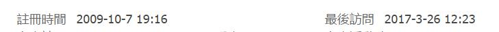

# 偶然瞄到，才發現原來已經10年了

作者：s21117307

TID：22803

<title>1</title> <link href="../Styles/Style.css" type="text/css" rel="stylesheet">

# 1

如附圖，我還是一事無成 <title>2</title> <link href="../Styles/Style.css" type="text/css" rel="stylesheet">

# 2

 <ignore_js_op>[741.png](forum.php?mod=attachment&aid=NjczNzZ8MTEzZGM0ZTF8MTY3NDA2NzY4M3wxODIzMHwyMjgwMw%3D%3D&nothumb=yes) *(1.37 KB, 下載次數: 10)*

[下載附件](forum.php?mod=attachment&aid=NjczNzZ8MTEzZGM0ZTF8MTY3NDA2NzY4M3wxODIzMHwyMjgwMw%3D%3D&nothumb=yes)

2017-3-24 00:41 上傳  

</ignore_js_op> <title>3</title> <link href="../Styles/Style.css" type="text/css" rel="stylesheet">

# 3

这么多年能运营下来，真的挺不容易的。10年对于人的一辈子来说真的是不短了。

我记得前两年还闹过服务器经费的危机，虽然作为一个路人并不太了解实情不过在得知问题解决后也算是松了一口气。

前一阵17年刚到的时候也发了类似的帖子一顿感慨。不过貌似秒沉了233  

隔壁最一开始的女神论坛，没几年就没了我记得……后来也出了一些论坛，不过依然觉得这里算是最根深的发源地了。虽然没怎么去过别的地方，但是依然觉得这应该没说错。

现在依稀能看到不少以前的老人，不过更多的还是不怎么来了，毕竟很多人都年岁不小了。

话说我好像也一样，10年前宅着，现在依然在宅着。
虽然现在说话很少了，主要业界也本身就不算多产再加冷门特殊性癖，能有这么多人已经算是很意外了。

想想以前小时候用着56K猫（还按分钟计费拨号的年代）上网搜索“女巨人”这种生硬的关键字来搜索，现在想想也只剩下感慨了。

<title>4</title> <link href="../Styles/Style.css" type="text/css" rel="stylesheet">

# 4

虽然没有07年两位大佬那么久，但我看看我自己也8年了，也不短了

还记得那时候偷偷摸摸注册GN，第一个账号不知道为什么用不了，难过了很久
一开始的新手区我印象真的尤其深刻，并不是那么勤奋创作的我看了很多很多文章，然后学着发了一些帖子，现在看回去，真的是很嫩的自己

然后慢慢认识了很多人，开始从一个新人到能跟一些大佬说得上话，说实在的也算很开心，虽然很多时候都是看着大佬们在谈论一些很高深的东西在一旁瑟瑟发抖（笑

再到了现在，偶尔在群里面说一下话，也没觉得有多少人会认出我的ID了，上GN看文章+管理，总感觉也有点不那么激动了，
明明以前是那样的，但现在上GN也成为了习惯，
心里面知道，不可能说一辈子都会上GN，但在现在来说，总是很快乐的
毕竟是giantess“night”，夜晚总有结束的时候，但快乐过就好
（想起以前每次浏览完GN就会清理历史记录，为了记住网址特地背了下来，到现在每次看到有人求网址我就想笑，他们是不会懂真的有英文不好的人特地去背这样当时还不太懂的域名的啦 <title>5</title> <link href="../Styles/Style.css" type="text/css" rel="stylesheet">

# 5

说来10年也有我一份啊，中间虽然很久没上过 <title>6</title> <link href="../Styles/Style.css" type="text/css" rel="stylesheet">

# 6

> [michael 發表於 2017-3-24 06:58](https://giantessnight.cf/gnforum2012/forum.php?mod=redirect&goto=findpost&pid=327046&ptid=22803)
> 这么多年能运营下来，真的挺不容易的。10年对于人的一辈子来说真的是不短了。
> 
> 我记得前两年还闹过服务器经 ...

懵懵懂懂的搜索gts到但大的文章，再到这个论坛，不禁要感叹初中生的我真的是强
另外我发帖的主要目的：dalao你的剑与魔法我还等着呢~
<title>7</title> <link href="../Styles/Style.css" type="text/css" rel="stylesheet">

# 7

我已經忘記當初是怎麼來到這裡的

只知道曾經被趕出GN直到2014年才回歸 <title>8</title> <link href="../Styles/Style.css" type="text/css" rel="stylesheet">

# 8

可...可惡，輸了，只來五年
不過圈子真的成長不少，不知道下一個縮小學園等級的作品甚麼時候會被創造出來 <title>9</title> <link href="../Styles/Style.css" type="text/css" rel="stylesheet">

# 9

貌似我也是07年的 <title>10</title> <link href="../Styles/Style.css" type="text/css" rel="stylesheet">

# 10

06年逐渐学会上网搜相关资源，当时不知道gts，只知道女巨人，只能搜到姚德芬之类的_(:з」∠)_，后来知道gts，找到gts吧，正好碰见红唇狩猎场撕逼现场，当年还是萌新，啥也不懂，期间还找到过一漫画网站，好像叫啥gtsfun之类的。当时还有个garden，每个星期都盼着更新，盼着盼着就没了， youtube也没被墙，国内资源还没有和谐，国内看完就上YouTube。后来09年知道gn，看到的第一眼是漫画，大概讲两个班级比拼谁的gts更大更性感，现在咋找也找不到。然后好不容易等个帐号注册开放日，申请个abc1234之类帐号，但竟然给忘了(ノ=Д=)ノ┻━┻。最后在几年前又注册个帐号，直到现在 <title>11</title> <link href="../Styles/Style.css" type="text/css" rel="stylesheet">

# 11

有請但丁出來發表感言
yahoo時代就在的還剩幾個人呢 <title>12</title> <link href="../Styles/Style.css" type="text/css" rel="stylesheet">

# 12

雅虎社区的时候就关注了，然后是V姐的网站，到论坛成立，改版，再直到现在………感慨无限啊。 <title>13</title> <link href="../Styles/Style.css" type="text/css" rel="stylesheet">

# 13

我才两年哇，萌新qwq…… <title>14</title> <link href="../Styles/Style.css" type="text/css" rel="stylesheet">

# 14

小虎比我慢一天,哈哈

*   註冊時間2007-3-23 15:20

<title>15</title> <link href="../Styles/Style.css" type="text/css" rel="stylesheet">

# 15

> [Feuillage 發表於 2017-3-24 12:42](https://giantessnight.cf/gnforum2012/forum.php?mod=redirect&goto=findpost&pid=327060&ptid=22803)
> 有請但丁出來發表感言
> yahoo時代就在的還剩幾個人呢

當時我創家族沒什麼經營還被V姊上來罵過．．．
<title>16</title> <link href="../Styles/Style.css" type="text/css" rel="stylesheet">

# 16

10年前都忘了為什麼，大概是看丁叔世界摸瓜順滕爬GN，那時還在實行限制註冊(還有文字獄)，不過不是重要事所以剛好遇到就登陸GN。
不過9年了來還是一事成，也沒有貢獻（反正不會成功(･ω･)
雖然有想過作文，但就那樣還是放棄。也做過MMD，也推廣MMD教程，但也是該放棄。妄想就好了，不做更舒服。
每天都有新主題，硬扳不出回覆，沒有想參與的話題，就這樣子所以現在還有高級會員。 <title>17</title> <link href="../Styles/Style.css" type="text/css" rel="stylesheet">

# 17

炸出一群老司机，以前论坛对简体还没那么友好 <title>18</title> <link href="../Styles/Style.css" type="text/css" rel="stylesheet">

# 18

不由也看了看自己的注册时间，对这总是有模糊的记忆。到现在也有八年的时间，始终有着恍如昨日的感觉，一直以为自己注册的时间还要更早。文笔最好，天马行空的时候遇上了紧迫的学业；自我的时间充足时，又将其献给了工作的历练。现在与其说是为了自己的冲动，倒不如说已经是种习惯了 <title>19</title> <link href="../Styles/Style.css" type="text/css" rel="stylesheet">

# 19

小的才來沒多久....好像快五年了.........
這裡好多大老阿....(跪
<title>20</title> <link href="../Styles/Style.css" type="text/css" rel="stylesheet">

# 20

以前小时候也会幻想 那是和妹子玩过家家还哄过她们玩假如你变成女巨人的其情节 后来有一天在网上看到一张小人被踩在鞋里的图一时兴起 就慢慢的摸索到了贴吧 然后到论坛 想想这么多年就这么过来了 <title>21</title> <link href="../Styles/Style.css" type="text/css" rel="stylesheet">

# 21

10年前我才刚入社会啊。。。现在已经是大叔了 <title>22</title> <link href="../Styles/Style.css" type="text/css" rel="stylesheet">

# 22

我看看我                            <title>23</title> <link href="../Styles/Style.css" type="text/css" rel="stylesheet">

# 23

*本帖最後由 coverle 於 2017-3-24 21:51 編輯*

原來已經十年了, 從大學啟蒙到現在, 從奇摩家族一直到今天的論壇, 這之間有太多太多回憶, 包含第一次緊張的跟但大面交合購品, 當時還有人辦網聚, 但很可惜地沒參與到.
十年如一日, 每天晚上下班後第一件事情就是打開論壇, 當年但大的 EOE 可是轟動整個 GTS 圈...下一個十年仍然會是這樣子吧
<title>24</title> <link href="../Styles/Style.css" type="text/css" rel="stylesheet">

# 24

老實說現在留言總覺得很心虛(毆

從家族走到現在.從高中到出社會6-7年.
當時因為偶然在全國電子看到性感女巨人這片子而上網辜狗.才發現原來也有其他人喜歡女巨人這屬性
(那個時候真的天真的以為這世界上只有自己會喜歡這種屬性
才一頭鑽進這圈子裡.雖然加入很久但老實說自己跟其他大佬比來什麼都不會.本身對GTS也沒有太高或太深遠的想法.就連ACG這類話題感覺也跟其他人聊不太起來(本身就是孤癖兒
前陣子因為一些因素浮上來.不過馬上又被其他興趣牽著鼻子走.又回復潛水夫的身份了
不過不變的是每天配菜妄想的依舊是女巨人色色場面這一點吧.只有這個始終如一(好髒 <title>25</title> <link href="../Styles/Style.css" type="text/css" rel="stylesheet">

# 25

盲狙一下，佐祐理的注册时间应该是在09-10之间…… <title>26</title> <link href="../Styles/Style.css" type="text/css" rel="stylesheet">

# 26

等到七月十年的时候我也要发帖纪念一下~~~ <title>27</title> <link href="../Styles/Style.css" type="text/css" rel="stylesheet">

# 27

*本帖最後由 447825856 於 2017-3-24 22:54 編輯*

啊，我也来了第八年了，想想我顶着秦受这个名号也已经八年了，然而我还和八年前一个鸟样，或者说还不如从前了，以前偶尔还写写文，现在除了灌水瞎扯淡啥也不会了 <title>28</title> <link href="../Styles/Style.css" type="text/css" rel="stylesheet">

# 28

不久前被論壇裡的人叫社畜，才驚覺已經是這個年歲了。
原本擔心這個年歲還每年衝動漫展的我，是否老到不應該在巨大娘領域徘徊，該去討個老婆之類的，今而看看前輩的發言，哈哈，釋懷啦!(不)

雖然不久前，十年收藏全被勒索病毒奪去，不過我也因此領悟了巨大娘的奧義!....真正的巨大娘控是完全可以靠虛空腦補滿足的啊...!

其實也沒什麼，阿Q的解決辦法而已。

有時間還是希望能再多產點圖，娛樂自己也娛樂大家!

<title>29</title> <link href="../Styles/Style.css" type="text/css" rel="stylesheet">

# 29

发个帖给大家看看我有多老 <title>30</title> <link href="../Styles/Style.css" type="text/css" rel="stylesheet">

# 30

不对，以前这里的前身，雅虎的某个群我也是老会员了，不过脸密码都忘了 <title>31</title> <link href="../Styles/Style.css" type="text/css" rel="stylesheet">

# 31

天阿 這篇釣出一堆老人XD

論壇成立也要滿10年了
從第一次接觸是國中時期的雅虎家族(boysgts創的)，到現在已經是個結了婚的大叔了(煙)

之後有v姐的家族，最後交由但大管理，再來就是但大成立了首個gts論壇，那時還是限制會員的 ＝ ＝
那時很難過沒辦法加入XDD 直到第二代論壇才開放加入~

參加了團購影片、跟但大面交、去台大擺攤、板聚等等～超豐富的XD

<title>32</title> <link href="../Styles/Style.css" type="text/css" rel="stylesheet">

# 32

差兩個禮拜也滿10年了
老實說還真感覺不出來有這麼久了 <title>33</title> <link href="../Styles/Style.css" type="text/css" rel="stylesheet">

# 33

记得是09年吧 看一下. 唉 时间都去哪了 <title>34</title> <link href="../Styles/Style.css" type="text/css" rel="stylesheet">

# 34

额，真的10年了，真的不容易呀，祝大家家庭幸福，生活美满，事业有成 <title>35</title> <link href="../Styles/Style.css" type="text/css" rel="stylesheet">

# 35

> [lovegts 發表於 2017-3-24 23:17](https://giantessnight.cf/gnforum2012/forum.php?mod=redirect&goto=findpost&pid=327117&ptid=22803)
> 天阿 這篇釣出一堆老人XD
> 
> 論壇成立也要滿10年了

我還記得當時論壇成立我們兩個一直PO小人國的照片，哈哈
當時還誘拐我那時候的女友去小人國拍過照
後來去了一趟大陸廣東一年多，後來又回到台灣
回台也快六年了，時光沖沖...老了
<title>36</title> <link href="../Styles/Style.css" type="text/css" rel="stylesheet">

# 36

> [dajiangjiang 發表於 2017-3-24 08:33](https://giantessnight.cf/gnforum2012/forum.php?mod=redirect&goto=findpost&pid=327051&ptid=22803)
> 懵懵懂懂的搜索gts到但大的文章，再到这个论坛，不禁要感叹初中生的我真的是强
> 另外我发帖的主要 ...

你不提這名字，我早就忘了……本來我就不是什麽寫手，文章就寫過一篇還是無聊蛋疼的。以前斷斷續續更新過，然後就坑了。後來好像有過念頭去寫（記憶中好像有想過），但是怎麽說呢，你也知道的，雖然這些年一直在宅，但是年紀大了，文筆和感覺就撤底變味了，怎麽都寫不出以前青澀和雛鳥的感覺了。再加上我也不是寫手，不像其他人那洋寫很多，說實話現在看都覺得就是10來歲小孩寫的幼稚文罷了，但是我覺得過個好多年，再去以另一種風格把坑填了才是一件更蛋疼的事吧，作者本人可能還好，讀者都會覺得蛋疼。所以說，就那樣坑著吧。大家都忘了比較好

而且還有就是以前的我也好，現在的我也罷，也就看看日文的文章，喜歡的也就是幾個作者的。平時文章區一年點不進去10次的我現在只想說，你記性也真是夠好的……

當然也有一個我自己想起來都很現實的可能性：我本身存在感就比較路人，旁人看我姑且又算老人，但是又不知道這人存在感，所以絞盡腦汁才想出來，哦對，這家夥好像寫過個什麽文XD

以前我發帖全部都用繁體，論壇也基本都是，然後看最近幾年簡體也不比繁體少，我也就跟著簡體了。個人還是比較入鄉隨俗的，然後最近幾年好像也開始全部間體了，想到這裏我抉定這一帖用繁體好了

<title>37</title> <link href="../Styles/Style.css" type="text/css" rel="stylesheet">

# 37

自己是09年啊，时间过得太快了
从学生成为社畜，一直到现在，网站就这么陪着我们走过了十年的时光
然后挖坑不填的我…………
希望网站以后能有更多新鲜血液进入吧~ <title>38</title> <link href="../Styles/Style.css" type="text/css" rel="stylesheet">

# 38

> [michael 發表於 2017-3-25 12:44](https://giantessnight.cf/gnforum2012/forum.php?mod=redirect&goto=findpost&pid=327159&ptid=22803)
> 你不提這名字，我早就忘了……本來我就不是什麽寫手，文章就寫過一篇還是無聊蛋疼 ...

说到简体繁体不得不提，我接触这个论坛后感觉自己繁体字技能一下觉醒，当时（中学）在ktv里各种小伙伴看不懂的繁体字都能看懂，还真得感谢gn
另外dalao你真的谦虚了，你写的这篇剑与魔法虽然不是我的启蒙作但也确确实实让我着迷了好一阵子，文章内容现在回头想想比较与众不同，有些日系风格的感觉在里面，设定上也不是当时的主流虐杀系，更倾向于服务读者，给了各种杀必死，我当时健全的心理给这文击溃了（赞美）。或许是受到M大这篇文章的影响我现在对gts的嘴唇play也是喜欢的不得了。
个人最喜爱的gts接触部位：缩学副部长启蒙入X ，M大启蒙的嘴唇play，各种地方启蒙的足控（足控蒸鹅心）
弃坑虽然可惜，但但大貌似把文章那帖给锁了，我想回头重温下也看不到呀
<title>39</title> <link href="../Styles/Style.css" type="text/css" rel="stylesheet">

# 39

> [eventually 發表於 2017-3-24 22:27](https://giantessnight.cf/gnforum2012/forum.php?mod=redirect&goto=findpost&pid=327102&ptid=22803)
> 盲狙一下，佐祐理的注册时间应该是在09-10之间……

我也來盲狙一下，我應該是大一(2009)年入的論壇

當時似乎是想來挖Karbo的Felarya漫畫

然後就便成了挖坑不填的R，然後就便成了F島島主，然後再變成了一個潛水員

然後就莫名其妙認識了但大、愛版、pliod、E爺、兔球、劍爺、卡車、草妹、導彈、ACGT(小鹼好像不叫這個)還有一堆我一時之間想不起來的朋友

然後就從劇情黨的鼎盛時期，走到老人紛紛因為各種原因而開始潛水的今天(我說那個懈怠走遠團根本沒有在營運了吧？！可以，這很怠惰)

雖然我知道自己可能又只是說說而已，但是今晚看到這個帖子真的有種情懷大爆發的感覺，要不要再來挖個坑呢......？

對了，在這邊開個世界廣播：但大！說好我跟夏綠蒂CP的文呢？！文呢？！
<title>40</title> <link href="../Styles/Style.css" type="text/css" rel="stylesheet">

# 40

一个帖子炸出好多大佬，都不敢发声了。注册的相当迟，还是贴吧上求本论坛一个大神的数位动画被人坑了，七拐八拐来到了这里。十几年前就有这种倾向，看机器猫的缩小，看探索节目的内窥特别来劲，初中就亲自动手写了一篇GTS文，用的作文本，那时候大陆的电脑系统普遍还是WIN98之类，大屁股机。。。。。 <title>41</title> <link href="../Styles/Style.css" type="text/css" rel="stylesheet">

# 41

<ignore_js_op>

**d.jpg** *(4.94 KB, 下載次數: 0)*

[下載附件](forum.php?mod=attachment&aid=NjczODd8OTlkZTk4YTF8MTY3NDA2NzY4OHwxODIzMHwyMjgwMw%3D%3D&nothumb=yes)

2017-3-26 12:25 上傳

天啦撸,你不说我还真想不起来竟然有这么久了!8年啦!</ignore_js_op>