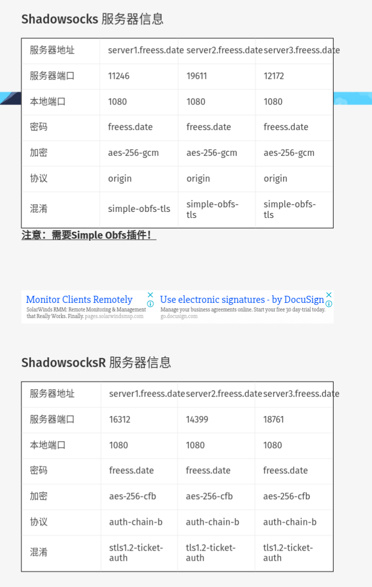

# 免费翻墙服务器分享第二弹

作者：Chtholly

TID：24941

<title>1</title> <link href="../Styles/Style.css" type="text/css" rel="stylesheet">

# 1

*本帖最後由 cheesycheese0uy 於 2018-4-15 22:40 編輯*

上次我心血来潮，分享了一个（即将过期的）服务器供大家使用。各位同好的高素质保证了服务器没有被墙，在现在严格的管制中难得可贵。因此，我决定再分享三个翻墙服务器。
在此我恳求各位继续保持高素质，用完关闭连接，防止被精确识别。
更多关于Shadowsocks的知识可以查看我之前的贴子[https://giantessnight.com/gnforum2012/forum.php?mod=viewthread&tid=24011](https://giantessnight.com/gnforum2012/forum.php?mod=viewthread&tid=24011)
这次增加了ShadowsocksR服务器供大家使用哦！服务器地址可以在[https://freess.date/](https://freess.date/) 看到。
如果翻墙服务器帮助到了你，请你考虑在网站服务器信息页给我的微信赞助。 <title>2</title> <link href="../Styles/Style.css" type="text/css" rel="stylesheet">

# 2

哇，正好自用的SS跑路了，这两天还在找科学上网工具
感谢楼楼的无私分享w <title>3</title> <link href="../Styles/Style.css" type="text/css" rel="stylesheet">

# 3

虽然不会翻墙，但还是顶一下…… <title>4</title> <link href="../Styles/Style.css" type="text/css" rel="stylesheet">

# 4

谢谢柯学家  <title>5</title> <link href="../Styles/Style.css" type="text/css" rel="stylesheet">

# 5

感谢楼主的无私分享，留个名，如有需要可能会来试一试的 <title>6</title> <link href="../Styles/Style.css" type="text/css" rel="stylesheet">

# 6

> Dibdabdu 發表於 2018-4-15 23:57
> 谢谢柯学家

是珂学家哦⊙∀⊙！
下次请注意✧٩(ˊωˋ*)و✧ <title>7</title> <link href="../Styles/Style.css" type="text/css" rel="stylesheet">

# 7

感谢一下吧，虽说我有梯子，不太稳定的那种，不过免费分享翻墙服务器的人还是要感谢的。 <title>8</title> <link href="../Styles/Style.css" type="text/css" rel="stylesheet">

# 8

影梭啊，现在都找不到了。 <title>9</title> <link href="../Styles/Style.css" type="text/css" rel="stylesheet">

# 9

顶一波，希望能帮助到更多的同好 <title>10</title> <link href="../Styles/Style.css" type="text/css" rel="stylesheet">

# 10

十分感谢楼主的善意~ <title>11</title> <link href="../Styles/Style.css" type="text/css" rel="stylesheet">

# 11

> [米莉恩 發表於 2018-4-22 23:40](https://giantessnight.cf/gnforum2012/forum.php?mod=redirect&goto=findpost&pid=370313&ptid=24941)
> 十分感谢楼主的善意~

插件apk下载链接
[https://github.com/shadowsocks/s ... l-nightly-0.0.5.apk](https://github.com/shadowsocks/simple-obfs-android/releases/download/v0.0.5/obfs-local-nightly-0.0.5.apk)
ios下载shadowrocket或者wingy
<title>12</title> <link href="../Styles/Style.css" type="text/css" rel="stylesheet">

# 12

> 有情人成兄妹 發表於 2018-4-23 09:14
> “更多关于Shadowsocks的知识可以查看我之前的贴子https://giantessnight.com/gnforum2012/forum.php?mod ...

很抱歉，插件怎么使用确实没有说。这是我的错，这位同好是无辜的。 <title>13</title> <link href="../Styles/Style.css" type="text/css" rel="stylesheet">

# 13

感谢楼主分享，终于可以上e站了 <title>14</title> <link href="../Styles/Style.css" type="text/css" rel="stylesheet">

# 14

我ssr是20买的一年(･ิϖ･ิ)っ <title>15</title> <link href="../Styles/Style.css" type="text/css" rel="stylesheet">

# 15

我用一个叫天麟的Vpn，虽然偶尔不好用，广告还特别多，但是能连上，也是免费的。 <title>16</title> <link href="../Styles/Style.css" type="text/css" rel="stylesheet">

# 16

太感谢楼主了，好人平安哇 <title>17</title> <link href="../Styles/Style.css" type="text/css" rel="stylesheet">

# 17

非常感谢楼主的分享，正在尝试，感觉速度还不错 <title>18</title> <link href="../Styles/Style.css" type="text/css" rel="stylesheet">

# 18

> 6882 發表於 2018-4-24 21:07
> 我ssr是20买的一年(･ิϖ･ิ)っ

我有卖付费的ssr，一年18三年45，考虑一下？???? <title>19</title> <link href="../Styles/Style.css" type="text/css" rel="stylesheet">

# 19

一直听说什么翻墙翻墙的，都不知道什么意思？ <title>20</title> <link href="../Styles/Style.css" type="text/css" rel="stylesheet">

# 20

> 訫訫訫 發表於 2018-4-28 09:08
> 一直听说什么翻墙翻墙的，都不知道什么意思？

就是通过技术手段，绕过中国大陆的防火长城以访问在大陆境内被屏蔽的网站 <title>21</title> <link href="../Styles/Style.css" type="text/css" rel="stylesheet">

# 21

希望大家能够成功越过长城，走向世界(｡>∀ <title>22</title> <link href="../Styles/Style.css" type="text/css" rel="stylesheet">

# 22

谢谢楼主分享，先留名，以后放假了有时间用用 <title>23</title> <link href="../Styles/Style.css" type="text/css" rel="stylesheet">

# 23

[https://freess.date/](https://freess.date/) 这个网址上不去，找不到服务器的地址。请问一下这个地址是用浏览器打开的吗？还是？ <title>24</title> <link href="../Styles/Style.css" type="text/css" rel="stylesheet">

# 24

> spacewolves 發表於 2018-5-30 23:03
> https://freess.date/ 这个网址上不去，找不到服务器的地址。请问一下这个地址是用浏览器打开的吗？还是？ ...

操，网站被墙了。。。
感谢反馈，会尽快修复。 <title>25</title> <link href="../Styles/Style.css" type="text/css" rel="stylesheet">

# 25

*本帖最後由 Chtholly 於 2018-5-31 20:10 編輯*

各位，freess.date被DNS污染了，我把服务器信息发到这里吧。 <ignore_js_op>

**IMG_20180601_000944.png** *(209.31 KB, 下載次數: 1)*

[下載附件](forum.php?mod=attachment&aid=NzI2Njd8ZDdlMGVmNjl8MTY3NDA2NzAwNnwxODIzMHwyNDk0MQ%3D%3D&nothumb=yes)

2018-5-31 20:10 上傳

<title>26</title> <link href="../Styles/Style.css" type="text/css" rel="stylesheet">

# 26

> [Chtholly 發表於 2018-5-31 20:07](https://giantessnight.cf/gnforum2012/forum.php?mod=redirect&goto=findpost&pid=376500&ptid=24941)
> 各位，freess.date被DNS污染了，我把服务器信息发到这里吧。

请问一下这些该怎么用？把以上信息往SS上输入吗？
协议和混淆是怎么输入的？
<title>27</title> <link href="../Styles/Style.css" type="text/css" rel="stylesheet">

# 27

> [spacewolves 發表於 2018-5-31 21:27](https://giantessnight.cf/gnforum2012/forum.php?mod=redirect&goto=findpost&pid=376507&ptid=24941)
> 请问一下这些该怎么用？把以上信息往SS上输入吗？
> 协议和混淆是怎么输入的？
> ...

协议不用输入，默认就是origin。
混淆如果没有选项的话需要下载simple-obfs插件
<title>28</title> <link href="../Styles/Style.css" type="text/css" rel="stylesheet">

# 28

无界和自由门了解一下。
<title>29</title> <link href="../Styles/Style.css" type="text/css" rel="stylesheet">

# 29

> HXC0507 發表於 2018-6-1 19:40
> 无界和自由门了解一下。

这两个都有去仑力背景啊。。。
虽说我对gcd没有很多好感，但对去仑力是绝对厌恶的。。。 <title>30</title> <link href="../Styles/Style.css" type="text/css" rel="stylesheet">

# 30

> [Chtholly 發表於 2018-6-1 19:17](https://giantessnight.cf/gnforum2012/forum.php?mod=redirect&goto=findpost&pid=376626&ptid=24941)
> 协议不用输入，默认就是origin。
> 混淆如果没有选项的话需要下载simple-obfs插件
> ...

抱歉，还是我，SS不大会用，改用SSR了，SSR是把以上信息直接往上面输入吗？我这边输入了还是连不上，是服务器的原因还是我的操作问题？ <title>31</title> <link href="../Styles/Style.css" type="text/css" rel="stylesheet">

# 31

非常感謝啊 正好之前用的梯子 客服換來換去換沒了
<title>32</title> <link href="../Styles/Style.css" type="text/css" rel="stylesheet">

# 32

> [spacewolves 發表於 2018-6-23 00:12](https://giantessnight.cf/gnforum2012/forum.php?mod=redirect&goto=findpost&pid=379995&ptid=24941)
> 抱歉，还是我，SS不大会用，改用SSR了，SSR是把以上信息直接往上面输入吗？我这边输入了还是连不上，是服 ...

目前建议用ss，因为ssr的作者去年被esu小鬼逼跑了，更新维护不如ss。
Simple-obfs插件下载地址：[https://github.com/shadowsocks/s ... l-nightly-0.0.5.apk](https://github.com/shadowsocks/simple-obfs-android/releases/download/v0.0.5/obfs-local-nightly-0.0.5.apk)
<title>33</title> <link href="../Styles/Style.css" type="text/css" rel="stylesheet">

# 33

> [Chtholly 發表於 2018-4-27 21:47](https://giantessnight.cf/gnforum2012/forum.php?mod=redirect&goto=findpost&pid=371076&ptid=24941)
> 我有卖付费的ssr，一年18三年45，考虑一下？????

啥3年才45？？？

老夫买的SS佛跳墙1年就100R…

emmm不过同时可以登录5个IP不造是不是在这方面有差别
<title>34</title> <link href="../Styles/Style.css" type="text/css" rel="stylesheet">

# 34

非常感谢，一直在找翻墙软件 <title>35</title> <link href="../Styles/Style.css" type="text/css" rel="stylesheet">

# 35

> Mannheim 發表於 2018-6-25 21:04
> 啥3年才45？？？
> 
> 老夫买的SS佛跳墙1年就100R…

这个三年45其实也是可以多设备同时登录的，但是总共只有两个IP。 <title>36</title> <link href="../Styles/Style.css" type="text/css" rel="stylesheet">

# 36

> [Chtholly 發表於 2018-7-1 04:17](https://giantessnight.cf/gnforum2012/forum.php?mod=redirect&goto=findpost&pid=381035&ptid=24941)
> 这个三年45其实也是可以多设备同时登录的，但是总共只有两个IP。

这两天原来的VPS到期了也跑路了，忽然想到作者果断买了w

豆知识：大陆IP在PAC模式下上GN的方式：
在PAC里面ctrl+F搜giantess就能找到GN网站：".giantessnight.com",
下面有个http开头的，在http后面加个s，
之后不用挂全局模式都可以上了。

附带一提楼主的网站也是一样的道理，在pac里面找地方加上：
".freess.date",
"|[https://freess.date](https://freess.date)",

不用开全局模式就能上了

<title>37</title> <link href="../Styles/Style.css" type="text/css" rel="stylesheet">

# 37

> Mannheim 發表於 2018-9-20 10:19
> 这两天原来的VPS到期了也跑路了，忽然想到作者果断买了w
> 
> 豆知识：大陆IP在PAC模式下上GN的方式：

然而freess.date目前已经挂了，哭唧唧 <title>38</title> <link href="../Styles/Style.css" type="text/css" rel="stylesheet">

# 38

感谢大佬！科学家万岁！ <title>39</title> <link href="../Styles/Style.css" type="text/css" rel="stylesheet">

# 39

> [hetingyu0624 發表於 2018-9-20 22:14](https://giantessnight.cf/gnforum2012/forum.php?mod=redirect&goto=findpost&pid=387715&ptid=24941)
> 感谢大佬！科学家万岁！

freess.date的服务器好像已经过期没有续费。请静等第三弹！</ignore_js_op>