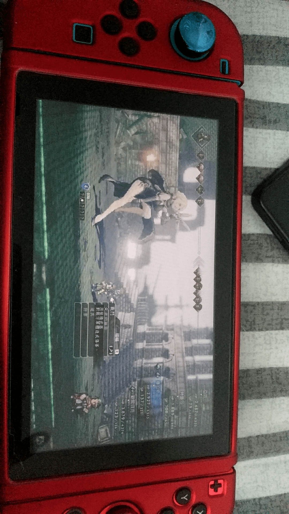

# 八方旅人一个擦边球

作者：camellia

TID：27780

<title>1</title> <link href="../Styles/Style.css" type="text/css" rel="stylesheet">

# 1

*本帖最後由 camellia 於 2019-12-29 10:45 編輯*

我看别人发的八方旅人还有擦边球，这是什么操作？
<title>2</title> <link href="../Styles/Style.css" type="text/css" rel="stylesheet">

# 2

 <ignore_js_op>[mmexport1577587267798.jpg](forum.php?mod=attachment&aid=ODA3MDh8ZTQzODU3ODN8MTY3NDA2NjYzNXwxODIzMHwyNzc4MA%3D%3D&nothumb=yes) *(1.22 MB, 下載次數: 15)*

[下載附件](forum.php?mod=attachment&aid=ODA3MDh8ZTQzODU3ODN8MTY3NDA2NjYzNXwxODIzMHwyNzc4MA%3D%3D&nothumb=yes)

2019-12-29 10:45 上傳  

</ignore_js_op> <title>3</title> <link href="../Styles/Style.css" type="text/css" rel="stylesheet">

# 3

八方旅人BOSS都这样的啊。。。只有自己的队伍是Q版的。 <title>4</title> <link href="../Styles/Style.css" type="text/css" rel="stylesheet">

# 4

> archer 發表於 2019-12-29 14:23
> 八方旅人BOSS都这样的啊。。。只有自己的队伍是Q版的。

搞得我也想弄一个玩玩了。。 <title>5</title> <link href="../Styles/Style.css" type="text/css" rel="stylesheet">

# 5

八方boss就这样，女boss只有两三个但是立绘还是挺美的。不过真的有人对马赛克感兴趣吗。。。 <title>6</title> <link href="../Styles/Style.css" type="text/css" rel="stylesheet">

# 6

> [camellia 發表於 2019-12-29 17:47](https://giantessnight.cf/gnforum2012/forum.php?mod=redirect&goto=findpost&pid=421428&ptid=27780)
> 搞得我也想弄一个玩玩了。。

如果是为了GTS入的话百分百会后悔。。。马赛克也就算了。。那个GTS是完全不会动的。。。
<title>7</title> <link href="../Styles/Style.css" type="text/css" rel="stylesheet">

# 7

后面神庙我记得还有几个女武神 也是这样的

不过为了这个入 我怕你会失望哦

马赛克GTS emmmmm，如果你喜欢RPG那估计问题不大 <title>8</title> <link href="../Styles/Style.css" type="text/css" rel="stylesheet">

# 8

> [Q神 發表於 2019-12-30 00:33](https://giantessnight.cf/gnforum2012/forum.php?mod=redirect&goto=findpost&pid=421453&ptid=27780)
> 八方boss就这样，女boss只有两三个但是立绘还是挺美的。不过真的有人对马赛克感兴趣吗。。。 ...

那我还是放弃吧。。。。