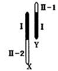

# 关于《药剂》中基因遗传的一点想法

作者：Lcxzyr

TID：32187

<title>1</title> <link href="../Styles/Style.css" type="text/css" rel="stylesheet">

# 1

*本帖最後由 Lcxzyr 於 2021-12-5 00:09 編輯*

关于[《药剂》](https://giantessnight.com/gnforum2012/forum.php?mod=viewthread&tid=32043)的谜题后面基因的部分，感觉作者最后的说明好像不是很清楚，大家没怎么看懂的样子
这里说一下我的理解和一些想法吧

在开始之前，我们看一下XY染色体的结构。其中I是X和Y染色体的同源区段。<ignore_js_op>

**图片1.png** *(2.73 KB, 下載次數: 0)*

[下載附件](forum.php?mod=attachment&aid=OTI3NTN8NGMyZmU3Y2N8MTY3NDA2NTc1M3wxODIzMHwzMjE4Nw%3D%3D&nothumb=yes)

2021-12-5 00:02 上傳

首先说明一下楼主的想法是什么意思：

在X染色体上存在一对等位基因Aa，它的基因座位在I区和II-2区交界处
那么在X染色体上，只存在Aa基因的I部分，我们称其为G基因。
那么我们可以知道，人群中会存在

X(A)X(A) ，X(A)X(a) ，X(a)X(a) 三种基因型的女性
以及
X(A)Y(G) ，X(a)Y(G)两种基因型的男性

其中，G基因为显性基因，抑制了a基因的表达，故男性中没有隐性性状个体。
而只有隐性个体才会表达为抗性，所以男性不会产生抗性

另外关于楼主

> 因为联会会导致纯隐的基因会混入其他基因，所以基本不会有完全抗性，而林诗音则是因为正好补了回去，就有了完全的抗性

的说法，我认为是有问题的。
这个说法适用于多对非等位基因的遗传而不适用于一对等位基因的遗传。
因为联会中发生交叉互换，是和非姐妹染色单体之间进行碱基的交换。交换的内容依然是Aa基因的内容，只不过是母体的基因中两条X染色体互相交换而已。如果所谓抗性仅与a基因有关，姐妹两人不应该存在明显的差异

（除非同时存在A基因，a1基因和a2基因，A对a显性，a1对a2显性，a2纯和抗性进一步增强，或者是a1和a2同为隐性，而抗性a2a2>a1a2>a2a2，但这样的假设也不符合前述语句的描述）

关于抗性强弱可以再引入多对不完全显性的等位基因进行解释，让Aa基因成为抗性开关，其余基因调节抗性程度。比如说bbccddeeffgghh可以体现出最强的抗性，而BBCCDDEEFFGGHH基因完全不体现抗性

我的想法是，完全可以通过简化的模型来达到同样的效果。

> X染色体上存在Bb基因，只有BB纯和（或者bb纯合）才能产生抗性

或者

> 抗性基因存在于所有人身上，其表现程度由上述多对基因决定。但是其产生作用需要通过一种阴道内腺体合成的特殊的酶的催化

<title>2</title> <link href="../Styles/Style.css" type="text/css" rel="stylesheet">

# 2

好专业，根本看不懂。。。。。。。。 <title>3</title> <link href="../Styles/Style.css" type="text/css" rel="stylesheet">

# 3

啥啊，有前情提要吗。。。突然讨论生物了。。 <title>4</title> <link href="../Styles/Style.css" type="text/css" rel="stylesheet">

# 4

这就是专业大佬吗，太强了，术业有专攻吧 <title>5</title> <link href="../Styles/Style.css" type="text/css" rel="stylesheet">

# 5

> [12345678901 發表於 2021-12-5 23:20](https://giantessnight.cf/gnforum2012/forum.php?mod=redirect&goto=findpost&pid=487095&ptid=32187)
> 这就是专业大佬吗，太强了，术业有专攻吧

专业倒是说不上，无非是高中时期略有学过而已
现在大学并没有学习相关专业
<title>6</title> <link href="../Styles/Style.css" type="text/css" rel="stylesheet">

# 6

> [Lcxzyr 發表於 2021-12-6 00:01](https://giantessnight.cf/gnforum2012/forum.php?mod=redirect&goto=findpost&pid=487103&ptid=32187)
> 专业倒是说不上，无非是高中时期略有学过而已
> 现在大学并没有学习相关专业
> ...

那也很强了，生物这些一直是我苦主，现在一点记不住了。。。
<title>7</title> <link href="../Styles/Style.css" type="text/css" rel="stylesheet">

# 7

文科生不明觉厉，论坛文章的专业性真越来越强了。</ignore_js_op>