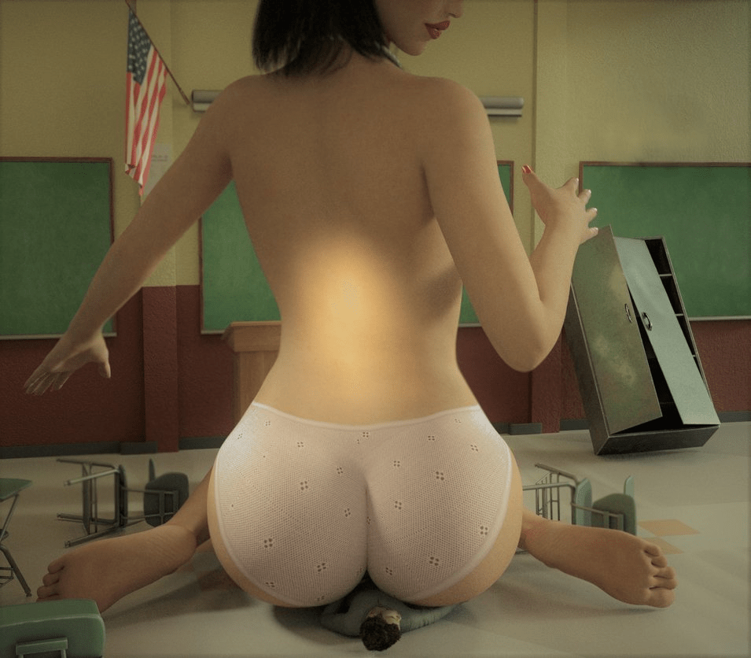

# 关于GTS领域的3D制图发展之我见

作者：weiwenjiao

TID：24076

<title>1</title> <link href="../Styles/Style.css" type="text/css" rel="stylesheet">

# 1

*本帖最後由 awkeygen 於 2021-7-26 00:00 編輯*

对于3D的GTS作品，相信大家并不陌生，但是，在这个3D软件同质化严重，3D制作流程死板，当今有如下几个问题出现在我们面前：
1\. 作品的同质化严重，无法给读者以深入YY空间
此问题应该为3D作品最为显而易见的问题，比如你上city，上DA，成千上万的3D图，却很少又图能让人心潮澎湃，让人去YY，究其根本原因，在于制作过程过于单一（建模-场景导入-pose-灯光-渲染），其实，GTS圈内，99%的图片都在单纯的改变物体的大小和位置而已，这种制作特点无法让制作者去深入思考图片的构图，重点，布局等等，所以很难做出好图
2\. 技术粗糙化
接第一点，所有图片如出一辙，真心让难以给读者留下YY的空间
3\. 不善于向二次元学习
大部分3d作者没有学习二次元表现手法的意识
结合以上三点，A某集合最近的作图学习，给出几个自己认为的需要突破的技术核心
1.作品的同质化严重，无法给读者以深入的思考
a. 加强个人的制作要求，秉持对读者负责的态度，尽量不用直接下载的资源。可以这么说，目前的软件技术完全可以做出类似最终幻想，死或生这种迷人人模，只要大家深入学习，绝对做得出来；
b. **建模-场景导入-pose-灯光-渲染这一传统流程**需要进一步深化，二次元之所以给人的冲击更大，是因为画师一般都会考虑**人物和周围物体的交互**与**互动**，优秀的画师会思考，我这幅图要去表达什么，并且会把细节的互动勾勒出来，哪怕就是简单的几笔，最简单的例子：
     人坐在沙发上，沙发会变形；
     美女坐在小人的身上，臀部会变形；
     小人被女大腿夹着，美女的大腿会变形；
     被美女的裙子盖住，裙子会自然地覆盖在人的身上；
     小人侵入液体中，皮肤会附着一层液体等等；
     小人从美女口（或阴道）中出来，身上沾满液体；
     可是，如今的GTS 3D作品，很少有人（包括自己）把所有的元素融汇到一起，所有作者几乎都是把小人摆在对应位置就完事了，如果表现不好，就换个镜头，把BUG处挡住，然而，殊不知，正是这些元素，才是作品的点睛之笔，你把小人摆在美女的裙下这不难，但是如果你让美女的裙子自然地裹在小人的身上，大腿夹着小人时，美丽有弹性的肌肤和小人紧紧贴在一起，这才是一个图片的精髓所在。
2\. 技术粗糙化
结合问题1，我认为有几个技术是3d制作不可缺少的技术元素，可是圈内的gts 3d作者几乎很少人注意这些，我认为如下几个技术比较重要
a. 衣服必须具有动态特性，不能因为服装复杂，互动困难而逃避使用飘逸复杂的服饰，动态服装是体现画面生动的重要元素，DAZ中已经引入动态系统，我最近正在研究，目前效果如下

效果虽然很一般，但是给了A某的一线希望，那就是，只要仔细推敲，这种动态感是能做出来的。
b. 必须使用柔软肌肤，不回避人物之间的细节互动，利用DAZ的平滑碰撞功能，是可以实验的，A某也开始尝试突破自己做一些柔软肌肤

c. 皮肤一定要做好
如果皮肤做得像石膏，或者像硅胶，那作品就基本失败了一半，渲染前要仔细推敲你的皮肤，尤其是皮肤的光滑度，通透性，湿润度；同时皮肤选取上要有自己的准则，A某的准则是在真实的基础上，保证最大程度的唯美，不做斑点和体毛过多的人，不做黑人。
d. 善于利用摄像机系统
POV是3D制作的一个优势，要多利用摄像机和景深功能做POV图片
3\. 不善于向二次元学习
不管怎么说，在亚洲，二次元的地位绝对不可撼动，3d要主动向2次元学习，学习什么，那就是：人模造型，服装设计，互动表达。
a.对于人模造型，只要细心设计，是可以制作出美感十足的人模的，所以在人物建模时不要拘束自己，大胆的设计，大胆地调整眼睛的大小和脸型/发行/皮肤。
b.对于服装设计，尽量使用动态服装，具备亚洲独特美感的衣服（棉袜，丝袜，木屐，和服，旗袍等）大胆地使用，然后辅之以完全真实的动态互动，比如小人沿着衣服往上爬，一定要做出真正的互动，布料的凹凸，对小人的覆盖，不同材质的重力系数等等；这时候，3D的技术优势才算是真正体现
c.互动表达方面，在制图时，要明白自己想表达什么，并突出之，而不是摆完位置再渲染就完事。比如小人被吸进口中或YD，那么人物和粘膜的挤压感、肉感、肉与肉的碰撞、液体的流动就必须表达出来，如果只是单纯把小人摆进去，很难成为出色的作品
4\. 例子点评与分析
<ignore_js_op>

**giantess_teacher_2_by_dofus59-dbodwrg.jpg** *(95.67 KB, 下載次數: 0)*

[下載附件](forum.php?mod=attachment&aid=Njk5MzN8ZDdlMmQ2MTB8MTY3NDA2OTY2N3wxODIzMHwyNDA3Ng%3D%3D&nothumb=yes)

2017-11-29 02:48 上傳

没有针对作者的意思，因为这张图我就是随意找的，首先，这张图大体看使用iray渲染的，虽然整体偏暗，但是灯光上做到了明暗有致，但是这幅图最大的问题在哪？
1\. 很明显，作者要表达小人被压在臀下的爽快感，因此，小人及其周边是此图的精髓所在，而这幅图却没有表达好，因为小人与臀部接触，臀部却没有变形，内裤也没有自然的覆盖在小人身上，而且，美女的脚没有紧贴地面给人感觉就是小人把美女支撑在空中
2\. 人物皮肤没调整，仔细观察美女的脚，石膏感特别严重，而且人体的皮肤的关泽和通透性全无
造成这个效果的根本原因是什么？那就是作者直接下载模型，然后pose，然后把小人摆在美女臀部下面，然后就渲染了，所以，3d效果做不过二次元是肯定的！

<title>2</title> <link href="../Styles/Style.css" type="text/css" rel="stylesheet">

# 2

用心文推，其實很多部分是許多創作者的通病
1.把過往作品顯眼元素重新排列組合當新作(少年漫、輕小說......罄竹難書)
2.只想用偷吃步把細節掩蓋掉，但觀眾看得出區別(電影特效就是一例，用道具能處理的東西硬要塞CGI)
3.不思進取，不懂參考類似領域的作法(像音樂換個風格就能聽到超不一樣又完整的創作方法，很多人卻只靠自己慢慢摸索已經有人做過的東西)

3D作品我目前看過最想吐的是Smogass的一張扭腰擺臀的圖，他的陰唇位置是跟小腹黏在一起的，做出屁股側一邊的Pose時陰唇就長到大腿上了......
但說實話2D作者也有非常多這種「有做出來就好」的半成品，巨人用正面照構圖處理、不會畫的地方通通切出畫面外，而我的感想常常是「能不能稍微參考一下3D作品啊」

當然2D和3D的表現手法還是有差，2D可以不顧物理現實為了構圖隨意扭曲畫面，3D可以隨便擺出超複雜的姿勢再打光
最麻煩的應該是物理擠壓，我看2D和3D都超不想面對的

技術學了就會了，如何運用(畫技)和投入時間(畫工)其實才是最困難的一環啊 <title>3</title> <link href="../Styles/Style.css" type="text/css" rel="stylesheet">

# 3

说的挺不错 <title>4</title> <link href="../Styles/Style.css" type="text/css" rel="stylesheet">

# 4

如果物理碰撞和形變效果真的那麼輕鬆就能做出來就好了。
由眾多多邊形組成的3D模型，要形成形變並沒有“坐在沙發上，沙發表面就自然凹陷”那麼簡單。 <title>5</title> <link href="../Styles/Style.css" type="text/css" rel="stylesheet">

# 5

> [Cae 發表於 2017-11-29 11:37](https://giantessnight.cf/gnforum2012/forum.php?mod=redirect&goto=findpost&pid=351014&ptid=24076)
> 如果物理碰撞和形變效果真的那麼輕鬆就能做出來就好了。
> 由眾多多邊形組成的3D模型，要形成形變並沒有“坐 ...

其实在3d方面 主要门槛在于硬件，由于GTS作品的特殊话，需要将女性模型的模型细分做的很大，然而，我的机器只能承受3倍的细分，再增加机器就会死掉，这是也凸显了丽台专业显卡的优势了。并且，细分是做碰撞的基础，所以，的确不易，最近在研究局部细分，但愿能解决这个问题 <title>6</title> <link href="../Styles/Style.css" type="text/css" rel="stylesheet">

# 6

厉害了，看到A大活跃就开心。有时候感觉一个人的力量有限吧，需要团队的。文案做的好的确可以弥补掉很多制作的时候粗糙的东西了，所以 <title>7</title> <link href="../Styles/Style.css" type="text/css" rel="stylesheet">

# 7

大神帖外加技术贴。。。膜拜下。。。细节决定成败。。哈哈哈 <title>8</title> <link href="../Styles/Style.css" type="text/css" rel="stylesheet">

# 8

我觉得是很多作者对GTS的理解不够深。gts并不一定要很裸露很黄暴，或者只去简单对比体现女主很巨大男主很弱小。有的时候只需要作者换个角度去解释剧情，一点画龙点睛的构图就能引人浮想联翩，比如说一个小人对脚背的仰望或是女主向下望去傲慢的神情，又或者男主发现眼前的巨物只是女主的鞋尖这样，大概就是国画里的留白把，通过简单的一笔能勾勒出令人联想的剧情才是好的作品，个人理解。 <title>9</title> <link href="../Styles/Style.css" type="text/css" rel="stylesheet">

# 9

抑或说好的GTS作品不光要作图质量好，这是最基本的，在这之上，并不是只要捏一个巨人一个小人就可以满足了，还需要有故事，有剧情。对于剧情发展而言，人物的动作神态，场景的布置，心理活动刻画，包括人物之间的对白都是必不可少的，好的作品都是作者精心构思的结果，读者往往能从一幅图中以小见大，在内心勾勒出属于自己去联想得出的剧情，再串联起整个故事来，与作者的想法进行对照，这也就实现了作者和读者的互动。说到这我想吹一下K大的被调戏了，无论是构图还是文字都很能令人产生联想。印象最深刻的是最后男主去小雨家那一段，看着令人血气涌动不可自拔。 <title>10</title> <link href="../Styles/Style.css" type="text/css" rel="stylesheet">

# 10

*本帖最後由 awkeygen 於 2017-11-30 17:05 編輯*

> [chuilaba1122 發表於 2017-11-30 15:55](https://giantessnight.cf/gnforum2012/forum.php?mod=redirect&goto=findpost&pid=351106&ptid=24076)
> 抑或说好的GTS作品不光要作图质量好，这是最基本的，在这之上，并不是只要捏一个巨人一个小人就可以满足了 ...

赞同你的说法，不过剧情上有时候很难众口难调，所以GTS对创作者的要求其实不低。
其次，目前3d图的制作过于粗糙，我认为3d制图者要把一些必要的互动技术加进去（如布料的动态感，皮肤的真实感，人与人，人与物的碰撞细节处理等），目前几乎所有的3d制图者就是把人物做一个缩放，然后摆pose，然后移动到某一个部位，A某认为一个好图应该包括这些关键互动，而这种互动往往是3d GTS作品最缺少的，也是和二次元的最大差距所在
<title>11</title> <link href="../Styles/Style.css" type="text/css" rel="stylesheet">

# 11

我同意楼主的说法，不过，首先要建立在完全学会某个软件的基础上再谈吧？而目前的情况是，有这种技术的人一般会从事跟这些相关的工作，可没时间去做这些东西。
而不会的，有基础还好，没有基础的，在自学的情况下不管怎么样都无法跟有类似专业基础的人相提并论的，并且还有一个动力因素在。
所以这就是目前的一个矛盾所在，站在客观的角度去看的话，圈内的平均水平不可能都是跟楼主齐平的一个层次。
为我的观点提一个总结，个人提高很容易，想要整体提高圈内水准还有很长的路要走。 <title>12</title> <link href="../Styles/Style.css" type="text/css" rel="stylesheet">

# 12

> [awkeygen 發表於 2017-11-29 15:33](https://giantessnight.cf/gnforum2012/forum.php?mod=redirect&goto=findpost&pid=351029&ptid=24076)
> 其实在3d方面 主要门槛在于硬件，由于GTS作品的特殊话，需要将女性模型的模型细分做的很大，然而，我的机 ...

硬件确实挡住了一大批人，向我这样还在用gtx560ti的基本告别了3d图。最多用honeyselect这样的黄油游戏来构图，效果和元素方面都差了好多表现力就更别提了。但更大的局限实在创意方面，这个领域虽然小众，但也有着几十年的历史了，能讲的故事，有代入感的玩法大家已经走一遍了，比手大小，把腿当柱子。能跳出前人的思路其实是最难的，就像一句名言:我想给你讲个全新的故事，可惜所有的故事都已经被说过了。</ignore_js_op>