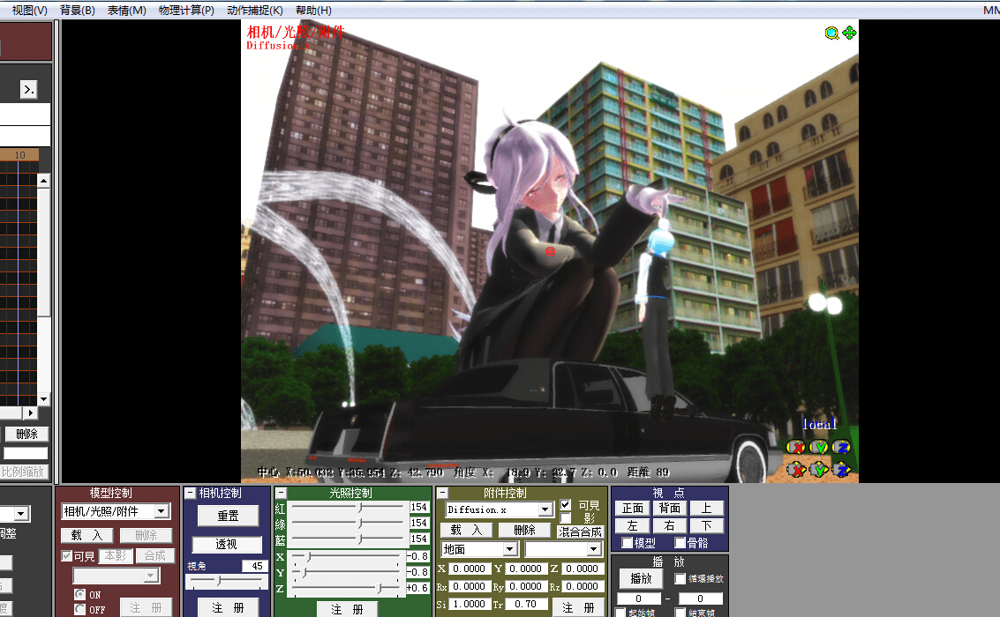

# 关于MMD的一些问题，算是大半个伸手贴。

作者：weiwenjiao

TID：18222

<title>1</title> <link href="../Styles/Style.css" type="text/css" rel="stylesheet">

# 1

本人学MMD已有4天了，从一开始的一窍不通渐渐也会做了一点，不过最大的问题就是模型难搜难找。
学到现在基本的动作已经会摆了，不过想要进军GTS领域的话只会调模型大小跟摆动作是远远不够的。
MME的使用还在摸索当中，下了好多MME，但发现没一个是那种GTS图里必不可少的元素：Bomb，Newbomb，Break Apart Effect，Footprint。
在此求一下大大们那些关键元素的MMD：爆炸，模型破坏，黑烟雾，损坏，超重脚印等等。。。。。
 为了证明我正在努力，上一张自己学习中做好的图。。 <ignore_js_op> </ignore_js_op> **(P6N7CO6A7F`N)$Z[{XCW`B.jpg** *(626.2 KB, 下載次數: 0)*

[下載附件](forum.php?mod=attachment&aid=NDg3ODd8ZWE5YzMwOWR8MTY3NDA2ODMyMXwxODIzMHwxODIyMg%3D%3D&nothumb=yes)

2014-12-8 16:45 上傳 
 <title>2</title> <link href="../Styles/Style.css" type="text/css" rel="stylesheet">

# 2

火 煙 爆炸 等的效果都能在這網頁可找到
[http://www43.atwiki.jp/beamman/pages/13.html](http://www43.atwiki.jp/beamman/pages/13.html)

另附上腳印檔 目前只能找過這個

<title>3</title> <link href="../Styles/Style.css" type="text/css" rel="stylesheet">

# 3

 <ignore_js_op>

[footprint.rar](forum.php?mod=attachment&aid=NDg3OTV8ZGM2Yzk0YjJ8MTY3NDA2ODMyMXwxODIzMHwxODIyMg%3D%3D)

2014-12-8 20:30 上傳

點擊文件名下載附件

256.36 KB, 下載次數: 19</ignore_js_op> <title>4</title> <link href="../Styles/Style.css" type="text/css" rel="stylesheet">

# 4

提供個建築物倒塌

[https://bowlroll.net/file/55615](https://bowlroll.net/file/55615)
<title>5</title> <link href="../Styles/Style.css" type="text/css" rel="stylesheet">

# 5

這這這~相信也希望樓主日文很好~ 機譯的話,應該也能勉強理解吧~ <title>6</title> <link href="../Styles/Style.css" type="text/css" rel="stylesheet">

# 6

> clivic 發表於 2014-12-8 22:05 這這這~相信也希望樓主日文很好~ 機譯的話,應該也能勉強理解吧~

理解是理解，我翻了好多网站，d站也去了无数次，很难找，大大们的成品图很多，也提供了所使用的MME，但是却没有提供下载链接，确实让新手头疼呀。。 <title>7</title> <link href="../Styles/Style.css" type="text/css" rel="stylesheet">

# 7

> [kevinsky05 發表於 2014-12-8 20:30](https://giantessnight.cf/gnforum2012/forum.php?mod=redirect&goto=findpost&pid=241276&ptid=18222)
> 火 煙 爆炸 等的效果都能在這網頁可找到
> http://www43.atwiki.jp/beamman/pages/13.html

K大我就知道是你。         那个网站我进去找过了， D站的作家的成品图里有列出来他们所使用的Effect ，可是我进那个网站找不到 。 <title>8</title> <link href="../Styles/Style.css" type="text/css" rel="stylesheet">

# 8

模型物理破坏貌似论坛有位大大发帖教程了，可以去看看撒，模型的话niconico有好多模型在配布，非常不错的说，楼主加油