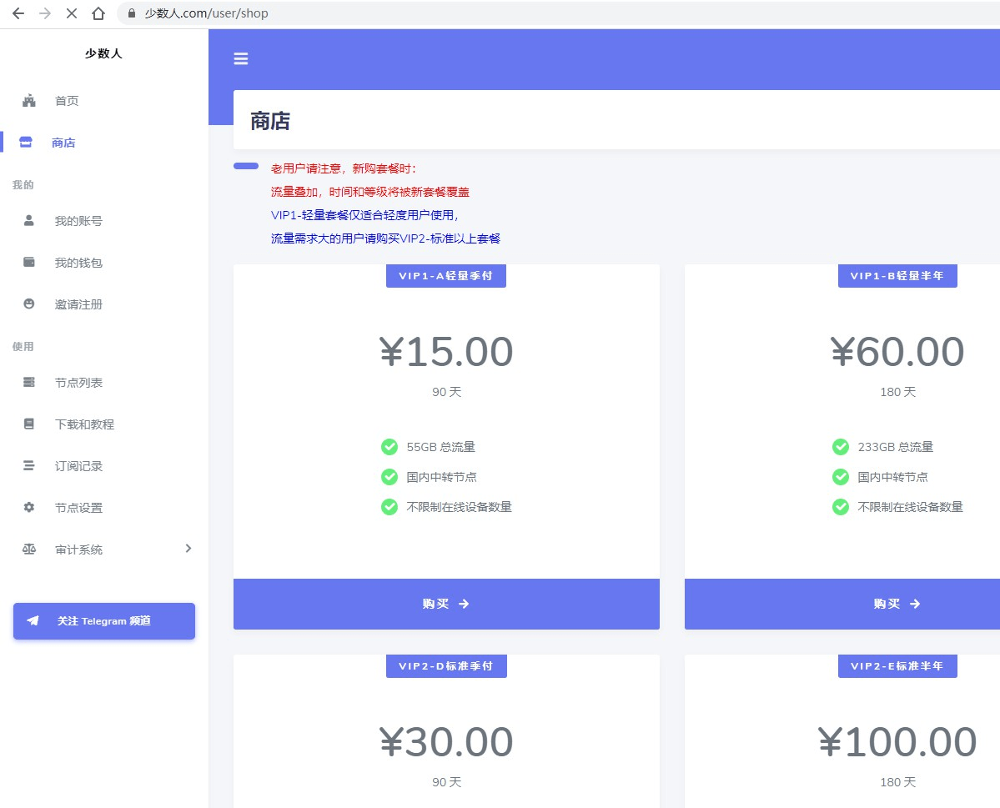
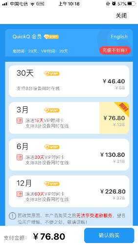

# 关于VPN

作者：zxk135

TID：29164

<title>1</title> <link href="../Styles/Style.css" type="text/css" rel="stylesheet">

# 1

现在gn论坛是需要翻墙才能上的吧各位有什么好的VPN能不能给推一下，现在用的这个太慢了，求求了

<title>2</title> <link href="../Styles/Style.css" type="text/css" rel="stylesheet">

# 2

我用的快连，付费的zsbd <title>3</title> <link href="../Styles/Style.css" type="text/css" rel="stylesheet">

# 3

自己搭的，只是上GN的话直接改host就行了，198.252.98.91 <title>4</title> <link href="../Styles/Style.css" type="text/css" rel="stylesheet">

# 4

首先啊你用的是什么啊？要是想快肯定是要付费的 <title>5</title> <link href="../Styles/Style.css" type="text/css" rel="stylesheet">

# 5

不想花钱，又想用快速稳定的VPN，天底下哪有那么好的事情呢？
要不花钱买付费VPN，这样更快更安全，要不就老老实实的用免费有风险的VPN，网速慢点其实还是处于可以接受范围内的，就当考验自己耐心好了 <title>6</title> <link href="../Styles/Style.css" type="text/css" rel="stylesheet">

# 6

> 大撸若愚 發表於 2020-7-30 18:10
> 首先啊你用的是什么啊？要是想快肯定是要付费的

我用的是kuai500，500一年的，结果就是最近总是慢的不行，想寻思看看换一个别的两个能倒着用这样子 <title>7</title> <link href="../Styles/Style.css" type="text/css" rel="stylesheet">

# 7

> 神父桑 發表於 2020-7-30 18:18
> 不想花钱，又想用快速稳定的VPN，天底下哪有那么好的事情呢？
> 要不花钱买付费VPN，这样更快更安全，要不就 ...

我一直用的kuai500，花的500买的一年，就是最近感觉实在是不给力，就想着看看能不能再找一个不错的VPN，这样就能两个做一下交替了 <title>8</title> <link href="../Styles/Style.css" type="text/css" rel="stylesheet">

# 8

> SuperHot 發表於 2020-7-30 16:57
> 我用的快连，付费的zsbd

好的好的，谢谢您啦，等晚上回去我试一下 <title>9</title> <link href="../Styles/Style.css" type="text/css" rel="stylesheet">

# 9

*本帖最後由 St2019 於 2020-7-30 23:10 編輯*

> [changliuliu 發表於 2020-7-30 18:41](https://giantessnight.cf/gnforum2012/forum.php?mod=redirect&goto=findpost&pid=443251&ptid=29164)
> 我一直用的kuai500，花的500买的一年，就是最近感觉实在是不给力，就想着看看能不能再找一个不错的VPN， ...

楼主你能花500一年建议上express，稍微贵点大概600人民币左右一年，但是注意要付美元，而且据说现在很多节点用不了（个别节点很稳定），不过这是我用过的感觉最快最稳定的了，前年用的时候拿它可以看油管4k的vr视频。我这两年在国外所以也不知道现在好不好用了，可以问问别人有没有在用的。
当然你要是要求不那么高的话就不用了，这个不太划算。
<title>10</title> <link href="../Styles/Style.css" type="text/css" rel="stylesheet">

# 10

刚刚看了下express包年打5折，15个月，我都没赶上这种。。。 <title>11</title> <link href="../Styles/Style.css" type="text/css" rel="stylesheet">

# 11

> St2019 發表於 2020-7-30 23:07
> 楼主你能花500一年建议上express，稍微贵点大概600人民币左右一年，但是注意要付美元，而且据说现在很多节 ...

嗯嗯，好的好的，谢谢您，我找时间一定回去了解一下 <title>12</title> <link href="../Styles/Style.css" type="text/css" rel="stylesheet">

# 12

搬瓦工50美元租个云服务器，自己搭一个v2ray，申请一个免费域名做流量伪装 <title>13</title> <link href="../Styles/Style.css" type="text/css" rel="stylesheet">

# 13

<ignore_js_op>

**2020-07-31_09-05-18.jpg** *(104.88 KB, 下載次數: 0)*

[下載附件](forum.php?mod=attachment&aid=ODQyMzJ8NWQ3MDNkMGZ8MTY3NDA2NjI3MXwxODIzMHwyOTE2NA%3D%3D&nothumb=yes)

2020-7-31 09:05 上傳

我用的SSR，一直用最便宜的套餐，平均一个月5块，还不限速，稳的一批，几乎不会断线。而且Windows OS IOS Android全平台通用
<title>14</title> <link href="../Styles/Style.css" type="text/css" rel="stylesheet">

# 14

。。。。其实免费的也挺好用啊，光gn、utb之类的足够了。。。老王、蚂蚁啥的，不过好像只能手机用 <title>15</title> <link href="../Styles/Style.css" type="text/css" rel="stylesheet">

# 15

我用的quickq，感觉挺快的，百度上就能搜到，第一年226，之后就378（加送一个月） <title>16</title> <link href="../Styles/Style.css" type="text/css" rel="stylesheet">

# 16

就这个vpn，应该比较好找吧，不过当时是偶然，..权限低发布了链接，发了个图 <title>17</title> <link href="../Styles/Style.css" type="text/css" rel="stylesheet">

# 17

 <ignore_js_op>[F374689D-78F1-4958-9037-08950D4AEDE0.png](forum.php?mod=attachment&aid=ODQyMzN8NzAzOGExMTR8MTY3NDA2NjI3MXwxODIzMHwyOTE2NA%3D%3D&nothumb=yes) *(49.55 KB, 下載次數: 0)*

[下載附件](forum.php?mod=attachment&aid=ODQyMzN8NzAzOGExMTR8MTY3NDA2NjI3MXwxODIzMHwyOTE2NA%3D%3D&nothumb=yes)

2020-7-31 10:20 上傳  

</ignore_js_op> <ignore_js_op>[D8B4B72A-DB7D-4677-A618-99B4AD203D20.png](forum.php?mod=attachment&aid=ODQyMzR8OWJmYWRjMGJ8MTY3NDA2NjI3MXwxODIzMHwyOTE2NA%3D%3D&nothumb=yes) *(91.87 KB, 下載次數: 0)*

[下載附件](forum.php?mod=attachment&aid=ODQyMzR8OWJmYWRjMGJ8MTY3NDA2NjI3MXwxODIzMHwyOTE2NA%3D%3D&nothumb=yes)

2020-7-31 10:22 上傳  

</ignore_js_op> <title>18</title> <link href="../Styles/Style.css" type="text/css" rel="stylesheet">

# 18

一开始有两个小时试用，可以试试，付费后并没有变慢 <title>19</title> <link href="../Styles/Style.css" type="text/css" rel="stylesheet">

# 19

改hosts有时候也上不来，大概清理一下cookie就行了，但我没试过，我现在手机端用着老王，电脑端一般用火箭加速器，嗯，，，火箭加速器免费试用一年，，，至于下载地址，，，（【火箭加速器】在国内也能刷油管、Instagram，我送你无限免费流量（邀请码：2UHPK） [https://share.rocket-fast.com/?mid=1018&invite_code=2UHPK](https://share.rocket-fast.com/?mid=1018&invite_code=2UHPK)）
<title>20</title> <link href="../Styles/Style.css" type="text/css" rel="stylesheet">

# 20

西部世界 就百度直接搜能搜到 价格好像是中等的25 一个月emm（或者有点贵？）但是挺稳定的 顺便看油管1080p也能不卡 <title>21</title> <link href="../Styles/Style.css" type="text/css" rel="stylesheet">

# 21

我同学给我分享过一个山羊vpn白嫖还不算慢 <title>22</title> <link href="../Styles/Style.css" type="text/css" rel="stylesheet">

# 22

手机免费的很多，我用的蓝灯，电脑有点少 <title>23</title> <link href="../Styles/Style.css" type="text/css" rel="stylesheet">

# 23

推荐一个收费的HideCAT,这个用起来很快不卡</ignore_js_op>