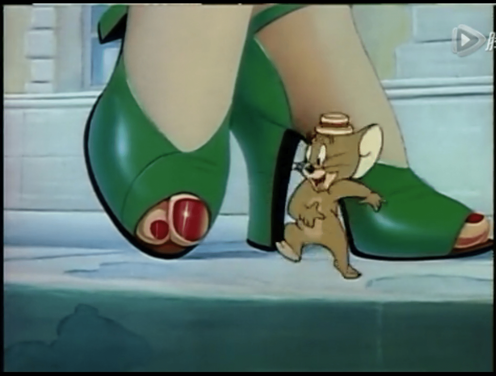

# 关于giantess爱好者背景

作者：wxy112300

TID：27009

<title>1</title> <link href="../Styles/Style.css" type="text/css" rel="stylesheet">

# 1

从小学5年级入的坑，到现在也已经有6年了，但一直没有在生活中遇到哪怕一个表现出giantess爱好倾向的人。没事的时候，就会一直思考，这个圈子里的人难道不会有些共性吗，比如类似的文化背景，类似的教育程度，类似的生活习惯等。所以，我希望能大概了解下各位的生活场所（时间长的那种）和学历，做下参考。各位如也有想过类似问题的，不妨在下面讨论一下，让我们都丰富一下相关认识.
<title>2</title> <link href="../Styles/Style.css" type="text/css" rel="stylesheet">

# 2

猜测：giantess 爱好者一般个子都比较高吧  男生170+
太矮的话 可能不太会往这方面幻想，纯猜测并无他意 <title>3</title> <link href="../Styles/Style.css" type="text/css" rel="stylesheet">

# 3

170cm的路过，学历嘛，在读硕士
但是这个爱好倾向貌似是初中就有的。。。233 <title>4</title> <link href="../Styles/Style.css" type="text/css" rel="stylesheet">

# 4

即便是圈内人大部分时候也会隐藏起来吧，不遇到同类基本不会主动联系。两边都在刻意伪装的情况下很难察觉彼此是同好吧，所以生活中遇不到完全正常啊 <title>5</title> <link href="../Styles/Style.css" type="text/css" rel="stylesheet">

# 5

我记得之前有看过挺专业的解读。。似乎和儿时和母亲的关系有关。。不过足控在这个圈子是蛮多的 <title>6</title> <link href="../Styles/Style.css" type="text/css" rel="stylesheet">

# 6

情况和楼主差不多入坑已经8年一般不会主动找同爱好的人一般都是机缘巧合 <title>7</title> <link href="../Styles/Style.css" type="text/css" rel="stylesheet">

# 7

说实话就是奥特曼看多了，最开始并不知道gts的。。。。另外和身高没关系，我就是例外。。。。 <title>8</title> <link href="../Styles/Style.css" type="text/css" rel="stylesheet">

# 8

先是足控，后面慢慢变成gts控了，不过还是只喜欢踩踏类的 <title>9</title> <link href="../Styles/Style.css" type="text/css" rel="stylesheet">

# 9

在小学初中的时候大概，反正第一次冲的时候就不自觉的这样想了，看着当时电视上减肥要这种广告，所以我也不知道到底是从哪里得来的这个爱好，大概是天生的吧。 <title>10</title> <link href="../Styles/Style.css" type="text/css" rel="stylesheet">

# 10

*本帖最後由 Lastato 於 2019-6-22 02:42 編輯*

170公分+，有過兩個女友，但都比我矮。第二個學士中，巨大娘齡十二年以上，我是Yahoo家族那個時代就開始暗中觀察但丁大大的小粉絲。但大有公布的。我應該都看完了。

那時候是十幾歲的中學時代，大概05, 06年左右開始從一些色情影片網站開始接觸到巨大娘，後來就查到了但大。一開始只是覺得這種沒什麼裸露，但很震撼的東西很好擼，而且通常男性角色沒什麼存在感，不會擋住我好好欣賞女體。但念了這麼多書之後，現在知道最使自己興奮的是巨大娘的超越權力感，那種主宰一切卻又蠻不在乎，只是伸個懶腰就滅世的感覺最棒了。毫無束縛毫無顧忌舒展的感覺，看著覺得超紓壓的。與受束縛的凡人形成強烈地剝奪對比，令人愉悅。
順待一提，我是先成為巨大娘控，後來過了一兩年才成為足控。從巨大娘為出發，真的讓我對於轉職成其他fetish毫無障礙呢。

是說樓主小五就接觸了這種重口味，祖國（？）的網路焚化部沒問題嗎？真的有在好好運作嗎？（開個玩笑）

<title>11</title> <link href="../Styles/Style.css" type="text/css" rel="stylesheet">

# 11

第一个YY对象是幼儿园大班的同学，想要睡在她裙子里。
第一次作梦梦见巨人反而是同班的男同学，差点没吓死我
至于启蒙作好像是哪里的特摄，女巫把主角的同伴关到了南瓜里，然后骗主角吃南瓜
皮皮鲁还是魔方大楼里好像有个骨牌什么的，粘到人身上就覆盖到全身，最后缩成骰子大小。
个人感觉和文化背景没太大关系吧，特别是信息时代，更多的是exposure <title>12</title> <link href="../Styles/Style.css" type="text/css" rel="stylesheet">

# 12

我很小的时候无意间摩擦到私处，感觉很舒服，以此产生了性冲动。那时候人小，也不懂什么是自慰，只是知道大腿夹住枕头被子之类的东西，摩擦私处会很舒服。后来发现看着电视里成熟漂亮的大姐姐摩擦会更舒服后，就一发不可收拾了。经常幻想自己抱着大姐姐的大腿摩擦私处，那时候身高也就1米左右吧，还没有大姐姐的腿高。后来就慢慢养成了喜欢高大女生的习惯，再逐步发展到女巨人。 <title>13</title> <link href="../Styles/Style.css" type="text/css" rel="stylesheet">

# 13

话说我第一次接触到女巨人题材的擦边球是《猫和老鼠》

<title>14</title> <link href="../Styles/Style.css" type="text/css" rel="stylesheet">

# 14

 <ignore_js_op>[39A141B7-9980-4490-9A64-4300C7C11C92.jpeg](forum.php?mod=attachment&aid=Nzg4OTN8MDViZDVlMTV8MTY3NDA2NjcxMnwxODIzMHwyNzAwOQ%3D%3D&nothumb=yes) *(217.71 KB, 下載次數: 3)*

[下載附件](forum.php?mod=attachment&aid=Nzg4OTN8MDViZDVlMTV8MTY3NDA2NjcxMnwxODIzMHwyNzAwOQ%3D%3D&nothumb=yes)

2019-6-22 05:20 上傳  

</ignore_js_op> <title>15</title> <link href="../Styles/Style.css" type="text/css" rel="stylesheet">

# 15

> [EIJIL 發表於 2019-6-22 05:20](https://giantessnight.cf/gnforum2012/forum.php?mod=redirect&goto=findpost&pid=407960&ptid=27009)
> 话说我第一次接触到女巨人题材的擦边球是《猫和老鼠》

这集有印象啊，乡下鼠进城记
<title>16</title> <link href="../Styles/Style.css" type="text/css" rel="stylesheet">

# 16

请问能否有人发个投票，就是有关成员大概常住地址的（省吧），可以了解下地域性联系之类的，说不定还能找找老乡，嘿嘿. <title>17</title> <link href="../Styles/Style.css" type="text/css" rel="stylesheet">

# 17

第一次接觸這類題材應該是藍胖子的縮小燈
在學習到跟性有關的知識後就開始無端遐想，從此深陷其中
(不過這種事幾乎沒和身邊的人說過就是) <title>18</title> <link href="../Styles/Style.css" type="text/css" rel="stylesheet">

# 18

本科在读，不过先是看到大嘘的本本变成足控，然后遇到gts <title>19</title> <link href="../Styles/Style.css" type="text/css" rel="stylesheet">

# 19

应该是从《格列夫游记》开始的...... <title>20</title> <link href="../Styles/Style.css" type="text/css" rel="stylesheet">

# 20

> [Lastato 發表於 2019-6-22 02:34](https://giantessnight.cf/gnforum2012/forum.php?mod=redirect&goto=findpost&pid=407955&ptid=27009)
> 170公分+，有過兩個女友，但都比我矮。第二個學士中，巨大娘齡十二年以上，我是Yahoo家族那個時代就開始暗 ...

小學開始的，那時在牙醫診所翻到一本畫著巨大娘的漫畫雜誌(普遍級)，從此就爆發了，
持續快20年了(哎 老囉)，口味還是差不多

180+，這個起源和身高應該沒什關係

說到網路，我很好奇北韓這種各種電子媒體完全受控的的國家會不會有野生的巨大娘同好
<title>21</title> <link href="../Styles/Style.css" type="text/css" rel="stylesheet">

# 21

身高180+，從小時候看的格利佛遊記、Alice in Wonderland、騎鵝旅行記等開始覺醒，然後又是哆啦A夢的縮小燈，還有小時候電視動畫裡很多關於縮小的部分（鴨子偵探好像有一集，還有兒童頻道的科普節目），都會覺得非常吸引我，然後學會上網之後就入了深坑 <title>22</title> <link href="../Styles/Style.css" type="text/css" rel="stylesheet">

# 22

好像是高中的时候在等车时看到旁边一个同校的女生在等车时 在踩蚂蚁 而且是不紧不慢的那种 比较主动 从那时候开始的 <title>23</title> <link href="../Styles/Style.css" type="text/css" rel="stylesheet">

# 23

看完这个帖子突然发现自己好高啊 <title>24</title> <link href="../Styles/Style.css" type="text/css" rel="stylesheet">

# 24

*本帖最後由 TANGLUNG 於 2019-6-24 13:18 編輯*

身高175，在校大学生，大概是在小的时候看哆啦A梦（那个时候还叫小叮当）还有女娲补天的故事的插图的时候觉醒了这种爱好，从此对巨大的女孩子特别着迷，小的时候还幻想过和自己玩的很要好的女孩子变成巨人然后她带着我四处旅行的故事，后来初中的时候（大概09，10年那会）有一次闲着没事在网上搜索女巨人，然后就接触了GN、GTS吧和女神论坛（虽然后面两个最后都凉了），就这样，新世界的大门完全向我打开了
以前印象比较深的巨大娘回忆除了上面说的以外还有一个三得利橙汁的广告，那个时候我们当地的少儿频道播铁胆火车侠的中间会放这个广告，内容大概是一个穿着挺火辣的巨大娘在上海街头散步的样子（我相信不少人应该看过），老实说当时我每天看动画最期待的不是动画本身而是中间的那个广告……
顺便一说以前曾经交往过比自己高的女朋友，但已经分手了 <title>25</title> <link href="../Styles/Style.css" type="text/css" rel="stylesheet">

# 25

也是由小學開始...十多年了(暴露年齡)
由格利佛遊記、Alice in Wonderland, 多啦A夢開始 到18+作品 <title>26</title> <link href="../Styles/Style.css" type="text/css" rel="stylesheet">

# 26

我其实也觉得身高偏高的男生可能会比较倾向GTS(毕竟在现实中找不到/难找到比自己高的女孩，自然可能会有这方面的幻想）我自问不矮（约180），故看到比我高的女孩自然会多看两眼咯
我大概也是小学时发现自己喜欢GTS，然后过了三四年才发现老外有类似论坛，再过了一年发现贴吧和GN
然而，我觉得喜不喜欢GTS是天生的，很难后天养成（有些人不过是没觉醒而已）
故此很难向人开口，对不是同好的人说GTS话题肯定会当成变态吧
现实中我不认识任何GTS爱好者。。。也许只有在网络上我们这群小众才能相濡以沫吧
<title>27</title> <link href="../Styles/Style.css" type="text/css" rel="stylesheet">

# 27

身高大約177,我從幼稚園就喜歡這個屬性了,對於一些性的認知很可恥的沒錯! 我也是從這個圈子了解,甚至二次元相關入坑也是,基本上我都圍繞著這個圈轉了阿....小時候就經常幻想被妹子當成玩偶阿玩具一樣的抓在手上玩弄和欺負之後慢慢的就成M了,我在以前讀書的時候也經常閱讀但大的文章,陪我度過了一陣子挺艱難的時刻,因此特別喜歡上了殘酷系!

殘酷系的妹子真的超棒的阿! 不過現實的話我基本不可能活下去吧....這些機會都不屬於我啊....不過很多作品小時候看了都有妄想和感覺,格列佛很基本的在大人國當然有吧! 小叮噹也有的! 不過我比起用這些作品我更喜歡自己想像故事和內容,自己塑造人物和PLAY,,慢慢的我才入手寫文至今都只是個廢渣萌新,現在也已經過了腦袋想像力的巔峰時期,我想像力和腦袋裡面的詞彙庫已經衰退....智商逐漸降低....

現實中還沒有熟識的相關同好者,主要還是依靠網路上的朋友們,至今都是死單身狗,想當然也沒有戀愛經驗了。
 <title>28</title> <link href="../Styles/Style.css" type="text/css" rel="stylesheet">

# 28

跟身高果然还是有关系呀，高的明显多些，甚至可以说都不矮，到时看看能不能找到更多相似点吧.
<title>29</title> <link href="../Styles/Style.css" type="text/css" rel="stylesheet">

# 29

Dark♂学生，死肥宅，社交能力低于平均水平 <title>30</title> <link href="../Styles/Style.css" type="text/css" rel="stylesheet">

# 30

小学就有启蒙，但更多的是sizefan。不仅仅局限于giantess同样喜欢gt巨大扶她或者正常人器官巨大或者缩小人或物。