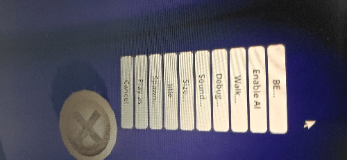

# 关于sizebox的一个问题

作者：砍马与骑杀

TID：30185

<title>1</title> <link href="../Styles/Style.css" type="text/css" rel="stylesheet">

# 1

点击giantess显示的菜单中无eat选项，但文件夹中有相关lua，从reddit中下载的eat有关script也无法正常运行(giantess呆住无反应)
请问如何调出eat选项及使其可用?亦或是eat选项的有无与模型本身有关?
菜单如图所示，缺乏eat选项，版本v2.9 系统Windows10 x64 <title>2</title> <link href="../Styles/Style.css" type="text/css" rel="stylesheet">

# 2

 <ignore_js_op>[IMG_20210121_164156.jpg](forum.php?mod=attachment&aid=ODY5MzZ8ZDA2ZjNjMzZ8MTY3NDA2NjE4M3wxODIzMHwzMDE4NQ%3D%3D&nothumb=yes) *(30.52 KB, 下載次數: 0)*

[下載附件](forum.php?mod=attachment&aid=ODY5MzZ8ZDA2ZjNjMzZ8MTY3NDA2NjE4M3wxODIzMHwzMDE4NQ%3D%3D&nothumb=yes)

2021-1-21 22:39 上傳  

</ignore_js_op> <title>3</title> <link href="../Styles/Style.css" type="text/css" rel="stylesheet">

# 3

选中giantess的情况下右键小人，右键自己是想让giantess吃自己吗？ <title>4</title> <link href="../Styles/Style.css" type="text/css" rel="stylesheet">

# 4

原来eat不是要点小人的吗。。。