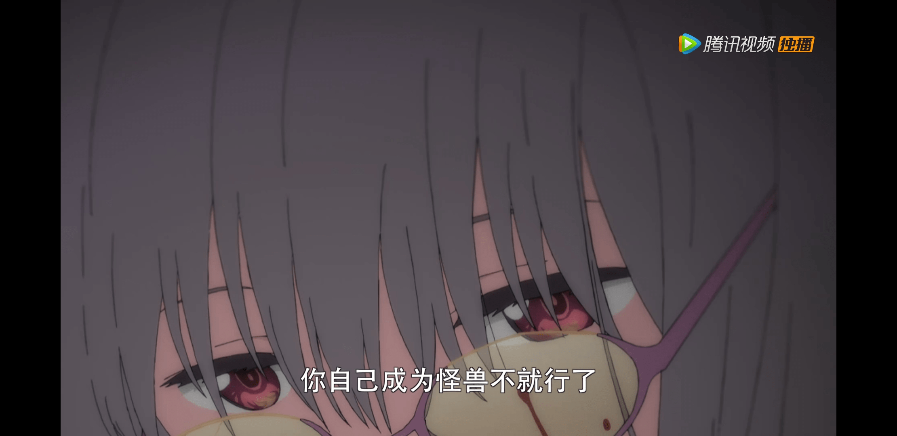

# 关于下周的古利特

作者：金泽明

TID：26171

<title>1</title> <link href="../Styles/Style.css" type="text/css" rel="stylesheet">

# 1

*本帖最後由 金泽明 於 2018-12-16 20:56 編輯*

敌方boss说要把我老婆自身变成怪兽，所以下周一定有gts剧情吧！（不要叫醒我） <title>2</title> <link href="../Styles/Style.css" type="text/css" rel="stylesheet">

# 2

 <ignore_js_op>[微信图片_20181216205430.jpg](forum.php?mod=attachment&aid=NzU4MDl8NTA3NjY2OTh8MTY3NDA2NjkwOXwxODIzMHwyNjE3MQ%3D%3D&nothumb=yes) *(367.79 KB, 下載次數: 2)*

[下載附件](forum.php?mod=attachment&aid=NzU4MDl8NTA3NjY2OTh8MTY3NDA2NjkwOXwxODIzMHwyNjE3MQ%3D%3D&nothumb=yes)

2018-12-16 20:56 上傳  

</ignore_js_op> <title>3</title> <link href="../Styles/Style.css" type="text/css" rel="stylesheet">

# 3

怪兽的事情，能叫做巨大娘吗？如果你也能萌上哥斯拉的话，说到哥斯拉，就不得不提起中国神话里能够与妖怪抗衡的----(哔) <title>4</title> <link href="../Styles/Style.css" type="text/css" rel="stylesheet">

# 4

OP有啊！ 那個很大沒錯 最後幾秒 白色像屁眼的那幕 <title>5</title> <link href="../Styles/Style.css" type="text/css" rel="stylesheet">

# 5

> [Jozetto 發表於 2018-12-16 23:08](https://giantessnight.cf/gnforum2012/forum.php?mod=redirect&goto=findpost&pid=392450&ptid=26171)
> 怪兽的事情，能叫做巨大娘吗？如果你也能萌上哥斯拉的话，说到哥斯拉，就不得不提起中国神话里能够与妖怪抗 ...

今年下半年中美合拍的……？（手动滑稽，要被律师函警告了）
不过话说回来，按照古利特剧组的风格这个“变成怪兽”说不定还真的不是字面意思，看看下一集怎么安排吧

<title>6</title> <link href="../Styles/Style.css" type="text/css" rel="stylesheet">

# 6

之前我认为6花是怪兽，为啥是茜啊。